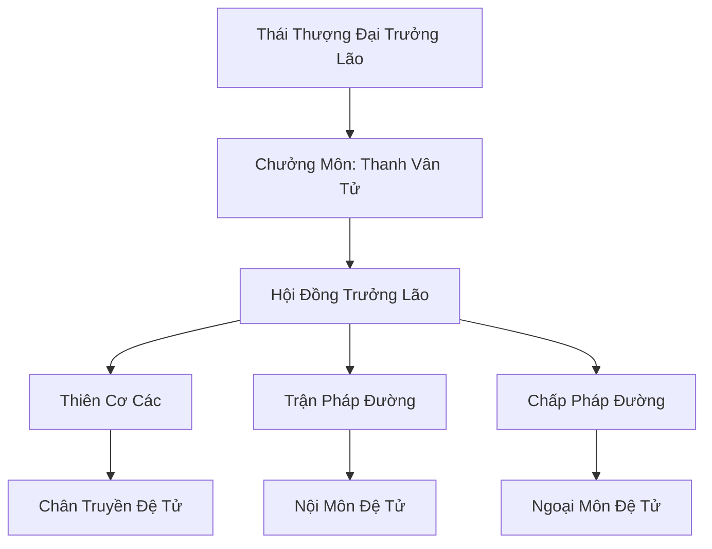

# THÁI ẤT MÔN (太乙门)

## I. Tổng Quan (总览)
Thái Ất Môn là tông môn Đạo gia chính thống lâu đời nhất tại Đông Hoang, được coi là biểu tượng của sự thông tuệ và cân bằng. Tông môn chuyên sâu về việc thấu hiểu quy luật vận hành của trời đất thông qua Bát Quái và Thiên Cơ, giữ vai trò lãnh đạo trong các liên minh Chính Đạo.

## II. Địa Lý & Tài Nguyên (地理与 tài nguyên)
Ngự trị trên dãy Thái Ất Sơn hùng vĩ, nơi có địa thế "Cửu Long Chầu Nguyệt". Tông môn nắm giữ Hỗn Nguyên Linh Mạch - một trong những mạch linh khí tinh thuần nhất lục địa, cùng nhiều vùng đất phong thủy bảo địa phục vụ tu luyện.

## III. Văn Hóa & Tín Ngưỡng (文化与信仰)
Đề cao triết lý "Vô Vi Nhi Dịch", thuận theo tự nhiên nhưng không ngừng tìm hiểu bí mật của tạo hóa. Đệ tử Thái Ất Môn thường có phong thái tiên phong đạo cốt, coi trọng việc rèn luyện tâm tính và trí tuệ hơn là sức mạnh cơ bắp đơn thuần.

## IV. Cơ Cấu Tổ Chức (组织结构)


## V. Công Pháp & Trận Pháp (功法与阵法)
- **Công Pháp:** *Thái Ất Hỗn Nguyên Kinh* (Tâm pháp tối cao), *Bát Quái Diễn Thiên Thuật* (Bói toán).
- **Trận Pháp:** *Thái Ất Vạn Tiên Trận* - trận pháp phòng thủ và tấn công quy mô lớn, có khả năng mượn sức mạnh của các tinh tú.

## VI. Đặc Sản Môn Phái (门派特产)
- **Thái Ất Trận Bàn:** Trận bàn cao cấp có độ chính xác và độ bền vượt trội.
- **Thiên Cơ Quẻ:** Các thẻ quẻ có khả năng dự đoán cát hung trong thời gian ngắn.

## VII. Cơ Sở Hạ Tầng (基础设施)
- **Thiên Cơ Lâu:** Tòa tháp cao nhất Đông Hoang, nơi đặt Thiên Cơ Kính để quan sát sự biến động của khí vận.
- **Hỗn Nguyên Đàn:** Nơi tổ chức các nghi lễ tế trời và đại hội luận đạo.

## VIII. Kinh Tế (经济)
Nguồn thu ổn định từ việc cung cấp dịch vụ bói toán vận mệnh cho các thế lực lớn và sản xuất trận bàn. Họ cũng kiểm soát một mạng lưới giao thương linh thạch rộng khắp khu vực Đông Hoang.

## IX. Lịch Sử Tóm Tắt (简史)
Sáng lập bởi Thái Ất Chân Nhân vào thời Thái Cổ sau khi ông ngộ Đạo bên dưới một gốc cây ngô đồng vạn năm. Qua nhiều kỷ nguyên, Thái Ất Môn luôn đứng vững như một ngọn hải đăng của trí tuệ, dẫn dắt nhân loại vượt qua các thời kỳ hỗn loạn.

## X. Giai Thoại & Bí Mật (轶 sự与秘密)
Tương truyền trong Thiên Cơ Lâu có lưu giữ một phần của "Thiên Đạo Tàn Quyển", chứa đựng bí mật về sự hình thành và kết thúc của Cố Nguyên Giới.

## XI. Quan Hệ Thế Lực (势力关系)
```mermaid
graph LR
    TAM[Thái Ất Môn] -- Đồng minh -- CHKT[Cửu Hoa Kiếm Tông]
    TAM -- Giám sát -- TYD[Thiên Yêu Đình]
    TAM -- Đối tác -- DVC[Dược Vương Cốc]
```
