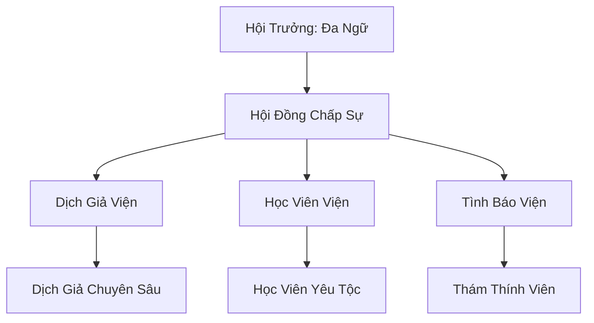

# THÚ NGỮ THÔNG DỊCH HỘI (兽语通译会)

## I. Tổng Quan (总览)
Thú Ngữ Thông Dịch Hội là một tổ chức nhỏ nhưng vô cùng quan trọng tại Đông Hoang, đóng vai trò là nhịp cầu ngôn ngữ giữa hàng vạn chủng tộc yêu thú và nhân tộc. Với khả năng thấu hiểu và chuyển ngữ hàng chục loại phương ngữ yêu thú từ cổ chí kim, hội giúp xóa bỏ những hiểu lầm không đáng có và thúc đẩy giao thương đa chủng tộc phát triển mạnh mẽ.

## II. Địa Lý & Tài Nguyên (地理 với tài nguyên)
Trụ sở là một tòa nhà hai tầng cũ kỹ nằm giữa khu chợ phía Đông của Vạn Yêu Thành. Tài nguyên lớn nhất của hội là kho lưu trữ đồ sộ các loại từ điển ngôn ngữ yêu thú cổ đại và hàng vạn bút ký thực địa ghi chép về tập tính giao tiếp của các loài sinh vật huyền bí khắp lục địa.

## III. Văn Hóa & Tín Ngưỡng (文化 với信仰)
Tôn thờ Trí Tuệ và sự Thấu Hiểu. Triết lý của hội là "Hiểu ngôn ngữ là hiểu linh hồn". Thành viên hội, dù là loài vẹt, khỉ hay cáo, đều phải tuân thủ quy tắc trung thực tuyệt đối trong dịch thuật. Họ coi việc bóp méo ý nghĩa lời nói là một hành vi báng bổ đối với linh hồn của các chủng tộc.

## IV. Cơ Cấu Tổ Chức (组织结构)


## V. Công Pháp & Trận Pháp (功法 với阵法)
- **Công Pháp:** *Linh Tâm Thông Ý Quyết* (Tăng cường khả năng tiếp nhận và xử lý tín hiệu thần thức), *Thiên Diễn Vạn Ngữ Chú*.
- **Trận Pháp:** *Linh Âm Cộng Hưởng Trận* - trận pháp hỗ trợ truyền âm diện rộng, giúp mọi chủng tộc trong phạm vi trận pháp có thể tạm thời hiểu được ý nghĩa cơ bản của nhau.

## VI. Đặc Sản Môn Phái (门派特产)
- **Từ Điển Vạn Thú:** Bộ sách chứa đựng phù văn âm thanh, giúp người đọc nắm bắt được ngữ điệu của các loài yêu thú phổ thông.
- **Linh Thạch Truyền Âm:** Loại đá ghi lại lời nói và dịch lại thành văn bản linh lực.

## VII. Cơ Sở Hạ Tầng (基础设施)
- **Đa Ngữ Các:** Nơi tiếp khách và thực hiện các hợp đồng dịch thuật trực tiếp.
- **Thư Viện Cổ Ngữ:** Căn phòng bí mật chứa các bản thảo bằng da thú thượng cổ.

## VIII. Kinh Tế (経済)
Nguồn thu đến từ phí dịch thuật theo giờ hoặc theo hợp đồng thương mại lớn. Hội cũng thu lợi nhuận từ việc biên soạn và bán các bản đồ ngôn ngữ khu vực cho những nhà thám hiểm di tích.

## IX. Lịch Sử Tóm Tắt (简史)
Sáng lập cách đây 80 năm bởi Đa Ngữ - một yêu vẹt già đã dành cả đời để lang bạt khắp Ngũ Phương lục địa. Nhận thấy sự hỗn loạn trong giao thương yêu tộc do rào cản ngôn ngữ, ông đã quyết định lập hội để chuẩn hóa việc dịch thuật yêu ngữ.

## X. Giai Thoại & Bí Mật (轶 sự với bí mật)
Đồn rằng Hội trưởng Đa Ngữ đang bí mật biên soạn một bộ "Thiên Địa Vạn Ngữ Thư", thứ có khả năng cho phép người sở hữu ra lệnh cho mọi sinh vật sống, kể cả những thực thể thần thoại.

## XI. Quan Hệ Thế Lực (势力关系)
```mermaid
graph LR
    TNTDH[Thú Ngữ Thông Dịch Hội] -- Phục vụ -- TYĐ[Thiên Yêu Đình]
    TNTDH -- Đối tác -- TSTH[Thiên Sa Thương Hội]
    TNTDH -- Giao thương -- BBC[Bách Bảo Các]
    TNTDH -- Trung lập -- ALL[Mọi Chủng Tộc]
```
