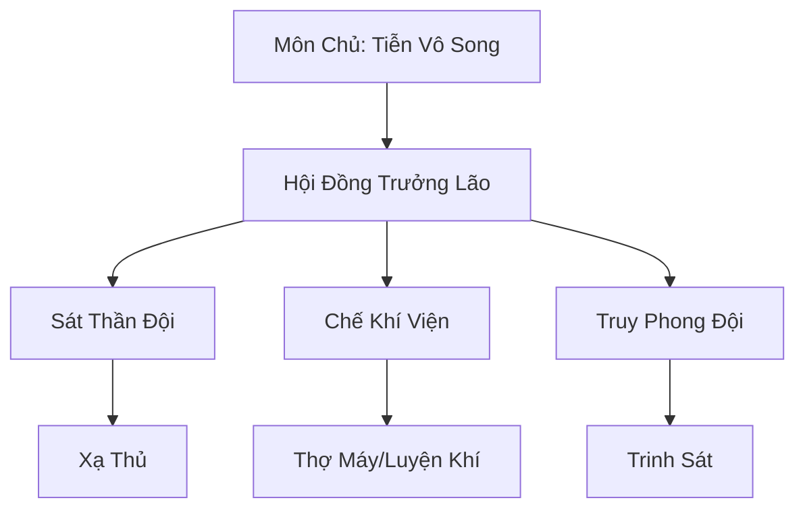

# THẦN CUNG MÔN (神弓门)

## I. Tổng Quan (总览)
Thần Cung Môn (hay còn gọi là Thần Cung Bắn Sa) là tông môn chuyên tu về viễn trình công kích duy nhất tại Tây Mạc. Với khả năng "Nhất tiễn định càn khôn", các xạ thủ của môn phái này là nỗi khiếp sợ cho bất kỳ sinh vật nào dám xâm phạm vùng trời và vùng đất của họ.

## II. Địa Lý & Tài Nguyên (地理与 tài nguyên)
Trụ sở đặt tại Vọng Nguyệt Đỉnh, một ngọn núi đá cô độc có tầm nhìn bao quát toàn bộ vùng Sa Mạc Cốt Linh. Nơi đây chứa đựng vô số bộ xương của các loài yêu thú khổng lồ thời Thái Cổ, là nguồn nguyên liệu vô tận để chế tạo thần cung.

## III. Văn Hóa & Tín Ngưỡng (文化与信仰)
Tôn thờ ý chí tự do và sự kiên nhẫn. Đệ tử Thần Cung Môn tin rằng mũi tên là sự kéo dài của ý chí, một khi đã bắn ra thì không bao giờ hối tiếc. Họ đề cao kỹ năng sinh tồn độc lập giữa môi trường sa mạc khắc nghiệt.

## IV. Cơ Cấu Tổ Chức (组织结构)


## V. Công Pháp & Trận Pháp (功法与阵法)
- **Công Pháp:** *Sa Hải Thần Tiễn Quyết* (Kỹ thuật bắn cung), *Linh Cốt Tâm Pháp* (Hấp thụ linh khí từ cốt liệu).
- **Trận Pháp:** *Vọng Nguyệt Trận* - trận pháp phòng thủ tầm xa, tăng cường nhãn lực và độ chính xác cho toàn bộ xạ thủ trong vùng ảnh hưởng.

## VI. Đặc Sản Môn Phái (门派特产)
- **Linh Cốt Cung:** Cung tên làm từ xương yêu thú cổ đại, có khả năng chịu được lực kéo cực lớn.
- **Phá Giáp Tiễn:** Mũi tên đặc chế có khả năng xuyên thủng các loại hộ thể linh khí.

## VII. Cơ Sở Hạ Tầng (基础设施)
- **Vọng Nguyệt Đỉnh:** Đài quan sát và bệ bắn lý tưởng.
- **Xưởng đúc tiễn cốt:** Nơi tập trung các lò luyện và bàn khắc phù văn.

## VIII. Kinh Tế (经济)
Nguồn thu đến từ việc bán các loại cung tên, mũi tên linh cốt cho tu sĩ và thương đoàn. Họ cũng nhận các nhiệm vụ săn bắn yêu thú hiếm và hộ tống cao cấp.

## IX. Lịch Sử Tóm Tắt (简史)
Được thành lập bởi các xạ thủ sống sót sau trận đại chiến "Cốt Linh", họ đã học cách tận dụng những gì còn sót lại của chiến trường để xây dựng nên một thế lực có thể tự bảo vệ mình giữa sa mạc.

## X. Giai Thoại & Bí Mật (轶 sự与秘密)
Tương truyền Tiễn Vương Hậu Nghệ đã để lại một cây thần cung có khả năng bắn rơi cả mặt trời (Thái Dương) trong bí cảnh sâu nhất của Vọng Nguyệt Đỉnh.

## XI. Quan Hệ Thế Lực (势力关系)
```mermaid
graph LR
    SCM[Thần Cung Môn] -- Đối tác -- TSTH[Thiên Sa Thương Hội]
    SCM -- Đối địch -- STLM[Sa Tặc Liên Minh]
    SCM -- Trung lập -- KST[Kim Sa Tự]
```
