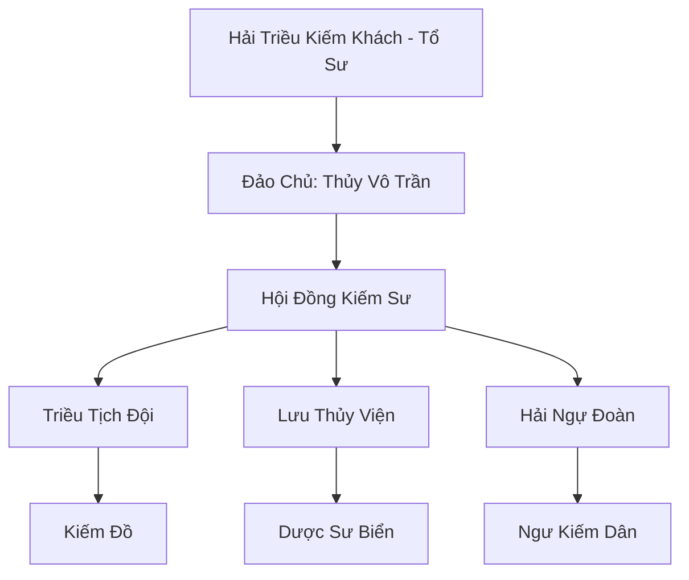

# THỦY KIẾM ĐẢO (水剑岛)

## I. Tổng Quan (总览)
Thủy Kiếm Đảo là một tông môn kiếm tu đặc thù chọn đại dương làm thánh địa tu luyện. Với phong cách chiến đấu biến hóa như nước, lúc nhu hòa uyển chuyển, lúc cuồng bạo như sóng thần, các kiếm tu tại đây là những bậc thầy làm chủ không gian mặt biển. Tông môn giữ vị thế độc lập và là lá chắn quan trọng bảo vệ cư dân ven biển khỏi sự quấy nhiễu của yêu thú và hải tặc.

## II. Địa Lý & Tài Nguyên (地理 với tài nguyên)
Tọa lạc trên một hòn đảo có hình dáng như một thanh kiếm khổng lồ đâm thẳng xuống lòng Vô Tận Hải. Đảo sở hữu "Kiếm Ý Thạch" - những khối đá ngầm bị sóng biển bào mòn thành hình lưỡi kiếm, chứa đựng kiếm khí tự nhiên của trời đất. Vùng biển xung quanh đảo trù phú với các loại san hô linh thạch và ngọc trai biển sâu, là nguồn tài nguyên kinh tế chính.

## III. Văn Hóa & Tín Ngưỡng (文化 với信仰)
Tôn thờ Hải Triều Kiếm Khách và triết lý "Tâm Tĩnh Như Thủy, Kiếm Xuất Như Triều". Đệ tử Thủy Kiếm Đảo có lối sống tự do, phóng khoáng, tâm hồn hòa quyện với tiếng sóng và gió biển. Hàng năm, họ tổ chức "Đại Hội Triều Tịch" để các kiếm tu so tài ngay trên những con sóng dữ nhất.

## IV. Cơ Cấu Tổ Chức (组织结构)


## V. Công Pháp & Trận Pháp (功法 với阵法)
- **Công Pháp:** *Hải Triều Vạn Lớp Kiếm* (Tấn công dồn dập), *Thủy Tinh Tâm Pháp* (Hồi phục và phòng ngự).
- **Trận Pháp:** *Vạn Kiếm Sóng Thần Trận* - trận pháp phòng thủ đảo, ngưng tụ nước biển thành hàng vạn lưỡi kiếm bay lơ lửng, tạo thành một bức tường kiếm bao quanh đảo khi có địch xâm lăng.

## VI. Đặc Sản Môn Phái (门派特产)
- **Thủy Tinh Kiếm:** Phi kiếm chế tác từ pha lê biển sâu, có khả năng ẩn hình khi ở dưới nước.
- **Hải Linh Đan:** Đan dược giúp tu sĩ hít thở và hoạt động bình thường dưới đáy biển trong thời gian dài.

## VII. Cơ Sở Hạ Tầng (基础设施)
- **Thính Triều Đài:** Nơi Đảo chủ tọa thiền và cảm nhận nhịp điệu của đại dương.
- **Kiếm Trì Dưới Nước:** Khu vực rèn luyện kiếm ý dưới áp lực nước cực lớn.

## VIII. Kinh Tế (経済)
Kinh tế dựa trên việc săn bắn yêu thú biển để lấy nội đan và các vật liệu quý giá. Họ cũng nổi tiếng với nghề khai thác ngọc trai linh khí và cung cấp dịch vụ bảo hộ cho các thương thuyền băng qua vùng biển phía Đông.

## IX. Lịch Sử Tóm Tắt (简史)
Sáng lập bởi Hải Triều Kiếm Khách vào thời kỷ nguyên Trung Cổ. Sau một lần thoát chết kỳ diệu giữa cơn bão thần, ông đã ngộ ra sự tương đồng giữa kiếm đạo và thủy triều, từ đó xây dựng nên tông môn trên hòn đảo hình kiếm này để truyền bá tư tưởng của mình.

## X. Giai Thoại & Bí Mật (轶 sự với bí mật)
Tương truyền Thủy Kiếm Đảo thực chất là một thanh thần binh của một vị đại năng thời Thái Cổ để lại, và hòn đảo sẽ trỗi dậy thành một thực thể khổng lồ khi thế giới gặp đại nạn.

## XI. Quan Hệ Thế Lực (势力关系)
```mermaid
graph LR
    TKĐ[Thủy Kiếm Đảo] -- Cẩn trọng -- LC[Long Cung]
    TKĐ -- Tử địch -- HHHT[Hắc Hải Hải Tặc]
    TKĐ -- Giao hảo -- CHKT[Cửu Hoa Kiếm Tông]
    TKĐ -- Hợp tác -- SHĐQ[San Hô Đảo Quốc]
```
