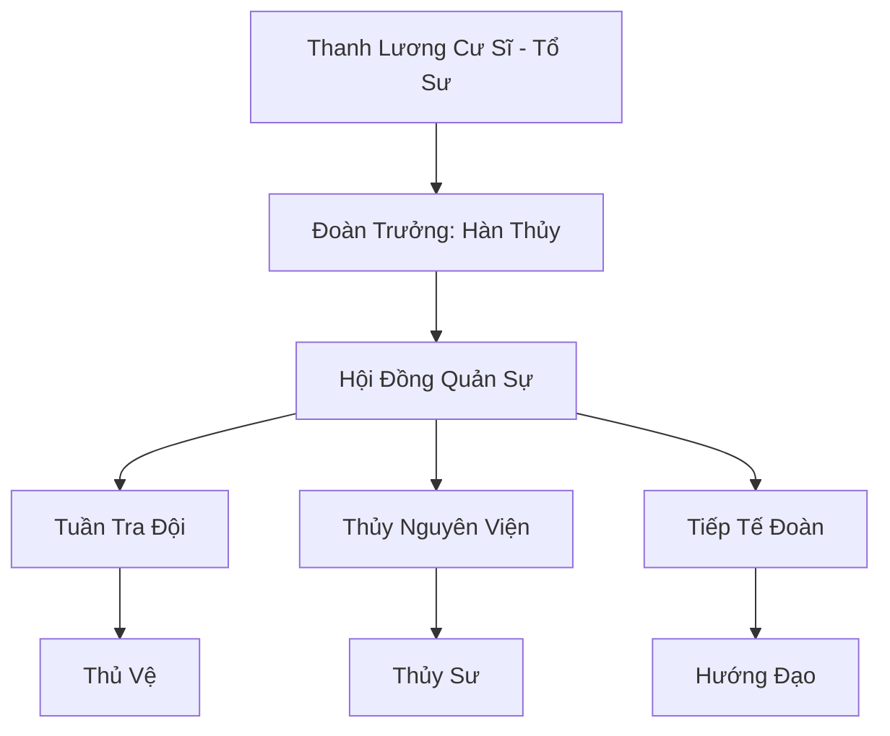

# THANH LƯƠNG THỦ VỆ (清凉守卫)

## I. Tổng Quan (总览)
Thanh Lương Thủ Vệ là một tổ chức vũ trang trung lập giữ vai trò huyết mạch tại Tây Mạc. Nhiệm vụ tối thượng của họ là bảo vệ Ốc Đảo Thanh Lương - trạm dừng chân cứu mạng duy nhất giữa đại sa mạc. Tổ chức hoạt động dựa trên nguyên tắc công bằng: "Nước là dành cho tất cả mọi người, nhưng kẻ phá hoại phải trả giá bằng mạng sống."

## II. Địa Lý & Tài Nguyên (地理 với tài nguyên)
Trụ sở chính đóng tại Ốc Đảo Thanh Lương, một vùng đất kỳ diệu có nguồn nước không bao giờ cạn giữa lòng Tây Mạc. Họ kiểm soát hệ thống mạch nước ngầm phức tạp bên dưới các cồn cát và sở hữu các tinh thể "Lam Thủy Thạch" có khả năng ngưng tụ hơi ẩm từ không khí khô cằn.

## III. Văn Hóa & Tín Ngưỡng (文化与信仰)
Tôn trọng sự sống và sự tiết kiệm. Thành viên tổ chức coi nước là linh hồn của sa mạc. Họ có văn hóa sống kỷ luật, tối giản và luôn sẵn sàng hỗ trợ những lữ khách gặp nạn, miễn là những người đó tuân thủ các quy tắc của ốc đảo.

## IV. Cơ Cấu Tổ Chức (组织结构)


## V. Công Pháp & Trận Pháp (功法与阵法)
- **Công Pháp:** *Thanh Lương Tâm Pháp* (Kháng nhiệt và ảo giác), *Sa Hải Tụ Thủy Thuật* (Ngưng tụ nước).
- **Trận Pháp:** *Tịnh Thủy Linh Trận* - trận pháp bao phủ ốc đảo, có tác dụng lọc sạch độc tố trong nước và tạo ra một lớp sương mù che giấu vị trí ốc đảo khỏi tầm mắt kẻ thù từ xa.

## VI. Đặc Sản Môn Phái (门派特产)
- **Thanh Lương Thủy:** Loại nước uống có chứa linh lực nhẹ, giúp hồi phục thể lực nhanh chóng trong môi trường nắng nóng.
- **Sa Mạc Huyết Phù:** Linh phù giúp người sử dụng giữ được độ ẩm cơ thể trong vòng 3 ngày mà không cần uống nước.

## VII. Cơ Sở Hạ Tầng (基础设施)
- **Thanh Lương Các:** Tòa nhà trung tâm dùng làm nơi điều hành và tiếp đón các đoàn thương nhân lớn.
- **Hệ thống giếng Tụ Thủy:** Các công trình bằng đá cổ xưa dùng để thu thập sương đêm và mạch nước ngầm.

## VIII. Kinh Tế (经济)
Nguồn thu đến từ "Phí bảo hộ nguồn nước" mà các thương đoàn phải trả khi dừng chân. Họ cũng kinh doanh các vật phẩm tiếp tế sa mạc và cung cấp dịch vụ hướng đạo viên chuyên nghiệp cho những ai muốn băng qua các vùng đất tử thần của Tây Mạc.

## IX. Lịch Sử Tóm Tắt (简史)
Sáng lập bởi Thanh Lương Cư Sĩ, một cao nhân ẩn thế đã phát hiện ra nguồn nước thần kỳ và quyết định dùng tu vi của mình để ngăn chặn các thế lực tà ác muốn độc chiếm nó. Qua nhiều thế kỷ, Thanh Lương Thủ Vệ đã trở thành một biểu tượng của sự hy vọng giữa cát cháy.

## X. Giai Thoại & Bí Mật (轶 sự với bí mật)
Tương truyền dưới đáy hồ nước trung tâm của ốc đảo có một lối vào dẫn đến "Thủy Nguyên Bí Cảnh", nơi chứa đựng nguồn nước nguyên thủy của toàn bộ lục địa.

## XI. Quan Hệ Thế Lực (势力关系)
```mermaid
graph LR
    TLTV[Thanh Lương Thủ Vệ] -- Hợp tác -- TSTH[Thiên Sa Thương Hội]
    TLTV -- Giao hảo -- KST[Kim Sa Tự]
    TLTV -- Đối địch -- STLM[Sa Tặc Liên Minh]
```
