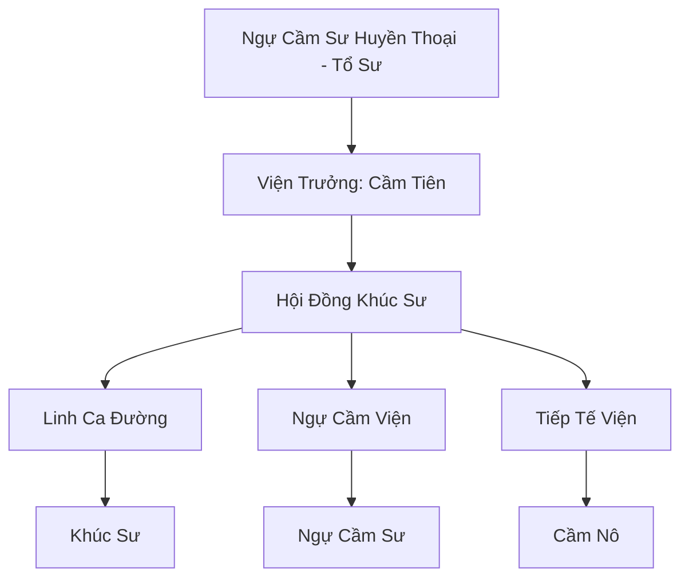

# TIÊN CẦM VIỆN (仙禽院)

## I. Tổng Quan (总览)
Tiên Cầm Viện là tông môn duy nhất tại Đông Hoang chuyên tâm vào việc bảo tồn và huấn luyện các loài chim quý hiếm và yêu tộc phi cầm. Khác với sự hung bạo của Bách Thú Sơn Trang, Tiên Cầm Viện đề cao sự hòa hợp, nghệ thuật âm nhạc và sự tao nhã. Đây là trung tâm giao thương thú cưỡi bay và dịch vụ bưu chính linh lực lớn nhất, giữ vai trò huyết mạch thông tin cho toàn bộ lục địa.

## II. Địa Lý & Tài Nguyên (地理 với tài nguyên)
Trụ sở chính nằm trong một vực núi lộng gió thuộc dãy Thiên Trụ Sơn, nơi có độ cao lý tưởng cho các loài chim cư ngụ. Viện sở hữu hệ thống "Tổ Chim Phù Không" - những kiến trúc treo lơ lửng giữa các vách đá. Tài nguyên quý giá nhất là "Phượng Hoàng Tàn Hồn" được lưu giữ trong đại điện, tỏa ra linh hỏa dịu nhẹ nuôi dưỡng hàng vạn linh điểu.

## III. Văn Hóa & Tín Ngưỡng (文化 với信仰)
Tôn thờ linh hồn Phượng Hoàng và triết lý "Tiếng Hót Hóa Đạo". Đệ tử Tiên Cầm Viện thường mang theo nhạc cụ (sáo, đàn) để giao tiếp với thú cưỡi. Họ coi mỗi con chim là một người bạn, một cộng sự tâm linh thay vì chỉ là công cụ chiến đấu. Văn hóa của viện rất yên bình, yêu thích thơ ca và những chuyến bay tự do trên tầng mây.

## IV. Cơ Cấu Tổ Chức (组织结构)


## V. Công Pháp & Trận Pháp (功法 với阵法)
- **Công Pháp:** *Bách Điểu Triều Phượng Khúc* (Âm công diện rộng), *Phong Vũ Hành* (Thân pháp và điều khiển gió).
- **Trận Pháp:** *Vạn Cầm Hộ Không Trận* - trận pháp phòng thủ sử dụng hàng vạn linh điểu kết hợp cùng linh lực đệ tử để tạo ra một lưới bao vây không trung, ngăn chặn mọi kẻ địch tiếp cận vách núi.

## VI. Đặc Sản Môn Phái (门派特产)
- **Hạc Vũ Pháp Y:** Áo choàng làm từ lông tiên hạc, giúp người mặc nhẹ như bông và tăng khả năng kháng phong hệ.
- **Tiêu Âm Linh:** Loại chuông phát ra âm thanh tần số thấp chỉ có loài chim mới nghe thấy, dùng để truyền tin bí mật.

## VII. Cơ Sở Hạ Tầng (基础设施)
- **Bách Điểu Đình:** Nơi hàng ngàn loài chim tập trung về mỗi buổi hoàng hôn để nghe kinh văn.
- **Hành Lang Gió:** Hệ thống cầu treo nối liền các đỉnh núi, được yểm bùa để hỗ trợ việc cất cánh và hạ cánh an toàn.

## VIII. Kinh Tế (経済)
Nguồn thu chính từ việc bán và cho thuê các loài thú cưỡi bay cao cấp cho các tông môn và hoàng gia. Họ cũng nắm giữ mạng lưới "Thiên cầm truyền tin" - dịch vụ đưa thư nhanh nhất và an toàn nhất Cố Nguyên Giới.

## IX. Lịch Sử Tóm Tắt (简史)
Được thành lập bởi Ngự Cầm Sư Huyền Thoại vào thời Trung Cổ, người đã dùng âm nhạc của mình để dẹp yên một cuộc bạo loạn của yêu tộc phi cầm. Ông đã chọn Thiên Trụ Sơn làm nơi xây dựng học viện để giảng dạy con đường cộng sinh hòa bình giữa người và chim.

## X. Giai Thoại & Bí Mật (轶 sự với bí mật)
Tương truyền mỗi ngàn năm, Phượng Hoàng Tàn Hồn sẽ tái sinh thành một hạt giống lửa, và nếu ai tìm được, người đó sẽ có khả năng hiệu lệnh vạn điểu của toàn bộ thế giới.

## XI. Quan Hệ Thế Lực (势力关系)
```mermaid
graph LR
    TCV[Tiên Cầm Viện] -- Đối tác -- ANU[Ảnh Nguyệt Uyển]
    TCV -- Cạnh tranh -- BTS[Bách Thú Sơn Trang]
    TCV -- Giao hảo -- VHC[Vũ Hoàng Các]
    TCV -- Cung cấp -- DCHH[Đại Càn Hoàng Triều]
```
