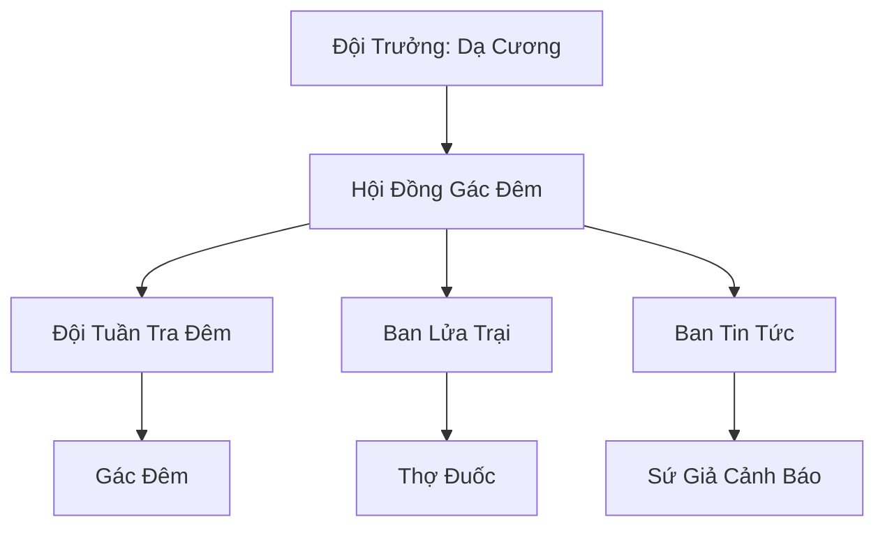

# ĐẠI MẠC GÁC ĐÊM (大漠守夜人)

## I. Tổng Quan (总览)
Đại Mạc Gác Đêm là một tổ chức tình nguyện đặc biệt gồm những Sa Cự Nhân dũng cảm và trầm mặc, dành trọn cuộc đời để trấn thủ tại ranh giới nguy hiểm nhất Tây Mạc: Vĩnh Tịch Chi Địa. Trong khi phần lớn thế giới mải mê tranh giành quyền lực, những người gác đêm này âm thầm đối mặt với bóng tối vĩnh cửu, ngăn chặn các thực thể kỳ lạ và chướng khí hắc ám tràn vào các vùng đất có sự sống. Đây là nhiệm vụ cô độc, không vinh quang nhưng vô cùng thiết yếu cho sự ổn định của sa mạc.

## II. Địa Lý & Tài Nguyên (地理 với tài nguyên)
Hoạt động dọc theo một dải cát tĩnh lặng bất thường, nơi gió sa mạc ngừng thổi và ánh sáng mặt trời bị bẻ cong bởi ranh giới bóng tối. Địa hình tại đây khô cằn và tuyệt diệt sinh linh. Tài nguyên duy nhất của họ là "Đuốc Linh" - loại hỏa cụ đặc chế từ mỡ yêu thú bóng tối và linh thảo kháng ma, thứ duy nhất có thể duy trì ánh sáng giữa màn đêm Vĩnh Tịch.

## III. Văn Hóa & Tín Ngưỡng (文化 với信仰)
Đề cao triết lý: "Ban đêm, sa mạc thuộc về thứ khác — chúng ta canh giữ ranh giới". Thành viên đội gác đêm coi sự tĩnh lặng và tỉnh táo là tôn chỉ sống. Họ có văn hóa hát các bài ca cổ của Cự Tộc trong lúc tuần tra để giữ vững tinh thần và xua đuổi những tiếng thì thầm của bóng tối. Tuyển mộ dựa trên sự tình nguyện tuyệt đối, không ai bị ép buộc phải tham gia vào nhiệm vụ tử thần này.

## IV. Cơ Cấu Tổ Chức (组织结构)


## V. Công Pháp & Trận Pháp (功法 với阵法)
- **Công Pháp:** *Dạ Nhãn Thuật* (Khả năng nhìn xuyên thấu bóng tối tuyệt đối), *Huyết Mạch Trấn Áp* (Sử dụng long uy/cự uy để đẩy lùi thực thể bóng tối).
- **Trận Pháp:** *Lửa Trại Phù Văn Trận* - hệ thống các đốm lửa linh lực được bố trí theo trận đồ, tạo ra một bức tường ánh sáng liên kết giúp xua đuổi chướng khí và cảnh báo khi ranh giới bóng tối dịch chuyển.

## VI. Đặc Sản Môn Phái (门派特产)
- **Dầu Đuốc Kháng Ma:** Loại dầu đốt tỏa ra mùi hương có tác dụng làm suy yếu các thực thể tâm linh tà ác.
- **Đá Gác Đêm:** Những viên đá được yểm bùa đặt dọc ranh giới, tự động phát sáng khi có biến động không gian.

## VII. Cơ Sở Hạ Tầng (基础设施)
- **Trạm Gác Đá Tảng:** Các chòi gác kiên cố được đục từ những khối đá sa thạch khổng lồ dọc theo ranh giới.
- **Hang Lửa Vĩnh Cửu:** Nơi lưu giữ ngọn lửa gốc và là nơi nghỉ ngơi duy nhất của các thành viên.

## VIII. Kinh Tế (経済)
Không có hoạt động kinh tế mang tính lợi nhuận. Đội sống dựa trên sự tự cung tự cấp và các khoản hỗ trợ ít ỏi từ các bộ lạc cự nhân thuần huyết hoặc bán thạch. Đôi khi họ trao đổi các mảnh xương hoặc vật liệu từ sinh vật bóng tối chết tại ranh giới cho các thợ rèn để lấy linh thạch hoặc nhu yếu phẩm.

## IX. Lịch Sử Tóm Tắt (简史)
Được hình thành từ thời Thái Cổ sau khi Vĩnh Tịch Chi Địa xuất hiện. Những tổ tiên Sa Cự Nhân đầu tiên nhận ra rằng nếu không có người canh giữ, bóng tối sẽ sớm nuốt chửng toàn bộ sa mạc. Qua hàng nghìn năm, Đại Mạc Gác Đêm đã trở thành một truyền thống thiêng liêng, được duy trì qua bao thế hệ cự nhân trầm mặc và quả cảm.

## X. Giai Thoại & Bí Mật (轶 sự với bí mật)
Tương truyền Dạ Cương đã canh giữ ranh giới này hơn 200 năm và ông đã từng nhìn thấy một bóng người khổng lồ bước ra từ trung tâm Vĩnh Tịch Chi Địa, người đó có hình dáng giống hệt một vị thần cổ đại đã mất tích.

## XI. Quan Hệ Thế Lực (势力关系)
```mermaid
graph LR
    ĐMGĐ[Đại Mạc Gác Đêm] -- Xuất thân -- SCJBL[Sa Cự Nhân Bộ Lạc]
    ĐMGĐ -- Hợp tác -- BTC[Bán Thạch Cự Nhân]
    ĐMGĐ -- Ngăn chặn -- VTCĐ[Vĩnh Tịch Chi Địa]
    ĐMGĐ -- Cảnh giác -- HSM[Huyết Sát Minh]
```
