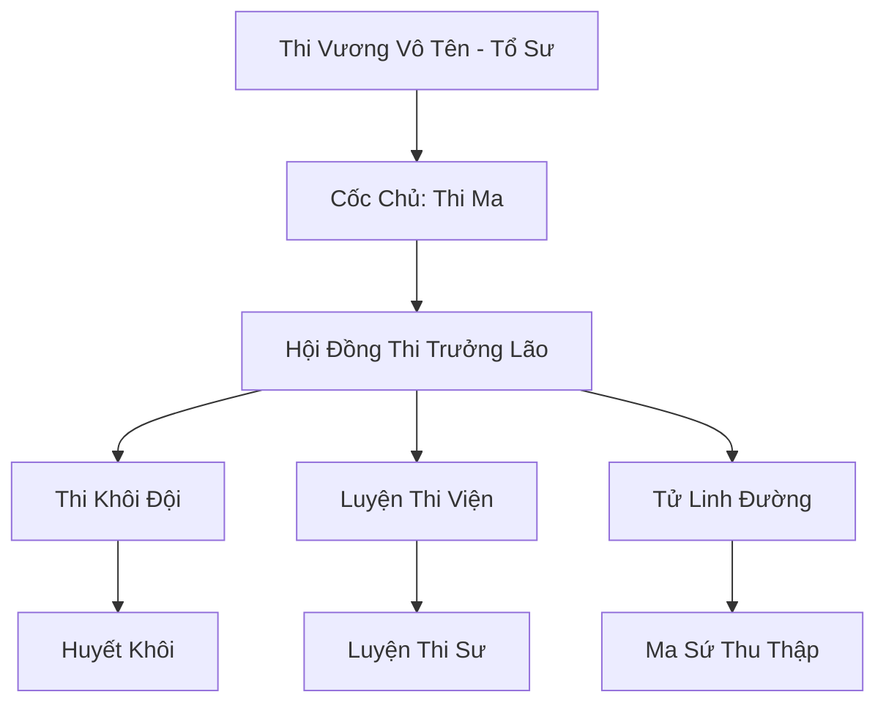

# TỬ VONG CHI THUNG LŨNG (死亡之谷)

## I. Tổng Quan (总览)
Tử Vong Chi Thung Lũng là một tông môn ma đạo chuyên về nghệ thuật luyện xác và điều khiển khôi lỗi thú. Tọa lạc tại một khu vực tử khí nồng nặc nhất Đông Hoang, tông môn này biến cái chết thành sức mạnh quân sự đáng sợ, là nỗi ám ảnh của các sinh vật sống xung quanh.

## II. Địa Lý & Tài Nguyên (地理 với tài nguyên)
Nằm sâu trong một thung lũng quanh năm sương mù xám xịt bao phủ, nơi ánh sáng mặt trời không thể chạm tới. Cốt lõi tài nguyên là "Vạn Thi Trì" - hồ nước chứa đầy dịch dưỡng xác và oán khí, cùng với các nghĩa địa cổ đại cung cấp nguồn nguyên liệu xác chết vô tận.

## III. Văn Hóa & Tín Ngưỡng (文化 với信仰)
Tôn thờ sự bất tử của vật chất. Họ tin rằng linh hồn là phù du, chỉ có cơ thể được rèn luyện và gia cố bằng ma pháp mới là vĩnh cửu. Văn hóa môn phái lạnh lùng, tàn nhẫn và không có sự tôn trọng đối với sự an nghỉ của người chết.

## IV. Cơ Cấu Tổ Chức (组织结构)


## V. Công Pháp & Trận Pháp (功法与阵法)
- **Công Pháp:** *Vạn Thi Quy Tâm Kinh* (Điều khiển đa mục tiêu), *Thi Hài Tái Sinh Thuật* (Hồi phục khôi lỗi).
- **Trận Pháp:** *Tử Vong Kết Giới* - trận pháp bao trùm thung lũng, biến mọi vết thương của quân địch thành nguồn lây nhiễm tử khí, ngăn chặn sự hồi phục.

## VI. Đặc Sản Môn Phái (门派特产)
- **Thi Hương Cao:** Loại mỡ đặc biệt dùng để bảo quản xác chết không bị phân hủy.
- **Xích Sắt Hư Không:** Pháp bảo dùng để trói buộc và điều khiển những con khôi lỗi thú khổng lồ.

## VII. Cơ Sở Hạ Tầng (基础设施)
- **Huyết Nhục Xưởng Đúc:** Nơi diễn ra các công đoạn lắp ráp và gia cố xác chết bằng kim loại linh thạch.
- **Đài Gọi Hồn:** Nơi thực hiện nghi lễ găm linh hồn vào xác sống.

## VIII. Kinh Tế (经济)
Nguồn thu đến từ việc cung cấp khôi lỗi chiến đấu cho các thế lực ma đạo khác và việc thu phí mai táng bí mật (thực chất là mua xác). Họ cũng chiếm đoạt tài sản từ những kẻ xâm nhập trái phép vào thung lũng.

## IX. Lịch Sử Tóm Tắt (简史)
Sáng lập bởi một tu sĩ cuồng tín muốn hồi sinh thú cưỡi của mình. Qua hàng vạn năm tích lũy tử khí, nơi đây đã biến từ một nghĩa địa nhỏ thành một tông môn ma đạo có tổ chức, đủ sức thách thức uy quyền của Thiên Yêu Đình tại khu vực phía Đông.

## X. Giai Thoại & Bí Mật (轶 sự với bí mật)
Có lời đồn rằng dưới đáy Vạn Thi Trì có một con "Thi Long" khổng lồ đang được cốc chủ âm thầm hoàn thiện để làm vũ khí chinh phục toàn bộ Đông Hoang.

## XI. Quan Hệ Thế Lực (势力关系)
```mermaid
graph LR
    TVCC[Tử Vong Chi Thung Lũng] -- Tử địch -- TYĐ[Thiên Yêu Đình]
    TVCC -- Phụ thuộc -- CUMT[Cửu U Ma Tông]
    TVCC -- Cung cấp -- HSM[Huyết Sát Minh]
    TVCC -- Cạnh tranh -- OALT[Ảo Ảnh Lâm Tộc]
```
