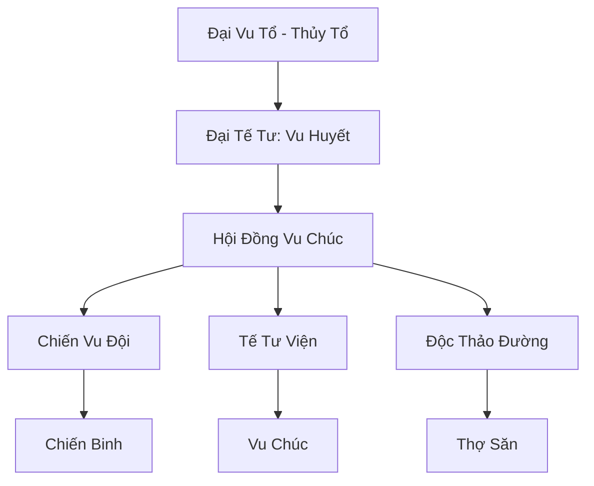

# VU TỘC TẾ ĐÀN (巫族祭坛)

## I. Tổng Quan (总览)
Vu Tộc Tế Đàn là một bộ lạc cổ xưa và huyền bí, giữ gìn những phương pháp tu luyện hoang sơ nhất từ thời Thái Cổ. Họ từ chối linh khí tinh thuần của tiên đạo, thay vào đó tập trung vào việc cường hóa nhục thân bằng nọc độc và sức mạnh của đất đá. Bộ lạc này sống tách biệt và chỉ hành động khi vùng đất thiêng của họ bị xâm phạm.

## II. Địa Lý & Tài Nguyên (地理 với tài nguyên)
Trụ sở chính nằm sâu trong dãy Vu Độc Sơn Mạch, một khu vực hiểm trở với sương mù độc bao phủ quanh năm. Bộ lạc sở hữu "Vạn Độc Trì" - một hồ nước tự nhiên tích tụ nọc độc của hàng vạn loài côn trùng và bò sát qua hàng nghìn năm, là tài nguyên quý giá nhất để rèn luyện "Vu Thể".

## III. Văn Hóa & Tín Ngưỡng (文化 với信仰)
Tôn thờ Đại Vu Tổ và các linh hồn tổ tiên. Họ tin rằng mỗi vết xăm trên cơ thể là một lần giao tiếp với thần linh và mỗi vết sẹo là một huân chương danh dự. Văn hóa của họ mang đậm tính nghi lễ, với các vũ điệu tế đàn và tiếng trống da thú vang vọng trong những đêm trăng máu.

## IV. Cơ Cấu Tổ Chức (组织结构)


## V. Công Pháp & Trận Pháp (功法与阵法)
- **Công Pháp:** *Vu Huyết Thần Thể* (Luyện thể ngoại công), *Đại Địa Trọng Kích* (Sát thương vật lý mạnh).
- **Trận Pháp:** *Vu Độc Đồ Đằng Trận* - trận pháp phòng thủ dựa trên các cột đá khắc phù văn, có khả năng phun ra độc khí và làm suy yếu linh lực kẻ thù.

## VI. Đặc Sản Môn Phái (门派特产)
- **Vu Độc Cao:** Loại cao bôi ngoài da giúp tăng cường độ cứng cáp và khả năng kháng độc.
- **Xương Thú Phù:** Những mảnh xương yêu thú được khắc phù văn, dùng để triệu hồi linh hồn chiến thú trợ chiến.

## VII. Cơ Sở Hạ Tầng (基础设施)
- **Tế Đàn Thượng Cổ:** Nơi diễn ra các nghi lễ quan trọng và là điểm tập trung năng lượng của toàn bộ lạc.
- **Hang Động Luyện Thể:** Hệ thống hang động chứa đầy độc vật dành cho việc rèn luyện đệ tử.

## VIII. Kinh Tế (经济)
Kinh tế tự cung tự cấp là chính. Họ thỉnh thoảng trao đổi các loại dược liệu độc hiếm và cổ vật khai quật được cho những thương nhân gan dạ để lấy các vật dụng sinh hoạt từ thế giới bên ngoài.

## IX. Lịch Sử Tóm Tắt (简史)
Là hậu duệ của những chiến binh Cự Tộc và Nhân Tộc đã sát cánh bên nhau trong cuộc chiến Thái Cổ. Sau khi chiến tranh kết thúc, họ chọn ở lại vùng núi độc này để canh giữ bí mật của tổ tiên và duy trì dòng máu lai đặc biệt của mình.

## X. Giai Thoại & Bí Mật (轶 sự với bí mật)
Tương truyền dưới lòng Tế Đàn Thượng Cổ có chôn cất "Trái Tim Của Đất", thứ cung cấp sức mạnh luyện thể vô hạn cho những ai đủ can đảm để dung hợp với nó.

## XI. Quan Hệ Thế Lực (势力关系)
```mermaid
graph LR
    VTTĐ[Vu Tộc Tế Đàn] -- Tôn trọng -- TYD[Thiên Yêu Đình]
    VTTĐ -- Tử địch -- VDM[Vạn Độc Môn]
    VTTĐ -- Cảnh giác -- TAM[Thái Ất Môn]
```
