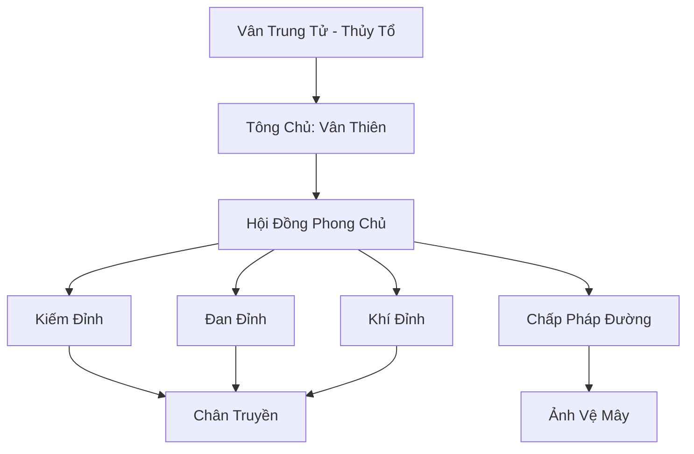

# VÂN TÔNG (云宗)

## I. Tổng Quan (总览)
Vân Tông là một trong những tông môn tu tiên hùng mạnh và lâu đời nhất Cố Nguyên Giới, ngự trị trên những đỉnh núi cao nhất bao quanh Thiên Trụ Sơn. Với triết lý "Phi Thăng Chi Đạo", tông môn tập trung vào việc tu luyện khí tu thuần túy và đạt đến sự hòa hợp tuyệt đối với mây gió. Vân Tông nổi tiếng với phong thái thanh cao, lánh đời nhưng lại nắm giữ sức mạnh đủ để thay đổi vận mệnh của toàn bộ lục địa.

## II. Địa Lý & Tài Nguyên (地理 với tài nguyên)
Trụ sở chính nằm rải rác trên hàng trăm đỉnh núi nhỏ lơ lửng giữa biển mây (Vân Hải). Tông môn kiểm soát "Vân Hải Bí Cảnh" - nơi sản sinh ra các loại vân thạch chứa đựng linh khí phong hệ đậm đặc và "Linh Sương Vạn Năm" dùng để tẩy tủy phạt cốt cho đệ tử thiên tài.

## III. Văn Hóa & Tín Ngưỡng (文化 với信仰)
Tôn thờ Vân Trung Tử và triết lý "Tự Do Tuyệt Đối, Hạo Nhiên Chính Khí". Đệ tử Vân Tông thường mặc y phục trắng vân mây, cưỡi hạc tiên hoặc ngự mây bay lượn. Văn hóa tông môn đề cao sự thanh khiết, tri thức và sự tự cao tự đại của những kẻ ở gần Thiên Đạo nhất. Họ coi việc can thiệp vào chuyện thế tục là điều làm vẩn đục đạo tâm.

## IV. Cơ Cấu Tổ Chức (组织结构)


## V. Công Pháp & Trận Pháp (功法 với阵法)
- **Công Pháp:** *Thái Hư Vân Du Kiếm* (Kiếm pháp biến hóa như mây), *Hạo Nhiên Chính Khí Cảnh* (Tâm pháp trấn áp tâm ma).
- **Trận Pháp:** *Thái Hư Hạo Nhiên Trận* - đại trận bao phủ toàn bộ vùng biển mây, có khả năng hóa giải mọi loại đòn tấn công vật lý và ma khí, biến không gian thành một vùng hư vô đối với kẻ thù.

## VI. Đặc Sản Môn Phái (门派特产)
- **Vân Du Thuyền:** Loại phi thuyền nhỏ chạy bằng phong linh khí, có tốc độ cực nhanh và khả năng ẩn hình trong mây.
- **Vân Thạch Linh Đan:** Đan dược giúp tu sĩ tạm thời đạt đến trạng thái "Không trọng lượng" để tu luyện pháp thuật không gian.

## VII. Cơ Sở Hạ Tầng (基础设施)
- **Thiên Vân Điện:** Cung điện chính lơ lửng tại đỉnh cao nhất, nơi diễn ra các cuộc họp của đại năng.
- **Vọng Thiên Đài:** Sân tập luyện và quan sát thiên văn, khí vận của lục địa.

## VIII. Kinh Tế (経済)
Kinh tế dựa trên việc bảo hộ các mạch linh khí lớn xung quanh Thiên Trụ Sơn và việc cung cấp các tài nguyên phong hệ quý hiếm. Họ cũng nhận các khoản cống nạp từ Đại Càn Hoàng Triều để đổi lấy sự bảo hộ về mặt tâm linh và đào tạo các hoàng tử, công chúa.

## IX. Lịch Sử Tóm Tắt (简史)
Được thành lập từ thời Thái Cổ bởi Vân Trung Tử, người đã ngộ đạo khi cưỡi mây chu du vạn dặm. Vân Tông đã trải qua vô số cuộc chiến vạn tộc và luôn giữ vững vị thế là người gác cổng cho Thiên Trụ Sơn, duy trì sự thanh khiết cho trục thế giới.

## X. Giai Thoại & Bí Mật (轶 sự với bí mật)
Tương truyền Tông chủ Vân Thiên có khả năng biến toàn bộ tông môn thành một làn khói và di chuyển nó đến bất kỳ đâu trong Cố Nguyên Giới chỉ trong một ý niệm.

## XI. Quan Hệ Thế Lực (势力关系)
```mermaid
graph LR
    VT[Vân Tông] -- Đồng minh -- CHKT[Cửu Hoa Kiếm Tông]
    VT -- Tử địch -- CUMT[Cửu U Ma Tông]
    VT -- Tôn trọng -- VHC[Vũ Hoàng Các]
    VT -- Đối tác -- DCHH[Đại Càn Hoàng Triều]
```
