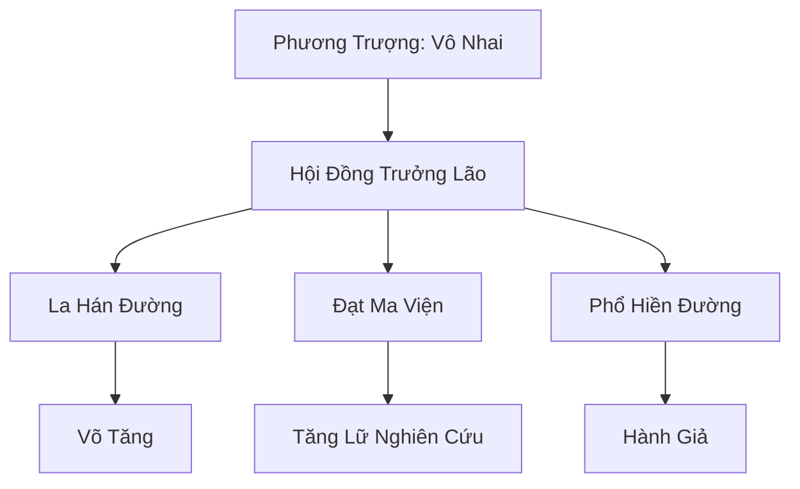

# VÔ TRANH TỰ (无争寺)

## I. Tổng Quan (总览)
Vô Tranh Tự là thánh địa Phật giáo uy nghiêm nhất Cố Nguyên Giới, nổi tiếng với triết lý từ bi và sự tĩnh lặng tuyệt đối. Khác với sự khổ hạnh của Kim Sa Tự, Vô Tranh Tự tập trung vào việc tu luyện tâm thức và tịnh hóa thế gian. Tự viện là nơi lưu giữ những bộ kinh phật thượng cổ quý giá nhất và là lá chắn tinh thần vững chắc cho nhân loại trước sự trỗi dậy của các thế lực tà ác.

## II. Địa Lý & Tài Nguyên (地理 với tài nguyên)
Tọa lạc trong một rừng trúc xanh mướt quanh năm sương khói bao phủ ở phía Tây dãy núi Thiên Trụ Sơn. Nơi đây có môi trường linh khí vô cùng hòa nhã, phù hợp cho việc thiền định lâu dài. Tài nguyên chính của tự viện là các mạch "Phật Quang Thạch" - loại đá có khả năng tự phát sáng và xua đuổi ma khí, cùng với tàng kinh các chứa đựng hàng vạn điển tịch tu tâm.

## III. Văn Hóa & Tín Ngưỡng (文化 với信仰)
Tôn thờ Phật Tổ và triết lý "Vạn Pháp Giai Không, Vô Tranh Thị Đạo". Tăng lữ tại đây sống cuộc đời thanh bạch, ăn chay niệm phật và không tham gia vào các cuộc tranh giành quyền lực thế tục. Họ đề cao sự nhẫn nhịn nhưng cũng cực kỳ kiên quyết khi đối mặt với tà ma ngoại đạo đang gây hại cho chúng sinh.

## IV. Cơ Cấu Tổ Chức (组织结构)


## V. Công Pháp & Trận Pháp (功法 với阵法)
- **Công Pháp:** *Kim Cương Bất Hoại Thể* (Phòng ngự tuyệt đối), *Đại Bi Chú* (Âm công tịnh hóa tâm hồn).
- **Trận Pháp:** *Bát Nhã Tâm Giới Trận* - trận pháp bao phủ tự viện, có khả năng phản chiếu nội tâm kẻ thù, khiến những kẻ mang tâm địa tà ác tự rơi vào mê cung của chính mình.

## VI. Đặc Sản Môn Phái (门派特产)
- **Vô Tranh Trà:** Loại trà mọc trong rừng trúc, giúp tu sĩ bình ổn tâm ma và tăng cường thần thức.
- **Phật Châu Định Tâm:** Chuỗi hạt đã được trì chú, có tác dụng hộ thân và xua đuổi tà mị cực tốt.

## VII. Cơ Sở Hạ Tầng (基础设施)
- **Đại Hùng Bảo Điện:** Nơi đặt pho tượng Phật tổ khổng lồ dát vàng, trung tâm của mọi nghi lễ.
- **Vạn Phật Động:** Hệ thống hang động chứa hàng vạn bức tượng Phật được tạc trực tiếp vào vách đá Thiên Trụ Sơn.

## VIII. Kinh Tế (経済)
Nguồn thu chủ yếu đến từ sự quyên góp tự nguyện của hàng triệu tín đồ khắp lục địa. Tự viện cũng cung cấp các loại vật phẩm tâm linh và dịch vụ tịnh hóa linh hồn cho những gia tộc lớn gặp phải các vấn đề về oan hồn hoặc tà thuật.

## IX. Lịch Sử Tóm Tắt (简史)
Sáng lập bởi Vô Tranh Thiền Sư vào thời Thượng Cổ, người đã dùng phật pháp để cảm hóa một con ma long đang tàn phá thế gian. Tự viện đã trải qua hàng nghìn năm đứng vững như một biểu tượng của chính đạo, từng dẫn đầu nhiều cuộc thập tự chinh tiêu diệt ma đầu nhưng sau đó lại rút về ẩn thế đọc kinh.

## X. Giai Thoại & Bí Mật (轶 sự với bí mật)
Tương truyền trong Đạt Ma Viện có giam giữ một "Ma Quân" từ thời Thái Cổ không thể tiêu diệt, và các vị cao tăng phải thay phiên nhau tụng kinh vạn năm để trấn áp hắn.

## XI. Quan Hệ Thế Lực (势力关系)
```mermaid
graph LR
    VTT[Vô Tranh Tự] -- Tử địch -- HMT[Huyết Ma Tông]
    VTT -- Đồng môn -- KST[Kim Sa Tự]
    VTT -- Cố vấn -- DCHH[大乾皇朝]
    VTT -- Đối địch -- HHHT[Hắc Hải Hải Tặc]
```
