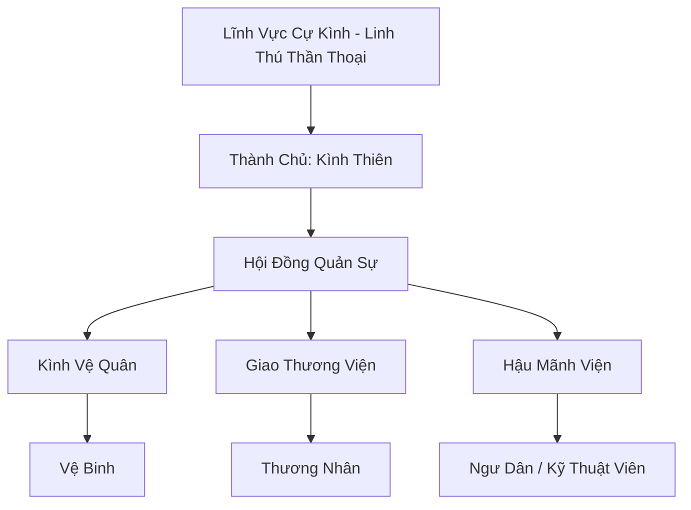

# CỰ KÌNH BẢO (巨鯨堡)

## I. Tổng Quan (总览)
Cự Kình Bảo là một trong những kỳ quan di động của Vô Tận Hải — một thành phố sầm uất với năm ngàn cư dân được xây dựng hoàn toàn trên lưng Lĩnh Vực Cự Kình, loài cá voi thượng cổ có kích thước tương đương một hòn đảo nhỏ. Dưới quyền cai trị của Thành Chủ Kình Thiên — tu vi Nguyên Anh Viên Mãn, người duy nhất có thể giao tiếp trực tiếp với Cự Kình qua thuật Ngự Thú Linh Tâm — thành phố di chuyển không ngừng trên Vô Tận Hải, theo dõi hải lưu giàu linh khí và tránh xa vùng nguy hiểm. Cự Kình Bảo vừa là pháo đài quân sự vững chắc vừa là trung tâm giao thương quan trọng nhất trên mặt biển, cho phép thương nhân từ mọi phương trời trao đổi hàng hóa ngay giữa đại dương bao la. Xếp Hạng Nhì, thành phố giữ lập trường trung lập trong các tranh chấp lớn — không theo Hải Thần Cung cũng không theo Long Cung — mà chỉ phục vụ thương mại và bảo vệ cư dân.

## II. Địa Lý & Tài Nguyên (地理 với tài nguyên)
Vì là thành phố di động, "địa lý" của Cự Kình Bảo thay đổi theo hải lưu. Tuy nhiên, nó luôn di chuyển qua các vùng biển giàu linh khí thủy hệ. Tài nguyên quý giá nhất chính là lớp da và chất tiết từ con cá voi khổng lồ, có khả năng gia cố các công trình kiến trúc và làm nguyên liệu luyện đan. Bảo cũng kiểm soát các túi trữ vật không gian quy mô lớn được tích hợp vào kiến trúc thành phố.

## III. Văn Hóa & Tín Ngưỡng (文化 với信仰)
Tôn thờ tinh thần cộng sinh giữa con người và đại dương. Cư dân Cự Kình Bảo coi con cá voi khổng lồ là vị thần bảo hộ và là thành viên quan trọng nhất của thành phố. Văn hóa tại đây mang đậm tính cởi mở, tự do của dân biển, nơi mọi chủng tộc đều có thể chung sống miễn là tôn trọng quy tắc của Bảo và không làm tổn thương "vị thần cưỡi" của họ.

## IV. Cơ Cơ Tổ Chức (组织结构)


## V. Công Pháp & Trận Pháp (功法 với阵法)
- **Công Pháp:** *Kình Hải Thôn Phệ Quyết* (Hấp thụ linh khí biển), *Ngự Thú Linh Tâm* (Giao tiếp với cá voi).
- **Trận Pháp:** *Kình Hải Hộ Giáp Trận* - trận pháp bao phủ toàn bộ lưng cá voi, tạo ra một lớp màng ngăn nước và phản chấn lại các đòn tấn công từ dưới lòng biển sâu.

## VI. Đặc Sản Môn Phái (门派特产)
- **Kình Chi Linh Dầu:** Loại dầu chiết xuất từ mỡ cá voi đã qua tinh luyện, có tác dụng tăng cường phòng ngự cho tàu thuyền và pháp bảo.
- **Thủy Tinh Cá Voi:** Loại đá linh thạch hình thành trên lưng cự kình, chứa đựng năng lượng thủy hệ dồi dào.

## VII. Cơ Sở Hạ Tầng (基础设施)
- **Cảng Lưng Cá:** Hệ thống cầu cảng phức tạp có khả năng thích ứng với sự chuyển động của con cá voi.
- **Quảng Trường Trung Tâm:** Nơi diễn ra các phiên chợ nổi và lễ hội đại dương.

## VIII. Kinh Tế (経済)
Kinh tế cực kỳ phát triển nhờ việc thu phí bến bãi và phí bảo hộ. Cự Kình Bảo là điểm trung chuyển lý tưởng cho hàng hóa từ phương Bắc xuống phương Nam và ngược lại. Họ cũng sở hữu đội tàu đánh bắt hải sản và săn tìm kho báu biển sâu cực kỳ hiệu quả.

## IX. Lịch Sử Tóm Tắt (简史)
Khởi nguồn từ một nhóm ngư dân may mắn cứu thoát một con cá voi con khỏi sự truy sát của hải tặc thời Trung Cổ. Theo thời gian, sự gắn kết giữa con người và sinh vật này đã tạo nên một cộng đồng bền vững. Con cá voi lớn dần, và thành phố trên lưng nó cũng ngày càng phồn vinh, trở thành biểu tượng của sự bình yên trên sóng dữ.

## X. Giai Thoại & Bí Mật (轶 sự với bí mật)
Tương truyền mỗi khi Cự Kình Bảo lặn xuống biển sâu để ngủ đông, nó sẽ đưa toàn bộ thành phố vào một không gian biệt lập, nơi thời gian trôi chậm lại và linh khí trở nên đậm đặc gấp mười lần.

## XI. Quan Hệ Thế Lực (势力关系)
```mermaid
graph LR
    CKB[Cự Kình Bảo] -- Đồng minh -- TCNĐ[Tuyết Cự Nhân Đảo]
    CKB -- Đối địch -- HHHT[Hắc Hải Hải Tặc]
    CKB -- Giao thương -- TSTH[Thiên Sa Thương Hội]
    CKB -- Cẩn trọng -- LC[Long Cung]
```
