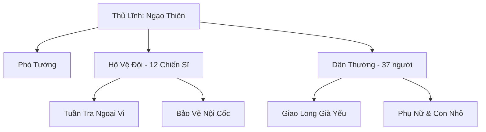

# GIAO LONG LƯU VONG (蛟龙流亡)

## I. Tổng Quan (总览)
Giao Long Lưu Vong là một cộng đồng nhỏ gồm khoảng năm mươi Giao Long, ẩn náu trong hẻm núi ngầm dưới đáy biển phía bắc Vô Tận Hải. Dẫn đầu bởi Cựu Tướng Quân Ngạo Thiên — một vị tướng trấn thủ phương bắc từng oai danh lẫy lừng trong Long Cung, nhưng bị vu oan mưu phản và phải bỏ trốn cùng thuộc hạ trung thành. Dù chỉ là nhóm lưu vong nhỏ bé, sức chiến đấu cá nhân của họ vượt xa tầm vóc số lượng, khiến vùng biển phía bắc trở thành khu vực mà ngay cả hải tặc cũng ngại đến gần.

## II. Địa Lý & Tài Nguyên (地理 与 资源)
Hải Cốc Ẩn nằm sâu dưới đáy biển phía bắc Vô Tận Hải, ẩn trong một hẻm núi ngầm nơi hải lưu lạnh quanh năm bao phủ. Dòng hải lưu băng giá này tạo thành hàng rào tự nhiên, khiến phần lớn sinh vật biển và tu sĩ thường không thể tiếp cận. Linh khí trong khu vực ở mức trung bình, đủ để duy trì tu luyện cơ bản nhưng không đủ cho những đột phá lớn. Hẻm núi ngầm có nhiều hang động nhỏ ăn sâu vào vách đá, mỗi gia đình Giao Long chiếm một hang làm nơi cư ngụ. Tài nguyên hạn chế — cộng đồng chủ yếu sống nhờ săn bắt hải sản vùng nước lạnh và trao đổi bí mật với thương nhân biển đi ngang.

## III. Văn Hóa & Tín Ngưỡng (文化 与 信仰)
Dù bị Ngao Đình — triều đình Long Cung — trục xuất, cộng đồng Giao Long Lưu Vong vẫn kiên trì duy trì nghi thức và phép tắc chính thống của Long Cung, coi đó là bản sắc cuối cùng chứng minh họ không phải phản đồ. Mỗi năm một lần, toàn bộ cộng đồng tổ chức "Nhớ Cố Hương Hội" — buồn bã hát khúc ca cổ của Long Tộc giữa biển tối, tiếng hát vang vọng qua hẻm núi ngầm khiến ai nghe cũng cảm thấy bi thương. Tuy nhiên, thế hệ trẻ sinh ra ngoài Long Cung bắt đầu nghi ngờ và thắc mắc: "Cố hương không nhận ta, tại sao ta phải nhớ?" Sự chia rẽ thế hệ đang âm thầm nảy sinh, đe dọa sự đoàn kết vốn đã mỏng manh của cộng đồng.

## IV. Cơ Cấu Tổ Chức (组织结构)


Cấu trúc tổ chức đơn giản theo mô hình quân sự thu nhỏ. Ngạo Thiên đứng đầu với tư cách thủ lĩnh tuyệt đối, bên dưới là mười hai Giao Long chiến sĩ trung thành, tu vi từ Trúc Cơ đến Kim Đan Sơ Kỳ. Phần còn lại là dân thường gồm Giao Long già yếu, phụ nữ và con nhỏ. Mọi quyết định đều do Ngạo Thiên đưa ra, nhưng ông luôn tham khảo ý kiến các chiến sĩ lão thành — duy trì phong cách lãnh đạo mà ông đã học được thời còn là tướng quân.

## V. Công Pháp & Trận Pháp (功法 与 阵法)
Cộng đồng vẫn tu luyện Giao Long Hóa Hải Quyết — công pháp chính thống mà Ngạo Thiên mang theo khi rời Long Cung, cho phép Giao Long chuyển hóa thân thể giữa hình nhân và hình rồng, đồng thời tăng cường sức mạnh thủy hệ. Ngoài ra, Ngạo Thiên nắm giữ bí thuật Vân Hải Phong Bạo — có thể triệu hồi bão nhỏ trong phạm vi hẹp, đủ để đánh chìm thuyền chiến cỡ trung. Đây là tuyệt kỹ mà ông luyện được thời còn trấn thủ phương bắc, và là lá bài chiến lược quan trọng nhất của cộng đồng trong trường hợp bị phát hiện.

## VI. Đặc Sản Môn Phái (门派特产)
Giao Long Lưu Vong không sản xuất hàng hóa thương mại, nhưng sở hữu một số vật phẩm đặc thù. Vảy Giao Long rụng tự nhiên được thu thập và chế tác thành giáp phiến phòng thủ, chất lượng vượt xa các loại giáp thông thường nhờ bản chất Long Tộc. Máu Giao Long pha loãng là nguyên liệu đan dược quý hiếm, thỉnh thoảng được dùng trao đổi bí mật với thương nhân biển để lấy vật tư cần thiết. Ngoài ra, các chiến sĩ Giao Long chế tác vũ khí từ xương cốt hải thú vùng nước lạnh, sắc bén và bền chắc hơn thép thường.

## VII. Cơ Sở Hạ Tầng (基础设施)
Cơ sở hạ tầng của Hải Cốc Ẩn được tận dụng tối đa từ địa hình tự nhiên. Hệ thống hang động trong vách hẻm núi ngầm được mở rộng và gia cố bằng pháp thuật Long Tộc, tạo thành khoảng hai mươi phòng ở và một đại sảnh trung tâm dùng cho hội họp. Cổng vào hẻm núi được che giấu bởi dòng hải lưu lạnh và một trận pháp ngụy trang đơn giản. Khu vực luyện công nằm ở hang động lớn nhất, nơi Ngạo Thiên đích thân huấn luyện thế hệ trẻ. Một kho dự trữ nhỏ chứa lương thực và dược liệu, đủ dùng trong vài tháng nếu phải ẩn cư hoàn toàn.

## VIII. Kinh Tế (经济)
Kinh tế của Giao Long Lưu Vong cực kỳ hạn chế và bấp bênh. Nguồn sống chính đến từ săn bắt hải sản và sinh vật biển vùng nước lạnh — nơi mà sự hiện diện của dòng hải lưu băng giá khiến ít ai cạnh tranh. Trao đổi thương mại chỉ diễn ra bí mật và không thường xuyên, thông qua một vài thương nhân biển đáng tin cậy biết về sự tồn tại của họ. Mặt hàng trao đổi chủ yếu là vảy Giao Long, máu Giao Long pha loãng và dược liệu biển lạnh, đổi lấy linh thạch, vải vóc và vật dụng sinh hoạt. Cộng đồng luôn sống trong tình trạng thiếu thốn, mọi tài nguyên phải được phân bổ cẩn thận dưới sự điều phối của Ngạo Thiên.

## IX. Lịch Sử Tóm Tắt (简史)
Hơn một trăm năm trước, Ngạo Thiên là tướng quân trấn thủ phương bắc cho Long Cung, oai danh vang dội khắp Vô Tận Hải. Tuy nhiên, một Long Tử ganh ghét đã ngụy tạo bằng chứng vu oan ông mưu phản. Bị triều đình kết tội, Ngạo Thiên dẫn theo mười hai thuộc hạ trung thành cùng gia đình họ bỏ trốn vào đêm tối, thề rằng sẽ trở về minh oan. Suốt hơn trăm năm lưu vong, ông nhiều lần gửi tin về Long Cung nhưng đều bị chặn — kẻ hãm hại vẫn nắm quyền và theo dõi chặt chẽ. Cộng đồng nhỏ bé dần ổn định tại Hải Cốc Ẩn, nhưng Ngạo Thiên ngày càng già yếu, sức khỏe suy giảm. Nỗi lo lớn nhất của ông không còn là minh oan, mà là ai sẽ lãnh đạo cộng đồng sau khi ông qua đời.

## X. Giai Thoại & Bí Mật (轶事 与 秘密)
Ngạo Thiên giữ trong mình bằng chứng quan trọng nhất về vụ vu oan — một ngọc giản ghi lại mật lệnh của Long Tử, chứng minh rõ ràng âm mưu hãm hại. Nếu ngọc giản này được trình trước mặt Long Đế, Ngạo Thiên sẽ được minh oan và kẻ hãm hại sẽ bị xử tội. Tuy nhiên, cách tiếp cận Long Đế vẫn là bài toán chưa có lời giải. Bí mật lớn nhất của cộng đồng là trong số những Giao Long trẻ, có một đứa sở hữu huyết mạch Chân Long ẩn giấu — điều cực kỳ hiếm và nguy hiểm. Nếu Long Cung phát hiện, đứa trẻ sẽ bị bắt về để "tẩy não" hoặc bị giết vì mang huyết mạch Chân Long mà không thuộc quyền kiểm soát của triều đình. Ngạo Thiên che giấu bí mật này bằng mọi giá, coi đó là hy vọng cuối cùng cho tương lai cộng đồng.

## XI. Quan Hệ Thế Lực (势力关系)
```mermaid
graph LR
    GLLV[Giao Long Lưu Vong] -- Thù địch -- LC[Long Cung]
    GLLV -- Thăm dò -- PLLT[Phản Loạn Long Tử]
    GLLV -- Đồng cảm -- THLD[Tạp Huyết Long Đàn]
    GLLV -. Trao đổi bí mật .-> TN[Thương Nhân Biển]
```

Quan hệ của Giao Long Lưu Vong với thế giới bên ngoài cực kỳ hạn chế và thận trọng. Long Cung là kẻ thù không đội trời chung — nơi từng là quê hương nay trở thành mối đe dọa tồn vong. Phản Loạn Long Tử đã bí mật liên lạc, hai bên đang trong giai đoạn thăm dò lẫn nhau với sự cảnh giác cao. Với Tạp Huyết Long Đàn, tuy chưa có liên minh chính thức nhưng cả hai chia sẻ nỗi đau chung — bị Long Cung coi thường và ruồng bỏ. Ngoài ra, cộng đồng duy trì mối quan hệ với một vài thương nhân biển tin cậy để trao đổi vật tư thiết yếu.
