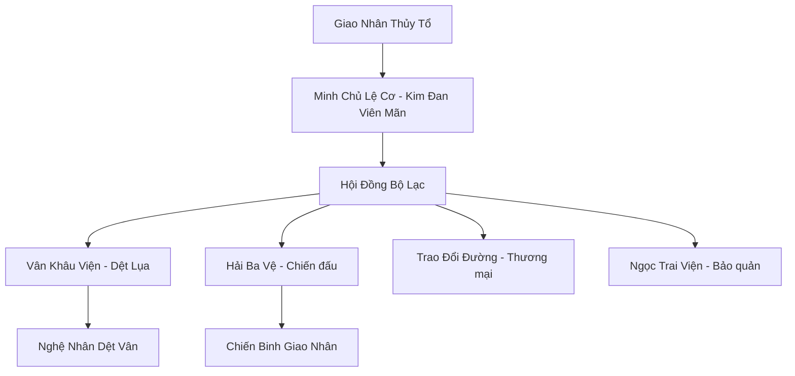
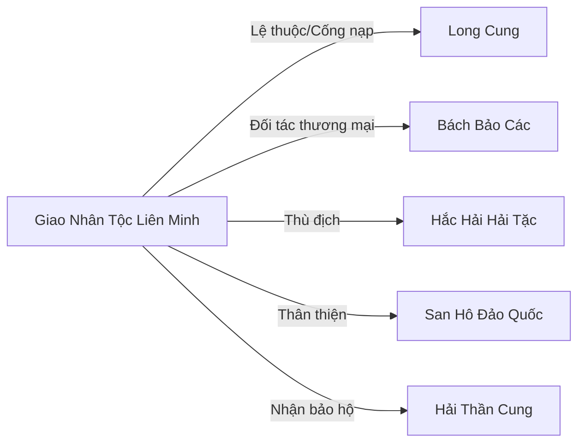

# GIAO NHÂN TỘC LIÊN MINH (鲛人族联盟)

## I. Tổng Quan (总览)
Giao Nhân Tộc Liên Minh là tổ chức tự vệ và bảo tồn văn hóa của chủng tộc Giao Nhân — loài người cá xinh đẹp cư ngụ tại các vùng biển sâu trù phú của Vô Tận Hải. Với ba ngàn thành viên phân bố trong các Thành phố Thủy Tinh dưới đáy biển, liên minh nổi tiếng khắp Cố Nguyên Giới nhờ hai kỳ vật vô giá: Ngọc Trai Giao Nhân — nước mắt giao nhân kết tinh thành ngọc — và Lụa Vân — loại vải dệt từ ráng chiều phản chiếu trên mặt nước, nhẹ như mây và kháng phép vượt trội. Minh Chủ Lệ Cơ — nữ giao nhân tu vi Kim Đan Viên Mãn — dẫn dắt liên minh trong cuộc đấu tranh không ngừng bảo vệ giống loài khỏi ba mối đe dọa: nạn săn trộm giao nhân lấy nước mắt từ nhân tộc, sự bóc lột của Long Cung đòi cống nạp Lụa Vân và ngọc trai, và sự tấn công thường xuyên từ Hắc Hải Hải Tặc. Xếp Hạng Ba về quy mô, liên minh yếu về quân sự nhưng giàu về văn hóa và kinh tế, tồn tại bằng nghệ thuật ngoại giao khéo léo và sản phẩm mà mọi thế lực đều thèm muốn.

## II. Địa Lý & Tài Nguyên (地理与资源)
Trụ sở chính là các Thành phố Thủy Tinh nằm ở độ sâu trung bình dưới đáy biển phía đông Vô Tận Hải, nơi ánh sáng mặt trời chỉ lọt đến dưới dạng tia xanh nhạt. Bên trong thành phố, ánh sáng từ hàng triệu ngọc trai và san hô phát quang tạo nên cảnh tượng lung linh huyền ảo, thay thế hoàn toàn ánh nắng mặt trời. Liên minh kiểm soát Rạn San Hô Nguyệt Quang — khu vực tập trung linh khí thủy hệ tinh thuần nhất Vô Tận Hải, nơi ánh trăng xuyên qua mặt nước tạo ra hiện tượng khúc xạ đặc biệt mà giao nhân sử dụng làm nguyên liệu dệt Lụa Vân. Ngọc Trai Giao Nhân hình thành từ nước mắt chân thành của giao nhân khi cảm xúc mãnh liệt ngưng tụ linh khí — không thể sản xuất nhân tạo, không thể ép buộc, mỗi viên đều là kết tinh của một khoảnh khắc tâm hồn. Rạn san hô cũng cung cấp nguồn thực phẩm dồi dào cho cư dân. Điểm yếu địa lý: thành phố nằm trong vùng ảnh hưởng của Long Cung, khiến liên minh luôn nằm dưới bóng đen quyền lực của Long Tộc.

## III. Văn Hóa & Tín Ngưỡng (文化与信仰)
Giao nhân tôn thờ Giao Nhân Thủy Tổ và coi vẻ đẹp và sự tự do là hai giá trị thiêng liêng nhất. Họ tin rằng nước mắt là tinh hoa linh hồn — mỗi giọt lệ chứa đựng một mảnh cảm xúc chân thật nhất, và chỉ nên rơi vì những điều cao cả: tình yêu, hy sinh, hoặc cái đẹp tuyệt mỹ. Chính vì vậy, nạn săn trộm giao nhân tra tấn để ép khóc lấy ngọc trai là tội ác ghê tởm nhất trong quan niệm của họ. Văn hóa giao nhân cực kỳ giàu tính nghệ thuật: điệu múa đuôi dưới nước — "Nguyệt Vũ" — kết hợp vũ đạo với huyễn thuật ánh sáng, tạo nên màn trình diễn mê hoặc mà nhiều tu sĩ trên đất liền sẵn sàng trả giá cao để được chiêm ngưỡng. Kỹ thuật dệt Lụa Vân là nghệ thuật tối thượng, truyền từ mẹ sang con gái, đòi hỏi sự tỉ mỉ cực độ và cảm ứng linh khí tinh tế. Phong tục đặc biệt nhất là "Lệ Nguyện" — khi giao nhân trưởng thành khóc giọt nước mắt đầu tiên tự nguyện, viên ngọc trai đó trở thành "Ngọc Trai Bản Mệnh," gắn liền với sinh mệnh chủ nhân suốt đời.

## IV. Cơ Cấu Tổ Chức (组织结构)

Minh Chủ Lệ Cơ đứng đầu liên minh, được bầu bởi Hội Đồng Bộ Lạc gồm đại diện của mười lăm bộ lạc giao nhân lớn nhất. Vân Khâu Viện do Ba Nguyệt Hà làm Viện Chủ, phụ trách dệt Lụa Vân và chế tác kỳ vật — đây là cơ quan quyền lực kinh tế lớn nhất liên minh, bởi Lụa Vân là nguồn thu chủ lực. Hải Ba Vệ do Ba Ngọc Hàn chỉ huy, là lực lượng chiến đấu bảo vệ thành phố và chống săn trộm — chỉ có năm trăm chiến binh nhưng được huấn luyện bài bản trong Thủy Vân Nhu Thuật. Trao Đổi Đường quản lý giao thương với bên ngoài qua các sứ giả biết hóa hình nhân tộc. Ngọc Trai Viện bảo quản ngọc trai do tộc nhân tự nguyện dâng tặng, quản lý nghiêm ngặt để tránh rơi vào tay kẻ xấu. Trưởng Lão Ba Thiên Lệ — tám trăm tuổi, tinh thông trận pháp Thượng Cổ — đóng vai trò cố vấn tối cao.

## V. Công Pháp & Trận Pháp (功法与阵法)
- **Công Pháp:**
  - *Thủy Vân Nhu Thuật* — chiến đấu thuật đặc trưng của giao nhân, sử dụng thân thể uyển chuyển kết hợp dòng nước tạo ra đòn đánh mềm mại nhưng sức mạnh cực lớn — giống như sóng biển, nhẹ nhàng khi bình yên nhưng tàn khốc khi dữ dội.
  - *Giao Nhân Khấp Lệ Quyết* — công pháp độc đáo chuyển hóa cảm xúc mãnh liệt thành sức mạnh linh lực, nỗi buồn trở thành phòng ngự, cơn giận trở thành tấn công, tình yêu trở thành chữa lành. Ở cảnh giới cao, giao nhân có thể khóc ra ngọc trai chứa năng lượng chiến đấu — "Lệ Đạn" — viên ngọc nổ tung gây sát thương thần thức diện rộng.
- **Trận Pháp:** *Thủy Diệu Kết Giới* — trận pháp phòng thủ đa tầng bao phủ Thành phố Thủy Tinh, sử dụng áp suất nước kết hợp ánh sáng khúc xạ từ ngọc trai tạo ra bức tường năng lượng phản xạ cả đòn tấn công vật lý lẫn thần thức. Trưởng Lão Giao Băng Ngọc Tâm là người duy nhất nắm giữ phương pháp kích hoạt trận pháp ở cường độ tối đa — "Thượng Cổ Thủy Diệu Trận" — phiên bản gốc từ thời Giao Nhân Thủy Tổ, mạnh gấp ba lần trận pháp thường.

## VI. Đặc Sản Môn Phái (门派特产)
- **Lụa Vân:** Loại vải dệt từ ráng chiều phản chiếu trên mặt nước kết hợp tơ tằm biển sâu, cực nhẹ, bền và kháng phép vượt trội. Pháp y may từ Lụa Vân giảm thiểu sát thương từ thuật pháp lên đến ba phần mười, là nguyên liệu quý nhất cho các bậc đại năng. Giá một tấm Lụa Vân phẩm chất tốt ngang ngàn linh thạch trung phẩm.
- **Ngọc Trai Giao Nhân:** Tinh túy từ nước mắt chân thành, có tác dụng định tâm, trừ tà, thanh lọc thần thức, là nguyên liệu quý cho đan dược cấp Nguyên Anh. Không thể sản xuất nhân tạo — mỗi viên đều độc nhất vô nhị, phản ánh cảm xúc của giao nhân khi khóc.
- **Phù Văn Thêu:** Các hoa văn thêu trên Lụa Vân có khả năng chứa thuật pháp — một tấm Phù Văn Thêu có thể phát ra phòng ngự tự động hoặc ẩn giấu bẫy tấn công, là sản phẩm kết hợp giữa nghệ thuật và chiến đấu.

## VII. Cơ Sở Hạ Tầng (基础设施)
- **Thành phố Thủy Tinh:** Tổ hợp kiến trúc hình vòm bằng pha lê biển chịu áp suất lớn, bên trong rộng rãi thoáng đãng, ngọc trai phát quang gắn khắp tường và trần thay thế ánh sáng mặt trời. Mỗi vòm chứa một cộng đồng bộ lạc, liên kết với nhau bằng hệ thống đường hầm pha lê.
- **Xưởng Dệt Nguyệt Quang:** Xưởng dệt chính đặt tại Rạn San Hô Nguyệt Quang, nơi nghệ nhân làm việc trong môi trường không trọng lực của nước, tay múa đưa tơ tằm và ráng chiều thành Lụa Vân. Quá trình dệt chỉ có thể thực hiện vào đêm trăng tròn khi ánh trăng xuyên qua nước biển tạo ra nguyên liệu ánh sáng.
- **Ngọc Trai Kho:** Kho bảo quản ngọc trai an toàn nhất Vô Tận Hải, nằm sâu trong lòng thành phố, được bảo vệ bởi Thủy Diệu Kết Giới và canh gác suốt ngày đêm. Mỗi viên ngọc được đánh dấu bằng linh văn riêng, ghi lại tên giao nhân và cảm xúc khi tạo ra nó.
- **Hải Ba Đài:** Trại huấn luyện chiến binh Hải Ba Vệ, nơi giao nhân trẻ học Thủy Vân Nhu Thuật và kỹ năng chiến đấu chống săn trộm.

## VIII. Kinh Tế (经济)
Kinh tế liên minh dựa chủ yếu vào xuất khẩu Lụa Vân và Ngọc Trai Giao Nhân cho các thương hội lớn trên đất liền — Bách Bảo Các là đối tác mua hàng lớn nhất, chiếm hơn năm phần mười doanh thu. Tuy nhiên, vị thế chính trị yếu kém khiến liên minh thường xuyên bị ép giá: Long Cung đòi cống nạp Lụa Vân miễn phí, thương nhân nhân tộc lợi dụng nỗi sợ săn trộm để mặc cả, và hải tặc cướp phá đoàn vận chuyển khiến chi phí bảo hiểm tăng vọt. Ngoài ra, dịch vụ trình diễn Nguyệt Vũ cho du khách giàu có mang lại nguồn thu phụ, nhưng Minh Chủ Lệ Cơ coi đây là sự xúc phạm văn hóa và muốn giảm thiểu. Mưu Sĩ Giao Bạch Lệ Hoa đang đề xuất chiến lược "độc quyền hóa" — giảm sản lượng Lụa Vân để đẩy giá lên, buộc các thế lực lớn phải đàm phán bình đẳng hơn.

## IX. Lịch Sử Tóm Tắt (简史)
Giao Nhân Tộc Liên Minh được thành lập sau cuộc Đại Di Cư thời Thượng Cổ, khi các bộ lạc giao nhân sống rải rác ở vùng biển nông bị tàn phá bởi chiến tranh giữa Long Tộc và Nhân Tộc. Trước đó, giao nhân sống hòa bình nhưng cô lập, không có tổ chức chung — sự phân tán khiến họ trở thành mục tiêu dễ dàng cho nạn săn trộm lấy nước mắt. Sau hàng ngàn giao nhân bị bắt cóc và tra tấn, Giao Nhân Thủy Tổ đích thân kêu gọi thống nhất và truyền lại Thủy Diệu Kết Giới trước khi biến mất. Các bộ lạc tập hợp, xây dựng Thành phố Thủy Tinh, và bầu Minh Chủ đầu tiên. Qua nhiều kỷ nguyên, liên minh sống sót bằng ngoại giao khéo léo — dùng Lụa Vân và Ngọc Trai làm "vũ khí kinh tế" khiến mọi thế lực đều cần họ nhưng không ai dám tiêu diệt họ hoàn toàn. Quan hệ với Long Cung dao động giữa lệ thuộc và đối kháng — hiện tại là giai đoạn căng thẳng, khi Long Cung tăng yêu cầu cống nạp trong khi liên minh đang tìm cách tự chủ hơn.

## X. Giai Thoại & Bí Mật (轶事与秘密)
Tương truyền nếu một giao nhân thật lòng yêu một người tộc khác và dâng hiến Ngọc Trai Bản Mệnh, người đó sẽ có khả năng hít thở dưới nước và chia sẻ tuổi thọ với giao nhân — nhưng cái giá là giao nhân sẽ mất giọng nói vĩnh viễn, không bao giờ còn khóc ra ngọc trai được nữa. Trưởng Lão Giao Băng Ngọc Tâm — tám trăm tuổi, người lớn tuổi nhất liên minh — đang giữ một bí mật kinh hoàng: bà phát hiện rằng "Thượng Cổ Thủy Diệu Trận" mà bà nắm giữ thực chất có chức năng thứ hai chưa ai kích hoạt — không phải phòng thủ mà là tấn công, có khả năng nhấn chìm một vùng biển rộng trăm dặm. Bà giấu kín vì sợ nếu Long Cung biết, họ sẽ coi liên minh là mối đe dọa và ra tay tiêu diệt trước. Ngoài ra, Mưu Sĩ Giao Bạch Lệ Hoa đang bí mật tiếp xúc với Hải Thần Cung để tìm kiếm đồng minh mới thay thế Long Cung — một nước cờ mạo hiểm có thể cứu sống hoặc hủy diệt liên minh.

## XI. Quan Hệ Thế Lực (势力关系)

Long Cung là "bảo hộ" nhưng thực chất là chủ nợ — đòi cống nạp Lụa Vân và ngọc trai với số lượng ngày càng tăng, đe dọa quân sự nếu liên minh từ chối. Bách Bảo Các trên đất liền là khách hàng lớn nhất, mua Lụa Vân với giá cao nhưng cũng thường xuyên mặc cả khắt khe. Hắc Hải Hải Tặc là mối đe dọa thường trực — săn trộm giao nhân lấy nước mắt và cướp phá đoàn vận chuyển hàng hóa. San Hô Đảo Quốc là đồng minh tự nhiên — cùng cảnh ngộ bị Long Cung bóc lột, hai bên chia sẻ tin tức và hỗ trợ lẫn nhau. Hải Thần Cung đang được Giao Bạch Lệ Hoa bí mật tiếp cận như đồng minh tiềm năng thay thế Long Cung.
