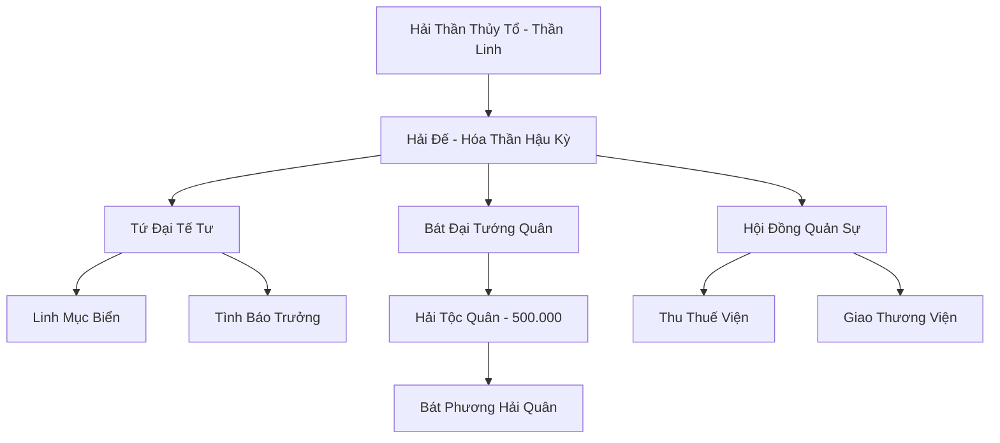

# HẢI THẦN CUNG (海神宫)

## I. Tổng Quan (总览)
Hải Thần Cung là thực thể chính trị và tôn giáo hùng mạnh nhất dưới lòng Vô Tận Hải, tự xưng là "Thiên Mệnh Hải Đình" — triều đình do Thiên Đạo ủy thác cai quản đại dương. Với hơn một triệu cư dân và binh lính thuộc đa chủng tộc hải tộc, Hải Thần Cung thống trị khoảng một phần ba diện tích đáy biển Vô Tận Hải, kiểm soát mọi tuyến hải lưu chiến lược và nắm giữ nguồn cung linh thạch thủy hệ lớn nhất thế giới. Hải Đế đương nhiệm — tu vi Hóa Thần Hậu Kỳ — là vị quân chủ tối cao, được Tứ Đại Tế Tư phò tá về tâm linh và Bát Đại Tướng Quân bảo vệ về quân sự. Trong hệ thống quyền lực Vô Tận Hải, Hải Thần Cung và Long Cung là hai cực đối trọng, cùng khống chế vận mệnh của vạn sinh linh dưới đáy biển — nhưng khác với Long Cung dựa trên huyết thống, Hải Thần Cung dựa trên đức tin và luật pháp, tự coi mình là đại diện cho ý chí của Hải Thần Thủy Tổ, là trụ cột chính nghĩa duy nhất giữa biển cả hỗn loạn.

## II. Địa Lý & Tài Nguyên (地理与资源)
Trụ sở chính là Thủy Tinh Cung, tọa lạc tại Thâm Uyên Hải Bình — vùng đáy biển sâu nhất mà linh khí thủy hệ vẫn lưu thông mạnh mẽ, nằm ở trung tâm Vô Tận Hải. Cung điện được xây dựng từ Thâm Hải Pha Lê — loại khoáng thạch trong suốt chỉ hình thành dưới áp suất cực lớn, cứng hơn kim cương và tự phát quang khi ngâm trong linh khí. Toàn bộ tổ hợp kiến trúc trải rộng hơn trăm dặm, gồm chín lớp cung thất xếp từ ngoài vào trong, lớp cuối cùng chứa Hải Thần Cấm Địa — bí cảnh bị phong ấn mà chỉ Hải Đế mỗi đời mới được phép tiến vào. Hải Thần Cung kiểm soát "Hải Thần Mạch" — mạch linh khí thủy hệ nguyên thủy chạy xuyên suốt lòng đại dương như huyết quản — bất kỳ thế lực nào muốn khai thác linh thạch thủy hệ quy mô lớn đều phải xin phép hoặc nộp thuế. Các mỏ trân châu linh thạch, rừng san hô ma thuật và khu bảo tồn linh thảo biển sâu trải dài khắp lãnh thổ, cung cấp tài nguyên vô tận cho cả quân đội lẫn thương mại. Điểm yếu địa lý duy nhất là biên giới phía tây giáp vùng Hắc Hải — nơi linh khí bị ô nhiễm nghiêm trọng do hoạt động của Hắc Hải Hải Tặc, tạo ra vùng đệm nguy hiểm mà quân đội Hải Thần Cung phải thường xuyên tuần tra.

## III. Văn Hóa & Tín Ngưỡng (文化与信仰)
Toàn bộ cư dân Hải Thần Cung tôn thờ Hải Thần Thủy Tổ — vị thần nước đầu tiên mà truyền thuyết kể rằng đã dùng quyền năng khai sinh ra đại dương từ hư vô. Mọi hành vi xúc phạm biển cả — ô nhiễm hải lưu, tàn sát vô cớ sinh vật biển, hoặc phá hoại rạn san hô — đều bị coi là phạm thượng và bị trừng phạt nặng nề bởi luật Hải Thần. Hệ thống tín ngưỡng được Tứ Đại Tế Tư duy trì chặt chẽ: mỗi sáng, toàn dân hướng về phía Thủy Tinh Cung tụng "Hải Thần Chú" — bài chú ngắn ngưng tụ linh khí thủy hệ vào cơ thể, vừa là lời cầu nguyện vừa là phương pháp tu luyện cơ bản nhất. Lễ hội "Triều Tịch Đại Điển" diễn ra mỗi năm một lần vào ngày trăng tròn tháng Sáu, khi thủy triều dâng cao nhất — hàng triệu cư dân từ mọi vùng biển hội tụ về Quảng Trường Hải Thần, nghe Đại Tế Tư tuyên đọc sắc lệnh của Hải Đế và cùng hát "Vạn Hải Quy Nhất Ca," khúc thánh ca mà mọi Hải Tộc đều thuộc từ nhỏ. Văn hóa Hải Thần Cung đề cao lòng trung thành tuyệt đối, tinh thần hy sinh vì tập thể, và lòng tự hào chủng tộc mãnh liệt — nhưng mặt trái là sự bảo thủ cứng nhắc, phân biệt đẳng cấp sâu sắc giữa các chủng tộc hải tộc, và thái độ khinh thường đối với lục địa tu sĩ mà họ gọi là "hạn dân" (kẻ sống trên cạn).

## IV. Cơ Cấu Tổ Chức (组织结构)

Hải Đế đứng trên đỉnh quyền lực, nắm quyền hành chính, quân sự và tôn giáo. Tứ Đại Tế Tư phụ trách duy trì đức tin, thực hiện nghi lễ thiêng, bói toán vận mệnh quốc gia và giám sát đạo đức — tu vi mỗi vị đều đạt Nguyên Anh Viên Mãn, có tiếng nói nặng ký trong triều chính. Bát Đại Tướng Quân trấn giữ tám phương biển — Đông, Tây, Nam, Bắc, Đông Bắc, Đông Nam, Tây Bắc, Tây Nam — mỗi vị thống lĩnh khoảng sáu vạn quân, tu vi từ Nguyên Anh Trung Kỳ trở lên. Dưới tướng quân là hệ thống Thiên Phu Trưởng (chỉ huy ngàn binh), Bách Phu Trưởng (chỉ huy trăm binh), tạo nên bộ máy quân sự đồ sộ nhất Vô Tận Hải. Hội Đồng Quản Sự gồm các quan viên dân sự phụ trách thu thuế, phân phối tài nguyên, điều hành thương mại và giải quyết tranh chấp dân sự giữa các bộ lạc. Tình Báo Trưởng Chương Thiên Nhãn — một bạch tuộc nhỏ trong suốt sở hữu thuật Thiên Nhãn Phân Thân — chỉ huy mạng lưới gián điệp rộng khắp, là đôi mắt và đôi tai ngầm của Hải Đế trong mọi ngóc ngách đại dương.

## V. Công Pháp & Trận Pháp (功法与阵法)
- **Công Pháp:**
  - *Hải Thần Lộ* — công pháp tối thượng chỉ Hải Đế và Tế Tư mới được tu luyện, chuyển hóa linh khí thủy hệ nguyên thủy từ Hải Thần Mạch thành thần lực, đạt đến cảnh giới cao có thể điều khiển thủy triều và hải lưu ở quy mô lục địa. Tương truyền công pháp này do Hải Thần Thủy Tổ đích thân truyền xuống, chỉ có thể tu luyện tại Thủy Tinh Cung nơi Hải Thần Mạch lộ thiên.
  - *Vạn Thủy Quy Tông* — công pháp phổ cập cho tướng quân và tinh nhuệ, cho phép ngưng tụ và điều khiển khối nước khổng lồ ở phạm vi vài dặm, tạo ra xoáy nước, sóng thần thu nhỏ và áp suất nghiền nát. Ở cảnh giới Nguyên Anh, một chiêu Vạn Thủy Quy Tông có thể nhấn chìm cả một hòn đảo nhỏ.
  - *Triều Tịch Luyện Thể Quyết* — phương pháp rèn luyện nhục thể bằng cách chịu đựng sự thay đổi áp suất liên tục theo chu kỳ thủy triều, giúp binh sĩ có khả năng chiến đấu ở mọi độ sâu mà không cần pháp bảo hỗ trợ.
- **Trận Pháp:**
  - *Vạn Hải Triều Tịch Trận* — trận pháp hộ môn siêu cấp bao phủ toàn bộ lãnh thổ Hải Thần Cung, hoạt động bằng cách liên kết chín trăm chín mươi chín trụ trận san hô xếp theo cửu cung bát quái. Khi kích hoạt toàn lực, trận pháp can thiệp trực tiếp vào hải lưu Vô Tận Hải, tạo ra chín tầng xoáy nước đồng tâm cuốn hút và nghiền nát mọi hạm đội xâm lược. Trong lịch sử, trận pháp này chỉ được kích hoạt toàn lực hai lần — cả hai lần đều khiến vùng biển xung quanh chìm trong hỗn loạn suốt nhiều tháng sau đó.

## VI. Đặc Sản Môn Phái (门派特产)
- **Hải Thần Trân Châu:** Loại ngọc trai hình thành tự nhiên trong Hải Thần Mạch, chứa đựng tinh hoa linh khí nguyên thủy của đại dương. Một viên Hải Thần Trân Châu phẩm chất tốt có giá trị ngang ngàn linh thạch thượng phẩm, có tác dụng tăng cường tuổi thọ, kháng mọi loại thủy độc, và giúp tu sĩ thủy hệ đột phá cảnh giới nhanh hơn. Chỉ được khai thác bởi đội ngũ chuyên trách dưới sự giám sát của Tế Tư, sản lượng giới hạn nghiêm ngặt mỗi năm.
- **Thủy Tinh Khải:** Bộ giáp chiến đấu chế tác từ Thâm Hải Pha Lê tinh luyện, cứng hơn kim loại thường gấp mười lần nhưng nhẹ bằng một phần ba, tự điều chỉnh áp suất theo độ sâu và giúp người mặc di chuyển nhanh gấp đôi dưới nước nhờ hệ thống rãnh dẫn hải lưu trên bề mặt. Bộ giáp hoàn chỉnh chỉ được ban cho Bát Đại Tướng Quân và các chiến binh lập công đặc biệt.
- **Triều Tịch Lệnh Bài:** Lệnh bài làm từ san hô hóa thạch ngàn năm, cho phép người mang di chuyển tự do trên toàn lãnh thổ Hải Thần Cung mà không bị kiểm tra. Ngoài ra có thể dùng để triệu tập hỗ trợ từ đồn binh gần nhất trong trường hợp khẩn cấp.

## VII. Cơ Sở Hạ Tầng (基础设施)
- **Thủy Tinh Cung:** Cung điện trung tâm gồm chín lớp vòm pha lê lồng nhau, lớp ngoài cùng cao ba trăm trượng, phát ra ánh sáng lam ngọc có thể nhìn thấy từ khoảng cách năm trăm dặm dưới đáy biển. Mỗi lớp vòm chứa một khu chức năng: triều đình, thư viện, kho báu, quân doanh, tu luyện thất, v.v. Lớp vòm thứ chín — Hải Thần Cấm Địa — bị phong ấn bởi trận pháp cổ đại mà chỉ Hải Đế nắm giữ chìa khóa.
- **Quảng Trường Hải Thần:** Quảng trường vòm mở rộng hai mươi dặm trước cổng Thủy Tinh Cung, trung tâm đặt pho tượng vàng ròng Hải Thần cao trăm trượng cầm Hải Thần Đinh Ba. Nơi đây tổ chức Triều Tịch Đại Điển hàng năm và là điểm tập hợp quân đội khi có chiến sự.
- **Bát Phương Hải Đồn:** Tám pháo đài quân sự đặt ở tám hướng biên cương, mỗi đồn có hệ thống trận pháp phòng thủ độc lập và kho dự trữ đủ cho sáu vạn quân chiến đấu liên tục ba tháng không cần tiếp tế.
- **Hải Thần Thư Các:** Thư viện lớn nhất dưới đáy biển, lưu trữ vạn quyển ngọc giản và san hô bản ghi chép lịch sử, công pháp và bản đồ Vô Tận Hải từ thời Khởi Nguyên đến nay.

## VIII. Kinh Tế (经济)
Nền kinh tế Hải Thần Cung là trụ cột tài chính của toàn bộ Vô Tận Hải, dựa trên ba nguồn thu chính. Thứ nhất, thuế bảo hộ — mọi bộ lạc hải tộc sống trong phạm vi lãnh thổ đều phải nộp một phần mười sản lượng hàng năm, đổi lại nhận sự bảo vệ quân sự và quyền sử dụng hải lưu. Hải Tảo Nông Dân Hội và nhiều cộng đồng nhỏ chịu thuế suất thực tế lên đến bảy phần mười do hệ thống giám sát viên ăn chặn và cơ chế phụ thu phức tạp. Thứ hai, khai thác linh thạch thủy hệ và trân châu biển sâu — Hải Thần Cung độc quyền các mỏ lớn nhất dọc theo Hải Thần Mạch, xuất khẩu ra đất liền qua Phong Bạo Thương Đội và Bách Bảo Các. Thứ ba, phí bảo hộ hàng hải — bất kỳ thương thuyền nào muốn đi qua vùng biển kiểm soát đều phải trả lệ phí và tuân thủ quy định của Hải Thần Cung, nếu không sẽ bị coi là hải tặc và bị tiêu diệt. Hệ thống kinh tế này tạo ra sự giàu có khổng lồ nhưng đồng thời gieo rắc oán hận âm ỉ trong các cộng đồng nhỏ bị bóc lột.

## IX. Lịch Sử Tóm Tắt (简史)
Hải Thần Cung được thành lập từ Kỷ Nguyên Khởi Nguyên, khi Hải Thần Thủy Tổ — vị thần nước đầu tiên — tập hợp các chủng tộc biển nhỏ bé để đối đầu với những cổ thú hải dương khổng lồ đang tàn sát vạn linh. Hải Thần Thủy Tổ dùng thần lực kiến tạo Thủy Tinh Cung và khai mở Hải Thần Mạch, tạo ra nguồn linh khí nuôi dưỡng mọi sinh linh biển. Sau khi Thủy Tổ biến mất — không ai biết ngài thăng thiên hay tịch diệt — các đời Hải Đế kế thừa trọng trách bằng cách thông qua nghi lễ truyền thừa tại Hải Thần Cấm Địa. Qua hàng triệu năm, Hải Thần Cung phát triển từ liên minh tự vệ thành đế chế hải dương, mở rộng lãnh thổ qua chinh phạt và sáp nhập. Giai đoạn hoàng kim nhất là Thịnh Hải Kỷ khi lãnh thổ bao phủ hơn một nửa đáy biển Vô Tận Hải. Tuy nhiên, cuộc Đại Chiến Hải Lục ba ngàn năm trước với Long Cung — kéo dài hai trăm năm — đã khiến Hải Thần Cung mất một phần ba lãnh thổ phía đông và hàng vạn tinh binh, buộc phải ký hiệp ước đình chiến phân chia vùng ảnh hưởng. Kể từ đó, hai thế lực duy trì thế cân bằng mong manh, không bên nào đủ sức nuốt trọn bên kia.

## X. Giai Thoại & Bí Mật (轶事与秘密)
Tương truyền dưới lớp vòm thứ chín của Thủy Tinh Cung — Hải Thần Cấm Địa — có phong ấn trái tim của một vị thần ma cổ đại từ thời Hỗn Mang. Mỗi đời Hải Đế phải dùng một phần thần hồn của mình để gia cố phong ấn, đây là lý do tuổi thọ của Hải Đế luôn ngắn hơn tu sĩ cùng cảnh giới — và cũng là bí mật mà chỉ Hải Đế và Đại Tế Tư đầu tiên mới biết. Nếu phong ấn vỡ, thần ma tỉnh giấc sẽ nuốt chửng Vô Tận Hải trong sóng thần vĩnh cửu. Ngoài ra, trong nội bộ triều đình đang có những rạn nứt sâu sắc — Tướng Quân Tây Bắc Chương Hắc Triều bất mãn vì bị bỏ qua trong việc thăng chức, đang bí mật liên lạc với Vực Thẳm Ma Cung; hệ thống giám sát viên thu thuế tại các cộng đồng nhỏ tham nhũng tràn lan nhưng triều đình bỏ mặc vì coi đó là "chuyện của kiến;" và Tình Báo Trưởng Chương Thiên Nhãn phát hiện dấu hiệu tà khí rò rỉ từ Hải Thần Cấm Địa ngày càng mạnh — nhưng Hải Đế ra lệnh im lặng, không muốn gây hoang mang.

## XI. Quan Hệ Thế Lực (势力关系)

```mermaid
graph LR
    HTC[Hải Thần Cung] -- Cạnh tranh quyền bá chủ --> LC[Long Cung]
    HTC -- Tử địch --> HHHT[Hắc Hải Hải Tặc]
    HTC -- Bảo hộ/Bóc lột --> SHĐQ[San Hô Đảo Quốc]
    HTC -- Đối địch --> VTMC[Vực Thẳm Ma Cung]
    HTC -- Trung lập/Thương mại --> PBTĐ[Phong Bạo Thương Đội]
    HTC -- Thống trị/Thu thuế --> HTNĐH[Hải Tảo Nông Dân Hội]
    HTC -- Kiêng nể --> KNBL[Kình Ngư Bộ Lạc]
```

Long Cung là đối trọng lớn nhất — hai bên ký hiệp ước đình chiến sau Đại Chiến Hải Lục nhưng căng thẳng chưa bao giờ nguội, cả hai đều tìm cách lôi kéo các thế lực nhỏ về phía mình. Hắc Hải Hải Tặc là tử địch truyền kiếp, Hải Thần Cung vây quét hải tặc không ngừng nhưng chưa bao giờ diệt sạch được do vùng Hắc Hải quá nguy hiểm. San Hô Đảo Quốc và Giao Nhân Tộc Liên Minh nhận sự bảo hộ nhưng phải nộp cống phẩm và tuân lệnh triệu tập khi có chiến sự — một mối quan hệ vừa ân vừa oán. Vực Thẳm Ma Cung là mối đe dọa tiềm tàng mà Hải Thần Cung luôn cảnh giác, hai bên đã giao chiến nhiều lần tại biên giới phía nam. Với các thế lực nhỏ như Hải Tảo Nông Dân Hội và Hải Thảo Dược Sư, Hải Thần Cung giữ thái độ thống trị lạnh lùng — thu thuế đều đặn nhưng không thèm quan tâm đến đời sống khốn khổ của họ.
