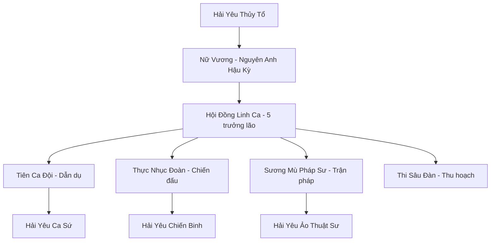
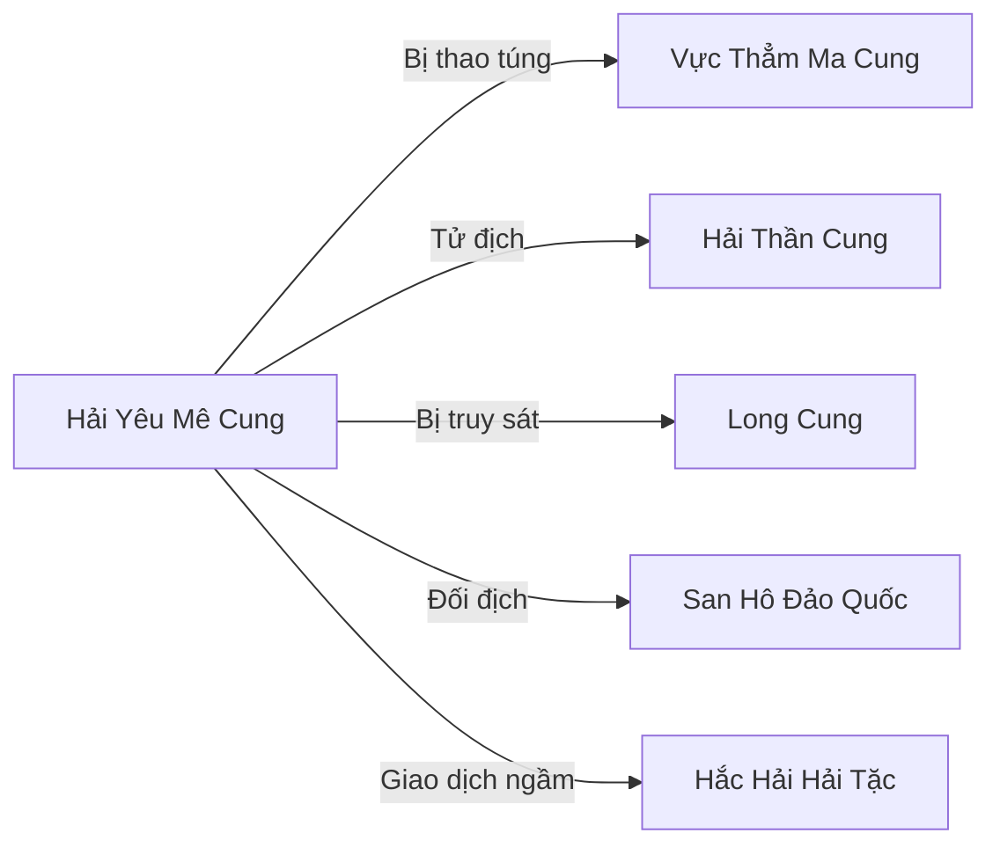

# HẢI YÊU MÊ CUNG (海妖迷宫)

## I. Tổng Quan (总览)
Hải Yêu Mê Cung là sào huyệt của loài Hải Yêu — còn gọi là Siren — tại vùng biển nguy hiểm nhất Vô Tận Hải. Với ba ngàn cá thể hải yêu phân bố trong hệ thống đá ngầm và hang động dưới vùng biển Tam Giác Chết, đây không phải tông môn tu tiên truyền thống mà là cộng đồng sinh vật săn mồi có tổ chức cao, sử dụng giọng hát mê hoặc và sương mù ma thuật để dẫn dụ thương thuyền, tu sĩ hành tẩu và ngư dân vào chỗ chết. Hải Yêu Nữ Vương — tu vi ước lượng Nguyên Anh Hậu Kỳ — cai trị bằng sức hấp dẫn tuyệt đối của giọng hát, được Hội Đồng Linh Ca gồm năm hải yêu cổ nhất phò tá. Xếp Hạng Nhì, mê cung là nỗi khiếp đảm thường trực của mọi hàng hải trên Vô Tận Hải — thủy thủ kỳ cựu thường nói: "Thà đối mặt bão tố mười ngày hơn là nghe thấy một nốt nhạc từ Tam Giác Chết." Mê cung tuy bị các thế lực chính thống coi là tà ác, nhưng thực chất hải yêu chỉ đang làm điều mà bản năng chủng tộc đòi hỏi — săn mồi để sinh tồn, vì chúng không thể sống mà không hấp thụ tinh huyết và linh hồn của sinh vật khác.

## II. Địa Lý & Tài Nguyên (地理与资源)
Vùng biển Tam Giác Chết nằm ở phía tây nam Vô Tận Hải, nơi ba dòng hải lưu nguy hiểm giao nhau tạo ra xoáy nước không thể đoán trước và hàng vạn bãi đá ngầm sắc nhọn ẩn dưới làn sương mù dày đặc quanh năm. Sương mù không phải hiện tượng tự nhiên mà do hải yêu liên tục duy trì bằng ma khí — bất kỳ tàu thuyền nào đi vào sẽ mất phương hướng hoàn toàn, la bàn linh lực quay loạn, và giọng hát quyến rũ vang lên từ mọi hướng dẫn dắt con mồi đến bãi đá. Tài nguyên chính của mê cung là kho báu khổng lồ từ hàng nghìn con tàu đắm tích lũy qua nhiều kỷ nguyên — linh thạch, pháp bảo, kim loại quý, hàng hóa xa xỉ — chồng chất dưới đáy biển tạo thành "Nghĩa Địa Vàng Bạc." Ngoài ra, vùng tử khí quanh mê cung nuôi dưỡng các loài thực vật biển đột biến có dược tính kỳ lạ, đặc biệt là San Hô Máu — loại san hô hấp thụ tinh huyết người chết, là nguyên liệu quý cho pháp bảo ma đạo.

## III. Văn Hóa & Tín Ngưỡng (文化与信仰)
Hải yêu tôn thờ Hải Yêu Thủy Tổ — tương truyền là tiên cá đầu tiên bị nguyền rủa — và bản năng săn mồi được coi là thiêng liêng, không phải tội lỗi. Chúng tin rằng tiếng hát là ngôn ngữ của linh hồn, và việc ăn thịt con mồi không phải giết chóc mà là "hòa nhập" — linh hồn nạn nhân sẽ trở thành một phần của hải yêu, tiếp tục tồn tại dưới dạng giai điệu vĩnh cửu trong giọng hát kẻ săn mồi. Mỗi hải yêu được đánh giá bởi "số lượng linh hồn" mà giọng hát chứa đựng — hải yêu càng già, giọng hát càng phong phú và mê hoặc hơn vì chứa hàng trăm linh hồn hòa âm. Nghi lễ quan trọng nhất là "Đại Hồi Thanh" — khi Nữ Vương hát bài ca gồm tất cả linh hồn mà bà đã "hòa nhập" suốt đời, tạo ra sóng âm mê hoặc lan xa hàng trăm dặm, thu hút mọi sinh vật có ý thức đến gần — đây là dịp săn mồi lớn nhất năm. Dù tàn bạo, văn hóa hải yêu có chiều sâu nghệ thuật đáng sợ: mỗi khúc hát là tác phẩm âm nhạc hắc ám, đẹp đến mức khiến nạn nhân mỉm cười ngay cả khi bị xé xác.

## IV. Cơ Cấu Tổ Chức (组织结构)

Nữ Vương nắm quyền tuyệt đối, giọng hát của bà có khả năng khống chế mọi hải yêu trong phạm vi mê cung — bất kỳ cá thể nào bất tuân sẽ bị "Câm Thanh Phạt" — mất giọng hát vĩnh viễn, đồng nghĩa với cái chết từ từ vì không thể săn mồi. Hội Đồng Linh Ca gồm năm hải yêu cổ nhất, mỗi vị chỉ huy một nhánh chức năng. Tiên Ca Đội gồm hai trăm hải yêu có giọng hát mê hoặc nhất, chuyên dẫn dụ mục tiêu vào mê cung bằng khúc ca quyến rũ. Thực Nhục Đoàn là lực lượng chiến đấu cận chiến, gồm hải yêu mang nanh vuốt và sức mạnh xé xác, tiêu diệt con mồi đã bị mê hoặc. Sương Mù Pháp Sư duy trì trận pháp sương mù bao phủ Tam Giác Chết quanh năm. Thi Sâu Đàn thu hoạch tài sản từ tàu đắm và xử lý xác nạn nhân.

## V. Công Pháp & Trận Pháp (功法与阵法)
- **Công Pháp:**
  - *Mê Hồn Khúc* — công pháp cốt lõi của hải yêu, sử dụng giọng hát truyền tải linh lực trực tiếp vào thần thức mục tiêu, tạo ra ảo giác về những thứ khao khát nhất — người thân đã mất, quê hương xa vời, tình yêu lý tưởng — khiến nạn nhân tự nguyện đi về phía hải yêu mà mỉm cười. Ở cảnh giới Nguyên Anh, Mê Hồn Khúc có thể khống chế hàng trăm mục tiêu cùng lúc.
  - *Thủy Sát Ảnh Thuật* — thuật ẩn thân hoàn hảo dưới nước, khiến hải yêu gần như vô hình trong môi trường biển, chỉ lộ ra khi tấn công.
  - *Linh Hồn Thôn Phệ* — sau khi con mồi chết, hải yêu hấp thụ linh hồn nạn nhân qua tiếng hát, biến linh hồn thành một phần sức mạnh và giai điệu của mình.
- **Trận Pháp:** *Sương Mù Ảo Ảnh Vĩnh Cửu* — đại trận bao phủ toàn bộ Tam Giác Chết rộng hàng trăm dặm, do hàng trăm Sương Mù Pháp Sư liên tục duy trì bằng ma khí và linh hồn nạn nhân. Trong trận, mọi la bàn linh lực mất tác dụng, phương hướng bị xáo trộn, và huyễn cảnh về đất liền, người thân hoặc kho báu hiện ra lung linh trước mắt dẫn dắt con mồi vào sâu hơn. Tu sĩ dưới Nguyên Anh gần như không thể thoát ra khi đã lọt vào trận.

## VI. Đặc Sản Môn Phái (门派特产)
- **San Hô Máu:** Loại san hô đỏ sẫm mọc tại vùng tử khí Tam Giác Chết, hấp thụ tinh huyết người chết qua nhiều kỷ nguyên. Nguyên liệu quý cho pháp bảo ma đạo — một cành San Hô Máu ngàn năm tuổi có giá trị ngang pháp bảo cấp Kim Đan. Vực Thẳm Ma Cung là khách hàng lớn nhất.
- **Nước Mắt Siren:** Tinh thể kết tinh từ nỗi buồn ảo giác của hải yêu cổ đại, chứa đựng tần số âm thanh mê hoặc cô đặc. Dùng làm nguyên liệu thuốc mê cực mạnh — một giọt Nước Mắt Siren hòa vào nước có thể khiến tu sĩ Trúc Cơ hôn mê ba ngày ba đêm.
- **Vỏ Ốc Truy Hồn:** Vỏ ốc biển được hải yêu chú nguyện bằng linh hồn, khi đặt lên tai sẽ nghe thấy khúc Mê Hồn Khúc yếu — dùng làm pháp bảo mê hoặc hoặc tra tấn tinh thần.

## VII. Cơ Sở Hạ Tầng (基础设施)
- **Ngai Vàng Xương Cá:** Cung điện trung tâm của Nữ Vương, xây từ bộ xương hoàn chỉnh của một con kình ngư thái cổ — xương sườn tạo thành vòm mái, xương sống làm trụ cột, hộp sọ khổng lồ là phòng ngủ riêng của Nữ Vương. Bên trong trang trí bằng ngọc trai cướp được và san hô máu phát sáng đỏ rực.
- **Vườn Đá Ngầm:** Hệ thống bãi đá ngầm sắc nhọn bao quanh mê cung, một phần tự nhiên một phần được hải yêu sắp xếp lại để tạo thành bẫy tàu thuyền tối ưu. Mỗi bãi đá được đánh dấu bằng xương người và mảnh tàu đắm, tạo nên cảnh tượng ghê rợn.
- **Hầm Kho Báu:** Hệ thống hang động dưới đáy Tam Giác Chết chứa tài sản cướp được từ hàng nghìn con tàu đắm qua nhiều kỷ nguyên — linh thạch, pháp bảo, vàng bạc chồng chất như núi, nhưng hải yêu không biết sử dụng đa phần, chúng chỉ coi đó là "đồ trang trí."
- **Ổ Ấp Thâm Hải:** Hang động sâu nơi hải yêu sinh sản và nuôi dưỡng ấu sinh, được bảo vệ nghiêm ngặt nhất vì hải yêu non rất yếu ớt và dễ bị săn.

## VIII. Kinh Tế (经济)
Kinh tế Hải Yêu Mê Cung hoàn toàn dựa trên chiếm đoạt từ con mồi và tàu đắm — hải yêu không sản xuất, không trồng trọt, không chế tạo. Kho báu tích lũy qua hàng nghìn năm đắm tàu là nguồn tài sản khổng lồ nhưng phần lớn không được sử dụng vì hải yêu không hiểu giá trị của linh thạch hay pháp bảo — chúng chỉ quan tâm đến tinh huyết và linh hồn. Một số hải yêu thông minh hơn đã học cách dùng kho báu để trao đổi bí mật với Vực Thẳm Ma Cung — đổi San Hô Máu và pháp bảo cướp được lấy ma khí và cấm thuật. Hải tặc Hắc Hải đôi khi giao dịch với mê cung — mua Nước Mắt Siren làm thuốc mê cho các vụ bắt cóc — nhưng cả hai bên đều không tin tưởng nhau và giao dịch thường kết thúc bằng phản bội.

## IX. Lịch Sử Tóm Tắt (简史)
Truyền thuyết kể rằng hải yêu vốn là tiên cá đẹp đẽ sống ở vùng biển nông thời Thượng Cổ, nhưng một nhóm đã đánh cắp một giọt lệ thiêng của Hải Thần — giọt lệ chứa sức mạnh bất tử. Hải Thần phẫn nộ, nguyền rủa cả giống loài: tước đi linh hồn thuần khiết, buộc chúng phải sống bằng cách hấp thụ linh hồn kẻ khác, và biến vẻ đẹp thành vũ khí chết chóc. Tiên cá bị nguyền rủa trở thành hải yêu, bị mọi chủng tộc khinh ghét và truy sát. Chúng chạy về vùng biển Tam Giác Chết — nơi dòng hải lưu hỗn loạn tạo ra lá chắn thiên nhiên — và xây dựng Hải Yêu Mê Cung làm pháo đài cuối cùng. Long Cung nhiều lần cử quân thảo phạt nhưng đều thất bại trong mê cung sương mù, cuối cùng bỏ cuộc và chỉ lập vùng cấm quanh Tam Giác Chết. Gần đây, Vực Thẳm Ma Cung đang bí mật tiếp cận và thao túng mê cung, cung cấp ma khí và cấm thuật đổi lấy tù nhân và tình báo — biến hải yêu thành tay sai không tự biết.

## X. Giai Thoại & Bí Mật (轶事与秘密)
Đồn rằng mỗi khúc Mê Hồn Khúc mà hải yêu hát đều chứa một phần sinh mạng của chính nó — hải yêu hát càng nhiều, sống càng ngắn, nhưng giọng hát càng mê hoặc. Nữ Vương hiện tại đã hát hơn ngàn khúc trong đời, giọng hát đẹp đến mức nghe một nốt nhạc cũng khiến Nguyên Anh tu sĩ mê mẩn — nhưng cái giá là tuổi thọ của bà đang cạn kiệt nhanh chóng. Nếu ai có thể hát át đi tiếng hát của Nữ Vương bằng một khúc ca thanh tịnh hơn, toàn bộ sương mù mê cung sẽ tan biến và lời nguyền sẽ suy yếu — đây là bí mật mà chỉ Hội Đồng Linh Ca biết và khiếp sợ. Ngoài ra, hải yêu lớn tuổi nhất trong Hội Đồng — già hơn cả Nữ Vương — đang bí mật tìm kiếm "Giải Nguyền Khúc" — bài hát tương truyền có thể phá bỏ lời nguyền của Hải Thần, cho phép hải yêu sống mà không cần hấp thụ linh hồn. Bà tin rằng bài hát ẩn giấu trong ký ức tập thể của tất cả linh hồn mà hải yêu đã "hòa nhập" suốt hàng vạn năm.

## XI. Quan Hệ Thế Lực (势力关系)

Vực Thẳm Ma Cung là "đồng minh" nhưng thực chất đang thao túng — cung cấp ma khí và cấm thuật để kiểm soát hải yêu làm tay sai, đổi lấy tù nhân sống và tình báo về các thế lực trên mặt biển. Hải Thần Cung và Long Cung đều coi mê cung là mối họa cần tiêu diệt nhưng chưa ai muốn tốn binh lực trong sương mù chết chóc. San Hô Đảo Quốc là nạn nhân thường xuyên — cư dân lạc đàn bị hải yêu bắt cóc và ăn thịt. Hắc Hải Hải Tặc giao dịch ngầm mua Nước Mắt Siren nhưng quan hệ đầy phản bội lẫn nhau.
