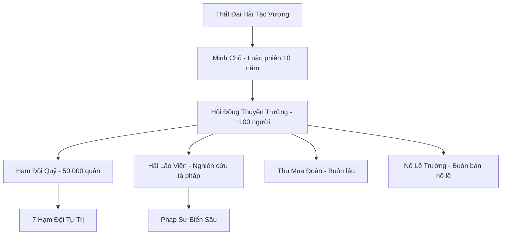
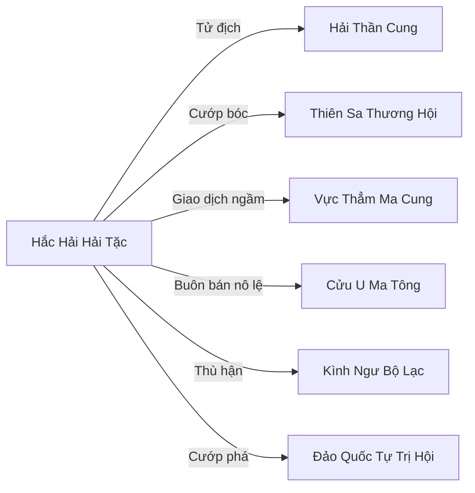

# LIÊN MINH HẮC HẢI (黑海海贼) - HẮC HẢI HẢI TẶC

## I. Tổng Quan (总览)
Liên Minh Hắc Hải là tổ chức tội phạm có quy mô lớn nhất trên đại dương, tập hợp hơn mười vạn thủy thủ, chiến binh và tà tu thuộc đa chủng tộc — từ hải tộc bị trục xuất, nhân tộc cướp biển đào ngũ, đến thủy yêu hoang dã không chịu quy phục bất kỳ vương quyền nào. Cư ngụ tại vùng biển Hắc Hải đầy rẫy xoáy nước và linh khí ô nhiễm, liên minh hoạt động như một quốc gia vô chính phủ nơi luật lệ duy nhất là sức mạnh và lòng tham. Thất Đại Hải Tặc Vương — bảy vị thuyền trưởng hùng mạnh nhất — luân phiên giữ chức Minh Chủ mỗi mười năm, nhưng trên thực tế mỗi vị đều tự trị hạm đội riêng và chỉ hợp lực khi đối mặt mối đe dọa sống còn. Hải tặc Hắc Hải là nỗi ám ảnh thường trực của mọi thương thuyền qua lại Vô Tận Hải, là cái gai không thể nhổ trong mắt Hải Thần Cung, và là thế lực tà đạo duy nhất trên biển dám thách thức cả Long Cung lẫn chính đạo.

## II. Địa Lý & Tài Nguyên (地理与资源)
Trụ sở chính là Đảo Xương Sọ, nằm ở trung tâm vùng biển Hắc Hải phía tây Vô Tận Hải — một hòn đảo kỳ dị hình thành từ xương cốt hàng vạn sinh vật biển cổ đại và xác tàu đắm chồng chất qua nhiều kỷ nguyên, tạo nên địa hình lởm chởm trắng xóa có hình dáng đầu lâu khổng lồ khi nhìn từ trên cao. Vùng biển Hắc Hải bao quanh đảo có nồng độ linh khí ô nhiễm cực cao, tạo ra "Hắc Thủy" — nước biển đen kịt có tính ăn mòn mạnh, phá hủy thuyền bè thường và gây nhiễm độc cho tu sĩ không quen. Đây vừa là tài nguyên quý giá cho tà đạo công pháp, vừa là lá chắn thiên nhiên ngăn cản quân chính đạo tiến sâu. Dưới đáy Hắc Hải có vô số xác tàu chứa kho báu tích lũy qua nhiều thế kỷ — linh thạch, pháp bảo, kim loại quý — là nguồn cung cấp vật tư chiến tranh vô tận cho hải tặc. Ngoài ra, vùng biển này có mật độ hải thú đột biến cực cao do linh khí ô nhiễm, cung cấp nội đan tà hệ quý hiếm mà tà tu săn lùng.

## III. Văn Hóa & Tín Ngưỡng (文化与信仰)
Hải tặc Hắc Hải tôn thờ hai thứ: Sức Mạnh và Tự Do. Họ tin rằng biển cả không thuộc về ai — không thuộc Hải Thần Cung, không thuộc Long Cung — và bất kỳ kẻ nào đủ mạnh đều có quyền lấy những gì hắn muốn từ đại dương. Một bộ phận thủy thủ thờ cúng "Thần Biển Hắc Ám" — biến thể tà ác của Hải Thần, tương truyền là mặt tối của Thủy Tổ bị phong ấn dưới Hắc Hải. Trước mỗi chuyến cướp, thuyền trưởng sẽ hiến tế linh hồn tù nhân xuống biển đen kèm lời nguyền cầu — máu tù nhân nhuộm đỏ mặt nước, và nếu biển đổi màu thành đen sẫm, đó là điềm lành cho cuộc đi săn. Luật Hải Tặc quy định chiến lợi phẩm chia theo công trạng: thuyền trưởng bốn phần, phó thuyền trưởng ba phần, thủy thủ chia đều phần còn lại. Sự phản bội là tội duy nhất bị trừng phạt bằng cái chết — kẻ phản bội bị trói vào cột buồm, thả neo giữa Hắc Hải cho hải thú đột biến ăn sống. Dù tàn bạo, văn hóa hải tặc vẫn có phần mã thượng kỳ lạ: không giết phụ nữ mang thai và trẻ em dưới mười tuổi — truyền thống này có từ thời Hải Tặc Vương đầu tiên lập ước.

## IV. Cơ Cấu Tổ Chức (组织结构)

Thất Đại Hải Tặc Vương là bảy vị quyền lực nhất, mỗi vị chỉ huy một hạm đội riêng gồm hàng chục chiến thuyền và hàng ngàn thủy thủ. Minh Chủ được bầu luân phiên mỗi mười năm qua "Hải Chiến Đại Hội" — trên danh nghĩa là bầu cử, thực tế là cuộc đấu sức giữa bảy hạm đội, hạm đội nào thắng nhiều trận nhất thì chủ soái lên làm Minh Chủ. Hội Đồng Thuyền Trưởng gồm khoảng trăm thuyền trưởng cấp dưới, phụ trách điều phối hoạt động cướp bóc và phân chia vùng biển săn mồi. Hải Lão Viện là nhánh nghiên cứu tà pháp, gồm những pháp sư biển già cỗi chuyên duy trì và sửa chữa tàu ma, bào chế thủy độc, và nghiên cứu cấm thuật hiến tế linh hồn. Thu Mua Đoàn là mạng lưới buôn lậu ngầm, tiêu thụ hàng cướp được qua các chợ đen trên đất liền. Nô Lệ Trường nằm sâu trong Đảo Xương Sọ, nơi hàng nghìn tù nhân đa chủng tộc bị giam giữ chờ bán hoặc hiến tế — là nguồn thu nhập ổn định và cũng là vết nhơ đen tối nhất của liên minh.

## V. Công Pháp & Trận Pháp (功法与阵法)
- **Công Pháp:**
  - *Hắc Thủy Hủ Thi Quyết* — tà đạo công pháp thủy hệ sử dụng Hắc Thủy ô nhiễm làm nguồn lực, cho phép thao túng nước độc ăn mòn phòng ngự và nhục thể đối phương. Tu luyện lâu ngày, tu sĩ sẽ bị Hắc Thủy xâm thực, da thịt biến thành màu xám đen và tuổi thọ giảm đáng kể — nhưng sức chiến đấu tăng vọt trong ngắn hạn.
  - *Huyết Tế Đoạt Linh* — cấm thuật hiến tế linh hồn kẻ khác để tăng cường tạm thời tu vi hoặc hồi phục thương tích nghiêm trọng. Mỗi linh hồn bị hiến tế sẽ biến thành "Vong Linh Binh" phục vụ cho Hải Lão Viện.
  - *Hắc Lôi Phá Giáp Quyết* — đao pháp chuyên dùng khi cướp tàu, kết hợp lôi khí ô nhiễm với thủy hệ tạo ra đòn chém ăn mòn phòng ngự trận pháp của thương thuyền.
- **Trận Pháp:** *Hắc Hải Vong Linh Trận* — trận pháp di động bao phủ toàn bộ hạm đội, triệu hồi linh hồn thủy thủ đã chết dưới biển tạo ra lớp sương mù đen che mắt đối phương và gây hoang mang thần thức. Ở quy mô lớn nhất khi cả bảy hạm đội liên thủ, trận pháp tạo ra "Hắc Hải Vĩnh Dạ" — vùng biển tối đen mười dặm nơi mọi cảm giác đều bị nhiễu loạn, khiến ngay cả Nguyên Anh tu sĩ cũng mất phương hướng.

## VI. Đặc Sản Môn Phái (门派特产)
- **Hắc Hải Độc Đao:** Đao răng cưa rèn từ kim loại đáy Hắc Hải, mạ lớp Hắc Thủy cô đặc có tính ăn mòn mạnh. Vết thương do Hắc Hải Độc Đao gây ra cực khó lành, linh lực chữa thương bị Hắc Thủy phân giải, buộc nạn nhân phải tìm dược sư chuyên trị hoặc chịu để vết thương hoại tử.
- **Thần Công Thủy Tinh:** Đại bác cổ đại lắp trên tàu chiến, bắn ra khối năng lượng thủy hệ nén cỡ đầu người với sức công phá kinh hoàng, có thể phá vỡ kết giới phòng thủ cấp Kim Đan từ khoảng cách năm trăm trượng. Mỗi hạm đội sở hữu từ mười đến hai mươi khẩu, do Hải Lão Viện bảo trì.
- **Hắc Thủy Tửu:** Rượu ủ từ tảo biển lên men trong Hắc Thủy, vị cay nồng mặn chát, uống vào toàn thân nóng rực và tăng cường tạm thời sức chiến đấu. Thủy thủ Hắc Hải coi đây là "huyết mạch" của cuộc sống trên biển — thiếu rượu thì nổi loạn trước cả khi thiếu lương thực.

## VII. Cơ Sở Hạ Tầng (基础设施)
- **Đảo Xương Sọ:** Pháo đài tự nhiên và thủ đô không chính thức của hải tặc. Bên trong đảo là mê cung hang động xương cốt chứa kho báu, Nô Lệ Trường, xưởng sửa tàu và khu giải trí đồi trụy với rượu, cờ bạc và đấu trường sinh tử. Bề mặt đảo có cầu cảng dài hơn năm dặm, đủ chỗ cho hàng trăm tàu chiến neo đậu cùng lúc.
- **Nghĩa Địa Tàu Đắm:** Vùng biển cạn phía nam Đảo Xương Sọ, nơi hàng ngàn xác tàu chồng chất tạo thành mê cung dưới nước. Hải Lão Viện sử dụng nơi đây làm xưởng sửa chữa và cải tạo tàu ma — con tàu đắm được phù phép hồi sinh, di chuyển bằng vong linh thủy thủ đã chết, không cần gió hay hải lưu.
- **Hắc Thị Trường:** Chợ đen lớn nhất trên biển, nằm trong lòng Đảo Xương Sọ, nơi buôn bán mọi thứ từ pháp bảo cướp được, linh thạch tang vật, nô lệ đa chủng tộc đến cấm dược và tà khí kết tinh. Thương nhân đen từ khắp Cố Nguyên Giới đến đây giao dịch, được bảo đảm an toàn bởi luật "Bất Sát Tại Chợ."
- **Xưởng Hải Lão:** Nằm sâu nhất trong hang động Đảo Xương Sọ, nơi các pháp sư biển già cỗi nghiên cứu tà pháp, bào chế thủy độc và thí nghiệm trên tù nhân sống — tiếng thét vọng ra từ xưởng cả ngày lẫn đêm khiến ngay cả hải tặc kỳ cựu cũng né tránh.

## VIII. Kinh Tế (经济)
Kinh tế Liên Minh Hắc Hải dựa trên ba trụ cột phi pháp. Thứ nhất, cướp bóc trực tiếp — mỗi năm bảy hạm đội thực hiện hàng trăm vụ tấn công thương thuyền và thành phố ven biển, thu về lượng linh thạch, pháp bảo và hàng hóa khổng lồ. Thứ hai, buôn bán nô lệ — Nô Lệ Trường trên Đảo Xương Sọ là chợ nô lệ lớn nhất trên biển, bán tù nhân đa chủng tộc cho các thế lực ma đạo trên đất liền, các mỏ khoáng nguy hiểm và thậm chí cả các tà tu cần "nguyên liệu" cho cấm thuật. Thứ ba, bảo kê và tống tiền — một số tuyến đường biển tối bị hải tặc kiểm soát, thương thuyền muốn đi qua an toàn phải trả "phí bình an" cho thuyền trưởng phụ trách vùng đó. Doanh thu tổng cộng của liên minh đủ nuôi mười vạn quân và duy trì hạm đội khổng lồ, nhưng phân phối bất công — Thất Vương giàu nứt đố đổ vách trong khi thủy thủ bình thường sống bấp bênh, là nguyên nhân của những cuộc nổi loạn nội bộ định kỳ.

## IX. Lịch Sử Tóm Tắt (简史)
Liên minh hình thành vào thời Trung Cổ Kỷ Nguyên, khi Long Cung và Hải Thần Cung đang sa lầy trong cuộc Đại Chiến Hải Lục, bỏ trống vùng biển Hắc Hải — nơi linh khí ô nhiễm nghiêm trọng mà không bên nào muốn kiểm soát. Bảy thuyền trưởng khét tiếng nhất lúc bấy giờ — mỗi vị đều bị truy nã bởi ít nhất ba thế lực lớn — đã tập hợp tại Đảo Xương Sọ và ký "Ước Nguyện Xương Người" bằng máu tươi, thề rằng "kẻ nào phản bội, xương cốt hắn sẽ trở thành một phần của hòn đảo này." Từ đó, liên minh phát triển nhanh chóng bằng cách thu nạp mọi kẻ bị xã hội ruồng bỏ — tù nhân vượt ngục, tu sĩ bị trục xuất, yêu tộc không chốn dung thân. Cuộc thanh trừng nội bộ lớn nhất xảy ra năm mươi năm trước khi Hải Tặc Vương đời thứ tư bị hạ bệ, dẫn đến cuộc chạy trốn của Châu Thiết và hình thành nhóm Hải Tặc Tàn Dư. Gần đây, liên minh đang bành trướng mạnh mẽ, lợi dụng sự suy yếu của Hải Thần Cung sau vụ rò rỉ tà khí từ Cấm Địa để mở rộng vùng hoạt động sang cả biển đông.

## X. Giai Thoại & Bí Mật (轶事与秘密)
Tương truyền Thất Đại Hải Tặc Vương đời đầu tiên cùng sở hữu một chiếc "Rương Vô Đáy" — trữ vật không gian cổ đại chứa linh hồn của mọi kẻ thù họ đã giết, và Hải Lão Viện có thể triệu hồi các linh hồn này thành Vong Linh Binh phục vụ chiến tranh. Rương được luân chuyển cho Minh Chủ đương nhiệm giữ, và tương truyền ai mở rương ra vào đêm trăng máu sẽ nghe thấy tiếng thét của hàng vạn linh hồn vọng lên từ đáy sâu. Bí mật lớn hơn nằm ở chính Đảo Xương Sọ — dưới lớp xương cốt và tàn tích, có một hệ thống hang động cổ đại khắc đầy phù văn không thuộc bất kỳ nền văn minh nào đã biết. Hải Lão Viện đã nghiên cứu phù văn này suốt nhiều thế kỷ nhưng chỉ giải mã được một phần nhỏ — phần đã giải mã cho ra công thức tạo tàu ma và Hắc Thủy Hủ Thi Quyết. Ngoài ra, một trong Thất Vương hiện tại đang bí mật liên lạc với Vực Thẳm Ma Cung, âm mưu lật đổ các vương khác để độc chiếm liên minh — nếu sự thật bại lộ, nội chiến tàn khốc sẽ nổ ra.

## XI. Quan Hệ Thế Lực (势力关系)

Hải Thần Cung là tử địch truyền kiếp — mỗi năm đều có những cuộc vây quét và đụng độ đẫm máu giữa hai bên, nhưng Hắc Hải như ổ kiến không bao giờ diệt sạch. Vực Thẳm Ma Cung là đối tác ngầm đáng ngờ — hai bên trao đổi ma tinh thạch và cấm thuật qua kênh bí mật, nhưng không bên nào thực sự tin tưởng bên kia. Kình Ngư Bộ Lạc thù hận hải tặc vì lịch sử săn bắt cá voi, mỗi lần chạm trán đều kết thúc bằng bạo lực. Các thế lực nhỏ như Đảo Quốc Tự Trị Hội và Phiêu Lưu Đảo Liên Minh là nạn nhân thường xuyên của các cuộc cướp phá. Hải Tặc Tàn Dư do Châu Thiết dẫn đầu bị coi là phản bội, Thất Vương đã treo thưởng cho cái đầu của hắn — dù số tiền thưởng thấp đến nhục nhã, phản ánh sự coi thường tuyệt đối.
