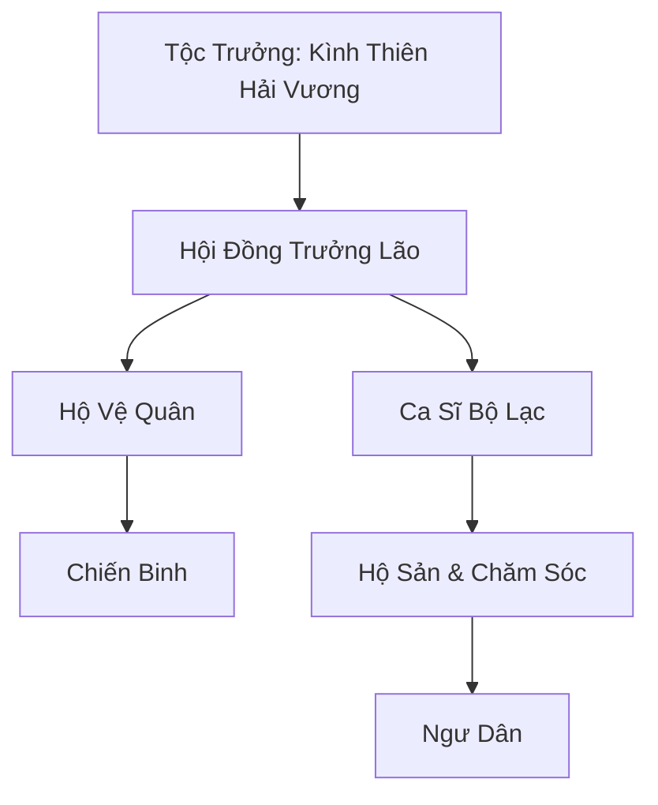
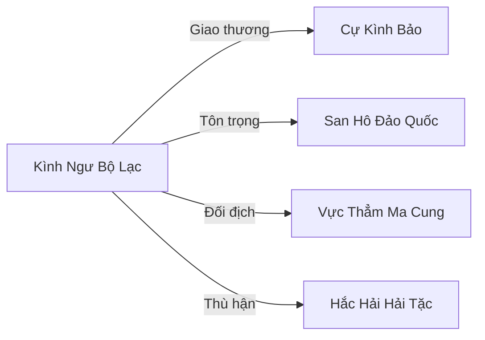

# KÌNH NGƯ BỘ LẠC (鯨魚部落)

> *"Biển sinh ra tiếng hát, tiếng hát sinh ra cá voi, cá voi sinh ra chúng ta. Ai quên tiếng hát, kẻ đó quên mình từ đâu đến."*
> — Kình Thiên Hải Vương, lời huấn thị tại lễ Di Cư Đại Hội

## I. Tổng Quan (总览)
Kình Ngư Bộ Lạc là một quần thể Hải Tộc cổ xưa sinh sống tại Vô Tận Hải, với tám ngàn tộc nhân sống hòa mình cùng các bầy cá voi khổng lồ giữa biển sâu thẳm. Trái ngược với Cự Kình Bảo xây dựng thành phố nhân tạo trên lưng cá voi khổng lồ, Kình Ngư Bộ Lạc sống hòa mình vào tự nhiên, bơi lội cùng các bầy cá voi và sử dụng âm ba để giao tiếp và chiến đấu. Dưới sự dẫn dắt của Kình Thiên Hải Vương — tu sĩ Nguyên Anh Sơ Kỳ hiếm hoi trong Vô Tận Hải — bộ lạc duy trì truyền thống di cư ngàn đời, theo dấu các đàn cá voi qua những dòng hải lưu lớn, bảo vệ chúng khỏi tà tu và hải tặc săn bắt. Họ là những người bảo vệ trung thành của biển cả, và tiếng hát vang vọng của họ dưới lòng đại dương là lời nhắc nhở rằng biển sâu không bao giờ im lặng.

## II. Địa Lý & Tài Nguyên (地理与资源)
Bộ lạc không có lãnh thổ cố định mà di cư theo các bầy cá voi qua những dòng hải lưu lớn của Vô Tận Hải, tuyến đường di cư chính hình vòng cung kéo dài hàng vạn dặm qua ba đại dương nội hải. Nơi họ đi qua thường là những vùng biển sâu thẳm, giàu linh khí thủy hệ và sản sinh nhiều trân châu quý hiếm, san hô ngọc, và "Thủy Tinh Cá Voi" — kết tinh linh khí từ tiếng hát của cá voi. Tuyến di cư đi qua ba điểm dừng quan trọng: **Kình Ca Nguyên** phía bắc — vùng biển nông nơi cá voi con sinh ra và học hát, nước ấm và linh khí dồi dào, bộ lạc dừng chân ở đây suốt mùa xuân; **Thâm Uyên Hải Cốc** ở trung tâm — rãnh biển sâu nhất trên tuyến đường, nơi trân châu biển sâu hình thành tự nhiên trong vách đá ngầm; và **Hàn Lưu Giao Hội** phía nam — điểm gặp nhau của ba dòng hải lưu lạnh, nơi thực phẩm dồi dào nhất cho cá voi. Mỗi điểm dừng đều có ý nghĩa thiêng liêng trong truyền thống bộ lạc, gắn liền với một bài thánh ca riêng biệt.

## III. Văn Hóa & Tín Ngưỡng (文化与信仰)
Người Kình Ngư tôn thờ "Âm Thanh Của Biển" — họ tin rằng tiếng hát của Kình Tổ là bản nhạc kiến tạo nên đại dương, rằng mỗi đợt sóng, mỗi dòng hải lưu đều là dư âm của khúc ca sáng thế ấy. Mọi hoạt động từ sinh nhật, săn bắt đến tang lễ đều được cử hành bằng những bài thánh ca vang vọng dưới lòng biển sâu — Ca Sĩ Bộ Lạc Kình Hải Âm Thiên là người giữ trọn bộ ba trăm sáu mươi bài thánh ca truyền đời, mỗi bài tương ứng với một ngày trong năm và một sự kiện cuộc đời. Trẻ sơ sinh được ca sĩ hát "Kình Sinh Ca" ngay khoảnh khắc chào đời; chiến binh trước trận đánh được hát "Lôi Âm Chiến Ca" để tăng cường ý chí; người chết được hát "Thâm Uyên Quy Ca" — khúc ca tiễn linh hồn về biển sâu nhất, giai điệu thấp đến mức chỉ cá voi mới nghe trọn vẹn. Phong tục đặc biệt nhất là "Sơ Thanh Lễ" — khi trẻ Kình Ngư phát ra tiếng hát đầu tiên cộng hưởng được với cá voi, cả bộ lạc ăn mừng suốt ba ngày ba đêm, và đứa trẻ chính thức được công nhận là thành viên.

## IV. Cơ Cấu Tổ Chức (组织结构)

Kình Thiên Hải Vương đứng đầu bộ lạc với tư cách Tộc Trưởng, quyết định tuyến đường di cư, giải quyết tranh chấp nội bộ, và dẫn dắt chiến đấu khi cần. Hội Đồng Trưởng Lão gồm năm Kình Tộc cổ nhất, mỗi người phụ trách một lĩnh vực: quân sự, tài nguyên, y tế, giáo dục và ngoại giao. Ca Sĩ Bộ Lạc Kình Hải Âm Thiên giữ vị trí đặc biệt — không phải lãnh đạo nhưng được tôn trọng ngang Trưởng Lão, vì tiếng hát của cô duy trì kết nối tâm linh giữa bộ lạc và cá voi. Hộ Vệ Trưởng Kình Lôi Âm chỉ huy một ngàn năm trăm chiến binh, phân thành năm đội tuần tra luân phiên bảo vệ đàn cá voi suốt ngày đêm. Kình Mẫu Từ phụ trách hộ sản và chăm sóc cả cá voi lẫn trẻ sơ sinh Kình Tộc — bà đỡ đẻ cho hơn ba trăm cá voi con trong suốt sự nghiệp, tay nghề không ai sánh bằng.

## V. Công Pháp & Trận Pháp (功法与阵法)
- **Công Pháp:** *Thâm Hải Kình Âm Quyết* — công pháp cốt lõi của bộ lạc, sử dụng sóng âm cộng hưởng với linh khí thủy hệ để tạo ra xung kích vật lý và nhiễu loạn thần thức trong nước biển, tầm tấn công lên đến mười dặm ở cảnh giới cao. *Kình Cốt Đoán Thể Thuật* — phương pháp rèn luyện nhục thể lấy cảm hứng từ cấu trúc xương cá voi, giúp chiến binh Kình Tộc có nhục thể cứng cỏi vượt xa tu sĩ cùng cảnh giới, đặc biệt kháng áp lực biển sâu.
- **Trận Pháp:** *Thánh Vực Thủy Âm Trận* — trận pháp di động sử dụng sự cộng hưởng âm thanh của hàng ngàn tộc nhân hát đồng loạt, tạo ra lớp khiên chắn sóng âm phản đòn mọi công kích vật lý và ma pháp. Khi kích hoạt đầy đủ với một ngàn chiến binh cùng hát, trận pháp tạo ra "Kình Vực" — vùng biển mà mọi sinh vật xâm nhập đều bị tần số âm thanh xé nát thần thức, ngay cả Kim Đan tu sĩ cũng không dám xông vào trận pháp ở cường độ tối đa. Trận pháp này chỉ thất bại một lần trong lịch sử — khi đối mặt Vực Thẳm Ma Cung, vì ma tu sử dụng tà âm phản sóng.

## VI. Đặc Sản Môn Phái (门派特产)
- **Trân Châu Lưu Âm:** Loại ngọc trai có thể ghi lại và phát ra một đoạn âm thanh hoặc sóng âm tấn công, hình thành tự nhiên bên trong cá voi già khi tiếng hát của chúng cộng hưởng với linh khí ngưng tụ. Một viên Trân Châu Lưu Âm ghi lại giọng hát của Ca Sĩ Bộ Lạc có thể bán được năm trăm linh thạch trung phẩm tại San Hô Đảo Quốc, nhưng bộ lạc hiếm khi bán vì coi đó là hồn vía của cá voi.
- **Tủy Xương Cự Kình:** Dược liệu quý hiếm từ xương cá voi chết tự nhiên, có tác dụng cường hóa thể phách và kinh mạch thủy hệ. Bộ lạc chỉ thu hoạch từ cá voi đã chết do tuổi già, không bao giờ giết cá voi lấy xương — phong tục Kình Tộc coi hành vi đó ngang với giết cha mẹ.
- **Thủy Tinh Cá Voi:** Kết tinh linh khí hình thành trong lồng ngực cá voi thượng cổ, trong suốt như pha lê nhưng chứa sóng âm ngưng đọng — khi đặt vào nước, phát ra giai điệu trầm mặc kéo dài hàng giờ. Các tu sĩ thủy hệ sử dụng Thủy Tinh Cá Voi trong thiền định để tăng cường cảm ứng linh khí biển sâu.

## VII. Cơ Sở Hạ Tầng (基础设施)
- **San Hô Động Di Động:** Những cụm san hô được cấy trên lưng các loài rùa biển và cá voi nhỏ làm nơi cư trú tạm thời, mỗi cụm chứa được hai mươi đến ba mươi tộc nhân, trôi theo đoàn di cư như làng nổi trên biển. Cụm lớn nhất mang tên "Mẫu Gia" — gắn trên lưng một cự quy ngàn tuổi — dùng làm nhà hộ sản và trạm y tế.
- **Hải Tế Đàn:** Một khối san hô khổng lồ được điêu khắc tinh xảo hình cá voi ngửa mặt hát, trôi nổi giữa trung tâm đội hình di cư, là nơi cử hành mọi nghi lễ thiêng liêng và hội đồng trưởng lão họp bàn. Mặt trên Hải Tế Đàn khắc bản đồ tuyến di cư truyền đời, đánh dấu mọi điểm dừng và vùng nguy hiểm bằng ký hiệu cổ.
- **Kình Ca Tháp:** Tháp san hô cao năm trượng đặt trên lưng cá voi lớn nhất đoàn, nơi Ca Sĩ Bộ Lạc đứng hát dẫn đường cho cả đoàn di cư. Tiếng hát từ đỉnh tháp vang xa năm mươi dặm, đảm bảo không tộc nhân nào lạc đường trong bão biển.

## VIII. Kinh Tế (经济)
Chủ yếu tự cung tự cấp, bộ lạc sống dựa vào biển cả mà không khai thác quá mức — triết lý "lấy vừa đủ, trả lại cho biển" là nền tảng kinh tế. Chiến binh và ngư dân thu thập trân châu, san hô ngọc, và linh thảo biển sâu tại các điểm dừng trên tuyến di cư, đặc biệt là Thâm Uyên Hải Cốc nơi trân châu biển sâu có chất lượng cao nhất. Họ thỉnh thoảng trồi lên mặt biển hoặc ghé qua các đảo quốc như San Hô Đảo Quốc và Cự Kình Bảo để dùng trân châu và linh thảo biển sâu đổi lấy đan dược, kim loại rèn vũ khí, và đặc biệt là muối linh — thứ duy nhất bộ lạc không tự sản xuất được nhưng cần thiết cho việc bảo quản thực phẩm trong mùa di cư dài. Mỗi năm giao dịch lớn nhất diễn ra tại Hàn Lưu Giao Hội, khi thương nhân San Hô Đảo Quốc đưa thuyền đến chờ sẵn — phiên chợ dưới nước kéo dài bảy ngày, được gọi là "Kình Thị."

## IX. Lịch Sử Tóm Tắt (简史)
Tương truyền, Kình Ngư Bộ Lạc là hậu duệ của những người đầu tiên lắng nghe được tiếng hát của Kình Tổ thời Thượng Cổ — khi Kình Tổ, con cá voi thượng cổ lớn nhất lịch sử, cất tiếng hát đầu tiên tạo nên dòng hải lưu và triều cường, một nhóm Hải Tộc nguyên thủy đã bị thu hút bởi âm thanh đó và theo Kình Tổ suốt phần đời còn lại. Qua hàng ngàn thế hệ, họ tiến hóa khả năng giao tiếp bằng âm ba và hình thành mối quan hệ cộng sinh sâu sắc với loài cá voi. Trải qua vô số kỷ nguyên, họ luôn giữ vững truyền thống di cư và bảo vệ các sinh vật biển khổng lồ khỏi sự săn lùng của tà tu. Trận chiến lớn nhất trong lịch sử bộ lạc là "Hải Chiến Huyết Kình" ba trăm năm trước, khi Vực Thẳm Ma Cung cử đội quân tà tu đến bắt cự kình luyện tà pháp — Kình Thiên Hải Vương đời trước hy sinh mạng sống để kích hoạt Thánh Vực Thủy Âm Trận ở cường độ tối đa, tiêu diệt toàn bộ tà tu nhưng cũng thiệt hại nặng nề, dân số giảm một nửa. Bộ lạc mất hai trăm năm để phục hồi đến quy mô hiện tại.

## X. Giai Thoại & Bí Mật (轶事与秘密)
Mọi ca sĩ của bộ lạc khi đạt đến cảnh giới cao nhất đều kể về một "Khúc Hát Tận Cùng" — bài thánh ca thứ ba trăm sáu mươi mốt không nằm trong bộ sưu tập chính thức, tương truyền có thể triệu hồi linh hồn của Kình Tổ từ Vực Thẳm. Kình Hải Âm Thiên thú nhận rằng đôi khi trong giấc mơ, cô nghe thấy giai điệu của bài hát đó — trầm hùng đến mức toàn thân run rẩy — nhưng tỉnh dậy chỉ nhớ được vài nốt nhạc rời rạc. Trưởng Lão lớn tuổi nhất bộ lạc tin rằng Kình Tổ không chết mà đang ngủ ở đáy Vực Thẳm, và Khúc Hát Tận Cùng chính là chìa khóa đánh thức nó — nhưng cũng cảnh báo rằng hậu quả của việc đánh thức Kình Tổ có thể là sóng thần quét sạch mọi thứ trên mặt biển. Ngoài ra, bộ lạc gần đây phát hiện rằng cá voi trong đàn bắt đầu hát những giai điệu lạ — không thuộc bất kỳ bài thánh ca nào đã biết — và nhiều con liên tục bơi về hướng nam như bị thứ gì đó gọi. Kình Thiên Hải Vương đang lo lắng theo dõi hiện tượng này, nghi ngờ nó liên quan đến Huyết Độc đang lan từ Nam Cương.

## XI. Quan Hệ Thế Lực (势力关系)

Cự Kình Bảo là đồng tộc chia tay từ thượng cổ — hai bên cùng nguồn gốc nhưng khác triết lý: Bộ Lạc sống hòa với biển, Cự Kình Bảo xây thành trên lưng cá voi. Dù có bất đồng, hai bên vẫn duy trì trao đổi thương mại và chia sẻ tin tức về tuyến di cư. San Hô Đảo Quốc cung cấp vật tư thiết yếu qua phiên chợ Kình Thị, đổi lại bộ lạc bảo vệ tuyến hàng hải khỏi hải tặc — một thỏa thuận không thành văn nhưng bền vững suốt nhiều thế kỷ. Vực Thẳm Ma Cung là kẻ thù truyền kiếp do lịch sử săn bắt cá voi luyện tà pháp, bộ lạc thề sẽ tiêu diệt bất kỳ tà tu nào tiến gần đàn cá voi. Hắc Hải Hải Tặc cũng là đối thủ thường xuyên — những lần chạm trán tại Thâm Uyên Hải Cốc luôn kết thúc trong bạo lực.