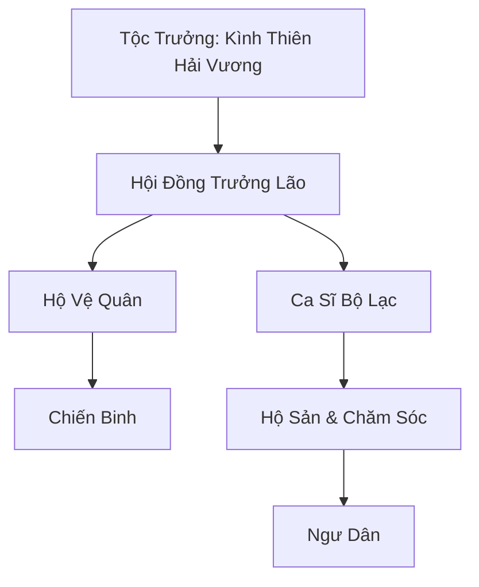

# KÌNH NGƯ BỘ LẠC (鯨魚部落)

## I. Tổng Quan (总览)
Kình Ngư Bộ Lạc là một quần thể Hải Tộc cổ xưa sinh sống tại Vô Tận Hải. Trái ngược với Cự Kình Bảo xây dựng thành phố nhân tạo trên lưng cá voi khổng lồ, Kình Ngư Bộ Lạc sống hòa mình vào tự nhiên, bơi lội cùng các bầy cá voi và sử dụng âm ba để giao tiếp và chiến đấu. Họ là những người bảo vệ trung thành của biển cả.

## II. Địa Lý & Tài Nguyên (地理 với tài nguyên)
Bộ lạc không có lãnh thổ cố định mà di cư theo các bầy cá voi qua những dòng hải lưu lớn của Vô Tận Hải. Nơi họ đi qua thường là những vùng biển sâu thẳm, giàu linh khí thủy hệ và sản sinh nhiều trân châu quý hiếm, san hô ngọc, và "Thủy Tinh Cá Voi" – kết tinh linh khí từ tiếng hát của cá voi.

## III. Văn Hóa & Tín Ngưỡng (文化 với信仰)
Người Kình Ngư tôn thờ "Âm Thanh Của Biển". Họ tin rằng tiếng hát của Kình Tổ là bản nhạc kiến tạo nên đại dương. Mọi hoạt động từ sinh nhật, săn bắt đến tang lễ đều được cử hành bằng những bài thánh ca vang vọng dưới lòng biển sâu.

## IV. Cơ Cấu Tổ Chức (组织结构)


## V. Công Pháp & Trận Pháp (功法 với阵法)
- **Công Pháp:** *Thâm Hải Kình Âm Quyết* (Sử dụng sóng âm để công kích và giao tiếp), *Kình Cốt Đoán Thể Thuật* (Rèn luyện nhục thể cứng cỏi như xương cá voi).
- **Trận Pháp:** *Thánh Vực Thủy Âm Trận* - Trận pháp di động sử dụng sự cộng hưởng âm thanh của hàng ngàn tộc nhân để tạo ra lớp khiên chắn sóng âm phản đòn mọi công kích vật lý và ma pháp.

## VI. Đặc Sản Môn Phái (门派特产)
- **Trân Châu Lưu Âm:** Loại ngọc trai có thể ghi lại và phát ra một đoạn âm thanh hoặc sóng âm tấn công.
- **Tủy Xương Cự Kình:** Dược liệu quý hiếm giúp cường hóa thể phách.

## VII. Cơ Sở Hạ Tầng (基础设施)
- **San Hô Động Di Động:** Những cụm san hô được cấy trên lưng các loài rùa biển và cá voi nhỏ làm nơi cư trú tạm thời.
- **Hải Tế Đàn:** Một khối san hô khổng lồ được điêu khắc tinh xảo, trôi nổi giữa trung tâm đội hình di cư.

## VIII. Kinh Tế (経済)
Chủ yếu tự cung tự cấp. Họ thỉnh thoảng trồi lên mặt biển hoặc ghé qua các đảo quốc (như San Hô Đảo Quốc, Cự Kình Bảo) để dùng trân châu và linh thảo biển sâu đổi lấy đan dược và kim loại rèn vũ khí.

## IX. Lịch Sử Tóm Tắt (简史)
Tương truyền, Kình Ngư Bộ Lạc là hậu duệ của những người đầu tiên lắng nghe được tiếng hát của Kình Tổ thời Thượng Cổ. Trải qua vô số kỷ nguyên, họ luôn giữ vững truyền thống di cư và bảo vệ các sinh vật biển khổng lồ khỏi sự săn lùng của tà tu.

## X. Giai Thoại & Bí Mật (轶 sự với bí mật)
Mọi ca sĩ của bộ lạc khi đạt đến cảnh giới cao nhất đều kể về một "Khúc Hát Tận Cùng", tương truyền có thể triệu hồi linh hồn của Kình Tổ từ Vực Thẳm Ma Cung.

## XI. Quan Hệ Thế Lực (势力关系)
```mermaid
graph LR
    KNBL[Kình Ngư Bộ Lạc] -- Giao thương -- CKB[Cự Kình Bảo]
    KNBL -- Tôn trọng -- SHDQ[San Hô Đảo Quốc]
    KNBL -- Đối địch -- VMC[Vực Thẳm Ma Cung]
    KNBL -- Thù hận -- HHHT[Hắc Hải Hải Tặc]
```