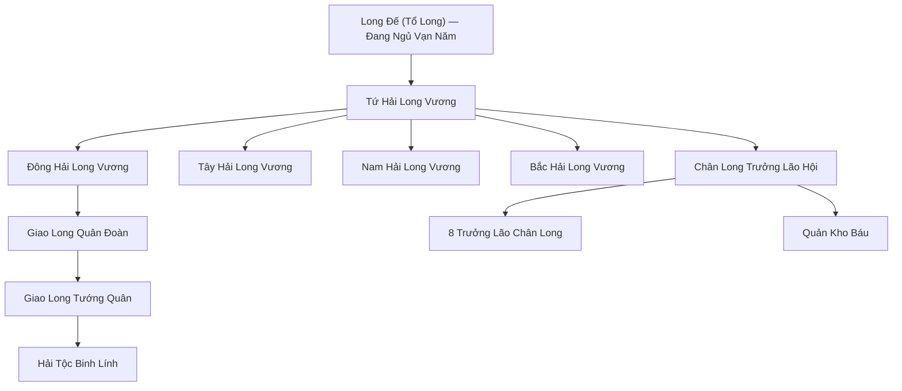
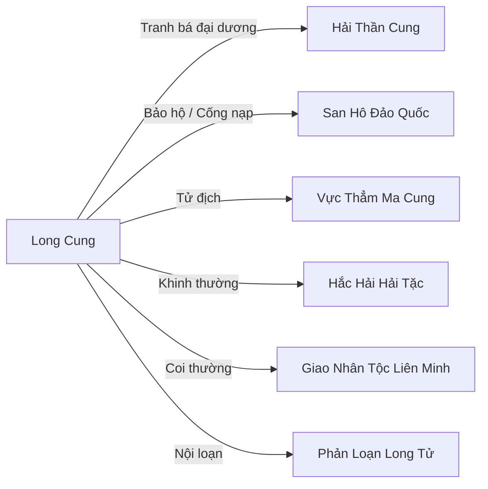

# Long Cung (龙宫)

## I. Tổng Quan (总览)
Long Cung là thực thể tối cổ và quyền uy nhất trong lòng Vô Tận Hải, vương quốc của Long Tộc — chủng tộc tự xưng là con cưng đầu tiên của Thiên Đạo. Với chưa đầy tám trăm thành viên gồm Chân Long, Giao Long và Á Long, Long Cung sở hữu sức mạnh quân sự và uy danh vượt xa mọi thế lực hải dương khác. Long Đế — Tổ Long ở cấp bậc Thần Thoại — đang ngủ say vạn năm tại đáy sâu nhất, quyền lực thực tế nằm trong tay Tứ Hải Long Vương cai quản bốn phương. Đây là thế lực Hạng Nhất, không phải vì số lượng mà vì chất lượng tuyệt đối: một Chân Long trưởng thành có thể đánh bại cả một tông môn nhỏ, và bốn Long Vương kết hợp đủ sức đối đầu với bất kỳ thế lực nào trong Cố Nguyên Giới. Long Cung kiêu ngạo, lười biếng, và coi mọi chủng tộc khác như bụi trần — nhưng chính sự kiêu ngạo ấy cũng là điểm yếu lớn nhất của họ.

## II. Địa Lý & Tài Nguyên (地理 与 资源)
Trụ sở chính là Thủy Tinh Long Cung, một tuyệt tác kiến trúc được xây dựng hoàn toàn từ pha lê tự nhiên ngàn năm, tọa lạc tại điểm sâu nhất và giàu linh khí nhất của Vô Tận Hải. Cung điện tỏa sáng lung linh trong bóng tối đáy biển, rộng hàng trăm dặm, mỗi căn phòng chứa đầy trân bảo thu thập qua vạn năm. Bốn Phân Cung đặt tại bốn phương — Đông, Tây, Nam, Bắc — mỗi cung là một tiểu vương quốc dưới nước với lãnh hải riêng. Hóa Long Trì nằm trong Cấm Địa Long Cung, là hồ nước đặc biệt có khả năng biến Giao Long thành Chân Long thông qua sấm sét Lôi Kiếp — tài nguyên bí cảnh quý giá nhất mà mọi Giao Long trong thiên hạ đều khao khát. Kho Báu Vạn Năm chứa đựng pháp bảo, linh thạch và di vật từ thời Thượng Cổ, quy mô lớn đến mức chính Long Tộc cũng chưa thống kê hết.

## III. Văn Hóa & Tín Ngưỡng (文化 与 信仰)
Long Tộc tôn thờ chính mình — họ tin rằng mình là giống loài cao quý nhất, sinh ra để cai trị bầu trời và đại dương. Văn hóa Long Cung mang đậm tính kiêu ngạo và thu thập: mỗi Chân Long đều có bản năng tích trữ trân bảo, và kho báu cá nhân là thước đo giá trị xã hội. Hệ thống đẳng cấp dựa hoàn toàn trên độ thuần chủng huyết mạch — Chân Long đứng trên Giao Long, Giao Long đứng trên Á Long, và tất cả đều coi mọi chủng tộc khác là hạ đẳng. Lễ nghi phức tạp và rườm rà, phản ánh niềm tự hào chủng tộc đến cực đoan. Mỗi khi Long Đế trở mình trong giấc ngủ, toàn bộ Vô Tận Hải rung chuyển — Long Tộc coi đó là điềm lành và tổ chức lễ tế lớn.

## IV. Cơ Cấu Tổ Chức (组织结构)

Chế độ phong kiến quân chủ tuyệt đối, quyền lực tập trung vào huyết mạch. Long Đế tuy đang ngủ vạn năm nhưng ý chí vẫn ảnh hưởng đến cả vương quốc qua Long Uy tỏa ra từ thân thể ngủ say. Tứ Hải Long Vương — bốn Chân Long cảnh giới Hóa Thần — nắm thực quyền, mỗi vị cai quản một phần tư đại dương. Chân Long Trưởng Lão Hội gồm tám vị trưởng lão phụ trách tham mưu, bảo quản di sản và giám sát Hóa Long Trì. Giao Long Quân Đoàn là lực lượng quân sự, dưới sự chỉ huy của các Giao Long Tướng Quân. Hải Tộc binh lính phục dịch Long Cung đông đảo nhưng bị coi như nô bộc, thường xuyên xung đột ngầm với Hải Thần Cung trong việc tranh giành nhân lực.

## V. Công Pháp & Trận Pháp (功法 与 阵法)
Long Tộc tu luyện bằng cách hấp thụ tinh hoa Nhật Nguyệt thay vì linh khí thông thường, đây là đặc quyền huyết mạch mà không chủng tộc nào khác có thể bắt chước. Hai công pháp chấn phái là "Chân Long Cửu Biến" — cho phép Long Tộc biến đổi hình dạng chín lần, mỗi lần tăng cường sức mạnh gấp bội — và "Long Ngâm Chấn Thiên" — tiếng gầm có thể rung chuyển sơn hà, làm sụp trận pháp cấp thấp. Long Tộc sở hữu khả năng Hô Phong Hoán Vũ bẩm sinh, khống chế lôi kiếp, và miễn nhiễm hầu hết phép thuật cấp thấp. Vũ khí chiến đấu chính là thân thể vảy rồng bọc thép, móng vuốt sắc nhọn, và Hơi Thở Hủy Diệt — mỗi thuộc tính (phong, vũ, lôi, điện, thủy, hỏa) tùy thuộc vào huyết mạch cá thể.

## VI. Đặc Sản Môn Phái (门派特产)
- **Long Lân:** Vảy rồng rụng tự nhiên, mỗi chiếc là nguyên liệu luyện khí tối thượng, giá trị bằng cả gia sản một tông môn nhỏ. Long Tộc hiếm khi bán ra ngoài.
- **Long Châu:** Viên ngọc kết tinh từ tinh hoa Long Tộc, chứa đựng sức mạnh nguyên thủy của Chân Long. Là pháp bảo cấp thần, toàn thiên hạ không quá mười viên.
- **Long Huyết Đan:** Đan dược chế từ một giọt máu Giao Long pha loãng, có tác dụng cải cốt hoán tủy cho tu sĩ nhân tộc. Cực kỳ hiếm và đắt đỏ.

## VII. Cơ Sở Hạ Tầng (基础设施)
- **Thủy Tinh Long Cung:** Cung điện trung tâm nguy nga lộng lẫy, xây từ pha lê biển sâu, rộng hàng trăm dặm, chứa kho báu khổng lồ và là nơi Long Vương cư ngụ.
- **Hóa Long Trì:** Hồ nước thiêng trong Cấm Địa, nơi Giao Long vượt lôi kiếp hóa thành Chân Long. Được bảo vệ bởi trận pháp đa tầng và sự canh giữ của Trưởng Lão Hội.
- **Tứ Hải Phân Cung:** Bốn tiểu cung điện đặt tại bốn cực của Vô Tận Hải, mỗi cung là trung tâm hành chính và quân sự của một phương.
- **Long Uy Tháp:** Tháp cao ở trung tâm Thủy Tinh Long Cung, khuếch đại Long Uy của Long Đế đang ngủ ra khắp đại dương, đóng vai trò như trận pháp trấn áp tự nhiên.

## VIII. Kinh Tế (经济)
Kinh tế Long Cung vận hành theo mô hình cống nạp và thu giữ. Các hải tộc nhỏ, đảo quốc ven biển và thương thuyền đi qua lãnh hải đều phải nộp cống phẩm — từ ngọc trai, linh thạch đến pháp bảo quý giá. Long Tộc cũng khai thác trân bảo đáy biển sâu mà không tộc nào khác có thể tiếp cận nhờ khả năng chịu áp suất và hô hấp dưới nước. Rất hiếm khi Long Cung bán ra pháp bảo — mỗi giao dịch là sự kiện chấn động, giá cả cao đến mức chỉ có thế lực Hạng Nhì trở lên mới đủ tài lực mua. Bản chất kinh tế là tích trữ và thu thập, không phải sản xuất và trao đổi — phản ánh bản năng của Long Tộc.

## IX. Lịch Sử Tóm Tắt (简史)
Long Tộc tự xưng là con cưng của Thiên Đạo đầu tiên, từng cai trị cả bầu trời lẫn đại dương vào thời Thượng Cổ. Khi đó, mỗi Chân Long là một vị chúa tể, và tiếng gầm của Long Đế có thể làm sụp cả một lục địa. Tuy nhiên, cuộc Đại Chiến với Cự Tộc và Yêu Tộc thời viễn cổ, cùng sự trỗi dậy của Nhân Tộc thông minh và đông đảo, đã khiến số lượng Long Tộc giảm mạnh. Long Đế bị trọng thương trong trận chiến cuối cùng và rơi vào giấc ngủ vạn năm. Long Tộc tàn dư phải rút về đáy Vô Tận Hải, xây dựng Thủy Tinh Long Cung làm pháo đài cuối cùng. Từ đó, họ thu mình trong kiêu ngạo, thỉnh thoảng hiện ra để thị uy hoặc đòi cống phẩm, nhưng không còn tham vọng chinh phục mặt đất như xưa.

## X. Giai Thoại & Bí Mật (轶事 与 秘密)
Tương truyền Long Đế không thực sự ngủ — mà đang dùng toàn bộ thần lực để trấn áp một thứ gì đó bị phong ấn dưới đáy sâu nhất của Vô Tận Hải. Nếu Long Đế thức dậy, phong ấn sẽ suy yếu, và thứ bị giam giữ sẽ thoát ra. Chỉ có Đại Trưởng Lão trong Trưởng Lão Hội biết sự thật này, và mỗi đời Trưởng Lão đều thề giữ bí mật đến chết. Một bí mật khác: trong Kho Báu Vạn Năm có một căn phòng mà ngay cả Long Vương cũng không được phép vào — tương truyền bên trong chứa di vật của một vị Chân Long đã phản bội Long Tộc và đầu quân cho Vực Thẳm Ma Cung thời Thượng Cổ. Sự tồn tại của Phản Loạn Long Tử cũng liên quan đến bí mật này.

## XI. Quan Hệ Thế Lực (势力关系)

- **Hải Thần Cung:** Đối thủ tranh bá đại dương hàng triệu năm. Long Cung coi Hải Thần Cung là kẻ tiếm quyền dựng lên tôn giáo giả để thu phục dân tâm, còn Hải Thần Cung coi Long Tộc là bạo chúa kiêu ngạo không biết thời thế. Cả hai hiếm khi toàn diện khai chiến vì đều sợ lực lượng thứ ba ngư ông đắc lợi.
- **San Hô Đảo Quốc:** Chư hầu trung thành nhất, cống nạp ngọc trai và dịch vụ chữa thương. Long Cung bảo hộ danh nghĩa nhưng với thái độ ban ơn.
- **Vực Thẳm Ma Cung:** Kẻ thù tự nhiên. Long Tộc coi ma vật biển sâu là ô uế cần thanh trừ, nhưng Vực Thẳm ẩn quá sâu và quá nguy hiểm để vây quét hoàn toàn.
- **Hắc Hải Hải Tặc:** Sâu bọ không đáng bận tâm. Long Cung lười truy quét, nhưng hải tặc nào dám xâm phạm lãnh hải Long Tộc sẽ bị hủy diệt không thương tiếc.
