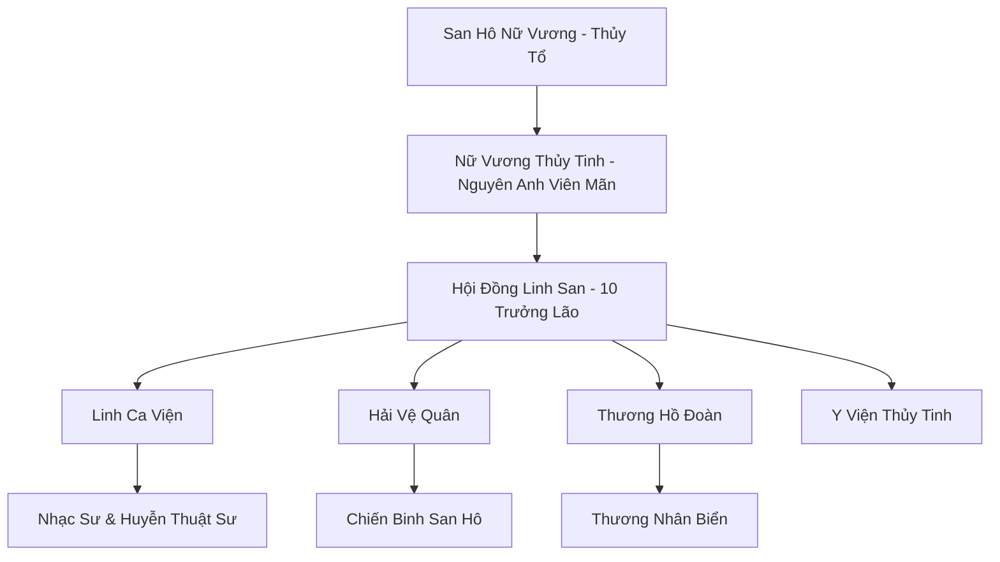
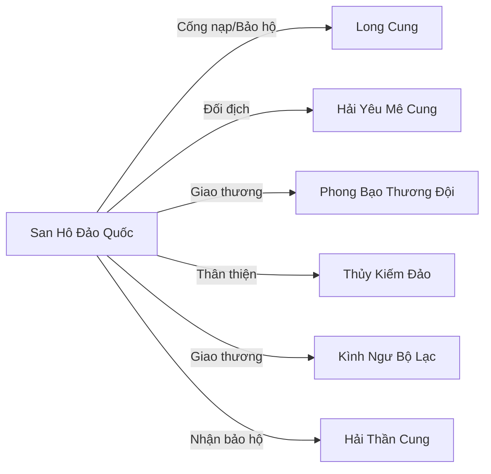

# SAN HÔ ĐẢO QUỐC (珊瑚岛国)

## I. Tổng Quan (总览)
San Hô Đảo Quốc là liên minh hải tộc ôn hòa nhất Vô Tận Hải, cư ngụ trong hệ thống rạn san hô khổng lồ tại vùng Biển Lam Ngọc — nơi nước biển trong vắt đến mức có thể nhìn thấu đáy ở độ sâu trăm trượng. Với năm ngàn cư dân chủ yếu là Nhân Ngư và Tiên Cá, đảo quốc là vương quốc của nghệ thuật, âm nhạc và sự chữa lành, nơi kiến trúc san hô sống hòa quyện với sinh vật biển tạo nên cảnh tượng mỹ lệ không nơi nào sánh bằng. Nữ Vương Thủy Tinh — hậu duệ trực hệ của San Hô Nữ Vương thời Thượng Cổ — cai trị bằng tiếng hát và lòng nhân từ, được Hội Đồng Linh San gồm mười trưởng lão phò tá. Đảo quốc giữ vị thế trung lập trong mọi tranh chấp lớn giữa Hải Thần Cung và Long Cung, nhận bảo hộ của Long Cung nhưng đổi lại phải cống nạp ngọc trai linh khí định kỳ — một mối quan hệ vừa bảo đảm an ninh vừa tạo ra gánh nặng kinh tế. Đảo quốc nổi tiếng là điểm đến của những tu sĩ muốn tìm kiếm sự thanh tịnh tâm hồn và chữa lành thương tổn thần thức bằng Linh Ca — âm nhạc mang linh lực trị liệu.

## II. Địa Lý & Tài Nguyên (地理与资源)
Vùng Biển Lam Ngọc tọa lạc ở phía đông Vô Tận Hải, nơi hai dòng hải lưu ấm giao nhau tạo ra vùng nước ổn định quanh năm với nhiệt độ và linh khí lý tưởng cho san hô sinh trưởng. Rạn San Hô Khổng Lồ trải rộng hơn năm mươi dặm theo chiều ngang và mười lăm dặm theo chiều sâu, gồm hàng triệu cụm san hô sống được cường hóa bằng linh lực — chúng có khả năng tự phát triển, thay đổi hình dạng và phát ra ánh sáng lung linh trong bóng tối biển sâu. San hô ở đây không chỉ là sinh vật mà còn là vật liệu xây dựng thông minh: cư dân có thể "ca hát" để san hô mọc theo hình dáng mong muốn, tạo nên cung điện, cầu đường và tường thành hoàn toàn bằng sinh vật sống. Tài nguyên chính gồm ngọc trai linh khí — hình thành tự nhiên trong các hang san hô kín nơi linh khí ngưng tụ — và tảo biển dược tính cao mọc dày đặc quanh rạn. Biển Lam Ngọc cũng là nơi sinh sản quan trọng của nhiều loài sinh vật biển quý hiếm, tạo nên hệ sinh thái phong phú bậc nhất Vô Tận Hải.

## III. Văn Hóa & Tín Ngưỡng (文化与信仰)
Cư dân đảo quốc tôn thờ San Hô Nữ Vương — Thủy Tổ sáng lập — và tin rằng tiếng hát của Nữ Vương vẫn vang vọng trong lòng rạn san hô, là nguồn gốc của mọi âm nhạc dưới đại dương. Triết lý sống cốt lõi là "Hòa Thanh" — sống hòa hợp với tự nhiên, coi âm nhạc là ngôn ngữ chung kết nối vạn vật, và tin rằng bạo lực là "nốt nhạc lạc điệu" phá hủy sự cân bằng của biển cả. Lễ hội lớn nhất năm là "San Hô Hoa Đăng Lễ" — khi rạn san hô đồng loạt phát sáng vào đêm rằm tháng Tám, toàn dân tụ họp tại San Hô Thánh Điện hát bài "Vạn Sắc Hải Ca" suốt đêm, tiếng hát ngân vang thu hút hàng ngàn sinh vật biển từ khắp nơi đến quây quần. Nghệ thuật điêu khắc từ vỏ sò và xương san hô đạt đến trình độ tinh xảo phi thường — mỗi tác phẩm chứa linh khí và phát ra giai điệu riêng khi chạm vào, là đồ trang sức và pháp bảo được giới tu sĩ trên đất liền khao khát. Dù ôn hòa, văn hóa đảo quốc có mặt trái: quá lý tưởng hóa hòa bình khiến họ thiếu chuẩn bị cho chiến tranh, và sự phụ thuộc vào bảo hộ từ Long Cung tạo ra tâm lý tự ti ngầm.

## IV. Cơ Cấu Tổ Chức (组织结构)

Nữ Vương Thủy Tinh đứng đầu đảo quốc, tu vi Nguyên Anh Viên Mãn, sở hữu giọng hát có sức mạnh điều khiển toàn bộ rạn san hô và tạo huyễn cảnh che phủ cả vùng Biển Lam Ngọc. Hội Đồng Linh San gồm mười trưởng lão đại diện cho mười bộ lạc Nhân Ngư lớn nhất, phụ trách từ quân sự, thương mại đến giáo dục và y tế. Linh Ca Viện do Viện Chủ Hải Nguyệt Ca dẫn dắt, là trung tâm nghiên cứu âm nhạc trị liệu và huyễn thuật — mọi nhạc sư được đào tạo tại đây trước khi phục vụ đảo quốc. Hải Vệ Quân gồm một ngàn chiến binh San Hô được trang bị vũ khí và giáp trụ bằng san hô cứng hóa, phòng thủ rạn san hô khỏi hải tặc và yêu thú. Thương Hồ Đoàn do San Hồng Diệp chỉ huy, phụ trách giao thương với bên ngoài bằng đội thuyền san hô nhẹ nhàng và nhanh nhẹn.

## V. Công Pháp & Trận Pháp (功法与阵法)
- **Công Pháp:**
  - *Thủy Tinh Linh Ca* — công pháp cốt lõi của đảo quốc, sử dụng giọng hát kết hợp linh khí thủy hệ để tạo ra sóng âm huyễn thuật, trị liệu hoặc tấn công. Ở cảnh giới cao, Linh Ca có thể thanh tẩy tâm ma, chữa lành thương tổn thần thức, hoặc ngược lại — xé nát thần thức kẻ thù bằng tần số cao. Nữ Vương Thủy Tinh đã đạt cảnh giới "Vạn Thanh Quy Nhất" — một tiếng hát đủ sức trấn áp ngàn quân.
  - *Hải Lưu Chú* — thuật điều khiển dòng nước bằng giai điệu ngân nga, cho phép cư dân di chuyển nhanh dưới nước và tạo dòng chảy bảo vệ.
  - *San Hô Sinh Trưởng Khúc* — bài hát đặc biệt khiến san hô sống mọc nhanh gấp trăm lần, dùng để xây dựng hoặc sửa chữa công trình — cũng có thể dùng trong chiến đấu để tạo tường chắn san hô tức thì.
- **Trận Pháp:** *Hải Lưu Ảo Ảnh Trận* — trận pháp hộ quốc bao phủ toàn bộ rạn san hô, sử dụng sự khúc xạ ánh sáng qua nước biển trong suốt và cộng hưởng âm thanh từ hàng triệu cụm san hô phát quang, tạo ra huyễn cảnh khiến kẻ xâm nhập lạc lối trong mê cung ánh sáng vô tận. Tu sĩ dưới Kim Đan gần như không thể tìm thấy lối vào đảo quốc khi trận pháp hoạt động.

## VI. Đặc Sản Môn Phái (门派特产)
- **Ngọc Trai Lam Ngọc:** Loại ngọc trai hình thành tự nhiên trong hang san hô kín, chứa linh khí thủy hệ tinh thuần, có tác dụng tăng cường thần thức và định tâm. Phẩm chất tốt nhất có thể dùng làm nguyên liệu luyện đan cấp Nguyên Anh, mỗi viên có giá vài trăm linh thạch trung phẩm.
- **Sáo San Hô:** Pháp bảo âm nhạc chế tác từ san hô cổ thụ ngàn năm, tiếng sáo có thể giao tiếp và điều khiển sinh vật biển nhỏ trong phạm vi một dặm. Nghệ nhân Hải Tiểu Loa nổi tiếng vì chế tác những chiếc sáo mang linh hồn riêng — mỗi chiếc phát ra giai điệu độc nhất vô nhị.
- **San Hô Linh Giáp:** Giáp chiến đấu bằng san hô cứng hóa, nhẹ nhàng và có khả năng tự sửa chữa khi bị hư hại nhờ linh lực nuôi dưỡng từ rạn san hô. Chỉ hoạt động tối đa khi ở gần Biển Lam Ngọc.

## VII. Cơ Sở Hạ Tầng (基础设施)
- **San Hô Thánh Điện:** Cung điện trung tâm hình vòm khổng lồ xây hoàn toàn bằng san hô phát quang bảy màu, bên trong có Đại Sảnh Linh Ca — phòng hòa nhạc tự nhiên với âm học hoàn hảo, nơi diễn ra các nghi lễ quốc gia và buổi trị liệu tâm linh cho du khách.
- **Vườn Ngọc Trai:** Khu vực nuôi cấy ngọc trai quy mô lớn dưới đáy biển, gồm hàng trăm hang san hô được kiểm soát điều kiện linh khí và nhiệt độ tối ưu. San Bạch Ngọc — Trưởng Lão Hội Đồng — đích thân giám sát vườn, đảm bảo chất lượng xuất khẩu.
- **Hải Cảng Lam Ngọc:** Cảng giao thương chính ở rìa rạn san hô, nơi thương thuyền từ bên ngoài cập bến trao đổi hàng hóa. Cảng được bảo vệ bởi san hô hóa thạch tạo thành đê chắn sóng tự nhiên.
- **Y Viện Thủy Tinh:** Trung tâm y tế sử dụng Linh Ca kết hợp ngọc trai và tảo dược liệu để chữa trị thương tổn — nổi tiếng khắp Vô Tận Hải vì khả năng chữa thương thần thức mà đan dược thông thường không thể.

## VIII. Kinh Tế (经济)
Kinh tế đảo quốc dựa trên ba mũi nhọn. Thứ nhất, xuất khẩu ngọc trai linh khí và sản phẩm mỹ nghệ san hô — nguồn thu lớn nhất, đặc biệt Ngọc Trai Lam Ngọc được giới tu sĩ đất liền và Bách Bảo Các tranh mua. Thứ hai, dịch vụ trị liệu tâm linh — tu sĩ bị tâm ma quấy rối hoặc thần thức tổn thương đến đảo quốc để được Linh Ca Viện chữa trị, chi phí cao nhưng hiệu quả vượt trội so với đan dược, mỗi năm có hàng trăm bệnh nhân từ khắp Cố Nguyên Giới tìm đến. Thứ ba, thực phẩm biển cao cấp — hải sản và tảo biển trong vùng Biển Lam Ngọc có chất lượng tuyệt hảo nhờ linh khí dồi dào. Gánh nặng kinh tế lớn nhất là cống phẩm cho Long Cung — mỗi năm phải nộp một ngàn viên Ngọc Trai Lam Ngọc phẩm chất tốt, chiếm gần hai phần mười tổng sản lượng, khiến đảo quốc luôn trong tình trạng thặng dư mỏng manh.

## IX. Lịch Sử Tóm Tắt (简史)
San Hô Nữ Vương sáng lập đảo quốc vào Thượng Cổ Kỷ Nguyên, khi cuộc Đại Chiến giữa Long Tộc và Yêu Tộc tàn phá vùng biển nông, đe dọa sự tồn vong của các hải tộc nhỏ bé. Nữ Vương dùng tiếng hát kỳ diệu của mình để thức tỉnh ý thức tập thể của rạn san hô, khiến hàng triệu cụm san hô liên kết lại tạo thành pháo đài sống bảo vệ những kẻ yếu thế. Qua nhiều kỷ nguyên, đảo quốc phát triển thành trung tâm văn hóa và nghệ thuật của Vô Tận Hải, nổi tiếng với Linh Ca và công nghệ san hô sống. Tuy nhiên, sức mạnh quân sự luôn là điểm yếu — đảo quốc từng bị Hải Yêu Mê Cung tấn công hai lần trong lịch sử, cả hai lần đều phải nhờ Long Cung cứu viện. Cái giá của sự cứu viện là hiệp ước cống nạp kéo dài đến tận ngày nay — Nữ Vương Thủy Tinh đương nhiệm muốn thoát khỏi sự lệ thuộc này nhưng chưa tìm ra cách, vì không có Long Cung bảo vệ, đảo quốc sẽ là con mồi béo bở cho hải tặc và hải yêu.

## X. Giai Thoại & Bí Mật (轶事与秘密)
Tương truyền San Hô Nữ Vương trước khi biến mất đã để lại mười hai viên ngọc trai bản mệnh — mỗi viên chứa một mảnh ký ức và sức mạnh của bà, giấu ở mười hai vị trí khác nhau trong rạn san hô. Ai sở hữu đủ mười hai viên ngọc sẽ kế thừa toàn bộ thần lực của Nữ Vương, bao gồm khả năng "Hải Thanh Vạn Lý" — tiếng hát vang khắp đại dương đủ sức triệu hồi sự bảo hộ của Hải Thần. Nữ Vương Thủy Tinh hiện nắm giữ ba viên, số còn lại nằm rải rác và một số đã rơi vào tay các thế lực khác — Long Cung được biết đang giữ hai viên. Ngoài ra, San Ngọc Lan — Dược Sư Tảo Biển — đã bí mật phát hiện rằng rạn san hô đang dần chết từ lõi do một loại ký sinh trùng biển sâu chưa từng thấy. Bà giấu kín phát hiện này vì sợ gây hoảng loạn, nhưng nếu không tìm ra cách chữa trị trong vòng vài chục năm, toàn bộ rạn san hô — nền tảng vật chất của đảo quốc — sẽ sụp đổ.

## XI. Quan Hệ Thế Lực (势力关系)

Long Cung là "bảo hộ" nhưng thực chất là mối quan hệ nửa chư hầu — cống nạp ngọc trai mỗi năm đổi lấy cam kết bảo vệ quân sự, nhưng Long Cung thường chậm trễ khi đảo quốc thực sự cần giúp đỡ. Hải Yêu Mê Cung là mối đe dọa thường trực — hải yêu thường xuyên quấy nhiễu rìa rạn san hô, bắt cóc cư dân lạc đàn và phá hoại san hô ngoại vi. Phong Bạo Thương Đội và các thương hội khác là đối tác thương mại quan trọng, vận chuyển ngọc trai và sản phẩm san hô ra đất liền. Thủy Kiếm Đảo là đồng minh tự nhiên — cả hai đều là thế lực ôn hòa trung lập, thường xuyên hỗ trợ lẫn nhau. Kình Ngư Bộ Lạc ghé qua Biển Lam Ngọc mỗi mùa di cư để giao thương tại phiên chợ Kình Thị, là đối tác thương mại quý giá.
