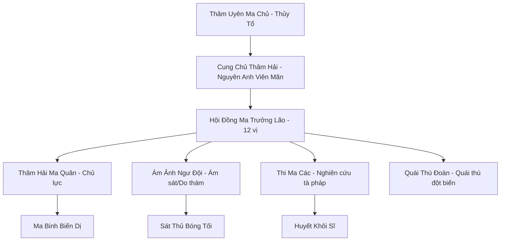
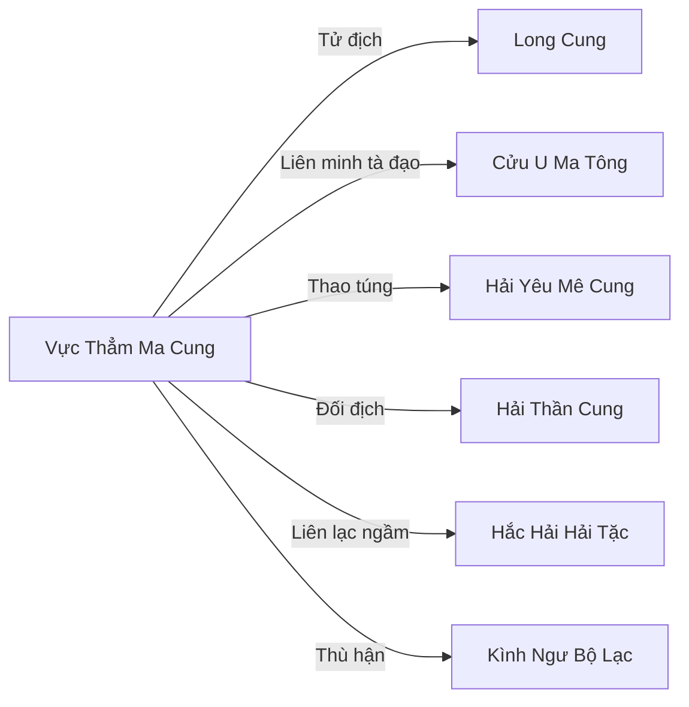

# VỰC THẲM MA CUNG (深渊魔宫)

## I. Tổng Quan (总览)
Vực Thẳm Ma Cung là thế lực ma đạo đáng sợ nhất dưới lòng đại dương, ngự trị tại rãnh biển sâu nhất Vô Tận Hải — nơi áp suất nước có thể nghiền nát nhục thể tu sĩ Kim Đan và ánh sáng mặt trời vĩnh viễn không thể chạm tới. Với bốn ngàn cư dân gồm sinh vật biển bị đột biến bởi ma khí, ma tu lưu vong, và các Thủy Ma cổ đại đã tồn tại từ trước khi Hải Thần Cung thành lập, ma cung là pháo đài tự nhiên bất khả xâm phạm nơi đáy Vực Thẳm. Ma Cung Chủ Thâm Hải — tu vi ước lượng Nguyên Anh Viên Mãn — cai trị bằng nỗi sợ hãi tuyệt đối, được Hội Đồng Ma Trưởng Lão gồm mười hai ma tu phò tá. Mặc dù xếp Hạng Nhì về quy mô, sức mạnh thực chiến của Vực Thẳm Ma Cung vượt xa con số bốn ngàn cư dân — bởi mỗi ma binh đều là sinh vật chiến đấu bẩm sinh dưới áp suất cực lớn, và ma cung còn sở hữu đội quân quái thú đột biến với số lượng không ai biết chính xác.

## II. Địa Lý & Tài Nguyên (地理与资源)
Ma cung tọa lạc tại đáy Rãnh Thâm Uyên — rãnh biển sâu nhất Vô Tận Hải, nơi áp suất nước lớn đến mức khoáng thạch thông thường cũng bị nén thành kim loại siêu cứng. Trung tâm là Hắc Diệu Thạch Điện — tòa thành đen ngòm xây từ đá núi lửa biển sâu và xương cốt cổ thú hải dương, bao phủ diện tích khoảng mười dặm, hoàn toàn chìm trong bóng tối vĩnh cửu. Ma cung nắm giữ "Hắc Ma Tuyền" — mạch ma khí thủy hệ rò rỉ từ khe nứt địa chất dưới đáy rãnh, cung cấp nguồn ma khí vô tận cho tu luyện và tạo ra môi trường lý tưởng cho sinh vật đột biến phát triển. Các loại khoáng thạch chịu áp suất cực cao — đặc biệt là Ma Thiết Thâm Hải, loại kim loại cứng nhất thế giới tu luyện — chỉ có ở đáy rãnh và là nguyên liệu chế tạo giáp trụ, vũ khí ma đạo được các thế lực tà đạo trên đất liền khao khát. Ma Tinh Thạch — linh thạch ma hệ chỉ kết tinh ở nơi có mật độ ma khí cực cao — là nguồn tài nguyên chiến lược mà Vực Thẳm Ma Cung độc quyền cung cấp cho các thế lực ma đạo toàn Cố Nguyên Giới.

## III. Văn Hóa & Tín Ngưỡng (文化与信仰)
Cư dân ma cung tôn thờ Thâm Uyên Ma Chủ — vị ma tu thái cổ sáng lập ma cung — và giáo lý cốt lõi là "Vạn Vật Quy Uyên" (tất cả sẽ trở về vực thẳm): đại dương sẽ nuốt chửng lục địa, bóng tối sẽ nuốt chửng ánh sáng, và vực thẳm là trạng thái nguyên thủy tối hậu của vũ trụ. Văn hóa cực kỳ tàn bạo — kẻ yếu có ba số phận: thức ăn cho quái thú, vật thí nghiệm cho Thi Ma Các, hoặc nô lệ khai mỏ Ma Tinh Thạch. Hệ thống đẳng cấp dựa hoàn toàn trên sức mạnh: mỗi năm tổ chức "Thâm Uyên Sát Kiếp" — cuộc thanh lọc nội bộ nơi ma tu yếu nhất bị đẩy ra vùng áp suất cực hạn, sống sót thì mạnh hơn, chết thì xương cốt bổ sung vào tường thành. Nghi lễ quan trọng nhất là "Uyên Tế" — hiến tế tù nhân sống cho Hắc Ma Tuyền mỗi tháng một lần, thi thể bị ma khí phân giải thành dưỡng chất nuôi quái thú đột biến. Dù tàn bạo, ma cung có một quy tắc bất khả vi phạm: không bao giờ giết đồng môn khi đang chiến đấu với kẻ thù bên ngoài — sự đoàn kết trước ngoại địch là ranh giới duy nhất giữa tổ chức và đám tàn sát hỗn loạn.

## IV. Cơ Cấu Tổ Chức (组织结构)

Ma Cung Chủ Thâm Hải nắm quyền tuyệt đối, quyết định mọi việc từ chiến tranh đến hiến tế. Hội Đồng Ma Trưởng Lão gồm mười hai ma tu mạnh nhất — tu vi từ Kim Đan Đỉnh Phong đến Nguyên Anh Hậu Kỳ — mỗi vị phụ trách một khu vực hoặc chức năng của ma cung. Ba nhánh quân sự hoạt động song song: Thâm Hải Ma Quân là lực lượng chủ lực gồm sinh vật biến dị chiến đấu dưới áp suất cực lớn, nơi không ai khác có thể tồn tại; Ám Ảnh Ngư Đội chuyên do thám, bắt cóc và ám sát trên mặt nước và vùng biển nông — họ là cánh tay vươn dài của ma cung ra thế giới bên ngoài; Thi Ma Các là nhánh nghiên cứu đáng sợ nhất, chuyên thí nghiệm trên tù nhân sống để tạo ra ma binh biến dị, bào chế ma độc và lai tạo quái thú chiến đấu. Quái Thú Đoàn là lực lượng bí mật mà ngay cả trong nội bộ ít người biết quy mô chính xác — hàng trăm sinh vật biển sâu bị đột biến bởi ma khí, từ bạch tuộc khổng lồ đến cá mập xương có khả năng tái sinh.

## V. Công Pháp & Trận Pháp (功法与阵法)
- **Công Pháp:**
  - *Thâm Uyên Áp Sát Quyết* — công pháp tối thượng của ma cung, sử dụng áp lực nước cực hạn làm vũ khí, tạo ra vùng không gian áp suất vạn lần bao quanh đối thủ, nghiền nát linh lực, nhục thể và ý chí. Ở cảnh giới Nguyên Anh, một chiêu Áp Sát có thể khiến tu sĩ Kim Đan nổ tung như quả cầu thịt. Tu luyện đòi hỏi nhục thể phải chịu được áp suất biển sâu — nhiều ma tu chết trong quá trình tu luyện.
  - *Hắc Ám Thủy Ma Pháp* — ma pháp sử dụng bóng tối vĩnh cửu của biển sâu làm phương tiện, thao túng cảm giác thị giác và thần thức đối phương trong môi trường nước, khiến nạn nhân rơi vào trạng thái mù quáng và hoảng loạn tuyệt đối.
  - *Thi Ma Biến Hóa Thuật* — cấm thuật biến đổi thi thể sinh vật biển thành ma binh phục tùng mệnh lệnh, do Thi Ma Các nghiên cứu và hoàn thiện qua nhiều thế kỷ thí nghiệm.
- **Trận Pháp:** *Áp Suất Diệt Tuyệt Trận* — trận pháp hộ cung bao quanh toàn bộ Hắc Diệu Thạch Điện, hoạt động bằng cách khuếch đại áp suất nước tự nhiên của rãnh biển sâu lên hàng vạn lần trong vùng trận. Bất kỳ kẻ xâm nhập nào chưa tu luyện Thâm Uyên Áp Sát Quyết đều bị nghiền thành bã thịt ngay lập tức — ngay cả Nguyên Anh tu sĩ cũng khó sống sót quá mười hơi thở trong trận. Trận pháp này hoạt động tự nhiên nhờ địa hình, gần như không tiêu hao năng lượng, là phòng tuyến bất khả phá vỡ lớn nhất của ma cung.

## VI. Đặc Sản Môn Phái (门派特产)
- **Ma Nhãn Hắc Ám:** Pháp bảo chế từ mắt cá quỷ biển sâu tinh luyện, cho phép tu sĩ nhìn thấu mọi vật trong bóng tối tuyệt đối ở phạm vi mười dặm. Ngoài ra có thể phát ra tia Hắc Quang ăn mòn thần thức — nạn nhân bị chiếu trúng sẽ rơi vào ảo giác kinh hoàng về biển sâu vô tận.
- **Thâm Hải Ma Độc:** Chất độc chiết xuất từ cá quỷ và sứa ma biển sâu, không màu không mùi, hòa tan hoàn hảo trong nước biển. Khi ngấm vào cơ thể, ma độc từ từ phân giải kinh mạch từ trong ra ngoài — nạn nhân không cảm thấy đau đớn cho đến khi kinh mạch đã hỏng hoàn toàn, lúc đó mọi chữa trị đều vô ích. Là vũ khí ám sát ưa thích của Ám Ảnh Ngư Đội.
- **Ma Thiết Thâm Hải:** Kim loại siêu cứng chỉ có ở đáy rãnh biển, nặng gấp mười lần thép thường nhưng sắc bén hơn bất kỳ vật liệu nào trên đất liền. Vũ khí rèn từ Ma Thiết có khả năng xuyên thủng kết giới phòng thủ cấp Kim Đan như cắt bơ.

## VII. Cơ Sở Hạ Tầng (基础设施)
- **Hắc Diệu Thạch Điện:** Cung điện trung tâm xây từ Hắc Diệu Thạch — loại đá núi lửa biển sâu đen tuyền, cứng cáp hơn kim cương, tự hấp thụ ma khí và phát ra áp lực tinh thần khiến kẻ yếu lòng ngất xỉu khi tiếp cận. Cung điện gồm ba tầng: Thượng Điện cho Cung Chủ và Trưởng Lão, Trung Điện cho quân doanh và kho báu, Hạ Điện cho Thi Ma Các và các bể nuôi cấy quái thú.
- **Bể Nuôi Cấy Đột Biến:** Hệ thống hang động ngập ma khí nơi Thi Ma Các lai tạo và biến đổi sinh vật biển thành quái thú chiến đấu. Bên trong có hàng trăm bể nuôi chứa các thực thể ở nhiều giai đoạn biến đổi — từ cá nhỏ bị tiêm ma khí đến quái vật khổng lồ đã hoàn thiện. Tiếng gào thét của các thí nghiệm thất bại vọng ra không ngừng.
- **Ma Khoáng Trường:** Mỏ khai thác Ma Tinh Thạch và Ma Thiết Thâm Hải, sử dụng nô lệ tù nhân và ma binh cấp thấp. Điều kiện làm việc cực kỳ tàn khốc — tuổi thọ trung bình của một nô lệ mỏ chỉ ba năm trước khi bị ma khí phân giải hoàn toàn.
- **Uyên Tế Đàn:** Đài hiến tế nằm trên miệng Hắc Ma Tuyền, nơi thi thể tù nhân được dâng cho mạch ma khí mỗi tháng. Ma khí từ Hắc Ma Tuyền bốc lên xoáy quanh đài tạo thành cột ma khí nhìn thấy được từ khoảng cách năm mươi dặm — là tín hiệu đáng sợ nhất của Vực Thẳm Ma Cung.

## VIII. Kinh Tế (经济)
Kinh tế ma cung dựa trên hai trụ cột: cướp bóc và khai thác tài nguyên biển sâu. Ám Ảnh Ngư Đội thường xuyên tấn công tàu thuyền và bắt cóc tu sĩ hành tẩu trên biển — tù nhân hoặc bán cho Hắc Hải Hải Tặc làm nô lệ, hoặc giữ lại làm thí nghiệm cho Thi Ma Các, hoặc hiến tế cho Hắc Ma Tuyền. Nguồn thu ổn định hơn đến từ việc khai thác và bán Ma Tinh Thạch — tài nguyên mà ma cung độc quyền — cho các thế lực ma đạo trên đất liền thông qua mạng lưới giao thương ngầm, đầu mối chính là Cửu U Ma Tông. Ma Thiết Thâm Hải cũng là mặt hàng có giá trị cực cao, nhưng sản lượng hạn chế do khai thác khó khăn. Nhìn chung, kinh tế ma cung không phong phú nhưng đủ duy trì lực lượng quân sự đáng sợ — bởi quái thú đột biến không cần trả lương, chúng chỉ cần máu tươi.

## IX. Lịch Sử Tóm Tắt (简史)
Vực Thẳm Ma Cung được sáng lập từ Thái Cổ Kỷ Nguyên bởi Thâm Uyên Ma Chủ — một vị đại năng bị Long Tộc và Nhân Tộc liên thủ đánh bại trong cuộc Đại Chiến Hỗn Mang. Bị đánh đuổi xuống rãnh biển sâu nhất, nơi không ai dám truy kích, Ma Chủ lợi dụng môi trường khắc nghiệt để hồi phục và sáng tạo ra Thâm Uyên Áp Sát Quyết — biến điểm yếu thành sức mạnh tuyệt đối. Hắn thu phục các sinh vật biển sâu, biến đổi chúng bằng ma khí, và xây dựng Hắc Diệu Thạch Điện từ xương cốt kẻ thù. Qua hàng vạn năm, ma cung trở thành đế chế bóng tối dưới đáy đại dương, nhiều lần cử quân tấn công Long Cung và Hải Thần Cung nhưng đều thất bại khi vượt ra khỏi vùng áp suất tự nhiên — sức mạnh của ma cung mạnh nhất ở biển sâu nhưng giảm sút đáng kể ở vùng nước nông. Trận chiến lớn nhất là cuộc tấn công Kình Ngư Bộ Lạc ba trăm năm trước nhằm bắt cự kình luyện tà pháp — thất bại trước Thánh Vực Thủy Âm Trận nhưng cũng gây thiệt hại nặng nề cho bộ lạc. Gần đây, ma cung đang âm thầm trỗi dậy mạnh mẽ — Thi Ma Các liên tục tạo ra quái thú mới, Ám Ảnh Ngư Đội mở rộng hoạt động, và có dấu hiệu liên lạc bí mật với một trong Thất Đại Hải Tặc Vương của Hắc Hải Hải Tặc.

## X. Giai Thoại & Bí Mật (轶事与秘密)
Đồn rằng Thâm Uyên Ma Chủ chưa bao giờ thực sự chết — hắn đã hóa thân thành chính Hắc Ma Tuyền, ý thức tàn dư ngấm vào mạch ma khí và lan tỏa khắp rãnh biển. Mỗi đời Ma Cung Chủ khi ngồi thiền tại Uyên Tế Đàn đều nghe thấy tiếng thì thầm từ Hắc Ma Tuyền — đó là Ma Chủ đang truyền đạt chỉ lệnh từ vực thẳm vô tận. Ma Cung Chủ Thâm Hải đương nhiệm tin tuyệt đối vào "tiếng nói" này và tuân theo mọi chỉ dẫn — nhưng một số Trưởng Lão nghi ngờ rằng đó không phải Ma Chủ thật mà là thực thể tà ác cổ đại bị phong ấn dưới đáy rãnh đang lợi dụng ma cung để tự giải phóng. Bí mật nguy hiểm nhất là Thi Ma Các đã bí mật phát triển "Vạn Hóa Thi Trùng" — loại sâu ma có khả năng ký sinh vào thi thể bất kỳ sinh vật nào và biến nó thành ma binh phục tùng mệnh lệnh. Nếu vũ khí sinh học này được triển khai, mọi xác chết trên chiến trường sẽ trở thành binh lực vô tận cho ma cung.

## XI. Quan Hệ Thế Lực (势力关系)

Long Cung là tử địch truyền kiếp từ thời Thái Cổ — ma cung luôn tìm cách phá hoại Long Mạch biển sâu và giết Long Tộc để luyện tà pháp, Long Cung đáp trả bằng những cuộc thảo phạt quy mô lớn nhưng chưa bao giờ dám tiến sâu vào rãnh biển. Hải Thần Cung cũng là kẻ thù nhưng ở mức độ thấp hơn — hai bên giao chiến chủ yếu tại biên giới phía nam. Cửu U Ma Tông trên đất liền là đồng minh ma đạo duy nhất, trao đổi Ma Tinh Thạch lấy tài nguyên và thông tin từ mặt đất. Hải Yêu Mê Cung bị ma cung thao túng ngầm — cung cấp tù nhân và tình báo đổi lấy ma khí và cấm thuật. Hắc Hải Hải Tặc gần đây trở thành đối tác tiềm năng khi một trong Thất Vương bí mật liên lạc với ma cung. Kình Ngư Bộ Lạc thù hận do lịch sử săn bắt cá voi luyện tà pháp.
