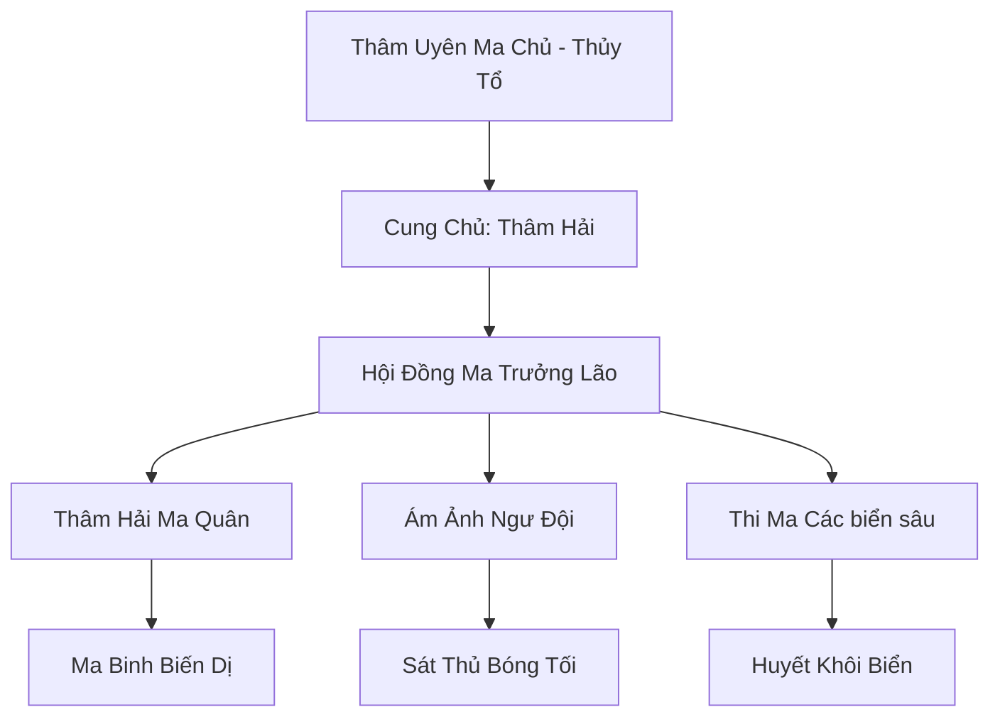

# VỰC THẲM MA CUNG (深渊魔宫)

## I. Tổng Quan (总览)
Vực Thẳm Ma Cung là thế lực ma đạo đáng sợ nhất dưới lòng đại dương, ngự trị tại rãnh biển sâu nhất Vô Tận Hải - nơi ánh sáng mặt trời vĩnh viễn không thể chạm tới. Cư dân của ma cung là những sinh vật biển bị đột biến bởi ma khí và những ma tu chọn con đường tu luyện dựa trên áp suất nước và bóng tối tuyệt đối. Đây là một pháo đài tự nhiên không thể xâm phạm, nơi mọi quy luật của mặt đất đều trở nên vô nghĩa.

## II. Địa Lý & Tài Nguyên (地理 với tài nguyên)
Tọa lạc tại đáy Rãnh Mariana, trung tâm là một tòa thành đen ngòm xây dựng từ đá núi lửa và xương cốt yêu quái biển. Ma cung nắm giữ "Hắc Ma Tuyền biển sâu" - mạch ma khí thủy hệ mạnh nhất thế giới, cùng với các loại khoáng thạch chịu áp suất cực cao dùng để chế tạo giáp trụ và vũ khí ma đạo.

## III. Văn Hóa & Tín Ngưỡng (文化 với信仰)
Tôn thờ Thâm Uyên Ma Chủ và sức mạnh của bóng tối vĩnh cửu. Họ tin rằng đại dương cuối cùng sẽ nuốt chửng mọi lục địa và bóng tối là trạng thái nguyên thủy của vũ trụ. Văn hóa ma cung cực kỳ tàn bạo, kẻ yếu sẽ bị ép trở thành thức ăn cho các quái vật biển hoặc vật thí nghiệm cho các loại ma độc biển sâu.

## IV. Cơ Cấu Tổ Chức (组织结构)


## V. Công Pháp & Trận Pháp (功法 với阵法)
- **Công Pháp:** *Thâm Uyên Áp Sát Quyết* (Sử dụng áp lực nước để nghiền nát linh lực đối phương), *Hắc Ám Thủy Ma Pháp*.
- **Trận Pháp:** *Áp Suất Diệt Tuyệt Trận* - trận pháp phòng thủ bao quanh cung điện, tăng áp suất nước lên hàng vạn lần khiến bất kỳ kẻ xâm nhập nào cũng bị ép thành bã thịt ngay lập tức.

## VI. Đặc Sản Môn Phái (门派特产)
- **Ma Nhãn Hắc Ám:** Loại pháp bảo giúp tu sĩ nhìn thấu mọi vật trong bóng tối tuyệt đối và có khả năng phát ra tia sáng ăn mòn thần thức.
- **Thâm Hải Ma Độc:** Chất độc chiết xuất từ cá quỷ biển sâu, không màu không mùi, cực khó phát hiện trong môi trường nước.

## VII. Cơ Sở Hạ Tầng (基础设施)
- **Hắc Diệu Thạch Điện:** Cung điện trung tâm cứng cáp hơn cả kim cương, có khả năng chịu đựng sức ép của toàn bộ đại dương.
- **Bể Nuôi Cấy Đột Biến:** Nơi lai tạo ra các loài quái vật biển phục vụ chiến tranh.

## VIII. Kinh Tế (経済)
Kinh tế dựa trên việc cướp bóc các đoàn thuyền và tu sĩ hành tẩu trên biển. Họ cũng độc quyền cung cấp các loại ma tinh thạch chỉ có ở vùng biển cực sâu cho các thế lực ma đạo trên đất liền thông qua mạng lưới giao thương ngầm.

## IX. Lịch Sử Tóm Tắt (简史)
Sáng lập từ thời kỷ nguyên Thái Cổ bởi một vị Ma Chủ bị Long Tộc và Nhân Tộc liên thủ đánh đuổi xuống biển sâu. Hắn đã lợi dụng môi trường khắc nghiệt của rãnh biển để hồi phục và xây dựng nên một đế chế bóng tối, âm thầm chờ đợi ngày quay lại mặt đất để trả thù.

## X. Giai Thoại & Bí Mật (轶 sự với bí mật)
Đồn rằng Thâm Uyên Ma Chủ chưa bao giờ thực sự chết, mà hắn đã hóa thân thành chính rãnh biển Mariana, và mỗi đợt sóng thần trên thế giới đều là một lần hắn trở mình.

## XI. Quan Hệ Thế Lực (势力关系)
```mermaid
graph LR
    VTMC[Vực Thẳm Ma Cung] -- Tử địch -- LC[Long Cung]
    VTMC -- Liên minh -- CUMT[Cửu U Ma Tông]
    VTMC -- Thao túng -- HYMC[Hải Yêu Mê Cung]
    VTMC -- Đối địch -- HTC[Hải Thần Cung]
```
