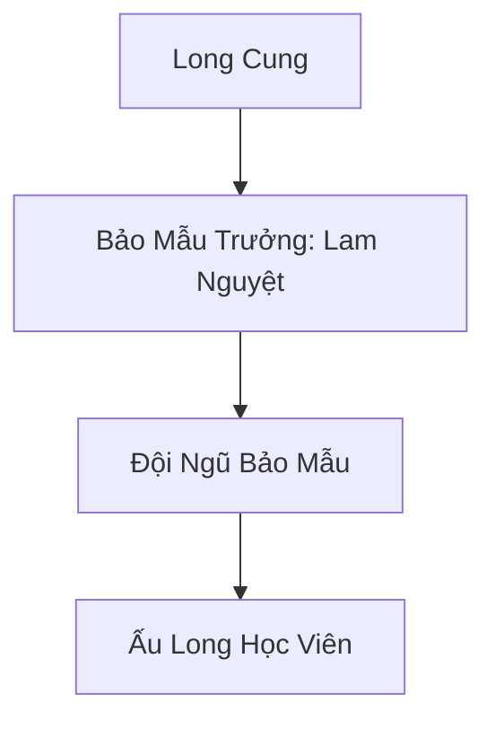
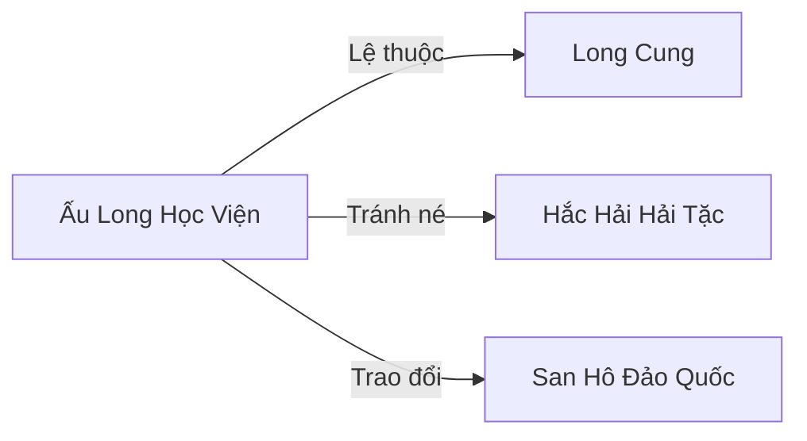

# ẤU LONG HỌC VIỆN (幼龙学院)

> *"Nuôi một con rồng đã khó, nuôi mười lăm con rồng nghịch ngợm cùng lúc — đó không phải công việc, đó là hình phạt."*
> — Lam Nguyệt, Bảo Mẫu Trưởng, trong lần báo cáo thường niên gửi Long Cung
> *"Rồng lớn quên mình từng bé — nhưng bảo mẫu thì nhớ, vì vết bỏng không bao giờ mờ."*
> — Lam Nguyệt, viết trong nhật ký cá nhân sau khi một ấu long đốt cháy phòng ngủ của bà

## I. Tổng Quan (总览)

Ấu Long Học Viện là cơ sở đào tạo đặc biệt do Long Cung thiết lập nhằm nuôi dưỡng và giáo dục các hậu duệ rồng con chưa đủ tuổi trưởng thành. Tọa lạc tại Đảo Vân Vụ xa xôi, học viện đóng vai trò là "nhà trẻ" cho những sinh vật mang huyết thống thần long đầy nghịch ngợm và khó bảo. Với chỉ hai mươi mốt thành viên — gồm Bảo Mẫu Trưởng Lam Nguyệt, năm giáo sư bảo mẫu và mười lăm ấu long học viên — đây là một trong những thế lực nhỏ nhất thuộc hệ thống Long Cung, nhưng lại mang trọng trách lớn lao: mỗi ấu long đều là hậu duệ quý báu của các dòng Chân Long, và bất kỳ sơ suất nào trong quá trình nuôi dạy đều có thể dẫn đến hậu quả nghiêm trọng — cả về mặt sinh tồn lẫn chính trị.

## II. Địa Lý & Tài Nguyên (地理 与 资源)

Học viện nằm trên Đảo Vân Vụ, một hòn đảo nhỏ biệt lập phía đông Vô Tận Hải, cách Long Cung khoảng ba ngày đường bơi đối với Hải Long Mã. Toàn đảo được bao phủ bởi sương mù ma thuật dày đặc do Vân Vụ Che Giấu Trận tạo ra, che giấu các vết tích phá hoại do rồng con gây ra trong quá trình tập luyện — những hố cháy đen, vách đá bị phá, và cây cổ thụ bị đốn ngã bởi "tai nạn luyện hơi thở." Đảo có diện tích khoảng mười dặm vuông, chia thành ba khu vực chính: Bắc Nham Đài — vùng đá chịu nhiệt dùng cho tập phun lửa; Thanh Phong Cốc — thung lũng gió nơi luyện bay; và Ngọc Thạch Loan — hồ nước ngọt ấm áp nơi ấu long tắm rửa và nghỉ ngơi. Tài nguyên chủ yếu do Long Cung cung cấp, bao gồm linh cá tươi, khoáng thạch bổ sung huyết mạch cho tộc rồng, và linh thạch trung phẩm để duy trì trận pháp. Đảo tự thân sản sinh một số dược thảo chịu nhiệt mọc ở vùng đất bị long hỏa nung nấu, đặc biệt là Long Tiết Thảo quý hiếm — cỏ này chỉ mọc nơi đất đã bị rồng phun lửa ít nhất ba lần, khiến Bắc Nham Đài trở thành vườn dược thảo tự nhiên độc nhất vô nhị.

## III. Văn Hóa & Tín Ngưỡng (文化 与 信仰)
> *"Tam Quy: Không phun lửa trong hang ngủ, không cắn bảo mẫu, không bay ra ngoài trận pháp. Quy thứ tư (bổ sung): Không bay khi bảo mẫu đang ngủ."*
> — Khắc trên tảng đá trước cửa Hang Thạch Long, bằng hơi thở lửa của chính kẻ vi phạm

Đề cao sự kiên nhẫn và kỷ luật cơ bản — hai đức tính mà rồng con thiếu trầm trọng và bảo mẫu buộc phải có thừa. Văn hóa tại đây là sự kết hợp kỳ lạ giữa sự hồn nhiên phá phách của rồng con và sự kiệt quệ triền miên của các bảo mẫu. Tín ngưỡng duy nhất là sự tôn thờ uy nghiêm của Long Tộc, hướng tới ngày được chính thức gia nhập hàng ngũ chiến binh Long Cung. Lam Nguyệt đặt ra "Tam Quy" — ba quy tắc nền tảng mà mọi ấu long phải thuộc lòng: "Không phun lửa trong hang ngủ, không cắn bảo mẫu, không bay ra ngoài trận pháp." Khẩu hiệu này được khắc trên tảng đá lớn nhất trước cửa Hang Thạch Long, mỗi vết chữ cháy sém do chính một ấu long bất chấp quy tắc đầu tiên mà "khắc" bằng hơi thở lửa. Mỗi năm vào ngày Long Đản Tiết, toàn bộ học viện tổ chức "Hội Thi Ấu Long" — một buổi lễ nhỏ nơi ấu long trình diễn kỹ năng trước sứ giả Long Cung, và kết quả quyết định phân bổ ngân sách cho năm tiếp theo. Lam Nguyệt thường dạy: "Rồng con nghịch ngợm hôm nay sẽ là thần long uy nghi ngày mai — nếu bảo mẫu sống đủ lâu để thấy ngày đó."

## IV. Cơ Cấu Tổ Chức (组织结构)

Cơ cấu tổ chức đơn giản nhưng rõ ràng. Lam Nguyệt giữ chức Bảo Mẫu Trưởng kiêm Viện Trưởng, chịu trách nhiệm toàn bộ hoạt động và báo cáo trực tiếp cho Trưởng Lão Hội Long Cung. Năm giáo sư bảo mẫu — toàn bộ là Giao Long tu vi Trúc Cơ — chia nhau trông coi mười lăm ấu long, mỗi người phụ trách ba con. Công việc hàng ngày bao gồm: cho ăn (sáu bữa linh cá mỗi ngày), dọn dẹp tàn tích phá hoại, dạy kiểm soát hơi thở, và giữ ấu long không giết nhau trong các trận đùa nghịch mất kiểm soát. Mỗi bảo mẫu trung bình bị bỏng bảy lần mỗi tháng — đây được coi là "tổn thất nghề nghiệp bình thường." Lam Nguyệt duy trì "Sổ Bỏng" ghi chép chi tiết từng lần bảo mẫu bị thương, lý do và biện pháp phòng tránh — cuốn sổ này sau ba trăm năm đã dày hơn cả bộ kinh thư Long Tộc.

## V. Công Pháp & Trận Pháp (功法 与 阵法)

- **Công Pháp:** Chương trình giảng dạy tập trung vào ba kỹ năng cốt lõi. *Long Tức Kiểm Soát Thuật* — dạy rồng con kiểm soát hơi thở nguyên tố (Lửa, Băng, Điện) để không vô tình thiêu rụi mọi thứ xung quanh khi hắt xì. *Sơ Cấp Vân Tường Thuật* — kỹ năng bay cơ bản gồm cất cánh, hạ cánh và không đâm đầu vào vách đá. *Long Giáp Cố Hóa Công* — bài tập tăng cường độ cứng vảy rồng non, do bảo mẫu hướng dẫn ấu long tự va đập có kiểm soát.
- **Trận Pháp:** *Vân Vụ Che Giấu Trận* — trận pháp cấp cao do Long Cung đặt ra từ khi thành lập học viện, dùng để ẩn toàn bộ hòn đảo khỏi tầm mắt của thợ săn rồng, lữ khách, và đặc biệt là Hắc Hải Hải Tặc. Trận pháp tạo ra lớp sương mù dày đặc bán kính năm dặm, bẻ cong ánh sáng và nhiễu loạn thần thức, khiến người ngoài chỉ thấy mặt biển trống trải. Chi phí duy trì trận pháp ngốn hơn nửa ngân sách hàng năm của học viện — Lam Nguyệt từng than rằng "tiền nuôi trận pháp còn nhiều hơn tiền nuôi rồng."

## VI. Đặc Sản Môn Phái (门派特产)

- **Long Tiết Thảo:** Loại cỏ quý mọc ở nơi rồng con thường xuyên tập phun lửa, đất bị long hỏa nung nấu tạo ra điều kiện đặc biệt cho thảo dược này phát triển. Long Tiết Thảo thấm đẫm long khí nguyên tố, có tác dụng cường hóa gân cốt và khơi thông kinh mạch hỏa hệ. Mỗi năm thu hoạch được khoảng mười cân, là nguồn thu phụ quý giá. Dược sư trên đất liền gọi đây là "Hỏa Long Chi Lệ" vì hình dáng giọt sương trên lá trông như giọt nước mắt óng ánh lửa.
- **Vảy Rồng Rụng:** Ấu long thay vảy hai lần mỗi năm, để lại vảy non óng ánh ngũ sắc. Đây là nguyên liệu quý hiếm trong luyện khí, có thể dùng chế tạo giáp phòng hộ cấp thấp hoặc pha trộn vào linh mực để vẽ phù lục đặc biệt. Bảo mẫu cẩn thận thu gom từng chiếc vảy, một phần nộp Long Cung, phần còn lại Lam Nguyệt bán để bù đắp ngân sách thâm hụt.
- **Ấu Long Diên:** Nước bọt rồng con khi ăn linh cá, tình cờ rơi vào nước hồ Ngọc Thạch Loan, qua thời gian ngưng tụ thành thứ dịch trong suốt có tác dụng dưỡng nhan và trẻ hóa da. Lam Nguyệt phát hiện ra hoàn toàn tình cờ khi rửa mặt bằng nước hồ, và giờ bà trông trẻ hơn tuổi thật hàng trăm năm — bí mật mà bà giấu kỹ nhất.

## VII. Cơ Sở Hạ Tầng (基础设施)

- **Đình Long Hô:** Sân tập luyện chính rộng hai mẫu, lát đá Huyền Vũ chịu nhiệt, nơi rồng con tập phun lửa, phun băng và thi triển thần thông. Bề mặt đá phải thay mới mỗi ba năm do hư hỏng nặng — chi phí thay đá là khoản chi lớn thứ hai sau duy trì trận pháp.
- **Hang Thạch Long:** Khu vực ngủ nghỉ chung nằm trong lòng núi đá, gồm mười lăm ngách riêng được lót bằng Ôn Thạch — đá tự phát nhiệt giữ ấm cho ấu long. Tường hang khắc đầy vết cào của rồng con qua nhiều thế hệ, Lam Nguyệt gọi đây là "bức bích họa nghịch ngợm vĩ đại nhất Long Tộc."
- **Bắc Nham Đài:** Khu vực đá chịu nhiệt phía bắc đảo, chuyên dùng cho bài tập phun lửa cường độ cao — nơi nguy hiểm nhất đảo, bảo mẫu phải mặc giáp long lân khi giám sát.
- **Thanh Phong Cốc:** Thung lũng hẹp giữa hai vách đá, gió biển thổi ổn định, lý tưởng cho bài tập bay. Bảo mẫu căng lưới tảo linh ở hai đầu cốc để bắt ấu long rơi.
- **Kho Linh Cá:** Hầm lạnh dưới lòng đất chứa thực phẩm cho ấu long, dung lượng đủ cho ba tháng, nhưng thường xuyên bị ấu long lén vào ăn vụng — Lam Nguyệt đã thay ổ khóa mười bảy lần trong năm qua mà vẫn không giữ nổi.

## VIII. Kinh Tế (经济)
> *"Long Cung có tiền đúc giáp bạc cho chiến binh nhưng không có tiền mua thuốc bỏng cho bảo mẫu — rồng trưởng thành quên rằng chúng từng là rồng con."*
> — Lam Nguyệt, ghi trong nhật ký

Nguồn kinh tế hoàn toàn phụ thuộc vào ngân sách từ Long Cung, được cấp phát hàng năm dựa trên kết quả Hội Thi Ấu Long và báo cáo của Lam Nguyệt. Tuy nhiên, do thường xuyên xảy ra hỏa hoạn, phá hoại cơ sở vật chất, và chi phí duy trì Vân Vụ Che Giấu Trận quá lớn, ngân sách luôn trong tình trạng thâm hụt trầm trọng — năm ngoái thiếu hụt ba mươi phần trăm. Lam Nguyệt đôi khi phải bán các vảy rồng rụng và Long Tiết Thảo qua kênh trung gian tại San Hô Đảo Quốc để bù đắp chi phí sinh hoạt, đặc biệt là tiền thuốc bỏng cho bảo mẫu. Bà từng ba lần đệ đơn xin tăng ngân sách lên Trưởng Lão Hội, cả ba lần đều bị từ chối với lý do "Long Cung có ưu tiên chiến lược khác." Lam Nguyệt ghi vào nhật ký: "Long Cung có tiền đúc giáp bạc cho chiến binh nhưng không có tiền mua thuốc bỏng cho bảo mẫu — rồng trưởng thành quên rằng chúng từng là rồng con."

## IX. Lịch Sử Tóm Tắt (简史)

Được thành lập vào thời Thượng Cổ Kỷ Nguyên khi các Trưởng lão Long Cung không còn đủ kiên nhẫn để đối phó với bầy rồng con nghịch ngợm trong hoàng cung — sau sự kiện một ấu long vô tình phun lửa thiêu rụi Thư Viện Long Cung cánh tây, Trưởng Lão Hội quyết định xây dựng cơ sở nuôi dạy riêng biệt. Lam Nguyệt bị cử đi làm Bảo Mẫu Trưởng cách đây ba trăm năm, thực chất là một hình thức lưu đày do tư chất tu luyện kém — Giao Long huyết mạch trung bình, tu vi Trúc Cơ Viên Mãn nhưng không có triển vọng đột phá Kim Đan. Tuy nhiên, bà đã biến nơi lưu đày thành tổ ấm thực sự cho bầy rồng nhỏ, kiên nhẫn nuôi dạy hơn hai trăm ấu long qua nhiều thế hệ, trong đó có bảy con sau này trở thành Chân Long chiến binh ưu tú của Long Cung. Dù công lao lớn, Lam Nguyệt chưa bao giờ được Long Cung chính thức ghi nhận hay thăng chức — bà đùa rằng "công lao nuôi rồng không bằng công lao giết địch, vì không ai muốn nhớ mình từng bé bỏng và nghịch ngợm."

## X. Giai Thoại & Bí Mật (轶事 与 秘密)

Tương truyền một trong số các học viên hiện tại — ấu long tên gọi "Tiểu Lam" mà Lam Nguyệt đặc biệt yêu quý — là con riêng của một vị Long Vương, mang trong mình sức mạnh tiềm ẩn có thể làm rung chuyển đại dương nếu thức tỉnh sớm. Long Cung gửi Tiểu Lam đến đây không phải để giáo dục mà để giấu đi, tránh trở thành mục tiêu trong cuộc tranh đoạt ngôi vị Long Vương. Lam Nguyệt không biết thân phận thực sự của Tiểu Lam, chỉ nhận thấy nó phát triển nhanh bất thường và hơi thở mạnh gấp ba lần ấu long cùng tuổi. Ngoài ra, dưới đáy hồ Ngọc Thạch Loan có một lối đi bí mật dẫn đến phế tích biển sâu — nơi Lam Nguyệt thỉnh thoảng lén xuống thu thập linh thạch từ tàn tích cổ đại, nguồn thu bí mật giúp bà duy trì học viện khi ngân sách cạn kiệt. Bí mật lớn nhất: Lam Nguyệt đã phát triển một phương pháp dạy ấu long kiểm soát hơi thở hiệu quả hơn hẳn chương trình chính thức của Long Cung, nhưng bà giấu kín vì sợ bị Trưởng Lão Hội coi là "tiếm quyền giáo dục."

## XI. Quan Hệ Thế Lực (势力关系)

Ấu Long Học Viện tồn tại hoàn toàn trong hệ thống quyền lực của Long Cung, phụ thuộc về mọi mặt từ ngân sách đến nhân sự và học viên. Long Cung cung cấp kinh phí nhưng đồng thời kiểm soát chặt chẽ — mỗi năm cử sứ giả đến kiểm tra và đánh giá, kết quả ảnh hưởng trực tiếp đến ngân sách năm sau. Lam Nguyệt duy trì mối quan hệ thận trọng nhưng ấm áp với San Hô Đảo Quốc, nơi bà trao đổi vảy rồng và thảo dược lấy vật tư thiết yếu mà Long Cung không cung cấp đủ — bà thường nói đùa rằng "San Hô Đảo Quốc là bà ngoại nuôi của bầy rồng con." Hắc Hải Hải Tặc là mối đe dọa thường trực — nếu phát hiện ra đảo ẩn giấu rồng con, giá trị của mười lăm ấu long trên thị trường chợ đen đủ để bất kỳ nhóm hải tặc nào liều mạng tấn công. Hải Long Mã Đoàn thỉnh thoảng cung cấp ngựa biển cho học viện dùng trong huấn luyện di chuyển, là dịp hiếm hoi mà hai thế lực "tầng đáy" của Long Cung tìm được sự đồng cảm.

Một giai thoại nổi tiếng trong học viện: ấu long tên "Tiểu Hỏa" từng lén bay ra ngoài trận pháp và suýt bị thuyền buôn phát hiện. Lam Nguyệt phải đích thân bay ra biển giữa đêm bão, dùng hết linh lực để dẫn Tiểu Hỏa quay về mà không để lộ vị trí đảo. Sau sự kiện đó, bà thêm quy tắc thứ tư vào Tam Quy: "Không bay khi bảo mẫu đang ngủ" — nhưng ấu long vẫn vi phạm ít nhất ba lần mỗi tháng.

