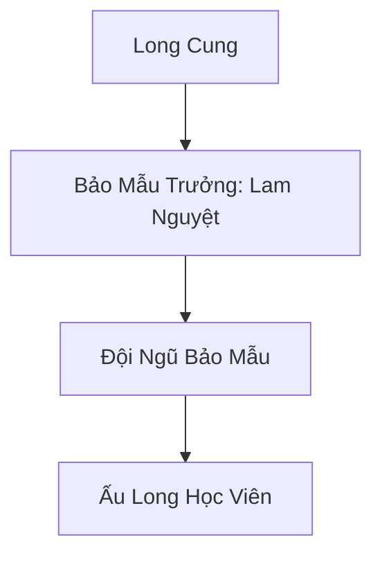
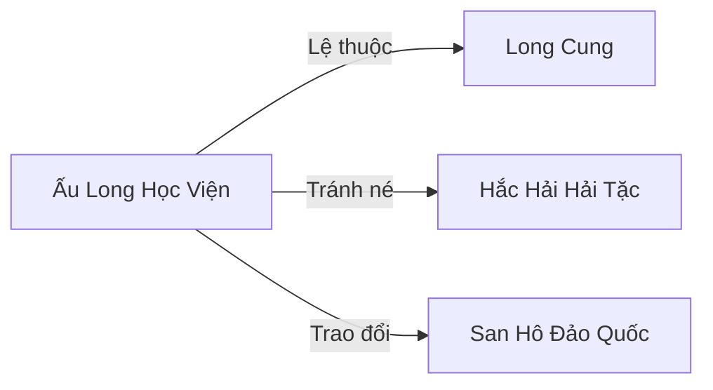

# ẤU LONG HỌC VIỆN (幼龙学院)

## I. Tổng Quan (总览)
Ấu Long Học Viện là cơ sở đào tạo đặc biệt do Long Cung thiết lập nhằm nuôi dưỡng và giáo dục các hậu duệ rồng con chưa đủ tuổi trưởng thành. Tọa lạc tại Đảo Vân Vụ xa xôi, học viện đóng vai trò là "nhà trẻ" cho những sinh vật mang huyết thống thần long đầy nghịch ngợm và khó bảo.

## II. Địa Lý & Tài Nguyên (地理与 tài nguyên)
Học viện nằm trên Đảo Vân Vụ, một hòn đảo nhỏ biệt lập phía Đông Vô Tận Hải. Toàn đảo được bao phủ bởi sương mù ma thuật dày đặc, che giấu các vết tích phá hoại do rồng con gây ra trong quá trình tập luyện. Tài nguyên chủ yếu do Long Cung cung cấp, bao gồm linh cá và các loại khoáng thạch bổ sung huyết mạch cho tộc rồng.

## III. Văn Hóa & Tín Ngưỡng (文化与信仰)
Đề cao sự kiên nhẫn và kỷ luật cơ bản. Văn hóa tại đây là sự kết hợp giữa sự hồn nhiên của rồng con và sự kiệt quệ của các bảo mẫu. Tín ngưỡng duy nhất là sự tôn thờ uy nghiêm của Long Tộc, hướng tới ngày được chính thức gia nhập hàng ngũ chiến binh Long Cung.

## IV. Cơ Cấu Tổ Chức (组织结构)

## V. Công Pháp & Trận Pháp (功法 với阵法)
- **Công Pháp:** Dạy rồng con kiểm soát hơi thở (Lửa, Băng, Điện) và các kỹ năng bay cơ bản.
- **Trận Pháp:** *Vân Vụ Che Giấu Trận* - trận pháp cấp cao dùng để ẩn匿 toàn bộ hòn đảo khỏi tầm mắt của các thợ săn rồng và lữ khách.

## VI. Đặc Sản Môn Phái (门派特产)
- **Long Tiết Thảo:** Loại cỏ mọc ở nơi rồng con thường xuyên tập luyện, thấm đẫm long khí, có tác dụng cường hóa gân cốt.
- **Vảy Rồng Rụng:** Nguyên liệu quý hiếm thường được bảo mẫu thu gom để trao đổi vật tư.

## VII. Cơ Sở Hạ Tầng (基础设施)
- **Đình Long Hô:** Nơi rồng con tập phun lửa và thi triển thần thông.
- **Hang Thạch Long:** Khu vực ngủ nghỉ chung được lót bằng các loại đá ấm áp.

## VIII. Kinh Tế (经济)
Nguồn kinh tế hoàn toàn phụ thuộc vào ngân sách từ Long Cung. Tuy nhiên, do thường xuyên xảy ra hỏa hoạn và phá hoại, ngân sách luôn trong tình trạng thâm hụt. Lam Nguyệt đôi khi phải bán các vảy rồng rụng để bù đắp chi phí sinh hoạt.

## IX. Lịch Sử Tóm Tắt (简史)
Được thành lập khi các Trưởng lão Long Cung không còn đủ kiên nhẫn để đối phó với bầy rồng con nghịch ngợm trong hoàng cung. Lam Nguyệt bị cử đi làm Bảo mẫu trưởng như một hình thức lưu đày do tư chất tu luyện kém, nhưng bà đã biến nơi này thành một tổ ấm thực sự cho bầy rồng nhỏ.

## X. Giai Thoại & Bí Mật (轶 sự với bí mật)
Tương truyền một trong số các học viên là con riêng của một vị Long Vương, mang trong mình sức mạnh tiềm ẩn có thể làm rung chuyển đại dương nếu thức tỉnh sớm.

## XI. Quan Hệ Thế Lực (势力关系)

