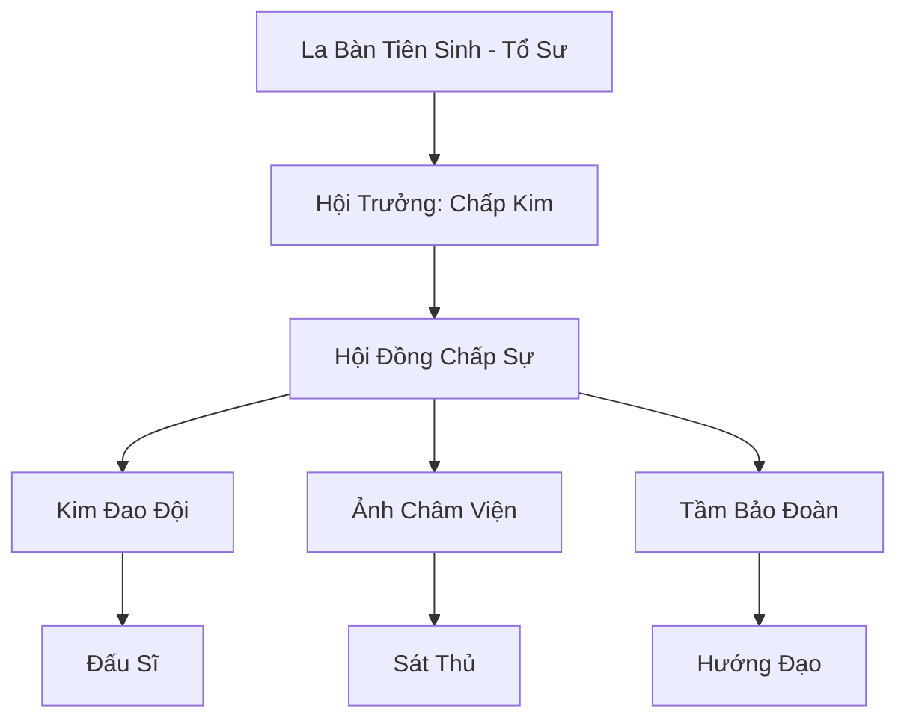

# VẠN TƯỢNG LA BÀN (万象罗盘)

## I. Tổng Quan (总览)
Vạn Tượng La Bàn là hiệp hội sát thủ và lính đánh thuê hoạt động công khai lớn nhất lục địa. Khác với những tổ chức ám sát ẩn mình trong bóng tối, Vạn Tượng La Bàn xây dựng uy tín dựa trên sự chuyên nghiệp, minh bạch về giá cả và tỷ lệ hoàn thành nhiệm vụ tuyệt đối. Họ coi sinh mạng và nhiệm vụ là những con số trên chiếc la bàn, chỉ cần kim chỉ hướng là mục tiêu phải diệt vong.

## II. Địa Lý & Tài Nguyên (地理 với tài nguyên)
Trụ sở chính đặt tại Vạn Tượng Thành, một thành phố trung lập sầm uất tại Đông Hoang, nơi giao thoa của nhiều luồng thông tin. Hiệp hội nắm giữ "Thiên Nhãn La Bàn" - một hệ thống pháp bảo định vị cổ đại có khả năng kết nối với mạng lưới linh mạch toàn cầu, cho phép họ truy vết mục tiêu ở bất kỳ đâu trên thế giới.

## III. Văn Hóa & Tín Ngưỡng (文化 với信仰)
Đề cao triết lý "Trọng Tín Như Sơn, Sát Phạt Quyết Đoán". Thành viên hiệp hội không bị ràng buộc bởi đạo đức chính tà mà chỉ tuân theo các điều khoản của hợp đồng. Văn hóa của họ tôn trọng năng lực cá nhân và sự chính xác tuyệt đối trong mọi hành động. Mỗi sát thủ đều sở hữu một chiếc la bàn định mệnh ghi lại lịch sử các nhiệm vụ đã thực hiện.

## IV. Cơ Cấu Tổ Chức (组织结构)


## V. Công Pháp & Trận Pháp (功法 với阵法)
- **Công Pháp:** *Vạn Tượng Định Vị Pháp* (Truy tìm dấu vết), *La Bàn Kiếm Chỉ* (Tấn công điểm yếu).
- **Trận Pháp:** *Tầm Tung Vạn Lý Trận* - trận pháp thu thập khí tức diện rộng, cho phép xác định vị trí của đối tượng thông qua một mảnh vụn áo hoặc một giọt máu còn sót lại.

## VI. Đặc Sản Môn Phái (门派特产)
- **La Bàn Truy Hồn:** Pháp khí định vị cá nhân, có khả năng báo động khi có kẻ thù áp sát.
- **Phi Trâm Tầm Nhiệt:** Loại ám khí tự động tìm đến mục tiêu dựa trên nhiệt lượng và linh lực tỏa ra.

## VII. Cơ Sở Hạ Tầng (基础设施)
- **Vạn Tượng Đài:** Tháp trung tâm dùng để thu phát tín hiệu từ Thiên Nhãn La Bàn.
- **Sàn Giao Dịch Nhiệm Vụ:** Nơi niêm yết các hợp đồng và định giá các món hàng/sinh mạng.

## VIII. Kinh Tế (経済)
Nguồn thu ổn định từ phí dịch vụ ám sát, bảo vệ và môi giới nhiệm vụ. Họ cũng thu lợi nhuận từ việc bán các bản đồ linh mạch cập nhật và các thiết bị định vị chuyên dụng cho các nhà thám hiểm di tích.

## IX. Lịch Sử Tóm Tắt (简史)
Sáng lập bởi La Bàn Tiên Sinh vào thời kỷ nguyên Trung Cổ. Vốn là một thầy bói thiên tài, ông nhận ra rằng kỹ năng định vị có thể biến thành một vũ khí kinh tế và quân sự mạnh mẽ. Vạn Tượng La Bàn từ một nhóm trinh sát đánh thuê đã nhanh chóng phát triển thành một tổ chức có tầm ảnh hưởng toàn lục địa.

## X. Giai Thoại & Bí Mật (轶 sự với bí mật)
Có lời đồn rằng Hội trưởng Chấp Kim sở hữu một chiếc "La Bàn Thời Gian", có thể nhìn thấy một vài giây trước của tương lai, giúp ông luôn chiến thắng trong mọi cuộc đối đầu.

## XI. Quan Hệ Thế Lực (势力关系)
```mermaid
graph LR
    VTLB[Vạn Tượng La Bàn] -- Cạnh tranh -- ANU[Ảnh Nguyệt Uyển]
    VTLB -- Đối tác -- TSTH[Thiên Sa Thương Hội]
    VTLB -- Cung cấp dịch vụ -- BBC[Bách Bảo Các]
    VTLB -- Trung lập -- DCHH[Đại Càn Hoàng Triều]
```
