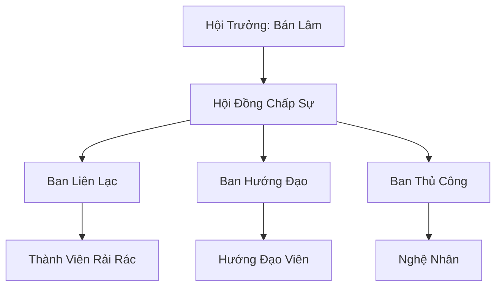

# BÁN TINH LINH HỘI (半精灵会)

> *"Giọt mực bẩn, họ gọi ta thế. Nhưng giọt mực ấy viết nên câu chuyện mà không suối trong nào kể nổi."*
> — Khuyết danh, câu nói lưu truyền giữa các bán tinh linh

## I. Tổng Quan (总览)
Bán Tinh Linh Hội là một tổ chức tương trợ dành cho những cá thể mang hai dòng máu Tinh Linh và Nhân Tộc. Sống trong một thế giới nơi sự thuần huyết được coi trọng, các bán tinh linh thường phải đối mặt với sự ghẻ lạnh và xua đuổi từ cả hai phía — Tinh Linh Vương Đình coi họ là "giọt mực bẩn trong dòng suối trong", còn nhân tộc lại nghi kỵ đôi tai nhọn và tuổi thọ dài bất thường của họ. Hội ra đời như một mái nhà chung, nơi họ có thể khẳng định bản sắc riêng và bảo vệ quyền lợi của những kẻ *"đứng giữa hai thế giới, không thuộc về nơi nào"*. Bán Lâm thường nói với các thành viên: *"Nửa này nửa kia, nhưng cả hai đều là ta — ai bảo ta không trọn vẹn?"* Bốn mươi hai thành viên rải rác khắp lục địa, nhưng trái tim họ luôn hướng về căn nhà gỗ nhỏ bên bìa rừng Vĩnh Hằng.

## II. Địa Lý & Tài Nguyên (地理 với tài nguyên)
Trụ sở chính là "Bán Nguyệt Trang" — một cụm bảy căn nhà gỗ đơn sơ nằm ẩn mình tại bìa rừng phía nam Vĩnh Hằng Sâm Lâm, được xây bằng gỗ "Nguyệt Quế" lấy từ rìa rừng. Đây là vùng đệm giữa lãnh thổ của Vương Đình và các thành bang nhân tộc, nơi cả hai bên đều không mặn mà quản lý — điều kiện lý tưởng cho những kẻ bị cả hai xã hội ruồng bỏ. Tài nguyên của hội rất hạn chế, chủ yếu dựa vào việc thu hái linh quả tự nhiên như "Bán Nguyệt Quả" và "Sương Lâm Quả" cùng các loại vật liệu thủ công từ rừng thưa — gỗ Nguyệt Quế, nhựa cây "Linh Tùng", và lá "Bạch Diệp" dùng để chế tác bướm giấy liên lạc.

## III. Văn Hóa & Tín Ngưỡng (文化 với信仰)
Đề cao triết lý: *"Nửa này nửa kia, nhưng vẫn là một con người hoàn chỉnh."* Thành viên hội tin rằng sự kết hợp huyết mạch là một món quà thay vì một lời nguyền — họ có đôi tai nhọn cảm nhận được gió rừng, đôi mắt nhìn xuyên bóng tối, nhưng cũng có trái tim nồng nhiệt và sự thực dụng của nhân tộc. Văn hóa hội mang đậm tính hòa hợp, kết hợp sự tinh tế của tinh linh trong nghệ thuật với tính thực dụng của con người trong đời sống. Buổi họp mặt hàng năm "Hội Bán Nguyệt" diễn ra vào đêm trăng nửa vầng, khi các thành viên từ khắp nơi trở về Bán Nguyệt Trang để chia sẻ câu chuyện, trao đổi kinh nghiệm, và cùng nhau hát bài "Bán Nguyệt Ca" — *"Trăng tròn đẹp thật, nhưng trăng nửa vầng cũng soi sáng đường."* Nghi thức kết nạp mới đặc biệt cảm động: mỗi thành viên mới được tặng một chiếc vòng tay đan từ cỏ rừng và dây da, tượng trưng cho hai nửa huyết mạch quấn quýt.

## IV. Cơ Cấu Tổ Chức (组织结构)


## V. Công Pháp & Trận Pháp (功法 với阵法)
- **Công Pháp:** Chưa có hệ thống công pháp riêng biệt. Thành viên thường tự biến tấu các bài tu luyện cơ bản để phù hợp với thể chất lai — kết hợp khả năng cảm nhận linh khí rừng rậm bẩm sinh của huyết mạch tinh linh với các kỹ thuật vận khí thô sơ của nhân tộc. Bán Lâm đang nghiên cứu "Song Nguyên Quyết" — bài công pháp kết hợp cùng lúc mộc linh khí (tinh linh) và kim linh khí (nhân tộc), nhưng tiến trình rất chậm do thiếu tài liệu tham khảo.
- **Trận Pháp:** Sử dụng các loại bẫy dây leo tự nhiên kết hợp "Điệp Trận" — trận pháp báo động bằng bướm giấy linh lực đơn giản. Khi kẻ xâm nhập bước vào phạm vi bảo vệ, các bướm giấy sẽ bay về Bán Nguyệt Trang phát ra tiếng kêu nhỏ, cho Bán Lâm biết hướng và khoảng cách của mối đe dọa.

## VI. Đặc Sản Môn Phái (门派特产)
- **Trang Sức Gỗ Linh "Nguyệt Quế Sức":** Các món đồ thủ công tinh xảo kết hợp giữa kỹ thuật điêu khắc nhân tộc và cảm quan thẩm mỹ tinh linh, chế tác từ gỗ Nguyệt Quế pha nhựa Linh Tùng. Mỗi món đều mang theo một luồng mộc linh khí nhẹ nhàng, có tác dụng ổn định tâm thần — rất được giới quý tộc nhân tộc ưa chuộng, giá từ mười đến năm mươi linh thạch hạ phẩm.
- **Bản Đồ Bìa Rừng "Vĩnh Hằng Biên Đồ":** Các bản ghi chép chi tiết về các lối đi bí mật, khu vực nguy hiểm và vùng linh quả quanh Vĩnh Hằng Sâm Lâm — thông tin mà chỉ những người sống lâu năm ở bìa rừng mới nắm được.
- **Bướm Giấy Linh Lực "Điệp Tín":** Bướm giấy gấp từ lá Bạch Diệp yểm bùa đơn giản, có khả năng mang thông điệp ngắn bay đến người nhận trong phạm vi năm mươi dặm. Giá rẻ và tiện dụng, được các thương nhân và tán tu mua số lượng lớn.

## VII. Cơ Sở Hạ Tầng (基础设施)
- **Bán Nguyệt Trang:** Bảy căn nhà gỗ Nguyệt Quế bao quanh một sân chung trồng đầy hoa "Bán Nguyệt Hoa" — loài hoa chỉ nở nửa cánh, biểu tượng của hội. Căn nhà lớn nhất là "Hội Đường" — nơi sinh hoạt chung, họp mặt, và trưng bày các tác phẩm thủ công. Bên cạnh có "Điệp Phòng" — phòng nuôi dưỡng và chuẩn bị bướm giấy liên lạc.
- **Trạm Tin Bướm Giấy "Điệp Trạm":** Hệ thống năm trạm nhỏ rải rác dọc bìa rừng phía nam, mỗi trạm là một hộp gỗ nhỏ treo trên cành cây, dùng để thu phát các thông điệp ngắn. Các trạm được kiểm tra mỗi ba ngày bởi hướng đạo viên tuần tra.

## VIII. Kinh Tế (経済)
Kinh tế dựa trên ba trụ cột: dịch vụ dẫn đường cho các đoàn thám hiểm và thương nhân muốn tiếp cận bìa rừng Vĩnh Hằng — mỗi chuyến dẫn đường bảy ngày giá năm mươi linh thạch hạ phẩm; bán trang sức gỗ linh và bướm giấy liên lạc tại chợ Thiên Mộc Thành; và trao đổi thông tin tình báo về biến động khí hậu và yêu thú khu vực biên giới để đổi lấy nhu yếu phẩm tu luyện cơ bản. Thu nhập của hội đủ sống nhưng không dư — phần lớn lợi nhuận được dùng để hỗ trợ các thành viên gặp khó khăn ở những nơi xa xôi. Gần đây, nhu cầu mua Điệp Tín đang tăng mạnh, mang đến hy vọng cải thiện tài chính cho toàn hội.

## IX. Lịch Sử Tóm Tắt (简史)
Sáng lập 15 năm trước bởi Bán Lâm sau khi ông bị Tinh Linh Vương Đình trục xuất vì huyết thống không thuần khiết — cha ông là nhân tộc, mẹ là tinh linh cấp thấp bị kết tội "phản bội chủng tộc". Bắt đầu từ hai bàn tay trắng và một trái tim đầy cay đắng, ông đã lang thang khắp Đông Hoang, kết nối được những bán tinh linh đang lẩn lút khắp nơi — người nấp trong chợ nhân tộc, kẻ sống ở bìa rừng, vài người thậm chí giả dạng nhân tộc bằng cách giấu tai nhọn dưới mũ. Qua mười lăm năm, ông đã tập hợp bốn mươi hai thành viên và xây dựng Bán Nguyệt Trang — nơi đầu tiên trong lịch sử mà bán tinh linh có thể sống mà không cần che giấu bản thân.

## X. Giai Thoại & Bí Mật (轶 sự với bí mật)
Tương truyền Bán Lâm đang bí mật nghiên cứu một loại "Huyết Mạch Dung Hợp Thuật" — kỹ thuật cho phép bán tinh linh sử dụng được các công pháp tối cao của cả hai chủng tộc mà không bị phản phệ. Nghiên cứu dựa trên một cuộn thư cổ mà ông tìm được trong rễ cây Nguyệt Quế cổ thụ nghìn năm — cuộn thư viết bằng ngôn ngữ tinh linh cổ đại, ghi chép về một thời kỳ khi tinh linh và nhân tộc từng là một chủng tộc duy nhất. Ngoài ra, hệ thống bướm giấy liên lạc của hội thực tế đã phát triển thành một mạng lưới tình báo bìa rừng đáng kể — Bán Lâm nắm trong tay thông tin về mọi hoạt động ra vào Vĩnh Hằng Sâm Lâm mà cả Vương Đình lẫn các thành bang đều không ngờ tới.

## XI. Quan Hệ Thế Lực (势力关系)
```mermaid
graph LR
    BTLH[Bán Tinh Linh Hội] -- Bị xua đuổi -- TLVĐ[Tinh Linh Vương Đình]
    BTLH -- Liên kết ngầm -- HTLLĐ[Hắc Tinh Linh Lưu Đày]
    BTLH -- Dịch vụ -- TMT[Thiên Mộc Thành]
    BTLH -- Cảnh giác -- ALL[Mọi Thế Lực Lớn]
```

Tinh Linh Vương Đình là mối đe dọa lớn nhất và cũng là nỗi đau lớn nhất — nơi mà nhiều thành viên hội mang một nửa dòng máu nhưng bị coi là "tạp chủng" đáng khinh bỉ. Hắc Tinh Linh Lưu Đày chia sẻ cảnh ngộ tương tự và có liên kết ngầm, đôi bên trao đổi thông tin khi gặp khó khăn. Thiên Mộc Thành là khách hàng chính cho dịch vụ dẫn đường và trang sức, mối quan hệ thuần thương mại nhưng ổn định. Bán Lâm luôn nhắc nhở: tất cả thế lực lớn đều có thể trở thành kẻ thù nếu phát hiện mạng lưới tình báo bìa rừng — sự cảnh giác là giá phải trả cho tự do.
