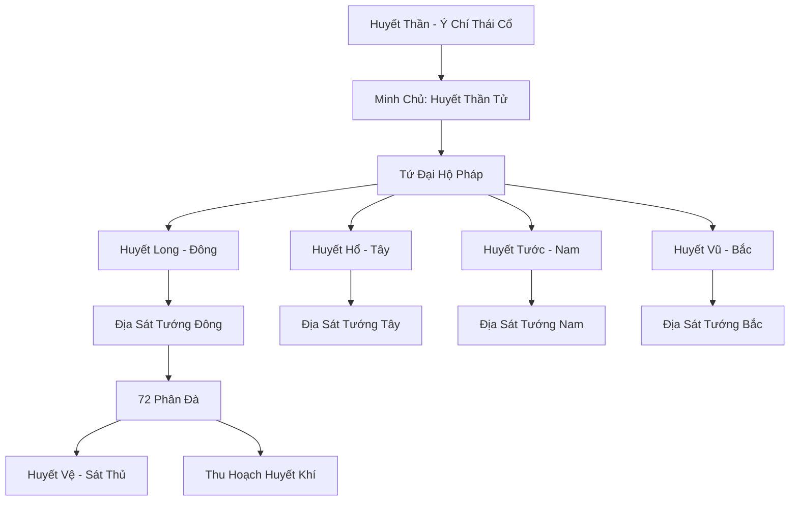
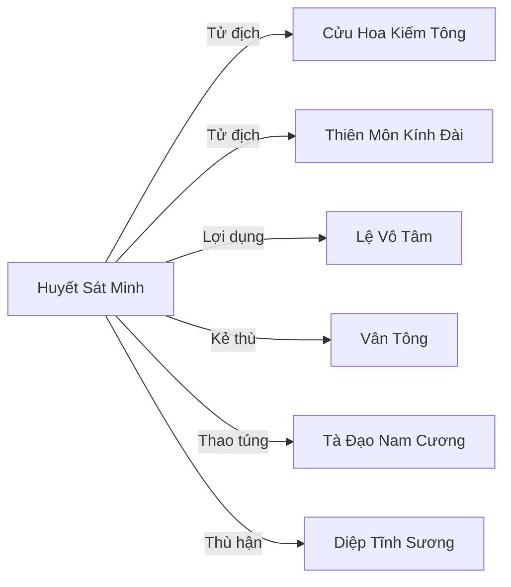

# Huyết Sát Minh (血煞盟)

## I. Tổng Quan (总览)
Huyết Sát Minh là tổ chức tà đạo ngầm xuyên lục địa nguy hiểm bậc nhất Cố Nguyên Giới, hoạt động hoàn toàn trong bóng tối với mạng lưới 72 phân đà rải rác khắp Đông Hoang, Trung Tâm và Nam Cương. Xếp hạng Hạng Nhất về sức mạnh tổng hợp, Minh thờ phụng "Huyết Thần" — một tồn tại từ Kỷ Nguyên Thái Cổ — và tin rằng Cố Nguyên Giới hiện tại là sai lầm cần được "thanh tẩy" bằng máu để đưa vạn vật về trạng thái nguyên thủy Hỗn Độn. Minh Chủ Huyết Thần Tử — cường giả có tu vi thực sự không rõ, nghi ngờ đã đạt Hóa Thần Hậu Kỳ hoặc thậm chí Luyện Hư Kỳ — là người duy nhất giao tiếp trực tiếp với ý chí của Huyết Thần, biến toàn bộ tổ chức thành công cụ thực thi "Huyết Nguyện" trên khắp lục địa.

## II. Địa Lý & Tài Nguyên (地理与资源)
Trụ sở chính ẩn giấu trong Huyết Uyên Đảo — một bí cảnh rạn nứt không gian nằm giữa Đông Hoang và Vô Tận Hải, vị trí không cố định mà di chuyển theo dòng chảy không gian. Chỉ những kẻ mang Huyết Ấn do Huyết Thần Tử ban mới có thể xác định tọa độ và xâm nhập. Bên trong Huyết Uyên Đảo là một không gian rộng lớn đỏ thẫm, bầu trời luôn phủ mây huyết, đất đai thấm đẫm huyết khí ngàn năm.

Ngoài Huyết Uyên Đảo, Minh hoạt động qua các phân đà rải rác — mỗi phân đà là một cơ sở ngầm được ngụy trang dưới nhiều vỏ bọc khác nhau: quán trọ, thương hội, hoặc thậm chí ngoại môn của các tông phái hợp pháp. Tài nguyên cốt lõi bao gồm Huyết Tinh Nguyên — nguồn sức mạnh chiết xuất từ máu của hàng ngàn tu sĩ bị hiến tế, Mẫu Cổ Cổ Đại — các bản thể cổ trùng có từ Kỷ Nguyên Thái Cổ (Thiên Tinh Mẫu Cổ mà Lệ Vô Tâm có được là một biến thể), và nhiều mỏ hắc linh thạch ở các vùng hoang địa mà không thế lực chính đạo nào kiểm soát.

## III. Văn Hóa & Tín Ngưỡng (文化与信仰)
Tín ngưỡng trung tâm là thờ phụng Huyết Thần — một tồn tại huyền bí từ Kỷ Nguyên Thái Cổ, được cho là thực thể sống sót từ trạng thái Hỗn Độn nguyên thủy trước khi Cố Nguyên Giới hình thành. Huyết Sát Minh tin rằng thế giới tu luyện hiện tại — với trật tự, quy tắc và phân tầng — là một "lỗi lầm" cần được thanh tẩy bằng máu để đưa vạn vật trở về Hỗn Độn, nơi mọi sinh linh bình đẳng trong hư vô.

Quy tắc tổ chức cực kỳ nghiêm ngặt và tàn nhẫn. Thứ nhất, tuyệt mật: thành viên cấp thấp không bao giờ biết danh tính của cấp trên, liên lạc qua mật hiệu và huyết phù; nếu bị bắt, huyết ấn trong não sẽ tự kích hoạt hủy diệt, xóa sạch ký ức và giết chết vật chủ. Thứ hai, đồng hóa: những kẻ có tư chất sẽ được ban "Huyết Chủng" — giống huyết mạch đặc biệt cải tạo thể chất, mang lại sức mạnh vượt trội nhưng đổi lại sẽ vĩnh viễn mất đi tự do ý chí trước kẻ ban Huyết Chủng.

## IV. Cơ Cấu Tổ Chức (组织结构)

Minh Chủ Huyết Thần Tử đứng đỉnh kim tự tháp, là người duy nhất giao tiếp trực tiếp với ý chí của Huyết Thần. Tu vi thực sự bị che giấu bằng nhiều lớp pháp thuật, nghi ngờ đã đạt Hóa Thần Hậu Kỳ hoặc Luyện Hư Kỳ. Dưới trướng là Tứ Đại Hộ Pháp (Tứ Linh Huyết Vệ): Huyết Long cai quản phương Đông, Huyết Hổ phương Tây, Huyết Tước phương Nam, Huyết Vũ phương Bắc — mỗi vị đều là cường giả Nguyên Anh Đỉnh Phong hoặc Hóa Thần Sơ Kỳ. Tiếp theo là Thất Thập Nhị Địa Sát Tướng — 72 đà chủ cai quản các phân đà khắp châu lục, tu vi từ Kim Đan Trung Kỳ trở lên. Cuối cùng là Huyết Vệ — lực lượng sát thủ cấp thấp thực hiện các nhiệm vụ đồ sát, bắt cóc và thu thập huyết khí tại từng khu vực.

## V. Công Pháp & Trận Pháp (功法与阵法)
- **Công Pháp:** "Huyết Thần Phệ Thiên Quyết" — công pháp tu luyện cốt lõi của Minh, cho phép hấp thu huyết nhục và nguyên thần của kẻ khác để nâng cao tu vi. Đây là tà pháp cực kỳ tàn bạo: tu sĩ càng giết nhiều, hấp thu nhiều máu, tu vi càng tăng nhanh. Tuy nhiên, phương pháp này tạo ra nghiệp lực khủng khiếp và dần ăn mòn nhân tính của người tu luyện.
- **Thân Pháp:** "Huyết Ảnh Độn" — kỹ thuật tẩu thoát cực nhanh, hóa thành một đạo huyết quang di chuyển với tốc độ khiến ngay cả tu sĩ cùng cấp cũng khó ngăn cản. Kỹ năng này đã được sử dụng để cứu Lệ Vô Tâm tại trận chiến Đầm Lầy Tử Thần khi hắn bị Mẫu Cổ phản phệ.
- **Trận Pháp:** "Huyết Thần Tế Đàn" — đại trận pháp hiến tế tại Huyết Uyên Đảo, thu thập và ngưng tụ huyết khí từ hàng ngàn vật hy sinh để cung cấp năng lượng cho Huyết Thần. Ngoài ra, mỗi phân đà đều có "Huyết Ấn Trận" — trận pháp nhỏ dùng để liên lạc mật, truyền tin và tự hủy khi bị phát hiện.

## VI. Đặc Sản Môn Phái (门派特产)
- **Huyết Chủng:** Giống huyết mạch đặc biệt do Minh Chủ tạo ra, cấy vào cơ thể tu sĩ để cải tạo thể chất — tăng sức mạnh, tốc độ phục hồi và khả năng hấp thu huyết khí, đổi lại hy sinh vĩnh viễn tự do ý chí.
- **Huyết Tinh Nguyên:** Tinh hoa huyết khí cô đọng từ máu tu sĩ hiến tế, dùng làm nguyên liệu luyện đan tà đạo, nuôi dưỡng Mẫu Cổ, hoặc trực tiếp hấp thu để tăng tu vi.
- **Mẫu Cổ Biến Thể:** Các bản thể cổ trùng được nuôi dưỡng và biến đổi từ Mẫu Cổ Cổ Đại, mỗi biến thể mang đặc tính riêng — ký sinh, khống chế, phá hủy — dùng làm vũ khí sinh học hoặc ban thưởng cho thuộc hạ có công.

## VII. Cơ Sở Hạ Tầng (基础设施)
- **Huyết Uyên Đảo:** Tổng đàn trong bí cảnh rạn nứt không gian, bao gồm Huyết Thần Tế Đàn, Huyết Kho chứa Huyết Tinh Nguyên, Mẫu Cổ Viên nuôi dưỡng cổ trùng, và cung điện Minh Chủ.
- **72 Phân Đà:** Cơ sở ngầm rải rác khắp Đông Hoang, Trung Tâm, Nam Cương, mỗi nơi được ngụy trang cẩn thận và có khả năng tự hủy khi bị phát hiện.
- **Mỏ Hắc Linh Thạch:** Các mỏ khoáng sản ở vùng hoang địa do Minh khống chế bí mật, cung cấp tài nguyên cho hoạt động ngầm.
- **Mạng Lưới Huyết Phù:** Hệ thống liên lạc mật mã xuyên lục địa qua huyết phù — bùa máu chứa tin nhắn mã hóa, chỉ người mang Huyết Ấn mới đọc được.

## VIII. Kinh Tế (经济)
Kinh tế của Huyết Sát Minh hoàn toàn nằm trong bóng tối — không có hoạt động thương mại công khai. Nguồn thu chính từ bốn kênh: khống chế và khai thác mỏ hắc linh thạch ở hoang địa bán trên thị trường chợ đen; buôn bán ngầm mẫu cổ, tà thuật và cấm thuật cho các thế lực tà đạo nhỏ hơn; thu thập huyết khí và nguyên liệu sinh học từ hiến tế — biến thành Huyết Tinh Nguyên bán cho ma tu cần tăng tu vi nhanh; và thao túng thị trường chợ đen xuyên lục địa thông qua 72 phân đà làm đầu mối phân phối. Quy mô kinh tế ngầm lớn đến mức nhiều thương hội hợp pháp không biết rằng nguồn hàng họ mua đã đi qua tay Huyết Sát Minh.

## IX. Lịch Sử Tóm Tắt (简史)
Nguồn gốc Huyết Sát Minh bắt nguồn từ Kỷ Nguyên Thái Cổ — thời kỳ Hỗn Độn chưa phân thiên địa, khi Huyết Thần là một trong những tồn tại nguyên thủy bị trấn áp khi thế giới hình thành trật tự. Suốt nhiều kỷ nguyên, tín đồ Huyết Thần âm thầm duy trì giáo phái, chờ đợi ngày Huyết Thần tái sinh. Huyết Thần Tử — đời Minh Chủ hiện tại — là kẻ đã thành công trong việc tiếp xúc trực tiếp với tàn dư ý chí của Huyết Thần, từ đó xây dựng Minh thành tổ chức tà đạo lớn nhất lục địa.

Trong quá khứ, Huyết Sát Minh là kẻ đã tàn sát Thanh Phong Thôn để luyện huyết đan — gây ra bi kịch mất gia đình cho Diệp Tĩnh Sương. Hiện tại, Minh đứng sau thao túng sự trỗi dậy của một số thế lực tà đạo ở Nam Cương, cung cấp Thiên Tinh Mẫu Cổ và tài nguyên ngầm cho Lệ Vô Tâm để hắn tạo ra cuộc hỗn loạn ở Vạn Độc Môn. Ở hồi kết Arc 3, tại trận chiến Đầm Lầy Tử Thần, một cường giả của Minh đã sử dụng Huyết Ảnh Độn để cứu Lệ Vô Tâm khi hắn đang bị Mẫu Cổ phản phệ, đưa hắn rút chạy qua đường mạch ngầm — xác nhận mối liên hệ giữa Lệ Vô Tâm và Minh.

## X. Giai Thoại & Bí Mật (轶事与秘密)
Huyết Thần Tử không phải con người bình thường — có giả thuyết cho rằng hắn là vật chủ cuối cùng của Huyết Thần, cơ thể đã bị ý chí Huyết Thần chiếm hữu từ lâu, và "Huyết Thần Tử" chỉ là vỏ bọc nhân cách để giao tiếp với thuộc hạ. Nếu đúng như vậy, Huyết Thần không phải "sắp tái sinh" mà đã tái sinh rồi — chỉ chưa đủ sức mạnh để hiện thân hoàn toàn.

Mục tiêu cuối cùng của Minh không đơn giản là phá hủy Chính Đạo — mà là "Huyết Tẩy Khai Thiên," nghi thức hiến tế quy mô toàn lục địa nhằm phá vỡ quy luật thiên địa hiện tại và mở cánh cửa cho Hỗn Độn quay lại. Để thực hiện, cần thu thập đủ huyết khí từ hàng vạn tu sĩ, và đó là lý do Minh hoạt động khắp nơi, không ngừng gây ra các vụ thảm sát và hiến tế.

Mối quan hệ với Lệ Vô Tâm phức tạp hơn vẻ bề ngoài — Minh cung cấp Mẫu Cổ cho hắn không phải vì hảo tâm mà vì cần hắn làm "quân cờ khuấy loạn," thu hút sự chú ý của Chính Đạo trong khi Minh thực hiện kế hoạch thực sự ở nơi khác.

## XI. Quan Hệ Thế Lực (势力关系)

