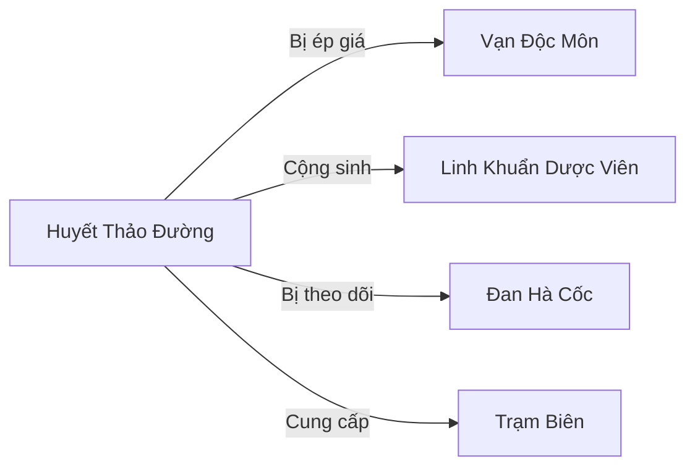

# Huyết Thảo Đường (血草堂)

## I. Tổng Quan (总览)
Huyết Thảo Đường là một hội dược liệu nhỏ chuyên thu hái và bào chế dược liệu từ vùng Rừng Huyết Độc — khu vực mà phần lớn tu sĩ đều tránh xa vì nồng độ huyết độc chết người. Dưới sự dẫn dắt của Đường Chủ Thảo Lão Tam — dược sư già mù một mắt nhưng tay nghề bào chế số một vùng rìa rừng — hội nhỏ này đã âm thầm cung cấp dược liệu giải độc quý hiếm cho cả một vùng rộng lớn suốt 50 năm. Với triết lý "Dược và Độc chỉ cách nhau một liều lượng," Huyết Thảo Đường tồn tại trong thế cân bằng mong manh giữa nguy hiểm từ thiên nhiên và áp bức từ các thế lực lớn hơn.

## II. Địa Lý & Tài Nguyên (地理与资源)
Huyết Thảo Đường nằm ở rìa phía bắc Rừng Huyết Độc, nơi nồng độ huyết độc vừa đủ để linh dược sinh trưởng nhưng chưa đến mức gây chết người ngay lập tức. Trụ sở là một khe đá tự nhiên hẹp xen kẽ với rễ cây cổ thụ, tạo thành hang nông kín đáo. Không khí luôn phảng phất mùi tanh ngọt của huyết độc, sương đỏ nhạt bao phủ mỗi buổi sáng tạo nên cảnh quan vừa mê hoặc vừa đáng sợ.

Tài nguyên cốt lõi là Huyết Linh Thảo — loại dược liệu đặc hữu chỉ mọc trong vùng nhiễm huyết độc, có tác dụng giải độc nghịch lý: bản thân chứa độc tố nhẹ nhưng khi bào chế đúng cách lại trở thành thuốc giải cực kỳ hiệu quả. Bên cạnh đó là Huyết Lộ Thạch — viên đá nhỏ ngưng tụ từ sương huyết qua hàng thập kỷ, dùng làm nguyên liệu luyện đan giải độc cấp thấp. Ngoài ra, kiến thức phân biệt hàng trăm loại dược liệu độc — biết cái nào chữa được cái nào — chính là tài sản vô giá nhất của Đường.

## III. Văn Hóa & Tín Ngưỡng (文化与信仰)
Triết lý trung tâm: "Dược và Độc chỉ cách nhau một liều lượng." Huyết Thảo Đường tôn trọng cả hai mặt của dược liệu, không coi độc là xấu xa mà coi nó là một phần tất yếu của tự nhiên cần được hiểu và thuần phục. Quy tắc nghiêm ngặt nhất là luôn đi theo cặp khi hái thuốc — một người hái, một người canh chừng độc khí và yêu thú — vì đã có nhiều dược sư chết vì bất cẩn khi đi một mình.

Nguyên tắc thứ hai: không bao giờ hái sạch, luôn để lại gốc cho dược liệu tái sinh. Đây không chỉ là đạo đức nghề nghiệp mà còn là chiến lược sinh tồn dài hạn. Phong tục đặc trưng nhất là "Nếm Huyết Lễ" — dược sư mới phải tự nếm một loại dược liệu độc dưới sự giám sát của Thảo Lão Tam, để cơ thể ghi nhớ vị độc bằng bản năng. Nghi lễ này vừa là bài kiểm tra dũng khí, vừa là phương pháp huấn luyện thực tế.

## IV. Cơ Cấu Tổ Chức (组织结构)
Đường Chủ Thảo Lão Tam — dược sư già mù một mắt do trúng bào tử độc trong một lần thâm nhập Rừng Huyết Độc quá sâu, nhưng kinh nghiệm bào chế vượt trội bù đắp cho khuyết tật. Dưới trướng có Tam Dược Sư — 3 dược sư Trúc Cơ Sơ Kỳ, mỗi người chuyên về một nhóm dược liệu: một chuyên thảo dược lá, một chuyên nấm và khuẩn, một chuyên rễ và vỏ cây. Tiếp theo là 25 học đồ Luyện Khí đang học hái thuốc và bào chế sơ đẳng, cùng 10 hộ vệ Luyện Khí Hậu Kỳ chuyên bảo vệ đoàn hái thuốc khỏi yêu thú. Tổng cộng 39 người, tổ chức gọn nhẹ nhưng hiệu quả.

## V. Công Pháp & Trận Pháp (功法与阵法)
- **Công Pháp:** Không có công pháp chiến đấu. Thảo Lão Tam tự sáng tạo "Huyết Thảo Hô Hấp Pháp" — phương pháp hô hấp đặc biệt điều tiết linh khí qua phổi theo nhịp chậm, giúp lọc huyết độc trong không khí, cho phép dược sư ở lâu hơn trong Rừng Huyết Độc mà không bị ngộ độc. Đây không phải công pháp tu luyện mà là kỹ thuật sinh tồn chuyên môn.
- **Trận Pháp:** Không có trận pháp. Khe đá tự nhiên và vị trí rìa rừng huyết độc tự nó là lớp phòng thủ — ít ai dám xâm nhập vùng này trừ phi biết cách chống độc.

## VI. Đặc Sản Môn Phái (门派特产)
- **Huyết Linh Thảo chế phẩm:** Dược liệu đặc hữu vùng Huyết Độc đã qua sơ chế, loại bỏ độc tố dư thừa, sẵn sàng cho các dược phường và đan sư sử dụng. Chất lượng ổn định và đáng tin cậy.
- **Huyết Giải Đan:** Đan dược giải độc cấp thấp bào chế từ Huyết Linh Thảo và Huyết Lộ Thạch, có hiệu quả đặc biệt với các loại huyết độc và chất độc gốc kim loại nặng.
- **Sương Huyết Tửu:** Rượu dược ngâm từ sương huyết thu gom mỗi sáng, có tác dụng tăng cường khả năng kháng độc cho cơ thể khi uống liều nhỏ trong thời gian dài.

## VII. Cơ Sở Hạ Tầng (基础设施)
- **Khe Đá Dược Phường:** Trụ sở chính trong khe đá tự nhiên, chia thành khu bào chế, khu sấy khô, khu lưu trữ và khu ở. Đá khe hấp thụ huyết độc qua nhiều năm nên có màu đỏ sẫm đặc trưng.
- **Vùng Hái Thuốc:** Khu vực rìa rừng được Đường đánh dấu và phân chia thành các lô luân phiên thu hái, đảm bảo dược liệu có thời gian tái sinh.
- **Kho Dược Liệu:** Hang đá nhỏ sâu bên trong khe, nhiệt độ ổn định, dùng lưu trữ dược liệu đã sơ chế và Huyết Lộ Thạch thu gom được.

## VIII. Kinh Tế (经济)
Nguồn thu chính từ việc bán dược liệu huyết độc đã sơ chế cho các thương nhân tại Trạm Biên và cung cấp nguyên liệu giải độc cho các dược phường lớn hơn. Huyết Giải Đan là sản phẩm có nhu cầu ổn định vì vùng Đông Hoang có nhiều sinh vật và thực vật độc. Tuy nhiên, lợi nhuận bị Vạn Độc Môn bóp nghẹt — môn phái này thường xuyên ép Đường bán hàng với giá rẻ mạt, đe dọa sẽ "xử lý" nếu Đường dám bán trực tiếp cho khách hàng lớn. Thảo Lão Tam chấp nhận vì không đủ sức đối đầu, miễn sao giữ được mạng và nghề.

## IX. Lịch Sử Tóm Tắt (简史)
Thảo Lão Tam vốn là dược đồng — kẻ hầu hạ và học việc — của một tán tu Kim Đan chuyên nghiên cứu dược liệu vùng Huyết Độc. Sau khi sư phụ mạo hiểm thâm nhập quá sâu vào Rừng Huyết Độc và bỏ mạng, Thảo Lão Tam không có nơi nào đi, bèn ở lại rìa rừng và tự mày mò từ những ghi chép sư phụ để lại. Suốt 50 năm gây dựng, từ một mình sống sót trong khe đá, hắn dần thu nhận học đồ và hộ vệ, hình thành nên Huyết Thảo Đường — hội dược liệu nhỏ nhưng chuyên môn sâu, cung cấp dược liệu cho cả một vùng. Thường xuyên bị Vạn Độc Môn ép giá, nhưng Thảo Lão Tam nhẫn nhịn vì biết rằng chỉ cần Đường còn tồn tại, kiến thức về dược liệu huyết độc sẽ không bị thất truyền.

## X. Giai Thoại & Bí Mật (轶事与秘密)
Sâu trong Rừng Huyết Độc có một "Huyết Linh Thụ" — cây cổ thụ đã hấp thụ huyết độc ngàn năm, quả của nó có thể giải bách độc, là dược liệu cấp truyền thuyết mà mọi dược sư đều khao khát. Thảo Lão Tam biết vị trí cây nhưng không đủ tu vi để hái — nồng độ huyết độc xung quanh Huyết Linh Thụ đủ giết chết tu sĩ Trúc Cơ trong vài khắc.

Mắt mù của Thảo Lão Tam thực ra có thể nhìn thấy dòng chảy linh khí trong dược liệu — một phó sản bất ngờ từ bào tử độc phá hủy đồng tử bình thường nhưng kích hoạt một loại linh thị đặc biệt. Nhờ khả năng này, hắn có thể đánh giá chất lượng dược liệu chính xác hơn bất kỳ dược sư nào, nhưng hắn giấu kín vì sợ bị bắt đi nghiên cứu.

Có tin đồn rằng Đan Hà Cốc đang âm thầm theo dõi hoạt động của Huyết Thảo Đường, vì dược liệu vùng Huyết Độc có giá trị nghiên cứu rất cao và Đan Hà Cốc muốn tìm hiểu bí mật của Huyết Linh Thụ.

## XI. Quan Hệ Thế Lực (势力关系)

