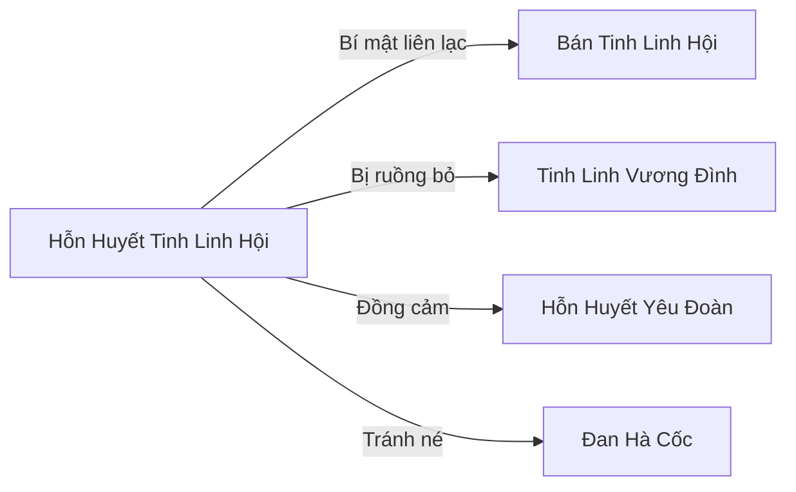

# Hỗn Huyết Tinh Linh Hội (混血精灵会)

## I. Tổng Quan (总览)
Hỗn Huyết Tinh Linh Hội là một cộng đồng nhỏ bé tập hợp những Tinh Linh mang hai dòng máu — bị cả Tinh Linh Vương Đình lẫn các chủng tộc khác khinh rẻ và ruồng bỏ. Nằm ẩn mình trên đồi đá cao ở rìa bắc Đầm Lầy Tử Thần, nơi không ai thèm đặt chân tới, Hội là mái nhà cuối cùng cho những sinh linh "hai dòng máu" bị cả thế giới chối bỏ. Dù quy mô nhỏ và sức mạnh yếu ớt, Hội tự hào về triết lý sống "hai dòng máu không phải lời nguyền mà là phước lành gấp đôi", biến sự mặc cảm thành nguồn sức mạnh tinh thần cho mỗi thành viên.

## II. Địa Lý & Tài Nguyên (地理与资源)
Hội định cư trên một gò đất đồi nhỏ nhô lên khỏi mặt nước đầm ở bờ phía bắc Đầm Lầy Tử Thần. Địa hình là đồi đá phủ cỏ dại, vài cây gầy guộc cằn cỗi, nhà cửa dựng bằng đá xếp thô sơ với mái lá đầm lầy. Mỗi sáng, sương mù từ đầm lầy bốc lên bao phủ toàn bộ khu vực, tạo ra lớp che chắn tự nhiên khỏi ánh mắt dò xét bên ngoài.

Tài nguyên chính của Hội là các loại linh dược đầm lầy — những loại cỏ linh chỉ mọc ở vùng rìa đầm, hiếm nhưng có giá trị cao trên thị trường. Ngoài ra, mỗi thành viên hỗn huyết thừa hưởng đặc tính sinh học khác nhau từ hai dòng máu, tạo thành một nhóm đa năng có kiến thức cả hai phía — hiểu cả văn hóa Tinh Linh lẫn chủng tộc pha huyết kia. Đặc biệt, dưới đất đồi nơi Hội định cư có dấu vết của một trận pháp cổ đại đã hỏng, nghi là lý do đất đồi này không bị đầm lầy nuốt chửng.

## III. Văn Hóa & Tín Ngưỡng (文化与信仰)
Triết lý cốt lõi của Hội là: "Hai dòng máu không phải lời nguyền mà là phước lành gấp đôi." Mọi thành viên được dạy tự hào về xuất thân lai của mình thay vì xấu hổ. Quy tắc nghiêm ngặt nhất là không phân biệt tỷ lệ huyết thống — dù chỉ mang một phần mười huyết mạch Tinh Linh hay một nửa, tất cả đều bình đẳng. Không ai bị kỳ thị vì ngoại hình dị biệt — tai nhọn nhưng không có phép thuật, vảy rắn trên tay nhưng không có nanh độc — những đặc điểm khiến họ không thuộc về bên nào lại trở thành biểu tượng cho sự đa dạng.

Phong tục quan trọng nhất là "Chuyện Hai Dòng Máu": khi trẻ em hỗn huyết đến 16 tuổi, các trưởng bối sẽ kể cho chúng nghe lịch sử của cha mẹ và lý do tại sao chúng tồn tại, để chúng tự hào thay vì mặc cảm. Nghi lễ này đánh dấu sự trưởng thành và gắn kết thế hệ mới với cộng đồng.

## IV. Cơ Cấu Tổ Chức (组织结构)
Cơ cấu tổ chức đơn giản, gồm Hội Trưởng Hỗn Nguyệt — nữ hỗn huyết Tinh Linh-Nhân Tộc, tai nhọn và mắt xanh lá nhưng không có khả năng nói chuyện với cây, bù lại giỏi chiến đấu hơn Tinh Linh thuần huyết. Phó Hội Trưởng là Lâm Kỳ Dạ (Trúc Cơ Sơ Kỳ) — hỗn huyết Tinh Linh-Yêu Tộc (xà), có vảy xanh trên cánh tay. Bên dưới là 28 thành viên hỗn huyết Tinh Linh đủ loại pha: Tinh Linh-Nhân, Tinh Linh-Yêu, Tinh Linh-Thạch, cùng 7 đứa trẻ hỗn huyết đang được nuôi dạy. Mọi quyết định lớn đều do Hỗn Nguyệt và Lâm Kỳ Dạ thương lượng cùng toàn thể thành viên, theo hình thức biểu quyết tập thể.

## V. Công Pháp & Trận Pháp (功法与阵法)
- **Công Pháp:** Không có công pháp thống nhất — mỗi hỗn huyết tu luyện công pháp phù hợp với thể chất riêng, vì sự khác biệt huyết mạch khiến không bài công pháp nào phù hợp cho tất cả. Hỗn Nguyệt tự sáng tạo "Song Nguyên Hòa Hợp Thuật" — kỹ thuật giúp cân bằng hai loại linh lực trong cơ thể hỗn huyết, giảm xung đột nội tại giữa hai nguồn năng lượng đối lập, cho phép tu sĩ hỗn huyết tu luyện ổn định hơn mà không bị bạo thể.
- **Trận Pháp:** Không có trận pháp chính quy. Dựa vào sương mù đầm lầy tự nhiên và dấu vết trận pháp cổ đại dưới lòng đất để che giấu vị trí, tạo hiệu ứng mê hoặc nhẹ đối với kẻ lạ mặt xâm nhập.

## VI. Đặc Sản Môn Phái (门派特产)
- **Linh Dược Đầm Lầy:** Các loại cỏ linh đặc hữu vùng rìa Đầm Lầy Tử Thần, có giá trị dược liệu cao, đặc biệt trong việc giải độc và thanh lọc tạp chất trong kinh mạch.
- **Trà Song Nguyên:** Loại trà pha từ hai loại thảo dược đầm lầy do Hỗn Nguyệt nghiên cứu, giúp cân bằng linh lực cho tu sĩ mang hỗn hợp thuộc tính, là sản phẩm duy nhất mà các cộng đồng hỗn huyết khác cũng tìm mua.

## VII. Cơ Sở Hạ Tầng (基础设施)
- **Nhà Đá Cộng Đồng:** Một cụm nhà dựng bằng đá xếp thô sơ với mái lá đầm lầy, đủ chỗ cho khoảng 40 người sinh hoạt. Kiên cố hơn vẻ ngoài, vì đá lấy từ đồi có tàn dư linh khí trận pháp cổ.
- **Vườn Linh Dược:** Khu vực trồng và thu hái linh dược đầm lầy, nằm trên sườn đồi hướng về phía đầm, nơi độ ẩm và linh khí thích hợp nhất.
- **Lều Nuôi Dạy:** Nơi 7 đứa trẻ hỗn huyết được chăm sóc và giáo dục, trang bị đơn sơ nhưng ấm cúng.

## VIII. Kinh Tế (经济)
Kinh tế của Hội rất khiêm tốn, chủ yếu dựa vào việc bán linh dược đầm lầy cho các thương nhân tại Trạm Biên với giá vừa phải. Ngoài ra, nhờ kiến thức đa văn hóa, một số thành viên làm dịch vụ phiên dịch và trung gian giao dịch giữa các chủng tộc khác nhau. Thu nhập chỉ đủ để duy trì cuộc sống cơ bản, không có tích lũy đáng kể. Hội phải thận trọng trong mọi giao dịch để tránh thu hút sự chú ý không mong muốn từ các thế lực lớn hơn.

## IX. Lịch Sử Tóm Tắt (简史)
Hỗn huyết Tinh Linh từ xưa bị Vương Đình coi là "ô nhiễm huyết mạch" và trục xuất hoặc bỏ rơi. Hỗn Nguyệt, bản thân là nữ hỗn huyết Tinh Linh-Nhân Tộc bị gia đình Tinh Linh ruồng bỏ từ nhỏ, sau khi tự mình vươn lên đạt Trúc Cơ Hậu Kỳ, đã bắt đầu tập hợp những Tinh Linh pha huyết lang thang, dẫn họ đến rìa Đầm Lầy Tử Thần — nơi không ai muốn sống. Suốt 60 năm xây dựng, cộng đồng từ 5 người ban đầu phát triển thành 28 thành viên trưởng thành cộng thêm 7 trẻ em sinh ra tại đây. Dù sống trong nghèo khó và cô lập, Hội đã âm thầm xây dựng mối quan hệ bí mật với Bán Tinh Linh Hội — hai cộng đồng có cùng cảnh ngộ bị ruồng bỏ vì huyết thống.

## X. Giai Thoại & Bí Mật (轶事与秘密)
Lâm Kỳ Dạ sở hữu khả năng độc nhất: nhìn thấy linh mạch trong đất — thiên phú kỳ lạ từ sự pha trộn huyết mạch Tinh Linh và Xà Yêu. Năng lực này cực kỳ quý hiếm, nếu bị phát hiện, cả Đan Hà Cốc lẫn Vạn Độc Môn sẽ tranh nhau bắt cô để khai thác. Hỗn Nguyệt ra lệnh tuyệt đối cấm Lâm Kỳ Dạ sử dụng thiên phú này trước mặt người ngoài.

Dưới đất đồi nơi Hội định cư có dấu vết của một trận pháp cổ đại đã hỏng — Hỗn Nguyệt nghi ngờ đó là lý do đất đồi này không bị đầm lầy nuốt chửng, nhưng không biết ai đã đặt trận pháp và vì mục đích gì. Trận pháp tàn dư vẫn phát ra linh khí yếu ớt, có thể cảm nhận được vào những đêm trăng tròn.

Một bí mật nhỏ nhưng đáng yêu: bảy đứa trẻ hỗn huyết trong Lều Nuôi Dạy đã tự đặt cho mình biệt danh "Thất Sắc" — Bảy Màu — vì mỗi đứa mang đặc điểm ngoại hình khác nhau từ hai dòng máu: tai nhọn, vảy xanh, mắt vàng, tóc bạc, ngón tay dài bất thường, da phát sáng nhẹ, và một đứa có khả năng đổi màu mắt theo cảm xúc. Chúng coi sự khác biệt của mình là điều đặc biệt thay vì dị thường, và Hỗn Nguyệt xúc động khi nhận ra rằng thế hệ mới không còn mang gánh nặng mặc cảm như thế hệ bà — phần lớn nhờ văn hóa "hai dòng máu là phước lành" mà bà kiên trì xây dựng suốt sáu mươi năm.

## XI. Quan Hệ Thế Lực (势力关系)

