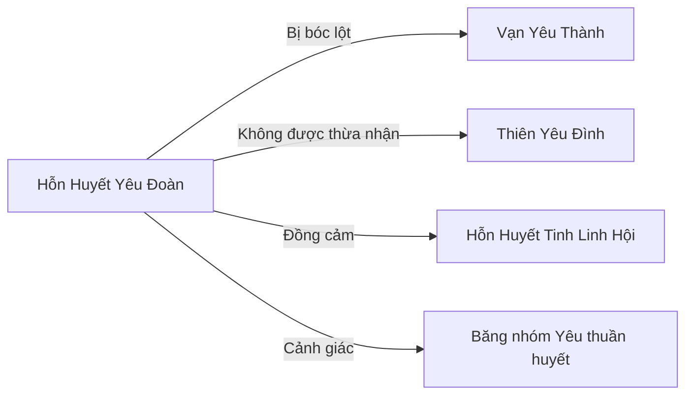

# Hỗn Huyết Yêu Đoàn (混血妖团)

## I. Tổng Quan (总览)
Hỗn Huyết Yêu Đoàn là một tổ chức tương trợ của những yêu tộc mang dòng máu lai — bị cả yêu thuần huyết lẫn nhân tộc khinh rẻ và đẩy ra bên lề xã hội. Với khoảng 70 thành viên sống chen chúc trong khu ngoại vi tồi tàn nhất của Vạn Yêu Thành, Đoàn không có sức mạnh, không có tham vọng chính trị, chỉ đơn thuần mong được sống yên ổn. Dưới sự dẫn dắt của Đoàn Trưởng Tạp Huyết — một yêu nửa hồ nửa lang bị cả hai bên khinh bỉ — Đoàn trở thành nơi nương tựa cuối cùng cho những sinh linh bị xã hội yêu tộc ruồng bỏ.

## II. Địa Lý & Tài Nguyên (地理与资源)
Đoàn chiếm cứ khu vực tồi tàn nhất ngoại vi phía nam Vạn Yêu Thành, ngay gần bãi phế thải của thành. Lều lán dựng từ vật liệu tái chế — xương thú, da rách, gỗ mục — chen chúc và bẩn thỉu, mùi hôi từ bãi rác xen lẫn với mùi linh khí tàn dư từ phế liệu pháp khí. Khu vực này không có tường bao hay trận pháp bảo vệ, hoàn toàn phơi mình trước mọi mối nguy.

Tài nguyên gần như không có. Đoàn sống nhờ nhặt nhạnh phế liệu từ bãi rác — đôi khi tìm được mảnh pháp khí hỏng hoặc dược liệu tàn dư còn chút công dụng. Nguồn thu chính đến từ việc làm công việc nặng nhọc, bẩn thỉu cho yêu tộc trong thành mà không ai khác muốn làm: khuân vác, dọn dẹp, vận chuyển chất thải.

## III. Văn Hóa & Tín Ngưỡng (文化与信仰)
Triết lý cốt lõi của Đoàn là: "Hỗn huyết không phải tội lỗi." Đây là lời nhắc nhở thường trực rằng họ không chọn được dòng máu, nhưng có thể chọn cách sống xứng đáng. Quy tắc số một: không được khinh thường đồng đội vì huyết mạch; bảo vệ lẫn nhau trước sự bắt nạt của yêu thuần huyết là nghĩa vụ bắt buộc, vi phạm sẽ bị trục xuất khỏi Đoàn.

Nghi thức kết nạp thành viên mới là "Lễ Đồng Cảm" — người mới phải đứng trước toàn Đoàn và chia sẻ câu chuyện bị kỳ thị đau đớn nhất của mình. Không phải để trình diễn nỗi đau, mà để mọi người biết rằng mình không đơn độc. Những giọt nước mắt rơi trong buổi lễ này là sợi dây gắn kết Đoàn bền chặt hơn bất kỳ lời thề nào.

## IV. Cơ Cấu Tổ Chức (组织结构)
Đoàn có cơ cấu đơn giản theo mô hình gia đình mở rộng. Đoàn Trưởng Tạp Huyết (Trúc Cơ Viên Mãn) — yêu nửa hồ nửa lang, bị cả hai dòng tộc khinh bỉ, tự lực phấn đấu từ một kẻ lang thang thành cường giả. Dưới trướng có hai Phó Đoàn Trưởng: một hỗn huyết xà-điểu và một hỗn huyết ngưu-hổ, đều ở cảnh giới Trúc Cơ Trung Kỳ. Còn lại khoảng 67 thành viên, đa số ở tầng Luyện Khí, bao gồm các loại hỗn huyết yêu đủ kiểu: hồ-lang, xà-điểu, ngưu-hổ, miêu-thử, và nhiều tổ hợp kỳ lạ khác. Mọi quyết định do Tạp Huyết quyết định cuối cùng, nhưng ông luôn lắng nghe ý kiến toàn Đoàn.

## V. Công Pháp & Trận Pháp (功法与阵法)
- **Công Pháp:** Không có hệ thống công pháp — hỗn huyết yêu cực kỳ khó tu luyện vì huyết mạch xung đột giữa hai loài, mỗi người phải tự mò mẫm phương pháp riêng. Tạp Huyết đã cố gắng tổng kết kinh nghiệm của mình thành một bộ ghi chú gọi là "Tạp Huyết Tu Luyện Chí", nhưng vì mỗi người một thể chất nên tính ứng dụng rất hạn chế.
- **Trận Pháp:** Không có trận pháp. Phòng thủ hoàn toàn dựa vào bản năng chiến đấu thú tính và sự đoàn kết số đông. Khi bị tấn công, toàn Đoàn sẽ hú lên báo động và xông ra cùng lúc — chiến thuật duy nhất của kẻ yếu.

## VI. Đặc Sản Môn Phái (门派特产)
- **Phế Liệu Tái Chế:** Đoàn có kinh nghiệm tuyệt vời trong việc phân loại và tái sử dụng phế liệu pháp khí, biến những thứ người khác vứt bỏ thành dụng cụ sinh hoạt thô sơ nhưng hữu dụng.
- **Dịch Vụ Đa Năng:** Nhờ sự đa dạng huyết mạch, Đoàn có thể cung cấp sức lao động phù hợp với nhiều loại công việc — từ bay lên cao (hỗn huyết điểu) đến bơi dưới nước (hỗn huyết ngư) — mà các đội lao động thuần huyết không có.

## VII. Cơ Sở Hạ Tầng (基础设施)
- **Lán Trại Tái Chế:** Một cụm lều lán dựng từ vật liệu tái chế, chia thành khu ở, khu làm việc và khu chứa phế liệu. Tuy bẩn thỉu nhưng được tổ chức có trật tự.
- **Bếp Chung:** Khu nấu ăn tập thể nơi toàn Đoàn chia sẻ thức ăn, thường là thịt thú thấp cấp và rau dại nhặt được.
- **Hố Huấn Luyện:** Một khoảng đất trống nơi Tạp Huyết dạy các thành viên trẻ kỹ năng chiến đấu sinh tồn cơ bản.

## VIII. Kinh Tế (经济)
Kinh tế Đoàn nằm ở đáy xã hội yêu tộc. Thu nhập chính từ ba nguồn: lao động chân tay cho yêu tộc trong Vạn Yêu Thành (khuân vác, dọn dẹp, vệ sinh), thu nhặt và bán lại phế liệu có giá trị còn sót lại từ bãi rác, và đôi khi nhận các công việc nguy hiểm mà không ai muốn làm. Tiền công bị ép xuống mức thấp nhất có thể, vì thương nhân yêu tộc biết rằng hỗn huyết không có lựa chọn nào khác. Mọi thu nhập được nộp vào quỹ chung và phân phối theo nhu cầu.

## IX. Lịch Sử Tóm Tắt (简史)
Ba mươi năm trước, Tạp Huyết — khi đó chỉ là một yêu hỗn huyết hồ-lang lang thang bên rìa Vạn Yêu Thành — bắt đầu thu nhận những kẻ cùng cảnh ngộ. Ban đầu chỉ là 5-6 hỗn huyết nương tựa nhau qua ngày, dần dần phát triển thành Đoàn 70 người. Tạp Huyết chọn khu vực gần bãi rác vì không ai tranh giành, biến nơi bị coi là ô uế thành mái nhà. Suốt ba thập kỷ, Đoàn không một lần được Vạn Yêu Thành công nhận tư cách pháp lý, thường xuyên bị bắt nạt và cướp bóc bởi các băng nhóm yêu thuần huyết, nhưng vẫn kiên cường tồn tại.

## X. Giai Thoại & Bí Mật (轶事与秘密)
Trong Đoàn có một đứa trẻ hỗn huyết mang ba dòng huyết mạch — hiện tượng cực kỳ hiếm gặp trong lịch sử yêu tộc. Đứa bé vẫn còn nhỏ, chưa biểu lộ năng lực gì đặc biệt, nhưng tiềm năng có thể rất lớn hoặc rất nguy hiểm. Tạp Huyết giữ bí mật này tuyệt đối, vì nếu Thiên Yêu Đình phát hiện, đứa trẻ sẽ bị bắt đi nghiên cứu hoặc xử lý.

Tạp Huyết nghi ngờ rằng huyết mạch hỗn hợp thực ra ẩn chứa bí mật tiến hóa mà yêu thuần huyết không muốn thừa nhận — rằng sự pha trộn không phải suy thoái mà là con đường tiến hóa mới, và sự kỳ thị chỉ là cách yêu thuần huyết bảo vệ địa vị thống trị của mình.

## XI. Quan Hệ Thế Lực (势力关系)

