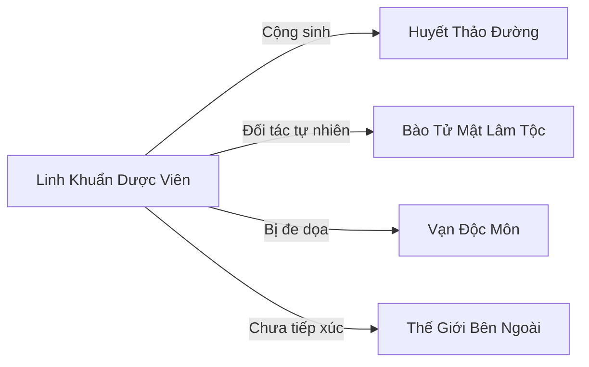

# Linh Khuẩn Dược Viên (灵菌药园)

## I. Tổng Quan (总览)
Linh Khuẩn Dược Viên là một "tổ chức" đặc biệt — không phải do nhân tộc hay yêu tộc thành lập, mà là quần thể khuẩn linh đã tiến hóa đến mức có linh trí, tự tổ chức hoạt động trong lòng Rừng Huyết Độc. Đứng đầu là Kim Khuẩn — cá thể khuẩn linh lớn nhất và có linh trí cao nhất, kích thước bằng nắm tay, phát ra ánh sáng vàng kim ấm áp. Viên chuyên phân giải huyết độc và biến đất nhiễm độc thành "Tịnh Thổ" — đất sạch phì nhiêu dùng trồng linh dược cấp thấp. Dù không có sức mạnh chiến đấu và quy mô cực nhỏ, Viên đóng vai trò sinh thái quan trọng trong việc cân bằng hệ sinh thái Rừng Huyết Độc.

## II. Địa Lý & Tài Nguyên (地理与资源)
Viên nằm trong vùng đất ẩm giàu hữu cơ bên trong Rừng Huyết Độc, nơi xác lá mục tích tụ tạo thành lớp mùn dày — môi trường lý tưởng cho khuẩn linh sinh trưởng. Bãi đất bằng phẳng phủ rêu xanh phát quang nhạt, xung quanh là gốc cây mục, tạo nên cảnh quan u ám nhưng kỳ dị với ánh sáng sinh học nhấp nháy.

Tài nguyên độc đáo nhất là khả năng phân giải huyết độc — Vi Tộc khuẩn linh biến huyết độc thành chất dinh dưỡng vô hại thông qua quá trình enzyme phức tạp, tạo ra "Tịnh Thổ" sạch. Đất này cực kỳ phì nhiêu cho trồng linh dược cấp thấp. Ngoài ra, khuẩn dịch — chất lỏng tiết ra trong quá trình phân giải — có tác dụng giải độc nhẹ, có thể bán cho dược sư. Gần khu vực Viên còn có vùng đất của Bào Tử Mật Lâm Tộc, hai Vi Tộc dần hình thành quan hệ cộng sinh tự nhiên.

## III. Văn Hóa & Tín Ngưỡng (文化与信仰)
Triết lý (nếu có thể gọi như vậy đối với một quần thể vi sinh): "Mục nát là khởi đầu, không phải kết thúc." Khuẩn linh coi sự phân hủy là một phần thiêng liêng của vòng tuần hoàn, biến cái chết thành nguồn sống mới. Quy tắc bất di bất dịch: chỉ phân giải chất độc và xác chết, không bao giờ phân giải sinh vật sống — đây là ranh giới đạo đức mà Kim Khuẩn duy trì nghiêm ngặt kể từ khi có linh trí. Bảo vệ vùng Tịnh Thổ khỏi tái nhiễm là nhiệm vụ ưu tiên hàng đầu.

Phong tục đặc trưng: khi một khu vực Tịnh Thổ hoàn thành quá trình thanh lọc, toàn bộ khuẩn linh phát ra đợt ánh sáng xanh nhạt đồng loạt — được gọi là "Lễ Tịnh Hóa" — đánh dấu thành quả và phát tín hiệu mời sinh vật khác đến hưởng lợi từ đất sạch mới.

## IV. Cơ Cấu Tổ Chức (组织结构)
Viên Trưởng Kim Khuẩn là cá thể duy nhất có linh trí đầy đủ, kích thước bằng nắm tay với thân thể vàng kim phát quang ấm áp. Kim Khuẩn điều phối hoạt động toàn Viên thông qua tín hiệu hóa học và sóng linh khí. Dưới Kim Khuẩn là 10 Khuẩn Công — cá thể khuẩn linh có linh trí sơ khai (tương đương Luyện Khí), chuyên phân giải độc tố nặng ở những khu vực nguy hiểm nhất. Cuối cùng là hàng triệu vi khuẩn thể không có linh trí, hoạt động theo tín hiệu hóa học của Kim Khuẩn như một đội quân vi mô. Tuy nhiên, chỉ 11 cá thể có linh trí mới được tính là "thành viên" theo nghĩa truyền thống.

## V. Công Pháp & Trận Pháp (功法与阵法)
- **Công Pháp:** Không có công pháp hay kỹ thuật tu luyện. Khuẩn linh tiến hóa bằng cách hấp thụ linh khí tự nhiên từ quá trình phân giải độc tố — càng phân giải nhiều, linh trí càng tăng. Đây là con đường tu luyện hoàn toàn khác biệt so với mọi chủng tộc khác.
- **Trận Pháp:** Không có trận pháp. Phòng thủ duy nhất: nếu bị tấn công, khuẩn thể sẽ phát tán enzyme phân giải — có thể ăn mòn pháp khí cấp thấp, quần áo và da thịt bên ngoài, nhưng không gây chết người. Đây là phản ứng bản năng hơn là chiến thuật có chủ đích.

## VI. Đặc Sản Môn Phái (门派特产)
- **Tịnh Thổ:** Đất đã được khuẩn linh thanh lọc hoàn toàn khỏi huyết độc, trở nên phì nhiêu hơn đất bình thường, dùng trồng linh dược cấp thấp cho năng suất cao gấp đôi. Là sản phẩm có giá trị nhất của Viên.
- **Khuẩn Dịch Giải Độc:** Chất lỏng trong suốt tiết ra từ quá trình phân giải, có tác dụng giải độc nhẹ và khử trùng vết thương. Hiệu quả thấp hơn đan dược chính quy nhưng sản lượng lớn và chi phí gần bằng không.
- **Rêu Phát Quang:** Lớp rêu xanh nhạt phát sáng sinh học mọc trên Tịnh Thổ, dùng chiếu sáng tự nhiên trong các hang động hoặc nơi thiếu ánh sáng.

## VII. Cơ Sở Hạ Tầng (基础设施)
- **Vùng Tịnh Thổ:** Khu vực đất sạch đã được thanh lọc, trải rộng dần theo thời gian. Hiện tại chỉ vài mẫu, nhưng tiềm năng mở rộng là vô hạn nếu có đủ thời gian.
- **Lõi Khuẩn:** Vị trí trung tâm nơi Kim Khuẩn thường trú, xung quanh là lớp rêu phát quang dày đặc nhất. Đây cũng là nơi Kim Khuẩn đang từ từ phân giải mảnh vỡ pháp khí cổ đại bí ẩn.
- **Vùng Đệm:** Khu vực giữa đất nhiễm độc và Tịnh Thổ, nơi Khuẩn Công đang tích cực hoạt động để mở rộng phạm vi thanh lọc.

## VIII. Kinh Tế (经济)
Kinh tế của Viên hoàn toàn dựa trên trao đổi tự nhiên — Tịnh Thổ và khuẩn dịch đổi lấy sự bình yên. Gần đây, mối quan hệ cộng sinh với Huyết Thảo Đường bắt đầu mang lại lợi ích kinh tế cụ thể: khuẩn linh thanh lọc đất, dược sư trồng dược liệu trên đó, đổi lại dược sư bảo vệ vùng Tịnh Thổ khỏi sự can thiệp bên ngoài. Đây là mô hình kinh tế cộng sinh có lợi cho cả hai bên, dù quy mô còn rất nhỏ.

## IX. Lịch Sử Tóm Tắt (简史)
Linh Khuẩn Dược Viên hình thành tự nhiên khi Vi Tộc khuẩn linh tiến hóa trong môi trường huyết độc khắc nghiệt của Rừng Huyết Độc, phát triển khả năng phân giải độc tố để sinh tồn. Kim Khuẩn là cá thể đầu tiên đạt linh trí cách đây khoảng 100 năm — khoảnh khắc đánh dấu sự chuyển biến từ quần thể vi sinh vô ý thức thành một "tổ chức" có mục đích. Sau đó, Kim Khuẩn bắt đầu điều phối đồng loại một cách có hệ thống, tập trung phân giải huyết độc theo khu vực thay vì ngẫu nhiên, tạo ra những vùng Tịnh Thổ đầu tiên. Gần đây, Tịnh Thổ thu hút sự chú ý của Huyết Thảo Đường, mở ra mối quan hệ cộng sinh đầu tiên giữa Viên và thế giới bên ngoài.

## X. Giai Thoại & Bí Mật (轶事与秘密)
Kim Khuẩn đang từ từ phân giải một vật thể lạ tìm thấy sâu dưới đất — trông như mảnh vỡ của pháp khí cổ đại, chất liệu không thuộc bất kỳ loại kim loại nào đã biết. Quá trình phân giải cực kỳ chậm, nhưng mỗi lần phân giải được một lớp, Kim Khuẩn lại "nhìn thấy" một đoạn ký ức cổ — hình ảnh mờ ảo về một thời đại xa xưa khi Rừng Huyết Độc còn là vùng đất xanh tươi. Những ký ức này đang dần thay đổi nhận thức của Kim Khuẩn về thế giới.

Nếu Linh Khuẩn Dược Viên mở rộng đủ lớn, Tịnh Thổ có tiềm năng biến cả Rừng Huyết Độc thành đất lành — nhưng quá trình này cần hàng ngàn năm, và quan trọng hơn, Vạn Độc Môn sẽ không bao giờ cho phép điều đó xảy ra vì sẽ phá hủy nguồn cung cấp nguyên liệu độc dược của họ.

Bào Tử Mật Lâm Tộc đang dần trở thành đối tác tự nhiên — hai Vi Tộc cộng sinh: khuẩn linh phân giải độc tố, bào tử tộc phân tán dinh dưỡng qua mạng lưới sợi nấm, cùng nhau phục hồi hệ sinh thái rừng từ bên dưới mà không ai để ý.

## XI. Quan Hệ Thế Lực (势力关系)

