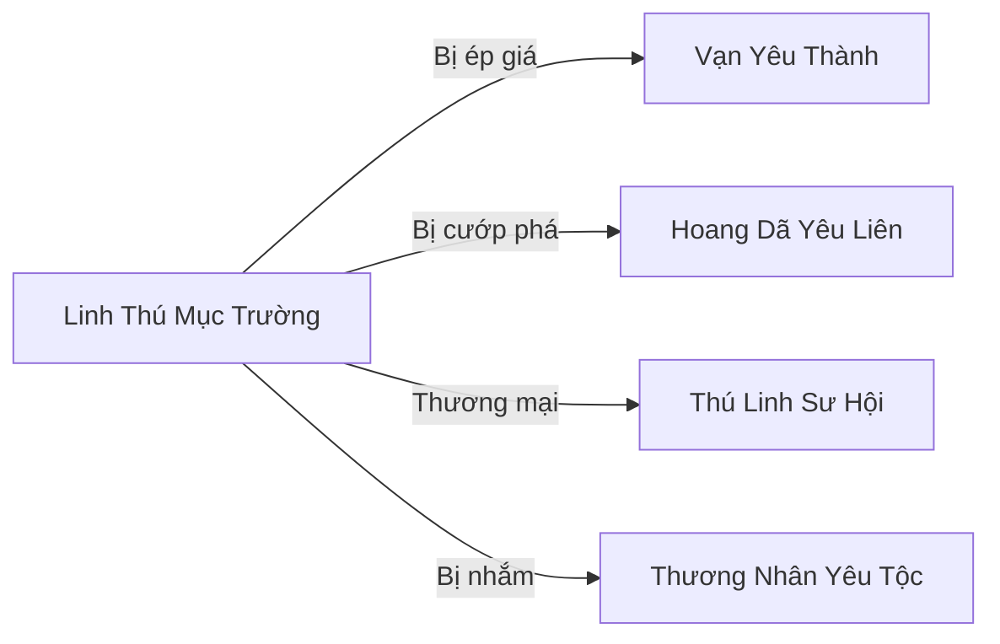

# Linh Thú Mục Trường (灵兽牧场)

## I. Tổng Quan (总览)
Linh Thú Mục Trường là một mục trường nhỏ do yêu tộc cấp thấp điều hành, chuyên chăn nuôi linh thú thuần hóa như linh dương, linh ngưu và linh thỏ. Nằm trong vùng đồng cỏ tự nhiên giữa rừng thưa Đông Hoang, cách Vạn Yêu Thành khoảng 150 dặm, mục trường là nơi cung cấp sữa linh và các sản phẩm linh thú cấp thấp cho thị trường yêu tộc. Mục Trường Chủ Ngưu Đại Lực — yêu ngưu chất phác, giỏi chăm sóc linh thú hơn chiến đấu — điều hành nơi đây với triết lý "Chăm sóc linh thú, linh thú nuôi ta," duy trì mối quan hệ cộng sinh thay vì chủ-nô với đàn linh thú.

## II. Địa Lý & Tài Nguyên (地理与资源)
Mục trường tọa lạc trên một bãi đồng cỏ linh rộng trong vùng rừng thưa Đông Hoang, có suối nước trong chảy qua cung cấp nước uống cho cả người lẫn thú. Xung quanh là rừng thưa tạo thành vành đai bảo vệ tự nhiên, che chắn gió mạnh và cản bước yêu thú hoang dã cỡ lớn. Đồng cỏ linh phì nhiêu bất thường so với khu vực xung quanh — cỏ xanh mượt, mọc nhanh, và chứa hàm lượng linh khí nhẹ giúp linh thú sinh trưởng khỏe mạnh.

Tài nguyên chính là đàn linh thú chăn nuôi khoảng 200 con các loại: linh dương cho sữa linh và lông mềm, linh ngưu cho sức kéo và thịt linh, linh thỏ cho lông và thịt. Sữa linh là sản phẩm có giá trị nhất, chứa linh khí loãng giúp tăng cường thể chất cho tu sĩ cấp thấp khi uống thường xuyên.

## III. Văn Hóa & Tín Ngưỡng (文化与信仰)
Triết lý cốt lõi: "Chăm sóc linh thú, linh thú nuôi ta" — Ngưu Đại Lực tin rằng quan hệ giữa người chăn và linh thú phải là cộng sinh thay vì chủ-nô. Linh thú được đối xử tốt sẽ cho sản phẩm chất lượng cao hơn và ít bệnh tật hơn. Quy tắc nghiêm ngặt: cấm giết linh thú đang cho sữa, cấm bán linh thú cho người lạ mà không kiểm tra mục đích sử dụng, sản phẩm phải chia đều cho mọi thành viên.

Phong tục đặc trưng: mỗi mùa xuân tổ chức "Lễ Phóng Sinh" — thả một phần linh thú con về tự nhiên, vừa để duy trì quần thể hoang dã, vừa để bày tỏ lòng biết ơn với thiên nhiên đã nuôi dưỡng đàn thú. Đây là truyền thống mà Ngưu Đại Lực rất coi trọng, dù nó làm giảm lợi nhuận.

## IV. Cơ Cấu Tổ Chức (组织结构)
Mục Trường Chủ Ngưu Đại Lực (Trúc Cơ Trung Kỳ) — yêu ngưu vạm vỡ, tính tình hiền lành, giỏi giao tiếp với linh thú bằng bản năng huyết mạch hơn bất kỳ kỹ thuật nào. Dưới trướng là 15 mục phu — yêu tộc cấp thấp thuộc các loài khác nhau (ngưu, mã, dương), chuyên chăn nuôi, vắt sữa và bảo vệ đàn linh thú. Không có phân cấp phức tạp, mọi người làm việc theo phân công hàng ngày của Ngưu Đại Lực. Mối quan hệ trong mục trường giống gia đình hơn tổ chức.

## V. Công Pháp & Trận Pháp (功法与阵法)
- **Công Pháp:** Không có công pháp chiến đấu. Yêu tộc trong mục trường sử dụng bản năng huyết mạch để giao tiếp với linh thú — một dạng cộng hưởng tự nhiên giữa yêu tộc và linh thú cùng loài hoặc gần loài. Ngưu Đại Lực có khả năng truyền cảm xúc qua tiếng rống thấp, giúp trấn an đàn thú khi hoảng loạn.
- **Trận Pháp:** Hàng rào linh lực đơn giản bao quanh mục trường, chỉ đủ ngăn linh thú đi lạc, không có giá trị phòng thủ trước tu sĩ hay yêu thú mạnh. Suối nước tự nhiên tạo thêm một lớp ranh giới.

## VI. Đặc Sản Môn Phái (门派特产)
- **Sữa Linh:** Sữa vắt từ linh dương và linh ngưu, chứa linh khí loãng, uống thường xuyên giúp tăng cường thể chất và ổn định kinh mạch cho tu sĩ cấp thấp. Hương vị béo ngậy và thanh mát.
- **Lông Linh Thú:** Lông mềm từ linh dương và linh thỏ, dùng làm bút linh, đệm ngồi tu luyện hoặc nguyên liệu dệt vải linh cấp thấp.
- **Linh Thú Thuần Hóa:** Linh thú nhỏ đã được thuần dưỡng từ bé, bán làm vật nuôi hoặc linh thú hỗ trợ cho tu sĩ cấp thấp.

## VII. Cơ Sở Hạ Tầng (基础设施)
- **Chuồng Trại:** Dãy chuồng gỗ đơn sơ dọc theo suối, chia thành khu cho linh dương, linh ngưu và linh thỏ. Sạch sẽ và thoáng mát nhờ gió rừng.
- **Nhà Ở Mục Phu:** Vài căn lều gỗ quây quần gần chuồng trại, đơn giản nhưng vững chắc, mỗi lều cho 2-3 người.
- **Kho Sữa Linh:** Hang đá nhỏ ven suối, nhiệt độ thấp tự nhiên, dùng bảo quản sữa linh trước khi vận chuyển đi bán.
- **Bãi Chăn Thả:** Đồng cỏ linh rộng được chia thành các khu luân phiên chăn thả, đảm bảo cỏ có thời gian phục hồi.

## VIII. Kinh Tế (经济)
Nguồn thu chính từ việc bán sữa linh và sản phẩm linh thú cho thương nhân Vạn Yêu Thành. Tuy sản phẩm có chất lượng tốt nhờ phương pháp chăn nuôi cộng sinh, giá bán lại bị ép xuống mức rẻ mạt vì mục trường không có sức mạnh thương lượng. Thương nhân yêu tộc từ Vạn Yêu Thành mua giá thấp rồi bán lại trong thành với giá gấp nhiều lần. Lông linh thú và linh thú thuần hóa là nguồn thu phụ nhưng không đều đặn. Tổng thu nhập chỉ đủ duy trì hoạt động và nuôi sống mục phu.

## IX. Lịch Sử Tóm Tắt (简史)
Ngưu Đại Lực vốn là một yêu ngưu bị đuổi khỏi bộ lạc vì quá yếu để chiến đấu — thân hình vạm vỡ nhưng tính tình hiền lành, không có bản năng chiến đấu của đồng tộc. Hắn lang thang cô độc cho đến khi tìm thấy đồng cỏ linh này 50 năm trước, bắt đầu thu thập linh thú hoang bị thương, chăm sóc chúng và thuần hóa dần. Tiếng lành đồn xa, các yêu tộc yếu khác — những kẻ không đủ mạnh để sống trong thành hay chiến đấu trong hoang dã — lần lượt đến phụ giúp, dần hình thành mục trường. Sản phẩm ban đầu chỉ tự cung tự cấp, sau được thương nhân Vạn Yêu Thành phát hiện và bắt đầu thu mua, nhưng luôn với giá rẻ mạt.

## X. Giai Thoại & Bí Mật (轶事与秘密)
Đồng cỏ linh nơi mục trường tọa lạc phì nhiêu bất thường — cỏ xanh mượt quanh năm, linh khí ổn định hơn hẳn khu vực xung quanh. Ngưu Đại Lực nghi ngờ rằng bên dưới đồng cỏ có thứ gì đó — có thể là mạch linh thạch nhỏ, tàn dư trận pháp cổ, hoặc thậm chí xác của một linh thú thượng cổ đang phân hủy và nuôi dưỡng đất — nhưng hắn không đủ sức và kiến thức để tìm hiểu.

Một thương nhân yêu tộc có thế lực trong Vạn Yêu Thành đang âm thầm lên kế hoạch thôn tính mục trường — hắn nhận ra giá trị thực sự của đồng cỏ linh vượt xa việc chăn nuôi thông thường, và muốn chiếm đoạt vùng đất này để khai thác bí mật bên dưới. Ngưu Đại Lực chưa hay biết gì về mối nguy đang đến gần.

## XI. Quan Hệ Thế Lực (势力关系)

