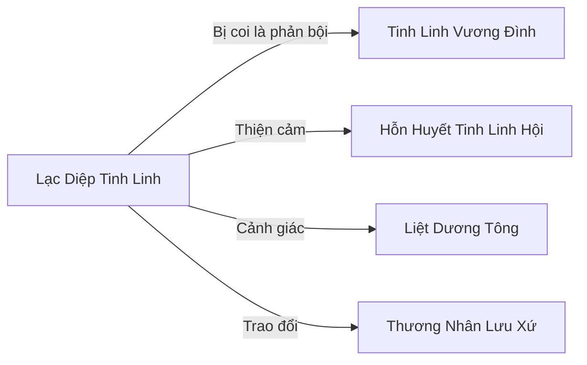

# Lạc Diệp Tinh Linh (落叶精灵)

## I. Tổng Quan (总览)
Lạc Diệp Tinh Linh là một cộng đồng nhỏ gồm 35 Tinh Linh lưu vong sống ẩn dật trong khu Rừng Lá Vàng kỳ lạ ở rìa phía tây Hỏa Vân Sơn — nơi cây cối luôn ở trạng thái "mùa thu vĩnh cửu," lá vàng rơi không ngừng nhưng cây không bao giờ trụi. Được sáng lập bởi Trưởng Lão Diệp Thu Thanh — nữ Tinh Linh bị Vương Đình trục xuất vì dám phản đối chính sách cô lập — cộng đồng này đại diện cho một triết lý sống khác biệt: Tinh Linh nên hòa nhập với thế giới thay vì đóng cửa trong Sâm Lâm. Với triết lý "Lá rơi không phải chết, mà là trở về đất," họ chấp nhận sự suy tàn như một phần tất yếu của vòng tuần hoàn.

## II. Địa Lý & Tài Nguyên (地理与资源)
Rừng Lá Vàng nằm ở rìa phía tây Hỏa Vân Sơn, nơi địa nhiệt từ núi lửa và linh khí tự nhiên kết hợp tạo ra một hiện tượng sinh thái độc đáo — cây luôn trong trạng thái mùa thu, lá vàng rơi liên tục nhưng tán cây luôn đầy đặn. Ánh sáng lọc qua tán lá tạo nên sắc hổ phách mê hoặc, toàn bộ khu rừng bao trùm trong bầu không khí u tịch nhưng ấm áp. Nhà của Tinh Linh là những tổ bện bằng cành và lá, treo trên cây như tổ chim lớn, hòa nhập hoàn toàn với cảnh quan.

Tài nguyên chính là lá vàng linh — lá rụng chứa linh khí loãng, dùng pha trà linh cấp thấp hoặc vẽ phù đơn giản. Nhựa cây mùa thu là chất keo tự nhiên quý hiếm dùng liên kết pháp khí cấp thấp. Dù sức mạnh yếu so với Tinh Linh Vương Đình, các thành viên vẫn giữ kỹ năng thảo mộc bẩm sinh — có thể kích thích cây cối sinh trưởng ở mức cơ bản, đủ để duy trì hệ sinh thái rừng.

## III. Văn Hóa & Tín Ngưỡng (文化与信仰)
Triết lý cốt lõi: "Lá rơi không phải chết, mà là trở về đất." Cộng đồng chấp nhận sự suy tàn như một phần thiêng liêng của vòng tuần hoàn, không oán hận số phận bị trục xuất mà coi đó là cơ hội để bắt đầu lại. Quy tắc nghiêm ngặt: không chặt cây sống, không dùng lá vàng linh cho mục đích sát sinh, sống giản dị không tích trữ quá mức cần thiết.

Phong tục quan trọng nhất là "Lạc Diệp Tế" — mỗi năm vào ngày lá rụng nhiều nhất, cả cộng đồng tụ tập dưới tán rừng, đứng giữa trận mưa lá vàng và cùng hát bài ca tạ ơn rừng cây. Bài ca được truyền lại từ Diệp Thu Thanh, giai điệu u buồn nhưng đầy sức sống, tượng trưng cho sự kiên cường của những kẻ bị lãng quên.

## IV. Cơ Cấu Tổ Chức (组织结构)
Trưởng Lão Diệp Thu Thanh — nữ Tinh Linh tóc vàng nhạt, dáng vẻ u buồn nhưng ấm áp, bị Vương Đình trục xuất vì công khai phản đối chính sách cô lập, dẫn theo những Tinh Linh cùng chí hướng rời đi. Phó Trưởng Lão là Phong Diệp (Trúc Cơ Trung Kỳ) — Tinh Linh nam trầm lặng, giỏi phép thuật phong hệ, phụ trách phòng thủ khu rừng. Bên dưới là 35 Tinh Linh từ tầng Luyện Khí đến Trúc Cơ Sơ Kỳ, bao gồm cả trẻ em Tinh Linh. Ngoài ra có một số "Bạn Rừng" — linh thú nhỏ như sóc linh và chim linh sống cùng cộng đồng, giúp canh gác và đưa tin.

## V. Công Pháp & Trận Pháp (功法与阵法)
- **Công Pháp:** "Lạc Diệp Quy Căn Quyết" — phiên bản đơn giản hóa của công pháp Tinh Linh Vương Đình, chuyên tu luyện mộc hệ linh lực. Công pháp này nhấn mạnh sự thuận theo tự nhiên, hấp thu linh khí từ cây cối và đất rừng thay vì cưỡng ép. Hạn chế lớn nhất: chỉ đủ tu đến Trúc Cơ Viên Mãn, không thể đột phá Kim Đan, vì thiếu phần cốt lõi mà Vương Đình giữ bí mật.
- **Trận Pháp:** "Thiên Diệp Mê Lâm" — trận pháp phòng thủ đặc trưng, điều khiển lá rụng tạo thành bão lá che khuất tầm nhìn và đánh lạc hướng kẻ xâm nhập. Kết hợp phong hệ phép thuật của Phong Diệp, trận pháp này có thể khiến kẻ lạc vào rừng quay vòng hàng giờ mà không tìm được lối ra.

## VI. Đặc Sản Môn Phái (门派特产)
- **Trà Lá Vàng:** Trà pha từ lá vàng linh rụng tự nhiên, vị thanh nhạt, có tác dụng an thần và thanh lọc tạp niệm nhẹ. Được một số tu sĩ ưa chuộng để uống khi nhập định.
- **Nhựa Thu Liên Kết:** Chất keo tự nhiên từ nhựa cây mùa thu, dùng để liên kết các bộ phận pháp khí cấp thấp, có đặc tính mộc hệ giúp ổn định linh lực trong vật phẩm.
- **Phù Lá Vàng:** Phù lục đơn giản vẽ trên lá vàng linh, hiệu quả yếu nhưng chi phí gần như bằng không, phổ biến trong giới tu sĩ nghèo.

## VII. Cơ Sở Hạ Tầng (基础设施)
- **Tổ Cây:** Nhà ở chính của cộng đồng — những tổ lớn bện bằng cành và lá, treo trên các cây cổ thụ, mỗi tổ chứa một gia đình hoặc 2-3 cá nhân. Kiến trúc hòa nhập hoàn toàn với rừng.
- **Sân Tế Lễ:** Khoảng đất trống giữa rừng nơi tổ chức Lạc Diệp Tế và các buổi họp cộng đồng, luôn được phủ một lớp lá vàng dày.
- **Vườn Ươm:** Khu vực nhỏ nơi Diệp Thu Thanh chăm sóc các loại cây con và thử nghiệm trồng trọt, cũng là nơi bà bí mật bảo quản hạt giống Cây Thế Giới.

## VIII. Kinh Tế (经济)
Kinh tế tự cấp tự túc là chính. Cộng đồng thu hái lá vàng linh và nhựa cây mùa thu để trao đổi với các thương nhân du hành lấy nhu yếu phẩm mà rừng không cung cấp được: vải, kim loại, muối. Trà Lá Vàng là sản phẩm có nhu cầu ổn định nhưng khối lượng nhỏ, đủ để duy trì cuộc sống giản dị. Đôi khi, một số Tinh Linh cung cấp dịch vụ kích thích thảo mộc sinh trưởng cho nông dân hoặc dược sư bên ngoài để đổi lấy vật phẩm cần thiết. Cộng đồng không có tích lũy tài sản, sống theo nguyên tắc vừa đủ.

## IX. Lịch Sử Tóm Tắt (简史)
Hai trăm năm trước, Diệp Thu Thanh — khi đó là một nữ Tinh Linh có địa vị trong Vương Đình — công khai phản đối chính sách cô lập của Tinh Linh Vương, cho rằng việc đóng cửa Sâm Lâm sẽ khiến tộc Tinh Linh dần thoái hóa. Bà bị trục xuất cùng 12 Tinh Linh ủng hộ và bị tuyên bố là kẻ phản bội. Dẫn đoàn đi lang thang, Diệp Thu Thanh tìm đến rìa Hỏa Vân Sơn và phát hiện khu Rừng Lá Vàng — bà cảm thấy đây là nơi dành cho những kẻ bị lãng quên, nơi cây cối không chết dù lá liên tục rơi. Từ 12 người ban đầu, cộng đồng phát triển thành 35, chủ yếu nhờ tiếp nhận Tinh Linh lạc lõng và trẻ em Tinh Linh mồ côi mà Vương Đình không thèm tìm kiếm.

## X. Giai Thoại & Bí Mật (轶事与秘密)
Diệp Thu Thanh mang theo một hạt giống từ Cây Thế Giới khi rời Vương Đình — nhỏ bé và yếu ớt, chỉ bằng đầu ngón tay, nhưng nếu trồng đúng cách có thể mọc thành một Cây Thế Giới nhỏ, tạo ra Sâm Lâm mới cho tộc Tinh Linh tái sinh. Đây là bí mật lớn nhất của bà và là lý do bà kiên trì tìm kiếm vùng đất có đủ linh khí để gieo trồng. Nếu Vương Đình biết bà lấy đi hạt giống thiêng, hậu quả sẽ khôn lường.

Khu Rừng Lá Vàng thực ra không tự nhiên hình thành — dưới lòng đất có một trận pháp cổ đại đang chậm rãi biến đổi linh khí, khiến cây luôn ở trạng thái mùa thu. Ai tạo ra trận pháp này, vì mục đích gì, và liệu nó có liên quan đến một nền văn minh cổ đại đã biến mất hay không — tất cả vẫn là bí ẩn mà ngay cả Diệp Thu Thanh cũng chưa giải đáp được.

Một hiện tượng kỳ lạ mới xuất hiện: gần đây, lá vàng rụng trong Rừng Lá Vàng bắt đầu có vệt đỏ — không phải do bệnh mà như thể rừng đang chuyển từ "mùa thu vĩnh cửu" sang một trạng thái mới. Diệp Thu Thanh lo lắng rằng trận pháp cổ đại dưới đất đang thay đổi, và sự thay đổi này có thể liên quan đến hoạt động gia tăng của Hỏa Vân Sơn gần đó. Bà đã gửi mẫu lá đỏ cho Dược Thảo Tinh Linh Viện phân tích, nhưng kết quả chưa có. Nếu rừng biến đổi hoàn toàn, nơi trú ẩn duy nhất của cộng đồng sẽ không còn an toàn.

## XI. Quan Hệ Thế Lực (势力关系)

