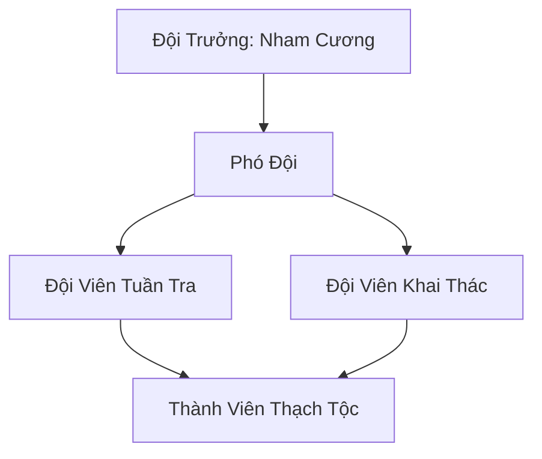

# NHAM THẠCH TIỂU ĐỘI (岩石小队)

> *"Đá không nói, nhưng đá luôn đứng — khi bão tan, khi tuyết tan, khi cả thế giới thay đổi, đá vẫn đứng."*
> — Nham Cương, khắc lên vách hang ngày thành lập đội

## I. Tổng Quan (总览)
Nham Thạch Tiểu Đội là một đơn vị vũ trang nhỏ gồm mười tám cá thể Thạch Tộc cư ngụ tại vùng núi đá hoang sơ phía đông Đông Hoang. Với bản tính trầm lặng, kiên nhẫn và vô cùng kỷ luật, tiểu đội này tự nguyện gánh vác trọng trách bảo vệ vùng núi khỏi những thợ săn linh thạch tham lam và những tu sĩ quấy nhiễu. Dù quy mô khiêm tốn, nhưng sức phòng thủ của mỗi thành viên — nhục thân cứng hơn thép, chịu được cả phù hỏa lẫn kiếm khí Trúc Cơ — cùng khả năng phối hợp địa hình khiến họ trở thành vật cản đáng gờm cho bất kỳ kẻ xâm nhập nào. Nham Cương thường nói với đội viên: "Mười tám tảng đá biết đi, hợp lại thành bức tường không ai phá nổi."

## II. Địa Lý & Tài Nguyên (地理与资源)
Trụ sở là Hang Nham Thạch — hang đá tự nhiên nằm sâu trong vách núi "Thiết Sơn Nham" thuộc dãy núi phía đông, nơi có địa hình hiểm trở và ít người qua lại. Lối vào hang được ngụy trang bằng các khối đá lớn xếp tinh vi, nhìn bên ngoài chỉ thấy vách đá bình thường — phải biết cách xoay tảng đá thứ ba từ trái sang mới mở được lối. Vùng núi này nghèo nàn về linh khí tiên đạo nhưng lại chứa đựng nhiều loại khoáng chất thô và linh thạch cấp thấp, vốn là nguồn thức ăn và năng lượng chính của Thạch Tộc — đặc biệt là "Huyền Thiết Khoáng" có vân đen bóng, giàu thổ linh khí, được Nham Cương coi là "bữa tiệc" mỗi khi tìm được. Nước mưa đọng trong các hốc đá tạo thành "Thiên Trì Tiểu" — hồ nước nhỏ trên đỉnh núi cung cấp nước cho sinh vật cộng sinh xung quanh hang và là nơi Thạch Tộc đôi khi đến "tắm rửa" bằng cách ngâm mình cho rêu bám trên người rụng đi.

## III. Văn Hóa & Tín Ngưỡng (文化与信仰)
Tôn thờ Sự Bền Bỉ và Tĩnh Lặng — hai đức tính mà Thạch Tộc coi là cao quý nhất. Triết lý của đội là "Đá không nói, nhưng đá luôn đứng," khắc trên vách hang bằng chữ Thạch Tộc cổ — mỗi nét chữ sâu một thốn, rộng ba phân, đẹp như tác phẩm điêu khắc. Họ không có tôn giáo phức tạp, chỉ tôn trọng những thực thể có sức mạnh địa mạch to lớn và coi Thạch Linh Cung là thánh địa chủng tộc. Nghi thức quan trọng nhất là "Khắc Đá Ghi Danh" — khi một thành viên mới gia nhập, toàn đội tụ tập trong Đại Sảnh Hang, và tân binh phải đục hình tượng của mình vào vách đá bằng tay không, thề nguyện gắn bó với đội cho đến khi thân xác tan thành cát bụi. Mỗi bức phù điêu ghi danh đều mang phong cách riêng của người khắc — có cái thô ráp mạnh mẽ, có cái tinh tế bất ngờ — tạo thành bộ sưu tập chân dung đá độc đáo nhất Đông Hoang.

## IV. Cơ Cấu Tổ Chức (组织结构)


Nham Cương đứng đầu — Thạch Tộc cao hai mét rưỡi, toàn thân bằng đá hoa cương xám đen, vân đá tạo thành hoa văn tự nhiên trông như giáp sắt. Ông ít nói, mỗi câu ngắn gọn như khắc trên đá, nhưng mỗi lời đều nặng như tảng đá ngàn cân. Hai phó đội phụ trách hai mảng: tuần tra bảo vệ lãnh thổ và khai thác khoáng thạch. Mười lăm đội viên chia thành ba tổ luân phiên: tổ tuần tra ban ngày, tổ canh gác ban đêm, và tổ nghỉ ngơi hấp thụ khoáng chất. Kỷ luật nghiêm minh — kẻ nào bỏ trực mà không có lý do chính đáng sẽ bị "phạt đứng" ba ngày giữa trời — hình phạt tưởng nhẹ nhưng với Thạch Tộc, đứng im bất động ba ngày giữa nắng gió mà không được hấp thụ khoáng chất là cực kỳ khó chịu.

## V. Công Pháp & Trận Pháp (功法与阵法)
- **Công Pháp:** Thạch Tộc không sử dụng công pháp nhân tạo mà tu luyện thông qua *Đại Địa Thôn Phệ Thuật* — hấp thụ tinh hoa khoáng thạch trực tiếp qua nhục thân, gia tăng độ cứng và sức mạnh vật lý theo thời gian. Quá trình này cực kỳ chậm — mỗi năm nhục thân cứng thêm một phần nghìn — nhưng tích lũy qua hàng trăm năm thì đáng kinh ngạc: nhục thân Nham Cương hiện tại đã chịu được ba đòn Trúc Cơ Viên Mãn mà chỉ nứt nhẹ.
- **Trận Pháp:** *Địa Mạch Cộng Hưởng Trận* — trận pháp sơ cấp do Nham Cương học được từ Thạch Linh Cung, cho phép các thành viên chia sẻ sát thương vật lý cho nhau thông qua mặt đất. Khi kích hoạt, toàn bộ mười tám Thạch Tộc đứng trên cùng một mặt đá sẽ được kết nối, mỗi đòn đánh vào một người sẽ bị phân tán cho mười tám người cùng chịu — biến cả đội thành một khối đá thống nhất không thể tách rời, một bức tường sống mà kiếm không chém được, lửa không đốt cháy.

## VI. Đặc Sản Môn Phái (门派特产)
- **Đá Mài Linh Lực "Nham Cương Thạch":** Loại đá có độ cứng cực cao, chỉ tìm thấy ở vùng núi nơi Thạch Tộc sinh sống, dùng để mài sắc vũ khí kim loại — một lần mài bằng Nham Cương Thạch giúp kiếm giữ sắc gấp mười lần đá mài thường, thợ rèn tại Thần Khí Phường đặt mua với giá ba viên linh thạch hạ phẩm một miếng.
- **Linh Thạch Thô:** Các khối linh thạch chưa qua tinh luyện nhưng có nồng độ thổ linh khí cao, phù hợp cho tu sĩ thổ hệ tu luyện hoặc dùng làm lõi trận pháp phòng ngự cấp thấp.
- **Phù Điêu Đá Ghi Danh:** Thỉnh thoảng, khách đến xin Thạch Tộc khắc phù điêu theo yêu cầu — kỹ thuật điêu khắc của Thạch Tộc tinh xảo vì họ dùng tay không thay vì dụng cụ, cảm nhận từng thớ đá bằng linh giác. Sản phẩm này không bán chính thức nhưng giá trị nghệ thuật rất cao.

## VII. Cơ Sở Hạ Tầng (基础设施)
- **Hang Nham Thạch:** Hang động tự nhiên kiên cố nằm sâu trong vách Thiết Sơn Nham, lối vào được ngụy trang bằng cơ chế xoay đá. Bên trong chia ba khu: Đại Sảnh trung tâm nơi họp bàn và thực hiện nghi lễ Khắc Đá Ghi Danh, khu nghỉ ngơi nơi Thạch Tộc đứng bất động hấp thụ khoáng chất (họ không nằm ngủ theo cách thông thường), và kho quặng nơi cất giữ khoáng thạch thu thập được.
- **Bệ Tế Tổ:** Khối đá vuông lớn giữa Đại Sảnh, mặt trên phẳng lì do nhiều thế hệ Thạch Tộc mài nhẵn qua hàng trăm năm, là trung tâm nghi lễ và nơi kích hoạt Địa Mạch Cộng Hưởng Trận.
- **Tuyến Tuần Tra:** Ba tuyến đường mòn trên núi nối Hang Nham Thạch với ba hướng chính, đánh dấu bằng ký hiệu khắc trên đá mà chỉ Thạch Tộc mới nhận ra — mỗi ký hiệu cho biết tuyến đường an toàn, nguy hiểm, hoặc có kẻ lạ đã đi qua.

## VIII. Kinh Tế (经济)
Kinh tế mang tính trao đổi vật phẩm là chính, đơn giản như chính bản tính Thạch Tộc. Tiểu đội đổi quặng thô và linh thạch nhặt được cho thợ rèn tại Thần Khí Phường hoặc thương nhân đi ngang để lấy kim loại tinh luyện — "món ăn cao cấp" của Thạch Tộc, vì hấp thụ kim loại tinh luyện giúp nhục thân cứng nhanh hơn hàng chục lần so với khoáng thạch thô thông thường. Ngoài ra, đội nhận thu phí hướng đạo vùng núi cho tán tu và thương đội muốn đi qua an toàn — Thạch Tộc biết rõ từng khe nứt, từng hang động, từng đường mòn trên dãy núi mà không sinh vật nào khác biết. Thu nhập không lớn nhưng đủ để duy trì cuộc sống — Thạch Tộc không cần quần áo, không cần nhà ở (hang đá là đủ), nhu cầu vật chất gần như bằng không ngoài khoáng thạch.

## IX. Lịch Sử Tóm Tắt (简史)
Được hình thành ba mươi năm trước khi Nham Cương — Thạch Tộc lang thang sau khi rời Thạch Linh Cung để "thấy thế giới bên ngoài" — tập hợp các cá thể Thạch Tộc rải rác trong vùng núi để cùng nhau sinh tồn. Ban đầu chỉ có năm thành viên sống co cụm trong hang nhỏ, dần dần tiếng tăm về đội tuần tra Thạch Tộc kiên cường lan ra, thu hút thêm thành viên. Từ một nhóm nhỏ lẻ, họ đã xây dựng nên hệ thống tuần tra bài bản và giữ cho vùng núi thoát khỏi sự nhòm ngó của các toán cướp nhỏ và thợ khai thác trái phép. Sự kiện quan trọng nhất là mười năm trước khi tiểu đội đẩy lùi một đoàn khai thác năm mươi người của Sa Tặc Liên Minh — mười tám Thạch Tộc kích hoạt Địa Mạch Cộng Hưởng Trận đứng chắn lối vào thung lũng, Sa Tặc dùng hết mọi cách vẫn không phá nổi "bức tường đá sống" đó, cuối cùng phải rút lui tay trắng.

## X. Giai Thoại & Bí Mật (轶事与秘密)
Nham Cương từng phát hiện một vết nứt sâu trong lòng núi dẫn đến không gian mà ông gọi là "Long Mạch Chi Tâm" — một hang động khổng lồ nơi thổ linh khí đậm đặc đến mức không khí đặc quánh như sương, và đá trên tường hang phát ra ánh sáng vàng nhạt. Ông bí mật phong tỏa lối vào bằng cách xếp ba tảng đá nặng hàng vạn cân chắn kín, vì hiểu rằng nếu tin tức lộ ra, các đại tông phái sẽ kéo đến tranh đoạt và tiểu đội nhỏ bé không thể chống đỡ. Ông chỉ tiết lộ bí mật này cho phó đội với lời dặn: "Nếu ta chết, hãy giữ bí mật này đến chết. Long Mạch Chi Tâm không thuộc về ai — nó thuộc về đất."

Ngoài ra, Khiên Đá Thạch Anh — pháp bảo duy nhất của đội — thực chất là một mảnh vỡ từ pháp bảo cổ đại mà Nham Cương tìm thấy gần Long Mạch Chi Tâm. Khiên chỉ còn một phần mười sức mạnh nguyên bản nhưng vẫn đủ chắn ba đòn Kim Đan — nếu phục hồi hoàn toàn, đây có thể là pháp bảo cấp Nguyên Anh.

## XI. Quan Hệ Thế Lực (势力关系)
```mermaid
graph LR
    NTTĐ[Nham Thạch Tiểu Đội] -- Tôn kính -- SLC[Thạch Linh Cung]
    NTTĐ -- Giao thương -- TKP[Thần Khí Phường]
    NTTĐ -- Cảnh giác -- STLM[Sa Tặc Liên Minh]
    NTTĐ -- Trung lập -- ALL[Mọi Thế Lực]
```

- **Thạch Linh Cung:** Thánh địa trong lòng mọi Thạch Tộc — Nham Cương từng tu học tại đây trước khi ra ngoài, vẫn giữ mối liên hệ kính trọng và thỉnh thoảng gửi quặng quý về cống nạp.
- **Thần Khí Phường:** Đối tác thương mại chính — thợ rèn tại Phường mua quặng thô và đá mài với giá ổn định, đổi lại cung cấp kim loại tinh luyện mà Thạch Tộc rất thích "ăn." Trưởng Phường từng nói: "Giao dịch với Thạch Tộc là dễ nhất — họ không mặc cả, không lừa đảo, nói một là một."
- **Sa Tặc Liên Minh:** Mối đe dọa thường trực — bọn Sa Tặc biết vùng núi có quặng quý và linh thạch, nhiều lần cố xâm nhập nhưng đều bị đẩy lùi. Chúng gọi Nham Thạch Tiểu Đội là "Mười Tám La Hán Đá" với giọng vừa ghét vừa sợ.
