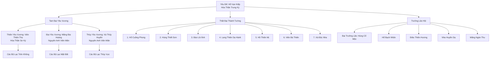

# Thiên Yêu Đình (天妖庭)

## I. Tổng Quan (总览)

Thiên Yêu Đình là thế lực Thượng Cổ hùng mạnh nhất Đông Hoang, thống nhất hàng trăm bộ lạc yêu tộc lớn nhỏ dưới quyền cai trị của Yêu Đế. Đây là liên minh bộ lạc hoạt động theo nguyên tắc "sức mạnh quyết định tất cả" — kẻ mạnh nhất đánh bại tất cả thủ lĩnh khác để lên ngôi Yêu Đế, cai trị toàn bộ yêu tộc trên lục địa. Dưới Yêu Đế là Tam Đại Yêu Vương cai quản ba vùng (Trời, Đất, Nước), Thất Đại Thánh Tướng thống lĩnh quân đội, và Trưởng Lão Hội nắm giữ bí thuật Thượng Cổ. Với quy mô 12.000 yêu tộc trực tiếp và vô số bộ lạc phụ thuộc, Thiên Yêu Đình là cột trụ của trật tự Đông Hoang, đối trọng với các tông phái nhân tộc và là nỗi kinh hoàng của bất kỳ kẻ nào dám xâm phạm lãnh thổ rừng rậm.

## II. Địa Lý & Tài Nguyên (地理与资源)

Thiên Yêu Đình chiếm giữ phần lớn rừng rậm nguyên sinh Đông Hoang — vùng đất rộng lớn trải dài từ trung tâm đến biên giới phía nam, bao gồm núi cao, thung lũng sâu, sông suối và đầm lầy. Trụ sở chính Vạn Yêu Cốc nằm sâu trong một thung lũng khổng lồ, được bao bọc bởi rừng cổ thụ và mạch linh khí mạnh mẽ — nơi Yêu Đế ngự trị. Tài nguyên cực kỳ phong phú: linh mộc thượng hạng, dược thảo hoang dã, yêu đan từ linh thú cấp thấp, và đặc biệt là các mạch linh khí nguyên thủy chưa bị khai thác — nguồn năng lượng lý tưởng cho tu luyện luyện thể và thức tỉnh huyết mạch. Huyết Tế Đài và Thánh Thụ Hóa Hình là hai địa điểm chiến lược quan trọng nhất.

## III. Văn Hóa & Tín Ngưỡng (文化与信仰)

Văn hóa Thiên Yêu Đình xoay quanh bản năng nguyên thủy và sức mạnh tuyệt đối. "Kẻ mạnh là vua, kẻ yếu phục tùng" — nguyên tắc này không phải tàn bạo mà là luật tự nhiên mà yêu tộc tôn thờ. Yêu Đế lên ngôi bằng cách đánh bại tất cả đối thủ tại Huyết Tế Đài trong lễ "Thiên Yêu Đăng Cực" — nghi lễ linh thiêng nhất, diễn ra khi Yêu Đế cũ qua đời hoặc bị thách thức. Thánh Thụ Hóa Hình là cây cổ thụ Thượng Cổ ban phát năng lượng giúp yêu tộc hóa hình người khi đạt cảnh giới cao — nghi lễ hóa hình đánh dấu sự trưởng thành và được tổ chức long trọng. Dù hoang dã, yêu tộc vẫn có lòng trung thành sâu sắc với đồng tộc, coi bộ lạc là gia đình và coi Đông Hoang là thánh địa không thể để kẻ ngoài xâm phạm.

## IV. Cơ Cấu Tổ Chức (组织结构)



Thiên Yêu Đình tổ chức theo hình thức Liên Minh Bộ Lạc, nơi sức mạnh quyết định mọi thứ. Yêu Đế Hổ Vạn Kiếp (Hóa Thần Trung Kỳ) là kẻ mạnh nhất, đánh bại tất cả đối thủ để lên ngôi. Bên dưới, Tam Đại Yêu Vương cai quản ba vùng lớn: Viên Thiên Thọ (Thiên Yêu Vương, Hóa Thần Sơ Kỳ) quản Trời, Mãng Địa Hoàng (Địa Yêu Vương, Nguyên Anh Viên Mãn) quản Đất, Xà Thủy Huyền (Thủy Yêu Vương, Nguyên Anh Viên Mãn) quản Nước. Thất Đại Thánh Tướng là bảy chiến binh xuất sắc nhất, thống lĩnh quân đội trong chiến tranh. Trưởng Lão Hội gồm Đại Trưởng Lão Hùng Cổ Mộc và bốn Trưởng Lão, là những yêu tu lớn tuổi am hiểu bí thuật Thượng Cổ, đóng vai trò cố vấn. Bên dưới là hàng trăm thủ lĩnh bộ lạc, mỗi người cai quản một nhánh yêu tộc.

## V. Công Pháp & Trận Pháp (功法与阵法)

Hệ thống tu luyện của Thiên Yêu Đình chuyên về Luyện Thể và Thức Tỉnh Huyết Mạch — ít chú trọng phép thuật tinh tế mà tập trung vào bùng nổ sức mạnh nguyên thủy. Hai công pháp chấn phái là "Thiên Yêu Thể" (cường hóa thể xác đến giới hạn tuyệt đối) và "Huyết Mạch Phản Tổ Quyết" (thức tỉnh huyết mạch cổ đại của tổ tiên, khai mở sức mạnh ẩn giấu trong gen). Yêu tộc cảnh giới cao có thể "Hóa Hình" — biến thành hình người nhờ năng lượng từ Thánh Thụ Hóa Hình, đây là dấu mốc tu luyện quan trọng nhất. Về trận pháp, "Thiên Yêu Huyết Mạch Trận" là đại trận cấp tối cao, huy động huyết mạch của hàng ngàn yêu tộc tạo thành lớp phòng thủ sinh học khổng lồ — trận pháp sống, không cần linh thạch mà dùng chính sinh mạng yêu tộc làm năng lượng.

## VI. Đặc Sản Môn Phái (门派特产)

Thiên Yêu Đình không sản xuất hàng hóa theo nghĩa truyền thống, nhưng sở hữu nhiều tài nguyên độc quyền. "Huyết Mạch Đan" — đan dược chế từ huyết dịch yêu tộc thuần huyết, có thể kích thích đột phá huyết mạch — là vật phẩm quý hiếm mà các thế lực bên ngoài khao khát. Nhựa Thánh Thụ Hóa Hình có tác dụng hỗ trợ biến hóa hình dạng, cực kỳ hiếm. Yêu Đan từ yêu thú hoang dã trong rừng rậm Đông Hoang có phẩm chất cao hơn bất kỳ nơi nào khác nhờ linh khí nguyên thủy. Ngoài ra, bí thuật Thượng Cổ mà Trưởng Lão Hội nắm giữ là kho tàng tri thức không thể đo đếm bằng linh thạch.

## VII. Cơ Sở Hạ Tầng (基础设施)

Vạn Yêu Cốc là trung tâm quyền lực — thung lũng khổng lồ được cải tạo thành cung điện tự nhiên, với hang động làm điện chính, vách đá khắc hình yêu thú Thượng Cổ, và mạch linh khí tuôn chảy như sông dưới lòng đất. Huyết Tế Đài là đấu trường lộ thiên nằm trên đỉnh núi, nơi các Yêu Vương quyết đấu giành quyền lực — nền đá thấm đẫm huyết dịch hàng vạn năm, tỏa ra sát khí bao trùm vạn dặm. Thánh Thụ Hóa Hình là cây cổ thụ Thượng Cổ đứng giữa rừng thiêng, quanh năm tỏa ra năng lượng biến hóa — yêu tộc đến đây khi đủ cảnh giới để hoàn thành nghi lễ hóa hình. Mỗi bộ lạc trực thuộc có lãnh thổ riêng với hang ổ, bãi săn và vùng tu luyện do thủ lĩnh bộ lạc quản lý.

## VIII. Kinh Tế (经济)

Kinh tế Thiên Yêu Đình vận hành theo mô hình cống nạp phong kiến — các bộ lạc trực thuộc định kỳ cống nạp tài nguyên (yêu đan, dược thảo, linh mộc, vật liệu quý) cho Yêu Đế Cung, đổi lại nhận sự bảo hộ quân sự. Giao thương với bên ngoài chủ yếu qua Vạn Yêu Thành — yêu tộc bán tài nguyên rừng rậm và yêu đan, mua về vũ khí, pháp khí và vật phẩm tu luyện mà tự mình không chế tạo được. Kinh tế không dựa trên linh thạch mà dựa trên tài nguyên thực — thịt, da, xương, dược thảo và lãnh thổ. Đây là nền kinh tế tự nhiên, ít phụ thuộc vào thị trường bên ngoài nhưng cũng không tạo ra thặng dư lớn.

## IX. Lịch Sử Tóm Tắt (简史)

Thiên Yêu Đình là một trong những thế lực lâu đời nhất Cố Nguyên Giới, thành lập từ thời Thượng Cổ khi yêu tộc còn là chủng tộc thống trị lục địa. Trước khi nhân tộc trỗi dậy, Thiên Yêu Đình từng thống trị toàn bộ Đông Hoang và một phần vùng Trung Tâm, là bá chủ không ai thách thức. Tuy nhiên, qua nhiều cuộc chiến lớn với nhân tộc, Vu Tộc và Cự Tộc, lãnh thổ bị thu hẹp dần. Đặc biệt, Đại Chiến Nhân-Yêu hàng ngàn năm trước đã buộc Đình phải rút về Đông Hoang, thiết lập ranh giới rõ ràng và chấp nhận chia sẻ lục địa. Kể từ đó, Thiên Yêu Đình duy trì vị thế bá chủ Đông Hoang bằng sức mạnh quân sự áp đảo, nhưng không còn tham vọng bành trướng ra ngoài. Yêu Đế hiện tại — Hổ Vạn Kiếp — lên ngôi 800 năm trước sau khi đánh bại Yêu Đế đời trước tại Huyết Tế Đài, đưa Đình vào thời kỳ ổn định và hưng thịnh.

## X. Giai Thoại & Bí Mật (轶事与秘密)

Thánh Thụ Hóa Hình không chỉ là cây cổ thụ ban phát năng lượng — có tin đồn rằng nó là tàn dư của một Thần Thú Thượng Cổ đã hóa thành cây sau khi chết, và năng lượng hóa hình thực chất là ý chí tàn dư của Thần Thú đang dần tiêu tán. Nếu đúng, một ngày nào đó Thánh Thụ sẽ mất hết năng lượng, và yêu tộc sẽ không còn khả năng hóa hình — đây là mối nguy tồn vong mà Trưởng Lão Hội giữ kín tuyệt đối.

Hùng Cổ Mộc — Đại Trưởng Lão — là yêu tu duy nhất nhớ được ký ức Thượng Cổ thông qua huyết mạch phản tổ. Trong ký ức đó, hắn thấy cảnh Yêu Đế đời đầu ký kết một hiệp ước bí mật với thế lực không rõ danh tính — nội dung hiệp ước liên quan đến lý do thật sự tại sao yêu tộc rút về Đông Hoang, và đó không phải vì thua trận.

Trong Thất Đại Thánh Tướng, Hồ Thiên Mị (Thánh Tướng Thứ Năm) bí mật duy trì mạng lưới gián điệp xâm nhập vào các tông phái nhân tộc thông qua khả năng mê hoặc và hóa hình — thông tin thu thập được chỉ báo cáo trực tiếp cho Yêu Đế, bỏ qua cả Tam Đại Yêu Vương.

## XI. Quan Hệ Thế Lực (势力关系)

```mermaid
graph LR
    TYĐ[Thiên Yêu Đình] -- Đồng minh -- TLVĐ[Tinh Linh Vương Đình]
    TYĐ -- Đối đầu -- CHKT[Cửu Hoa Kiếm Tông]
    TYĐ -- Căng thẳng -- BTST[Bách Thú Sơn Trang]
    TYĐ -- Liên kết -- VYT[Vạn Yêu Thành]
    TYĐ -- Giám sát -- TAM[Thái Ất Môn]
    TYĐ -- Tử địch -- TVTL[Tử Vong Chi Thung Lũng]
```

- **Tinh Linh Vương Đình:** Đồng minh truyền thống lâu đời nhất, cùng tôn trọng tự nhiên và bảo vệ Đông Hoang. Hai bên chia sẻ lãnh thổ rừng rậm và thỉnh thoảng phối hợp chống lại kẻ xâm nhập từ bên ngoài. Tuy nhiên, quan hệ thiên về tôn trọng lẫn nhau hơn là liên minh quân sự chặt chẽ.
- **Cửu Hoa Kiếm Tông:** Đối đầu truyền thống giữa yêu tộc và nhân tộc Chính Đạo. Không phải tử địch nhưng luôn cảnh giác — Cửu Hoa từng nhiều lần trấn áp yêu tộc xâm phạm biên giới, và Thiên Yêu Đình coi đó là sự kiêu ngạo của nhân tộc.
- **Bách Thú Sơn Trang:** Căng thẳng nghiêm trọng vì Thiên Yêu Đình coi việc thuần hóa yêu thú bằng khế ước cưỡng chế là hành vi nô dịch đồng bào. Nhiều yêu tộc cấp thấp bị Sơn Trang bắt và bán, đây là vết thương chưa bao giờ lành.
- **Vạn Yêu Thành:** Quan hệ phức tạp — Vạn Yêu Thành hoạt động độc lập nhưng nhiều yêu tộc trong thành vẫn trung thành với Đình. Cả hai cần nhau: Đình cần kênh giao thương, Thành cần bảo trợ quân sự ngầm.
