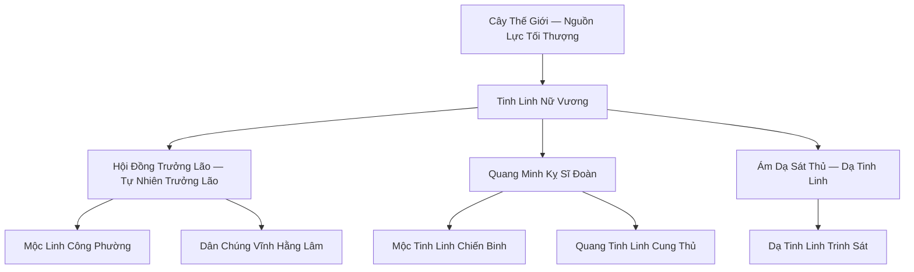
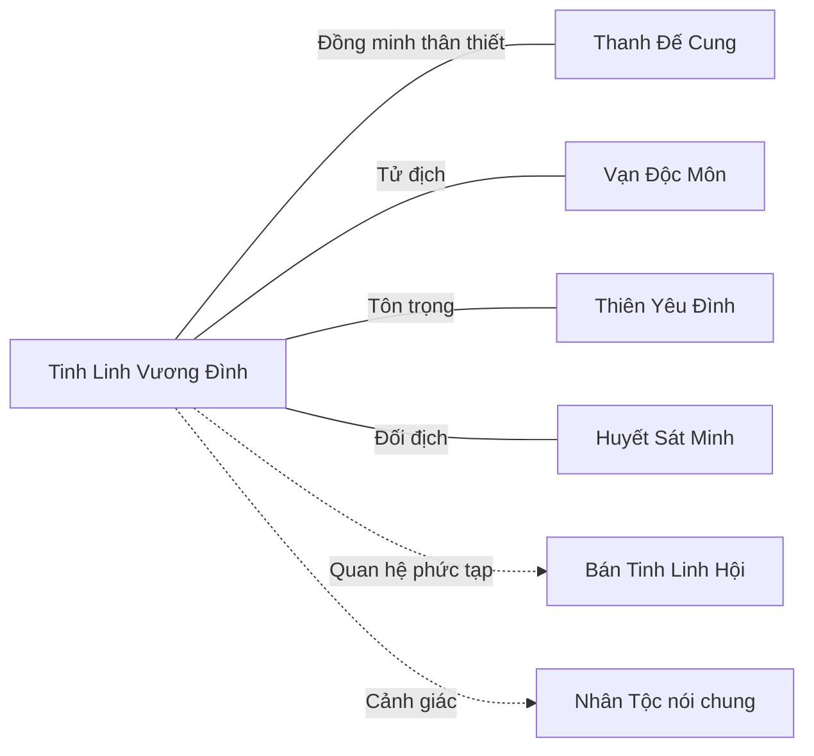

# Tinh Linh Vương Đình (精灵王庭)

## I. Tổng Quan (总览)

Tinh Linh Vương Đình là một trong những thế lực thượng cổ lâu đời nhất Cố Nguyên Giới, cai quản toàn bộ Vĩnh Hằng Sâm Lâm — khu rừng thiêng bao la nằm sâu trong lòng Đông Hoang. Được sinh ra từ hạt giống của Cây Thế Giới ở Kỷ Nguyên Khởi Nguyên, Tinh Linh Tộc sở hữu mối liên kết tâm linh sâu sắc nhất với tự nhiên trong tất cả các chủng tộc. Vương Đình hoạt động theo hệ thống quân chủ được Cây Thế Giới lựa chọn, do Tinh Linh Nữ Vương đứng đầu — vị chúa tể duy nhất có khả năng giao tiếp trực tiếp với Cây Thế Giới. Với triết lý gắn kết tự nhiên và yêu hòa bình nhưng cực kỳ bảo thủ, Tinh Linh Vương Đình đã tự cô lập mình trong Vĩnh Hằng Sâm Lâm suốt hàng vạn năm, tạo nên một vương quốc thanh cao mà ít thế lực nào dám xâm phạm.

## II. Địa Lý & Tài Nguyên (地理与资源)

Vĩnh Hằng Sâm Lâm là khu rừng cổ đại rộng lớn nhất Đông Hoang, nơi những cổ thụ ngàn năm đan xen tạo thành một thế giới riêng biệt với tán lá che khuất bầu trời. Trung tâm khu rừng là Cây Thế Giới — sinh vật sống lâu đời nhất trên lục địa, thân cây cao đến tận tầng mây, rễ cây len lỏi xuyên suốt mạch đất của cả khu rừng. Thánh Thụ Điện — tòa lâu đài của Vương Đình — được xây dựng ngay trên những nhánh cây khổng lồ của Cây Thế Giới, hòa hợp hoàn hảo với thiên nhiên đến mức khó phân biệt đâu là kiến trúc, đâu là cây cối. Hồ Ánh Trăng nằm dưới chân Cây Thế Giới, mặt nước phản chiếu ánh trăng quanh năm ngay cả ban ngày, là nơi tiến hành các nghi lễ ban phước thiêng liêng nhất. Ranh Giới Sương Mù — trận pháp ảo ảnh cổ đại — bao bọc toàn bộ Vĩnh Hằng Sâm Lâm, khiến những kẻ không được phép lạc lối vĩnh viễn trong sương mù mà không bao giờ tìm được đường vào. Tài nguyên chính bao gồm mộc linh khí nồng đậm, tinh thạch thiên nhiên, và vô số loại linh thảo thượng hạng chỉ mọc được dưới bóng cổ thụ Vĩnh Hằng.

## III. Văn Hóa & Tín Ngưỡng (文化与信仰)

Tinh Linh Tộc tôn thờ Tự Nhiên như một thực thể sống có ý thức, với Cây Thế Giới là hiện thân cao nhất. Mọi hoạt động — từ kiến trúc, nông nghiệp đến chiến tranh — đều phải tuân theo nguyên tắc "không làm tổn thương rừng". Tinh Linh sống hàng nghìn năm, điều này khiến họ coi thời gian khác hẳn với nhân tộc: một quyết định có thể mất hàng trăm năm bàn bạc, và "gấp gáp" đối với Tinh Linh là chỉ mất vài thập kỷ. Xã hội phân chia thành ba nhánh chính — Mộc Tinh Linh sống hòa hợp với cây cối và phụ trách nông nghiệp, Quang Tinh Linh sở hữu sức mạnh ánh sáng và là lực lượng chiến đấu chính, Dạ Tinh Linh ẩn mình trong bóng tối và đảm nhận vai trò tình báo. Nghi lễ quan trọng nhất là "Lễ Nguyệt Quang" tại Hồ Ánh Trăng, nơi Nữ Vương ban phước cho chiến binh và dân chúng bằng năng lượng thanh tẩy từ Cây Thế Giới.

## IV. Cơ Cấu Tổ Chức (组织结构)

Hệ thống quân chủ tuyệt đối, nhưng quyền lực của Nữ Vương được Cây Thế Giới giám sát — nếu Nữ Vương đi ngược lại ý chí tự nhiên, Cây Thế Giới sẽ rút lại phước lành và lựa chọn người kế vị mới.

- **Tinh Linh Nữ Vương:** Nắm quyền lực tối cao, là người duy nhất giao tiếp trực tiếp với Cây Thế Giới. Tu vi Hóa Thần Hậu Kỳ, sở hữu năng lượng thanh tẩy có thể tịnh hóa mọi tà khí trong phạm vi khu rừng.
- **Hội Đồng Trưởng Lão (Tự Nhiên Trưởng Lão):** Năm vị Trưởng Lão sống hàng vạn năm, đưa ra lời khuyên cho Nữ Vương và phụ trách các phép thuật bảo vệ quy mô lớn. Mỗi vị phụ trách một lĩnh vực: Nguyệt Quang (nghi lễ), Cổ Thụ (phòng thủ), Linh Thảo (y dược), Phong Ngữ (ngoại giao), Mộc Ca (văn hóa).
- **Quang Minh Kỵ Sĩ Đoàn:** 3000 chiến binh tinh nhuệ, sử dụng quang năng cung thuật, cưỡi Bạch Lộc hoặc Ngân Ưng tuần tra và bảo vệ khu rừng.
- **Ám Dạ Sát Thủ:** 500 Dạ Tinh Linh hoạt động trong bóng tối, giám sát mọi chuyển động ở rìa rừng và tiêu diệt mối đe dọa trước khi chúng tiếp cận Vương Đình.
- **Mộc Linh Công Phường:** Hơn 3000 thợ thủ công Tinh Linh, chế tạo Tinh Linh Cung, Trượng Tự Nhiên và các pháp bảo từ mộc linh khí và tinh thạch.

## V. Công Pháp & Trận Pháp (功法与阵法)

- **Công Pháp Chấn Phái:** *Vĩnh Hằng Cổ Thụ Quyết* — công pháp Mộc hệ thượng cổ, lấy sinh lực rừng làm nguồn tu luyện. Tu sĩ hòa nhập với cây cối, hấp thu mộc linh khí qua rễ cây, đạt đến trạng thái "Nhân Mộc Hợp Nhất". Cấp cao nhất có thể hóa thân thành cổ thụ và bất diệt cùng rừng.
- **Tinh Quang Tiễn Pháp:** Cung thuật đặc trưng của Quang Tinh Linh, mỗi mũi tên mang quang năng thanh tẩy, bắn xa vạn dặm bách phát bách trúng. Đối với ma tu và tà vật, sát thương nhân gấp ba lần.
- **Dạ Ẩn Thuật:** Kỹ năng ẩn mình của Dạ Tinh Linh, hòa tan hoàn toàn vào bóng tối, ngay cả Nguyên Anh kỳ cường giả cũng khó phát hiện.
- **Trận Pháp:** *Ranh Giới Sương Mù Trận* — ảo trận cổ đại bao bọc toàn bộ Vĩnh Hằng Sâm Lâm, được nuôi dưỡng bởi Cây Thế Giới. Kẻ xâm nhập không được phép sẽ lạc trong sương mù vĩnh viễn, dần mất đi ký ức cho đến khi quên cả mục đích ban đầu. Chỉ Nữ Vương và Hội Đồng Trưởng Lão mới có thể mở lối đi.

## VI. Đặc Sản Môn Phái (门派特产)

- **Tinh Linh Cung:** Vũ khí truyền thừa của Quang Minh Kỵ Sĩ Đoàn, đúc từ lõi cổ thụ ngàn năm và tinh thạch thiên nhiên. Cung có khả năng tự hấp thu mộc linh khí để gia tăng sát thương, càng sử dụng lâu càng mạnh.
- **Trượng Tự Nhiên:** Pháp khí của Hội Đồng Trưởng Lão, mỗi chiếc được chế tạo từ nhánh rơi tự nhiên của Cây Thế Giới. Có khả năng khuếch đại mộc hệ công pháp lên gấp nhiều lần và chữa lành vết thương trong phạm vi rộng.
- **Linh Thảo Vĩnh Hằng:** Các loại linh thảo thượng hạng chỉ mọc dưới bóng cổ thụ Vĩnh Hằng Sâm Lâm, bao gồm Nguyệt Quang Thảo (chữa trọng thương), Thiên Niên Hoa (kéo dài tuổi thọ) và Tịnh Tâm Diệp (thanh tẩy tà khí).
- **Tinh Thạch Nguyên Liệu:** Tinh thạch kết tinh tự nhiên trong lòng đất Vĩnh Hằng Sâm Lâm, thuần khiết hơn linh thạch thông thường, được các luyện khí sư bên ngoài rất thèm muốn.

## VII. Cơ Sở Hạ Tầng (基础设施)

- **Thánh Thụ Điện:** Tòa lâu đài nguy nga xây dựng trên các nhánh khổng lồ của Cây Thế Giới, hòa hợp hoàn hảo với thân cây. Bao gồm Đại Điện nghị sự, phòng riêng của Nữ Vương, Tàng Thư Các lưu trữ tri thức thượng cổ, và Tế Đàn Nguyệt Quang.
- **Hồ Ánh Trăng (Phế Tích Nguyệt Quang):** Hồ nước thiêng dưới chân Cây Thế Giới, mặt nước luôn phản chiếu ánh trăng bất kể ngày đêm. Là nơi tiến hành Lễ Nguyệt Quang và ban phước cho chiến binh.
- **Ranh Giới Sương Mù:** Không phải công trình mà là trận pháp tự nhiên được Cây Thế Giới duy trì, tạo thành hàng rào phòng thủ bất khả xâm phạm bao quanh toàn bộ khu rừng.
- **Ngân Quang Doanh Trại:** Doanh trại của Quang Minh Kỵ Sĩ Đoàn, nằm ở vành ngoài khu rừng gần Ranh Giới Sương Mù, bao gồm chuồng Bạch Lộc, bãi tập xạ thuật và kho vũ khí.
- **Ám Dạ Huyệt:** Mạng lưới hang động ngầm dưới rễ cổ thụ, là sào huyệt của Ám Dạ Sát Thủ. Vị trí chính xác chỉ Dạ Tinh Linh mới biết.

## VIII. Kinh Tế (经济)

Kinh tế Tinh Linh Vương Đình gần như tự cung tự cấp nhờ nguồn tài nguyên phong phú của Vĩnh Hằng Sâm Lâm. Mộc linh khí nồng đậm cho phép trồng trọt linh thảo thượng hạng quanh năm mà không cần can thiệp nhiều — cây cối tự lớn dưới sự chăm sóc của Mộc Tinh Linh. Tinh thạch kết tinh tự nhiên trong lòng đất cung cấp nguyên liệu cho Mộc Linh Công Phường chế tạo vũ khí và pháp bảo. Giao thương bên ngoài cực kỳ hạn chế — chỉ có Thanh Đế Cung được phép trao đổi linh thảo và tinh thạch thông qua kênh ngoại giao đặc biệt. Thỉnh thoảng, Tinh Linh cũng lặng lẽ để lại linh thảo ở rìa rừng cho những nhân tộc họ đánh giá là tốt bụng, nhưng không bao giờ thừa nhận công khai. Sự tự cô lập về kinh tế là lựa chọn có chủ đích — Tinh Linh tin rằng phụ thuộc vào bên ngoài sẽ dẫn đến sự can thiệp vào nội bộ.

## IX. Lịch Sử Tóm Tắt (简史)

Tinh Linh Tộc là một trong những chủng tộc lâu đời nhất Cố Nguyên Giới, được sinh ra từ hạt giống của Cây Thế Giới ở Kỷ Nguyên Khởi Nguyên. Trong thời kỳ đầu, Tinh Linh từng có quan hệ hữu hảo với hầu hết các chủng tộc, chia sẻ tri thức về tự nhiên và chữa lành. Tuy nhiên, khi các thế lực tham lam bắt đầu săn lùng Tinh Linh vì vẻ đẹp mê hồn và năng lượng thanh tẩy quý hiếm trong huyết dịch, Vương Đình đã đưa ra quyết định lịch sử: kích hoạt Ranh Giới Sương Mù và cô lập hoàn toàn Vĩnh Hằng Sâm Lâm khỏi thế giới bên ngoài. Suốt hàng vạn năm kể từ đó, Tinh Linh Vương Đình duy trì chính sách bế quan — chỉ giữ lại liên minh với Thanh Đế Cung vì sự tương đồng về tín ngưỡng Mộc hệ. Những kẻ lạc vào rừng bị xua đuổi hoặc mất trí nhớ bởi sương mù, và danh tiếng "khu rừng không thể xâm phạm" dần trở thành huyền thoại đáng sợ.

## X. Giai Thoại & Bí Mật (轶事与秘密)

- Cây Thế Giới không chỉ là một cây — nó là một thực thể có ý thức, thậm chí có thể được coi là một vị Thần Cổ Đại đang ngủ dưới hình dạng thực vật. Nếu Cây Thế Giới tỉnh giấc hoàn toàn, sức mạnh của nó có thể vượt xa mọi cường giả hiện tại trên lục địa.
- Nữ Vương đời trước đã biến mất bí ẩn cách đây 800 năm trong một chuyến hành trình vào sâu trong rễ Cây Thế Giới. Nữ Vương đời hiện tại được Cây Thế Giới lựa chọn trong hoàn cảnh bất thường — bà không thuộc hoàng tộc mà là một Mộc Tinh Linh bình dân, điều này vẫn gây ra bất mãn ngấm ngầm trong Hội Đồng Trưởng Lão.
- Dạ Tinh Linh — nhánh Tinh Linh sống trong bóng tối — ngày càng tách biệt với Mộc Tinh Linh và Quang Tinh Linh. Một số Trưởng Lão lo ngại rằng Dạ Tinh Linh đang phát triển theo hướng "sa đọa", nhưng không có bằng chứng cụ thể.
- Ranh Giới Sương Mù đang yếu dần đi — không ai biết tại sao, nhưng gần đây có người lạ đã thành công xâm nhập sâu hơn trước khi bị phát hiện. Nếu trận pháp sụp đổ, Vĩnh Hằng Sâm Lâm sẽ lộ ra trước tham vọng của mọi thế lực.

## XI. Quan Hệ Thế Lực (势力关系)

- **Thanh Đế Cung:** Đồng minh thân thiết nhất suốt hàng vạn năm. Hai bên chia sẻ tín ngưỡng tự nhiên và Mộc hệ tu luyện. Thanh Đế Cung là thế lực nhân tộc duy nhất được phép bước vào Vĩnh Hằng Sâm Lâm mà không bị Ranh Giới Sương Mù cản trở.
- **Vạn Độc Môn:** Tử địch không thể hòa giải. Vạn Độc Môn tàn phá rừng rậm để chiết xuất độc tố, sử dụng Dược Nhân và đầu độc nguồn nước — mọi hành vi đều là sự xúc phạm cực độ đối với Tinh Linh Tộc.
- **Thiên Yêu Đình:** Mối quan hệ tôn trọng lẫn nhau dựa trên sự gắn bó chung với thiên nhiên. Yêu Tộc không xâm phạm Vĩnh Hằng Sâm Lâm, Tinh Linh không can thiệp vào lãnh thổ Yêu Đình.
- **Huyết Sát Minh:** Đối địch nghiêm trọng. Huyết Sát Minh từng nhiều lần cử sát thủ xâm nhập rừng để săn bắt Tinh Linh, vì huyết dịch Tinh Linh là nguyên liệu tối thượng cho huyết thuật.
- **Bán Tinh Linh Hội:** Quan hệ nhạy cảm và mâu thuẫn. Chính thức, Vương Đình không công nhận Bán Tinh Linh — sản phẩm của sự kết hợp bị cấm giữa Tinh Linh và nhân tộc. Nhưng một số Trưởng Lão lặng lẽ ủng hộ sự tồn tại của Hội vì coi họ là cầu nối tiềm năng với thế giới bên ngoài.
