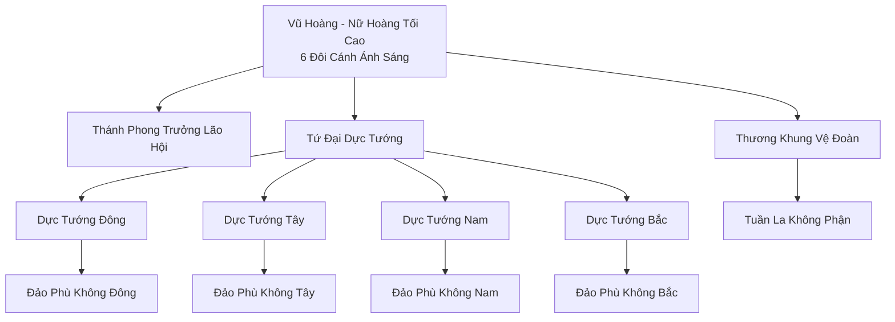
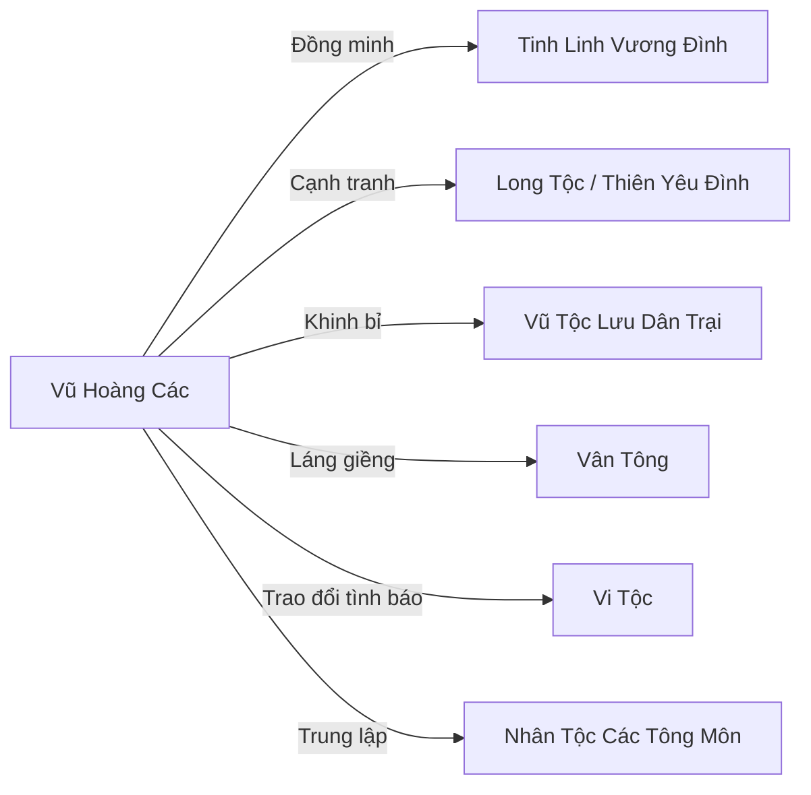

# Vũ Hoàng Các (羽皇阁)

## I. Tổng Quan (总览)
Vũ Hoàng Các là vương quốc trên mây của Vũ Tộc — chủng tộc có cánh tự do nhất và kiêu hãnh nhất Cố Nguyên Giới. Xếp hạng Hạng Nhất, với dân số khoảng tám nghìn, Các ngự trị trên các hòn đảo bay (Đảo Phù Không) quanh đỉnh Thiên Trụ Sơn, nơi tầng mây dày đặc che khuất mọi tầm nhìn từ mặt đất. Chế độ thần quyền do Vũ Hoàng — Nữ Hoàng tối cao sở hữu sáu đôi cánh ánh sáng — thống trị, với sự phò tá của Tứ Đại Dực Tướng cai quản bốn hòn đảo phụ.

Vũ Hoàng Các coi bầu trời là lãnh thổ thần thánh, bất khả xâm phạm. Bất kỳ sinh vật nào bay vào vùng trời kiểm soát mà không được phép sẽ bị Thương Khung Vệ Đoàn giáng Lôi Kiếp xuống trừng phạt. Tính cách chung của Vũ Tộc là kiêu hãnh đến mức ngạo mạn — họ xem Nhân Tộc như kiến dưới mặt đất, coi các chủng tộc không biết bay là sinh vật hạ đẳng. Sự cô lập tự nguyện này vừa là sức mạnh vừa là điểm yếu: bất khả xâm phạm trên không nhưng hoàn toàn mù lòa về những gì xảy ra dưới mặt đất.

## II. Địa Lý & Tài Nguyên (地理与资源)
Vũ Hoàng Các tọa lạc trên hệ thống Đảo Phù Không quanh đỉnh Thiên Trụ Sơn — ngọn núi cao nhất Đông Hoang. Đảo bay chính rộng hàng chục dặm, nằm ở độ cao mà mây mù vĩnh viễn bao phủ, khiến kẻ dưới mặt đất không bao giờ nhìn thấy. Bốn Đảo Phù Không phụ nhỏ hơn, mỗi đảo do một Dực Tướng cai quản, phân bố theo bốn hướng tạo thành tuyến phòng thủ.

Tài nguyên đặc trưng bao gồm vân thạch — khoáng sản chỉ hình thành ở độ cao cực lớn, linh sương — sương mù ngưng tụ linh khí phong hệ dùng làm nguyên liệu luyện đan, và Phong Linh Mạch — dòng linh khí gió liên tục thổi qua các đảo bay, cung cấp năng lượng vô tận cho tu luyện. Khí hậu trên đảo bay quanh năm lạnh lẽo, gió mạnh và ánh sáng mặt trời chói chang — môi trường lý tưởng cho Vũ Tộc nhưng khắc nghiệt với mọi chủng tộc khác.

## III. Văn Hóa & Tín Ngưỡng (文化与信仰)
Vũ Hoàng Các theo chế độ thần quyền, tôn thờ Vũ Hoàng Nguyên Thủy — Nữ Thần Bầu Trời, vị tổ tiên khai thiên lập địa của Vũ Tộc. Mỗi đời Vũ Hoàng được coi là hiện thân của Nữ Thần trên trần thế, nhận được sự phục tùng tuyệt đối. Văn hóa Vũ Tộc xoay quanh sự tự do — cánh là biểu tượng thiêng liêng, và mất cánh được coi là nhục nhã hơn cái chết.

Hệ thống đẳng cấp phân chia nghiêm ngặt theo cánh: Vũ Hoàng sáu đôi cánh ánh sáng, Dực Tướng bốn đôi cánh, Trưởng Lão ba đôi cánh rực rỡ, và thường dân chỉ có một đôi cánh màu tối (đen, nâu, xám). Những Vũ Tộc có cánh nhỏ, bay thấp, hoặc huyết mạch loãng bị coi là "không xứng đáng" và bị trục xuất khỏi đảo bay — đó là lý do Vũ Tộc Lưu Dân Trại tồn tại.

## IV. Cơ Cấu Tổ Chức (组织结构)

Quyền lực tập trung tuyệt đối ở Vũ Hoàng — Nữ Hoàng tối cao, người duy nhất sở hữu sáu đôi cánh ánh sáng và được Thiên Đạo công nhận. Dưới trướng là Thánh Phong Trưởng Lão Hội — hội đồng các trưởng lão cao tuổi am hiểu phong hệ bí thuật thượng cổ, phụ trách nghi lễ tôn giáo và điều khiển khí hậu bảo vệ đảo bay. Tiếp theo là Tứ Đại Dực Tướng — bốn vị cường giả mạnh nhất sau Vũ Hoàng, mỗi người cai quản một Đảo Phù Không phụ và chỉ huy lực lượng phòng thủ khu vực. Thương Khung Vệ Đoàn là đội quân tinh nhuệ nhất, trang bị quang thương và giáo ánh sáng, bay lượn với tốc độ siêu việt, chịu trách nhiệm tuần tra không phận và tiêu diệt mọi kẻ xâm nhập.

## V. Công Pháp & Trận Pháp (功法与阵法)
- **Công Pháp:** *Thiên Vũ Thần Hành* — công pháp chấn phái tối cao, cho phép tu luyện Phong và Lôi thuộc tính đồng thời, đạt đến cảnh giới kiểm soát không gian và tốc độ bay tuyệt đối. *Phong Lôi Cửu Trọng Thiên* — công pháp chiến đấu chín tầng, mỗi tầng mở khóa một năng lực mới: từ Phong Nhẫn (gió cắt) ở tầng một đến Lôi Đình Thiên Phạt (sấm trời phạt kẻ thù) ở tầng chín.
- **Trận Pháp:** *Thương Khung Kết Giới* — đại trận pháp phong tỏa toàn bộ không phận quanh Đảo Phù Không, tạo ra bão lốc vĩnh cửu ngăn cản mọi kẻ không được phép bay vào. Trận pháp này do Thánh Phong Trưởng Lão Hội duy trì, tiêu thụ Phong Linh Mạch liên tục.
- **Vũ Khí Đặc Trưng:** Quang Thương — giáo làm từ vân thạch tinh luyện, phát ra ánh sáng chói lòa khi kích hoạt; Phong Nhẫn — đĩa gió sắc bén vô hình; Mũi Tên Ánh Sáng — tiễn thuật đặc biệt chỉ Vũ Tộc mới có thể sử dụng do cần cánh để ổn định khi bắn trên không.

## VI. Đặc Sản Môn Phái (门派特产)
- **Vân Thạch Tinh Luyện:** Khoáng sản chỉ hình thành ở độ cao cực lớn, là nguyên liệu tối thượng để chế tạo pháp khí phong hệ và quang thương.
- **Linh Sương:** Sương mù ngưng tụ linh khí phong hệ, dùng làm nguyên liệu luyện đan hoặc uống trực tiếp để tăng cường thể chất — đặc biệt hiệu quả cho tu sĩ phong hệ.
- **Lông Vũ Thần:** Lông rụng tự nhiên từ Vũ Tộc cấp cao, mang theo linh lực phong hệ, được dùng làm nguyên liệu chế tạo phù lục hoặc bùa hộ thân — là mặt hàng quý hiếm trên thị trường bên dưới.

## VII. Cơ Sở Hạ Tầng (基础设施)
- **Đảo Phù Không Chính:** Hòn đảo bay lớn nhất, nơi Vũ Hoàng ngự trị, bao gồm Thiên Cung (cung điện Vũ Hoàng), Quảng trường tập hợp, và khu dân cư chính.
- **Thiên Phong Các:** Thư viện bay trên mây, chứa đựng sách ma pháp Gió cổ xưa nhất Cố Nguyên Giới — nhiều cuốn có từ Kỷ Nguyên Khởi Nguyên.
- **Đảo Phù Không Bão Táp:** Vùng luyện tập của Dực Tướng và Thương Khung Vệ Đoàn, nơi bão lốc nhân tạo liên tục hoành hành — môi trường huấn luyện cực hạn.
- **Thánh Phong Đàn:** Đàn tế lộ thiên trên đỉnh đảo bay chính, nơi Vũ Hoàng tiến hành các nghi lễ giao tiếp với Thiên Đạo và ban phước cho Vũ Tộc.
- **Bến Gió:** Điểm xuất phát và hạ cánh duy nhất cho các đoàn thương mại và sứ giả từ mặt đất — được canh giữ nghiêm ngặt.

## VIII. Kinh Tế (经济)
Kinh tế Vũ Hoàng Các khép kín và tự cung tự cấp ở mức cao — đảo bay cung cấp đủ tài nguyên cho dân số tám nghìn. Nguồn thu từ bên ngoài chủ yếu đến từ ba kênh: thương mại vân thạch và linh sương với các tông môn phong hệ dưới mặt đất; thuế không phận thu từ thương đoàn và tu sĩ muốn bay qua vùng trời kiểm soát mà không bị Thương Khung Vệ Đoàn tấn công; và chế tạo Phong vũ khí cao cấp bán cho khách hàng VIP thông qua Bến Gió. Tuy nhiên, sự kiêu hãnh của Vũ Tộc khiến họ hiếm khi chủ động giao thương — phần lớn giao dịch do phía đối tác chủ động tìm đến.

## IX. Lịch Sử Tóm Tắt (简史)
Vũ Tộc là một trong những chủng tộc tự do nhất từ buổi khai thiên — vốn có thể sống ở mọi nơi có bầu trời. Tuy nhiên, sự trỗi dậy của Nhân Tộc với trận pháp phòng không, và Long Tộc tranh giành quyền kiểm soát không phận, đã buộc Vũ Tộc thu hẹp lãnh thổ. Vũ Hoàng đời đầu tiên — Nữ Thần Bầu Trời — đã dẫn dắt tộc nhân kéo các hòn đảo bay lên cao hơn, vượt qua tầng mây mà không sinh vật nào khác chạm tới, tạo thành Vũ Hoàng Các — pháo đài bất khả xâm phạm trên mây mù Thiên Trụ Sơn.

Kể từ đó, Vũ Hoàng Các duy trì chính sách cô lập — không can thiệp vào chuyện mặt đất, không liên minh lâu dài, không cho phép ngoại tộc lên đảo bay. Chính sách này giữ an toàn cho Vũ Tộc suốt hàng vạn năm, nhưng cũng khiến họ dần mất kết nối với thế giới bên dưới. Trong thời gian gần đây, một số Trưởng Lão trẻ bắt đầu chất vấn liệu sự cô lập có còn phù hợp khi các thế lực tà đạo như Huyết Sát Minh ngày càng mạnh và đe dọa cả bầu trời.

## X. Giai Thoại & Bí Mật (轶事与秘密)
Vũ Hoàng hiện tại được đồn đại không phải hậu duệ trực hệ của Vũ Hoàng Nguyên Thủy — bà đạt được sáu đôi cánh ánh sáng thông qua một nghi lễ cổ xưa bí mật mà Thánh Phong Trưởng Lão Hội kiểm soát. Nếu điều này bị lộ, tính chính danh của bà sẽ bị lung lay nghiêm trọng.

Trong lõi Đảo Phù Không Chính có một vật thể bí ẩn duy trì sức bay cho toàn bộ hệ thống đảo — không ai ngoài Vũ Hoàng biết đó là gì, nhưng nếu vật thể bị phá hủy hoặc di chuyển, tất cả các đảo bay sẽ rơi xuống mặt đất, kéo theo sự diệt vong của Vũ Hoàng Các.

Lý do Vũ Hoàng Các trục xuất những Vũ Tộc "không đủ chuẩn" không chỉ vì kiêu hãnh — còn một lý do thực dụng hơn: tài nguyên trên đảo bay có giới hạn, dân số phải được kiểm soát chặt chẽ. Mỗi Vũ Tộc sinh ra đều phải trải qua "Lễ Thử Cánh" lúc năm tuổi — cánh không đủ lớn hoặc huyết mạch không đủ thuần sẽ bị trục xuất xuống mặt đất vĩnh viễn.

## XI. Quan Hệ Thế Lực (势力关系)

