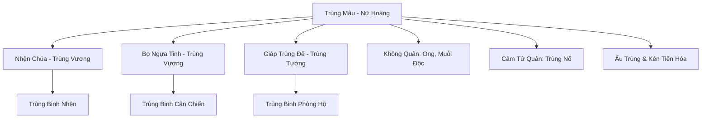
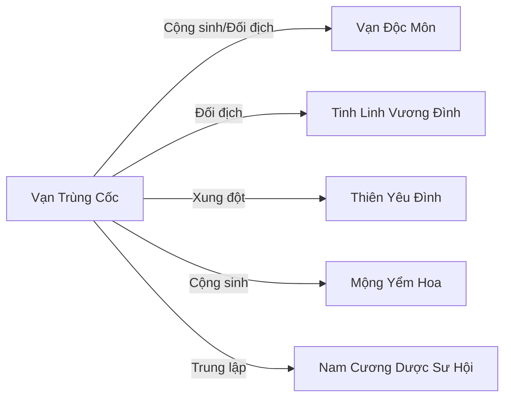

# Vạn Trùng Cốc (万虫谷)

## I. Tổng Quan (总览)
Vạn Trùng Cốc là thế lực Trùng Tộc khổng lồ nhất tại Nam Cương, được xếp hạng Hạng Nhì không phải vì số lượng cá thể — hàng tỷ — mà vì số lượng sinh vật có linh trí thực sự chỉ đếm trên đầu ngón tay. Đây là một bầy đàn sinh học vận hành theo bản năng, với Trùng Mẫu — Nữ Hoàng Côn Trùng ở cảnh giới Hóa Thần — đứng đỉnh chuỗi thức ăn, vừa sinh sản vừa điều khiển tâm trí toàn bộ bầy đàn. Tính chất của Vạn Trùng Cốc là tàn bạo, thích nghi, đa dạng và tiến hóa liên tục — mỗi thế hệ trùng đều mạnh hơn thế hệ trước nhờ nuốt chửng linh khí và máu thịt của mọi sinh vật xung quanh. Không tông môn nào muốn đánh nhau với Vạn Trùng Cốc, không phải vì sợ mà vì chiến đấu với bầy đàn vô tận là chiến đấu với một đại dương — giết triệu con, triệu con khác lập tức thế chỗ.

## II. Địa Lý & Tài Nguyên (地理与资源)
Vạn Trùng Cốc nằm sâu trong rừng rậm ẩm thấp nhất Nam Cương, nơi ánh sáng mặt trời không bao giờ xuyên qua được tán cây dày đặc. Mặt đất phủ đầy lớp mùn hữu cơ dày hàng trượng, dưới đó là mạng lưới hang ngầm chằng chịt kéo dài hàng trăm dặm — tổ ấm thực sự của bầy đàn. Trung tâm là Sào Huyệt Mẫu Trùng, nằm ở lòng đất sâu nhất, đầy rẫy mạng nhện và kén trứng, nhiệt độ cao ngột ngạt do hoạt động sinh học liên tục. Phía nam là Biển Ăn Mòn — một hồ axit sinh học tự nhiên, nơi bầy đàn tiêu hóa rác thải, xác chết và mọi thứ không cần thiết, đồng thời cũng là nơi khai sinh ra những dòng nọc độc mới. Tài nguyên chính là tơ nhện sắc như dao, giáp xác chống ma pháp, nọc độc các loại, và kén tiến hóa — vật phẩm quý hiếm mà ngay cả Vạn Độc Môn cũng thèm muốn.

## III. Văn Hóa & Tín Ngưỡng (文化与信仰)
Vạn Trùng Cốc không có văn hóa theo nghĩa nhân loại hiểu. Bầy đàn vận hành theo bản năng sinh học thuần túy — ăn, sinh sản, tiến hóa, mở rộng lãnh thổ. Tuy nhiên, trong số ít cá thể có linh trí cao (Trùng Vương và Trùng Tướng), tồn tại một dạng "tín ngưỡng" nguyên thủy: tôn thờ Trùng Mẫu như thần linh, tin rằng toàn bộ bầy đàn là một cơ thể sống duy nhất và mỗi cá thể chỉ là một tế bào. Khái niệm "cái tôi" gần như không tồn tại — ngay cả Trùng Vương có trí tuệ siêu việt cũng coi mình là nhánh mở rộng của ý chí Trùng Mẫu, sẵn sàng hy sinh bản thân để phục vụ bầy đàn.

## IV. Cơ Cấu Tổ Chức (组织结构)

Tổ chức hoàn toàn theo hệ thống bản năng sinh học. Đỉnh cao là Trùng Mẫu — sinh vật tối cao vừa sinh sản vừa điều khiển tâm trí toàn bộ bầy đàn thông qua pheromone linh lực và sóng thần thức. Dưới Trùng Mẫu là các Trùng Vương — cá thể đột biến cực mạnh như Nhện Chúa và Bọ Ngựa Tinh, có khả năng hóa hình người và sở hữu trí tuệ ngang bằng tu sĩ nhân loại. Tiếp theo là Trùng Tướng — những cá thể đạt linh trí nhưng chưa đủ mạnh để hóa hình, chỉ huy các binh chủng chuyên biệt. Cuối cùng là vô tận Trùng Binh chia thành nhiều lớp: bộ binh cận chiến (Kiến, Bọ Cánh Cứng), không quân (Ong, Muỗi Độc), và cảm tử quân (Trùng nổ tự sát khi tiếp cận kẻ thù).

## V. Công Pháp & Trận Pháp (功法与阵法)
Trùng Tộc không tu luyện công pháp theo cách truyền thống — hệ thống sức mạnh của chúng dựa hoàn toàn trên tiến hóa sinh học. Bằng cách nuốt chửng linh khí, máu thịt và thậm chí cả nguyên thần của chủng tộc khác, mỗi cá thể Trùng Tộc có thể đột biến, phát triển các đặc tính mới. Công pháp chấn phái (nếu có thể gọi vậy) là Phệ Linh Quyết — bản năng nuốt chửng vạn vật, cho phép hấp thu và chuyển hóa bất kỳ dạng năng lượng nào thành sức mạnh của bản thân.

Kỹ năng đáng sợ nhất là **Biển Trùng Phệ Thiên** — Trùng Mẫu triệu hồi hàng triệu con trùng đồng loạt cắn nuốt kẻ thù, tạo thành sóng thần sinh vật che kín bầu trời. Ngoài ra, **Ký Sinh Tâm Trí** cho phép một số Trùng Vương cấy ấu trùng vào não bộ đối thủ, dần dần kiểm soát ý chí và biến nạn nhân thành con rối.

Vũ khí đặc trưng là nọc độc tự nhiên, tơ nhện sắc như dao, và giáp xác chống ma pháp — tất cả đều là sản phẩm của quá trình tiến hóa hàng vạn năm.

## VI. Đặc Sản Môn Phái (门派特产)
- **Kén Tiến Hóa:** Vật phẩm quý hiếm nhất Vạn Trùng Cốc — kén chứa đựng tinh hoa tiến hóa của một dòng trùng, có thể dùng làm nguyên liệu luyện đan hoặc nghiên cứu sinh học.
- **Nọc Độc Nguyên Chất:** Nọc độc từ các cá thể Trùng Vương, cô đọng và mãnh liệt, là nguyên liệu tối thượng cho Vạn Độc Môn luyện Cổ.
- **Tơ Nhện Linh:** Tơ nhện từ Nhện Chúa, bền hơn thép tinh luyện và sắc hơn kiếm pháp — nhiều tông môn trả giá cao để mua làm nguyên liệu chế tạo pháp khí.
- **Giáp Xác Chống Ma Pháp:** Vỏ ngoài của Giáp Trùng Đế, có khả năng miễn nhiễm hoặc phản xạ một phần pháp thuật hệ hỏa và hệ lôi.

## VII. Cơ Sở Hạ Tầng (基础设施)
- **Sào Huyệt Mẫu Trùng:** Hang ngầm sâu nhất, rộng hàng trăm trượng, nơi Trùng Mẫu ngự trị — nhiệt độ cao, không khí đặc quánh pheromone linh lực, đầy rẫy mạng nhện và kén trứng.
- **Biển Ăn Mòn:** Hồ axit sinh học khổng lồ, nơi tiêu hóa mọi thứ bầy đàn mang về — xác chết, tài nguyên thô, và cả kẻ thù bị bắt sống.
- **Mạng Lưới Hang Ngầm:** Hệ thống đường hầm chằng chịt kéo dài khắp lãnh thổ, cho phép bầy đàn di chuyển nhanh chóng mà không lộ diện trên mặt đất.
- **Khu Ấp Trứng:** Các buồng hang ấm áp chuyên dùng để ấp kén và nuôi dưỡng ấu trùng, được canh giữ bởi lớp Trùng Binh trung thành nhất.

## VIII. Kinh Tế (经济)
Khái niệm "kinh tế" không tồn tại trong Vạn Trùng Cốc theo nghĩa thông thường. Bầy đàn thu hoạch mọi thứ bằng cách nuốt chửng — linh khí, tài nguyên, sinh vật, đất đai — tất cả đều được chuyển hóa thành năng lượng nuôi dưỡng bầy đàn và thúc đẩy tiến hóa. Tuy nhiên, mối quan hệ cộng sinh với Vạn Độc Môn tạo ra một dạng "thương mại" nguyên thủy: Vạn Độc Môn cung cấp xác chết tu sĩ và linh thú có chứa năng lượng cao, đổi lấy nọc độc nguyên chất, kén tiến hóa và tơ nhện linh. Ngoài ra, một số thực vật ma quái như Mộng Yểm Hoa cộng sinh với Trùng Tộc, cung cấp dưỡng chất đặc biệt đổi lấy sự bảo vệ của bầy đàn.

## IX. Lịch Sử Tóm Tắt (简史)
Nam Cương vốn là bãi rác khổng lồ của chiến trường Thượng Cổ — vô số xác chết tu sĩ, yêu thú, và tà ma chất chồng lên nhau, oán khí và chất độc ngấm sâu vào đất đai. Trùng Tộc sinh ra từ chính mảnh đất chết chóc đó, hấp thu oán khí và chất độc mà trở nên khổng lồ, dần dần phát triển linh trí. Trùng Mẫu đời đầu tiên là một con sâu đất bình thường vô tình nuốt phải nguyên thần tàn dư của một vị cường giả tử trận, từ đó khai mở linh trí và bắt đầu sinh sản vô tận.

Vạn Trùng Cốc từng uy hiếp toàn bộ Nam Cương, biển trùng tràn ngập khiến mọi sinh linh phải rời bỏ. Mãi đến khi Vạn Độc Môn và các thế lực tu chân xuất hiện, dùng Cổ thuật để kiềm chế bầy đàn, Trùng Tộc mới bị đẩy lùi vào rừng sâu. Kể từ đó, hai bên duy trì mối quan hệ vừa đối địch vừa cộng sinh kỳ lạ — Vạn Độc Môn cần Trùng Tộc làm nguyên liệu, Trùng Tộc cần xác chết do Vạn Độc Môn cung cấp để tiến hóa.

## X. Giai Thoại & Bí Mật (轶事与秘密)
Trùng Mẫu hiện tại không phải đời đầu tiên. Có giả thuyết cho rằng Trùng Mẫu nguyên thủy đã đạt cảnh giới vượt xa Hóa Thần, nhưng bị chính nguyên thần tàn dư mà nó nuốt phải ngày xưa phản phệ, rơi vào giấc ngủ sâu trong lòng đất. Trùng Mẫu hiện tại chỉ là hậu duệ mạnh nhất, thay thế vai trò điều khiển bầy đàn — và nếu Trùng Mẫu nguyên thủy tỉnh giấc, toàn bộ cục diện Nam Cương sẽ thay đổi.

Trong Biển Ăn Mòn có một vật thể kỳ lạ không bao giờ bị axit hòa tan — nhiều Trùng Vương đã cố nuốt nó nhưng bị phản đòn nặng nề. Vạn Độc Môn nghi đó là di vật Thượng Cổ, nhưng không dám xâm nhập sâu vào lòng Cốc để kiểm chứng.

Mối quan hệ cộng sinh giữa Trùng Tộc và Mộng Yểm Hoa phức tạp hơn vẻ bề ngoài — Mộng Yểm Hoa không chỉ cung cấp dưỡng chất mà còn âm thầm ảnh hưởng đến bản năng tiến hóa của bầy đàn, hướng dẫn chúng theo một con đường mà không ai hiểu rõ mục đích.

## XI. Quan Hệ Thế Lực (势力关系)

