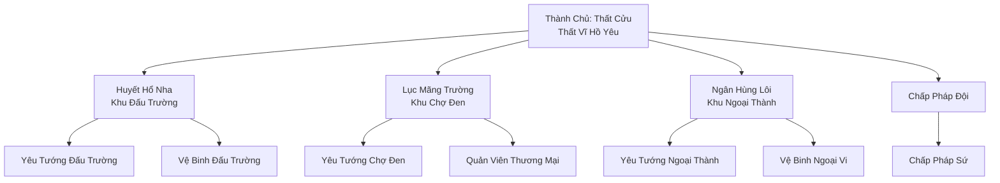
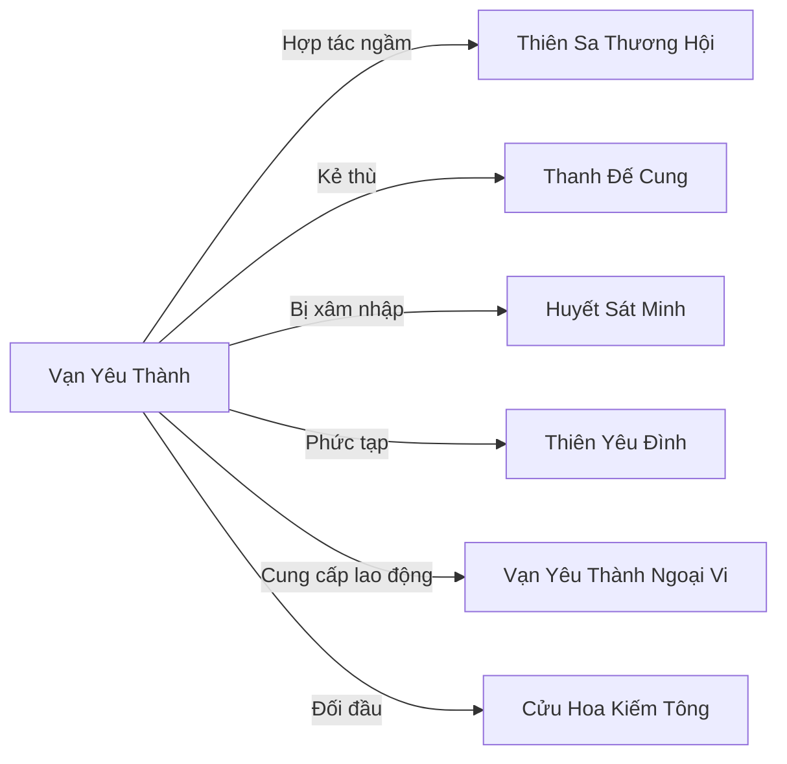

# Vạn Yêu Thành (万妖城)

## I. Tổng Quan (总览)
Vạn Yêu Thành là thành phố tự do lớn nhất Đông Hoang, hoạt động như một liên minh Yêu Tộc phi tập trung, đồng thời là trung tâm giao thương ngầm lớn nhất Cố Nguyên Giới dành cho yêu thú, tán tu, và các thế lực hắc ám. Xếp hạng Hạng Nhất về quy mô và ảnh hưởng, Thành có dân số khoảng mười hai nghìn sinh linh thường trú — chưa kể hàng nghìn khách vãng lai qua lại mỗi ngày.

"Thành Chủ" trên danh nghĩa là Thất Cửu — Thất Vĩ Hồ Yêu ở cảnh giới Hóa Thần Trung Kỳ — nhưng thực quyền chia đều cho Tam Đại Yêu Vương, ba vị cường giả Hóa Thần Sơ Kỳ cai quản ba khu vực chính: Huyết Hổ Nha quản Khu Đấu Trường, Lục Mãng Trường quản Khu Chợ Đen, và Ngân Hùng Lôi quản Khu Ngoại Thành. Luật lệ duy nhất ở Vạn Yêu Thành là "kẻ mạnh làm vua" — mọi ân oán đều có thể được giải quyết tại Đấu Trường, còn trong Chợ Đen, miễn có đủ Linh Thạch và tài nguyên, mọi thứ đều có thể mua được.

Nơi quy tụ mọi nguồn tài nguyên quý hiếm, bất hợp pháp, hàng cấm — Huyết Tinh, độc dược, yêu đan — cùng với mạng lưới tình báo ngầm rộng lớn không chịu sự chi phối của Chính Đạo. Tuy nhiên, sự tự do này cũng biến Vạn Yêu Thành thành một thùng thuốc súng, chỉ chờ một mồi lửa nhỏ để bùng nổ, đặc biệt là khi các thế lực bên ngoài như Huyết Sát Minh bắt đầu nhúng tay vào.

## II. Địa Lý & Tài Nguyên (地理与资源)
Vạn Yêu Thành nằm sâu trong trung tâm Đông Hoang, được bao bọc bởi Vạn Trùng Sa Mạc ở phía nam và Độc Chướng Lâm ở phía bắc — hai vùng tử địa tự nhiên đóng vai trò như hào thành thiên nhiên, ngăn cản bất kỳ đạo quân xâm lược quy mô lớn nào. Thành được xây dựng trên một bình nguyên hiếm hoi giữa rừng rậm, tường thành bằng đá đen cao ba mươi trượng, khắc đầy phù văn yêu lực cổ xưa.

Nội thành chia thành ba khu vực rõ ràng: Khu Đấu Trường ở phía đông, Khu Chợ Đen ở trung tâm, và Khu Ngoại Thành ở phía tây. Tài nguyên dồi dào nhờ vị trí trung chuyển — mọi thứ từ yêu đan thượng phẩm, Huyết Tinh cấm, độc dược Nam Cương, đến linh thảo quý hiếm từ Vĩnh Hằng Sâm Lâm đều chảy qua Chợ Đen. Ngoài ra, vùng hoang địa xung quanh Thành là nơi sinh sống của vô số yêu thú hoang dã, cung cấp nguồn nguyên liệu chiến lợi phẩm liên tục.

## III. Văn Hóa & Tín Ngưỡng (文化与信仰)
Vạn Yêu Thành không có tín ngưỡng thống nhất — đây là nơi mà mọi tín ngưỡng, mọi triết lý, mọi đạo đức đều tồn tại song song mà không ai phán xét ai. Văn hóa cốt lõi là tôn sùng sức mạnh và tự do cá nhân tuyệt đối. Yêu tộc ở đây tin rằng trật tự do Nhân Tộc áp đặt — phân chia chính tà, quy định thiện ác — là xiềng xích vô hình, và Vạn Yêu Thành là nơi duy nhất thoát khỏi xiềng xích đó.

Phong tục nổi bật nhất là Đấu Trường — nơi mọi tranh chấp từ nợ nần, ân oán, đến tranh giành lãnh thổ đều được giải quyết bằng một trận sống mái. Khán giả cá cược công khai, máu văng tung tóe, và kẻ thua mất mọi thứ — kể cả mạng sống. Ngoài ra, Chợ Đen hoạt động theo quy tắc ngầm riêng: không lừa đảo trong giao dịch đã ký kết bằng Huyết Thệ, nhưng ngoài Huyết Thệ ra thì mọi thủ đoạn đều được chấp nhận.

## IV. Cơ Cấu Tổ Chức (组织结构)

Cơ cấu quyền lực của Vạn Yêu Thành là tam đầu chế dưới sự điều phối danh nghĩa của Thành Chủ. Thất Cửu giữ vai trò trọng tài và người điều phối — bà không trực tiếp cai trị mà duy trì cân bằng quyền lực giữa Tam Đại Yêu Vương, ngăn không cho bất kỳ ai trong ba vị trở nên quá mạnh. Mỗi Yêu Vương có Yêu Tướng riêng — các cường giả Nguyên Anh Kỳ làm tay sai đắc lực — cùng hệ thống vệ binh và quan viên riêng biệt. Chấp Pháp Đội là lực lượng duy nhất trung lập, trực thuộc Thành Chủ, chịu trách nhiệm duy trì trật tự tối thiểu trong Nội Thành — đảm bảo giao dịch không bị phá vỡ bằng bạo lực trắng trợn và kẻ nào vi phạm quy tắc Chợ Đen sẽ bị trừng phạt.

## V. Công Pháp & Trận Pháp (功法与阵法)
Vạn Yêu Thành không có công pháp thống nhất — mỗi yêu tộc tu luyện theo huyết mạch và bản năng riêng. Tuy nhiên, Tam Đại Yêu Vương mỗi vị sở hữu bí thuật riêng đáng sợ: Huyết Hổ Nha tu luyện **Huyết Hổ Cuồng Bạo Thể**, biến thân thể thành vũ khí sát thương cận chiến khủng khiếp; Lục Mãng Trường tu luyện **Huyền Mãng Thôn Thiên Thuật**, có thể nuốt chửng cả pháp bảo và trận pháp; Ngân Hùng Lôi tu luyện **Cự Hùng Chấn Sơn Công**, mỗi quyền đánh ra có thể lay chuyển núi non.

Về trận pháp, tường thành Vạn Yêu Thành được khắc **Vạn Yêu Hộ Thành Trận** — đại trận pháp cổ xưa kích hoạt bằng yêu lực tập thể, có thể chịu được đòn tấn công từ cường giả Hóa Thần. Ngoài ra, Chợ Đen có hệ thống trận pháp cách âm và che giấu thần thức riêng, đảm bảo các giao dịch bí mật không bị dò xét.

## VI. Đặc Sản Môn Phái (门派特产)
- **Yêu Đan Thượng Phẩm:** Yêu đan chiết xuất từ yêu thú cấp cao tử trận tại Đấu Trường, tinh luyện bởi các đan sư tà đạo lưu lạc, chất lượng vượt xa hàng thông thường.
- **Huyết Tinh:** Tinh hoa huyết mạch yêu tộc cô đọng, có thể giúp tu sĩ nâng cao thể chất hoặc kích hoạt huyết mạch tiềm ẩn — hàng cấm ở mọi nơi ngoại trừ Vạn Yêu Thành.
- **Tình Báo Ngầm:** Mạng lưới tình báo của Thành bao phủ khắp Đông Hoang và một phần Nam Cương, cung cấp thông tin về di chuyển của các tông môn, bí cảnh mở cửa, và mọi sự kiện quan trọng — bán cho bất kỳ ai trả đủ giá.
- **Huyết Thệ Khế Ước:** Khế ước đặc biệt do Thành Chủ Phủ phát hành, ràng buộc hai bên giao dịch bằng huyết mạch — ai vi phạm sẽ bị huyết lực phản phệ.

## VII. Cơ Sở Hạ Tầng (基础设施)
- **Vạn Yêu Đấu Trường:** Đấu trường khổng lồ bằng đá đen có thể chứa hàng nghìn khán giả, sàn đấu được gia cố bằng trận pháp chống phá hủy, là trung tâm giải trí và giải quyết tranh chấp của toàn Thành.
- **Chợ Đen Vạn Yêu:** Khu thương mại rộng lớn chiếm toàn bộ trung tâm Thành, chia thành hàng trăm quầy hàng và sảnh giao dịch — từ hàng cấm công khai đến phòng VIP bí mật cho các giao dịch cấp Nguyên Anh.
- **Thành Chủ Phủ:** Phủ đệ của Thất Cửu nằm ở vị trí cao nhất Nội Thành, kiến trúc pha trộn giữa phong cách nhân tộc và yêu tộc, nơi diễn ra các cuộc họp cấp cao.
- **Tường Thành Đá Đen:** Tường thành cao ba mươi trượng bao quanh Nội Thành, khắc phù văn yêu lực cổ xưa, là lớp phòng thủ đầu tiên và cũng là ranh giới phân chia "trong" và "ngoài."
- **Mạng Lưới Đường Hầm:** Hệ thống đường ngầm bí mật nối liền ba khu vực, dùng để vận chuyển hàng hóa nhạy cảm và di tản khi cần thiết.

## VIII. Kinh Tế (经济)
Kinh tế Vạn Yêu Thành cực kỳ sôi động nhưng hoàn toàn nằm ngoài hệ thống thương mại chính thức của Cố Nguyên Giới. Nguồn thu chính đến từ thuế giao dịch Chợ Đen — mọi giao dịch trong Chợ Đen phải nộp một phần trăm giá trị cho Lục Mãng Trường, đổi lại được bảo đảm an toàn và quyền kiện cáo nếu bị lừa. Phí tham gia và cá cược tại Đấu Trường mang về nguồn thu khổng lồ cho Huyết Hổ Nha — mỗi trận đấu lớn có thể sinh ra hàng vạn linh thạch tiền cược. Thuế thương nhân vào thành do Ngân Hùng Lôi thu, cùng với dịch vụ tình báo bán cho khách hàng cấp cao. Thành hợp tác ngầm với Thiên Sa Thương Hội — thương hội cung cấp hàng hóa hợp pháp từ bên ngoài, đổi lấy tài nguyên quý hiếm chỉ có trong Chợ Đen.

## IX. Lịch Sử Tóm Tắt (简史)
Vạn Yêu Thành được hình thành từ hàng vạn năm trước, ban đầu chỉ là nơi trú ẩn của những Yêu Tộc bị Nhân Tộc truy sát. Trong thời kỳ đen tối khi các tông môn Chính Đạo phát động "Diệt Yêu Lệnh," vô số yêu tộc bị săn lùng vì nội đan và vật liệu quý — những kẻ sống sót chạy về vùng rừng sâu trung tâm Đông Hoang, nơi sa mạc và rừng độc ngăn cản sự truy đuổi.

Dần dần, với sự tàn nhẫn và sức mạnh vượt trội của những kẻ sống sót, nơi trú ẩn nhỏ bé phát triển thành cộng đồng, rồi thành thị trấn, và cuối cùng là thành trì — một đế chế độc lập không chịu sự chi phối của bất kỳ trật tự nào. Thất Cửu — Thất Vĩ Hồ Yêu — lên nắm quyền khoảng ba nghìn năm trước sau khi thống nhất các phe phái bằng cả vũ lực lẫn mưu trí, thiết lập hệ thống Tam Đại Yêu Vương để phân quyền và tránh nội chiến.

Hiện tại, Vạn Yêu Thành đang ở giai đoạn nhạy cảm. Sự tự do vốn là sức mạnh của Thành giờ đây cũng là điểm yếu — Huyết Sát Minh bắt đầu cài gián điệp vào, các thế lực bên ngoài lợi dụng tính hỗn loạn để gây bất ổn, và mâu thuẫn ngầm giữa Tam Đại Yêu Vương ngày càng sâu sắc. Chỉ cần một mồi lửa nhỏ là đủ để thùng thuốc súng này bùng nổ.

## X. Giai Thoại & Bí Mật (轶事与秘密)
Thất Cửu — Thất Vĩ Hồ Yêu — được đồn đại thực ra đã đạt Hóa Thần Hậu Kỳ từ lâu, cố tình giấu tu vi để không trở thành mục tiêu của các thế lực lớn. Bà giữ vị trí Thành Chủ không phải vì tham quyền mà vì một lời thề cổ xưa với vị Thành Chủ đời trước — nội dung lời thề không ai biết, nhưng có liên quan đến một bí mật ẩn giấu dưới lòng đất Vạn Yêu Thành.

Dưới Đấu Trường có một tầng ngục bí mật gọi là "Vạn Yêu Mộ" — nơi giam giữ những yêu tộc cổ đại bị trấn phong từ thời khai thiên lập địa. Máu và yêu lực từ các trận đấu trên Đấu Trường chảy xuống, nuôi dưỡng con dấu trấn phong. Nếu con dấu bị phá, những gì bên trong sẽ khiến cả Đông Hoang chấn động.

Tam Đại Yêu Vương bề ngoài cân bằng quyền lực, nhưng bên trong mỗi vị đều đang âm thầm tích lũy lực lượng riêng, chờ ngày Thất Cửu suy yếu hoặc rời đi. Mâu thuẫn sâu sắc nhất là giữa Huyết Hổ Nha và Lục Mãng Trường — hai bên đã giao tranh bí mật qua tay chân ít nhất ba lần trong năm trăm năm qua.

## XI. Quan Hệ Thế Lực (势力关系)

