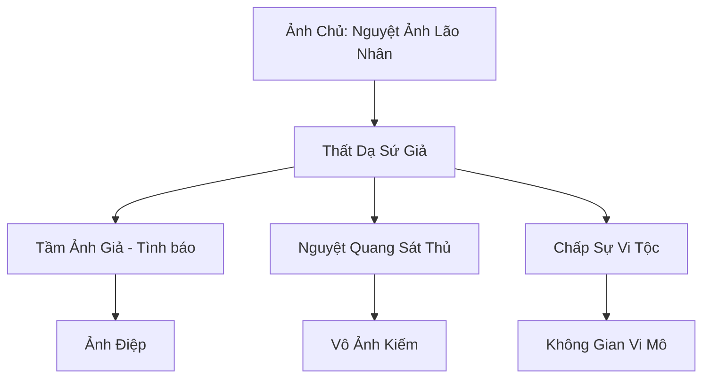

# ẢNH NGUYỆT UYỂN (影月苑)

## I. Tổng Quan (总览)
Ảnh Nguyệt Uyển là mạng lưới tình báo và sát thủ bí ẩn nhất Cố Nguyên Giới, được vận hành chủ yếu bởi chủng tộc Vi Tộc (những sinh vật có kích thước siêu nhỏ). Nhờ lợi thế hình thể và khả năng thao túng không gian vi mô, thành viên của Uyển có thể hiện diện ở bất kỳ đâu, từ khuê phòng của công chúa đến mật thất của tông chủ mà không bị phát hiện. Với phương châm "Thông tin là quyền lực tối thượng", Ảnh Nguyệt Uyển nắm giữ huyết mạch bí mật của toàn bộ lục địa.

## II. Địa Lý & Tài Nguyên (地理 với tài nguyên)
Ảnh Nguyệt Uyển không sở hữu các thành trì hay dãy núi rộng lớn. Lãnh thổ của họ là những "Ảnh Điểm" ẩn giấu ngay bên trong các kiến trúc của chủng tộc khác. Họ kiểm soát các mạch linh khí không gian siêu nhỏ và sở hữu đàn "Ảnh Điệp" - loài bướm đêm có khả năng ghi lại hình ảnh và âm thanh từ khoảng cách vạn dặm.

## III. Văn Hóa & Tín Ngưỡng (文化 với信仰)
Tôn thờ ánh trăng mờ ảo và sự tĩnh lặng. Thành viên Ảnh Nguyệt Uyển coi sự tồn tại của mình như một cái bóng - hiện hữu nhưng không thể chạm tới. Văn hóa của họ đề cao sự quan sát, kiên nhẫn và khả năng giữ bí mật tuyệt đối. Nghi lễ lớn nhất là "Lễ Rửa Bóng" vào mỗi kỳ trăng non để thanh tẩy khí tức cá nhân.

## IV. Cơ Cấu Tổ Chức (组织结构)


## V. Công Pháp & Trận Pháp (功法 với阵法)
- **Công Pháp:** *Thiên Diện Ẩn Ảnh Thuật* (Thay đổi hình dạng và khí tức), *Không Gian Súc Địa Quyết* (Di chuyển qua các kẽ hở không gian).
- **Trận Pháp:** *Ẩn Diệt Hư Không Trận* - trận pháp bảo vệ các Ảnh Điểm, khiến chúng hoàn toàn tan biến vào hư không đối với các loại thần thức thông thường.

## VI. Đặc Sản Môn Phái (门派特产)
- **Vô Ảnh Châm:** Loại kim nhỏ như sợi tóc, tẩm kịch độc hoặc linh phù tê liệt, cực khó phát hiện.
- **Nguyệt Quang Thạch:** Viên đá lưu giữ thông tin dưới dạng huyễn ảnh, tự hủy nếu bị mở sai cách.

## VII. Cơ Sở Hạ Tầng (基础设施)
- **Nguyệt Lầu Ảnh Khách:** Các trà lâu, kỹ viện do Uyển bí mật điều hành để làm điểm giao dịch thông tin.
- **Hành Lang Vi Mô:** Mạng lưới đường hầm siêu nhỏ bên trong tường thành và núi đá dành cho Vi Tộc di chuyển.

## VIII. Kinh Tế (経済)
Nguồn thu khổng lồ từ việc bán các tin tức tuyệt mật: từ điểm yếu của các công pháp trấn phái đến vị trí của các kho báu thất truyền. Họ cũng nhận các hợp đồng ám sát với mức giá đủ để mua lại cả một thành trì nhỏ.

## IX. Lịch Sử Tóm Tắt (简史)
Khởi nguồn từ thời Thái Cổ khi Vi Tộc bị các chủng tộc lớn xua đuổi. Nguyệt Ảnh Lão Nhân đã tập hợp đồng bào mình, dạy họ cách biến sự nhỏ bé thành lợi thế. Trải qua hàng vạn năm, Ảnh Nguyệt Uyển đã âm thầm can thiệp vào hầu hết các biến cố lớn của lục địa mà chưa bao giờ để lộ danh tính thực sự của các thủ lĩnh.

## X. Giai Thoại & Bí Mật (轶 sự với bí mật)
Tương truyền Ảnh Chủ thực chất là một linh hồn cổ đại sống trong chính ánh trăng, và ông ta có thể nhìn thấy mọi cuộc trò chuyện diễn ra dưới ánh trăng trên toàn thế giới.

## XI. Quan Hệ Thế Lực (势力关系)
```mermaid
graph LR
    ANU[Ảnh Nguyệt Uyển] -- Cung cấp tin -- TSTH[Thiên Sa Thương Hội]
    ANU -- Đối tác ngầm -- QTNC[Quỷ Thị Nam Cương]
    ANU -- Cạnh tranh -- VTLB[Vạn Tượng La Bàn]
    ANU -- Thân thiện -- VT[Vân Tông]
```
