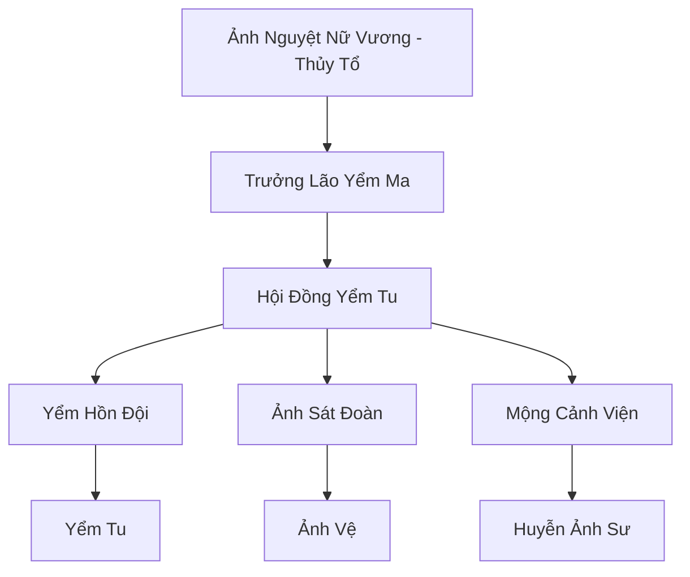

# ẢO ẢNH LÂM TỘC (幻影林族)

## I. Tổng Quan (总览)
Ảo Ảnh Lâm Tộc là một nhánh Tinh Linh Tộc bị tha hóa, đã từ bỏ ánh sáng của Cây Thế Giới để đi theo con đường bóng tối. Cư ngụ trong những khu rừng sương mù dày đặc, họ đã biến đổi sinh học để có thể tồn tại bằng cách hấp thụ nỗi sợ hãi và sinh cơ của các sinh vật khác thông qua các mộng cảnh ảo giác.

## II. Địa Lý & Tài Nguyên (地理 với tài nguyên)
Trụ sở chính nằm trong Rừng Ảo Ảnh tại Đông Hoang, một vùng đất mà không gian và thời gian bị bẻ cong bởi ma lực. Trung tâm khu rừng là Cây Mộng Yểm Thượng Cổ - một cây thần bị ô nhiễm tỏa ra chướng khí màu tím, cung cấp năng lượng mộng yểm vô tận cho bộ lạc.

## III. Văn Hóa & Tín Ngưỡng (文化 với信仰)
Tôn thờ bóng tối và sự sợ hãi. Họ tin rằng ánh sáng là sự giả dối và chỉ có nỗi đau mới là chân thực. Văn hóa của bộ lạc xoay quanh việc chế tác các mặt nạ ảo ảnh và tổ chức các buổi tế lễ linh hồn dưới tán cây mộng yểm.

## IV. Cơ Cấu Tổ Chức (组织结构)


## V. Công Pháp & Trận Pháp (功法与阵法)
- **Công Pháp:** *Cửu Chuyển Yểm Ma Quyết* (Thao túng giấc mơ), *Vạn Ảnh Phệ Hồn Kinh* (Hút sinh cơ).
- **Trận Pháp:** *Mê Hồn Ảnh Lưới* - một mạng lưới tơ nhện ma thuật bao phủ toàn bộ khu rừng, có khả năng kích phát những nỗi sợ sâu thẳm nhất trong lòng bất kỳ ai chạm vào.

## VI. Đặc Sản Môn Phái (门派特产)
- **Yểm Ma Thạch:** Viên đá chứa đựng ác mộng, dùng làm nguyên liệu chế tạo vũ khí tấn công tinh thần.
- **Linh Hồn Phấn:** Loại bột mịn chiết xuất từ sinh cơ nạn nhân, giúp hồi phục ma lực bóng tối nhanh chóng.

## VII. Cơ Sở Hạ Tầng (基础设施)
- **Hang Động Mộng Yểm:** Nơi ở và luyện công của các yểm tu cấp cao, chứa đầy các kén linh hồn.
- **Đài Tế Nguyệt:** Nơi thực hiện các nghi lễ hiến tế vào những đêm trăng khuyết.

## VIII. Kinh Tế (经济)
Kinh tế dựa trên việc chiếm đoạt tài sản của các lữ khách và thương đoàn bị lạc vào rừng. Họ cũng bí mật trao đổi các tài nguyên linh hồn quý hiếm cho các thế lực ma đạo để lấy các vật phẩm tu luyện cần thiết.

## IX. Lịch Sử Tóm Tắt (简史)
Vốn là một nhóm Tinh Linh Tộc đi theo Ảnh Nguyệt Nữ Vương trong cuộc nổi loạn chống lại Vương Đình thời Thái Cổ. Sau khi thất bại, họ bị nguyền rủa và trục xuất vào vùng đất tối tăm nhất của Đông Hoang, nơi họ bị bóng tối đồng hóa và trở thành những kẻ săn mồi đáng sợ như ngày nay.

## X. Giai Thoại & Bí Mật (轶 sự với bí mật)
Tương truyền mỗi thành viên Ảo Ảnh Lâm Tộc đều sở hữu một "Trái Tim Ảo Ảnh", nếu bị phá vỡ, họ sẽ tan biến thành sương mù tím và linh hồn sẽ quay trở về Cây Mộng Yểm.

## XI. Quan Hệ Thế Lực (势力关系)
```mermaid
graph LR
    OALT[Ảo Ảnh Lâm Tộc] -- Tử địch -- TLVD[Tinh Linh Vương Đình]
    OALT -- Đối tác ngầm -- HSM[Huyết Sát Minh]
    OALT -- Cạnh tranh -- VDM[Vạn Độc Môn]
```
